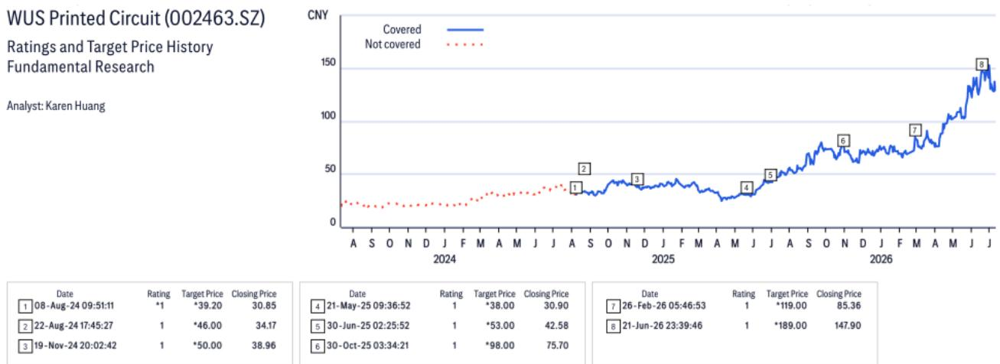
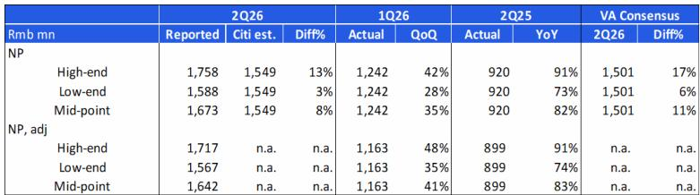
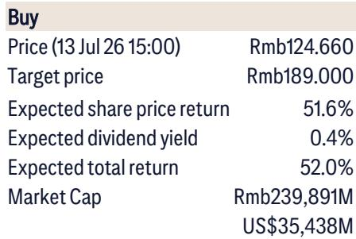

# Citi：WUSPCB Q2净利润指引超预期

Citi最新报告指出，沪电股份二季度净利润指引中值达到16.7亿元，环比增长35%，超出市场预期约11%。这份超预期并非来自收入端的突然爆发，而是产品组合优化与海外工厂扭亏共同作用的结果。报告特别提到，泰国工厂在二季度实现盈利，这是此前市场并未充分定价的变化。

对于一家以通信和AI服务器PCB为核心业务的公司，海外产能的爬坡速度直接决定了其能否承接下一代交换机与AI加速器平台的订单。Citi认为，下半年收入与利润的同比增速将进一步加快，核心驱动力来自1.6T交换机和新一代AI加速器平台的量产备货。

## 1. 二季度利润超预期，产品结构与海外产能是双重支撑

Citi给出的二季度净利润指引中值为16.7亿元，区间上限达到17.6亿元，下限为15.9亿元。对比一季度实际利润12.4亿元，环比增幅在28%至42%之间。报告指出，这一表现不仅高于Citi自身预期8%，也高于买方此前交流中给出的15-16亿元预期区间。

超预期的来源有两个层面。一是产品组合持续向高附加值方向倾斜，AI相关PCB的占比提升直接拉动了毛利率。二是泰国工厂在二季度实现扭亏，意味着海外产能的爬坡进度比市场预期的更快。这两个因素叠加，使得公司在不依赖大幅增量收入的情况下，实现了利润率的显著改善。

> **KC评论：** 泰国工厂扭亏是一个容易被忽视的信号。它意味着公司海外产能的盈亏平衡点已经跨过，后续新增订单的边际利润贡献将明显高于国内产能。对于关注产能扩张节奏的读者，这个节点的确认比季度利润数字本身更具前瞻意义。

## 2. 下半年增长加速的确定性来自两个产品周期

Citi判断下半年收入与利润的同比增速将进一步提升，支撑这一判断的是两个明确的产品周期。第一个是1.6T交换机的量产备货，这是数据中心网络升级的关键节点。第二个是新一AI加速器平台的上量，这类平台对PCB的层数、材料和工艺要求更高，单价和毛利率也显著高于传统产品。

报告认为，沪电股份是Citi覆盖的PCB公司中增长可见度最高的标的。这一判断的基础在于：公司同时覆盖了交换机和AI加速器两个高增长赛道，且海外产能的释放节奏与下游客户的需求周期高度吻合。

## 3. 估值框架的核心假设是盈利复合增速而非单一季度

Citi给出的估值基准是2027年预期市盈率的30倍，对应的2026至2028年盈利复合增速约为86%。这个增速假设并非来自线性外推，而是基于三个结构性因素：GenAI相关PCB需求的持续扩张、产品组合升级带来的均价与毛利率提升、以及公司执行能力对毛利率的支撑。

当前报价对应2027年预期市盈率约为20倍，与30倍的估值基准之间存在一定空间。但需要指出的是，这一估值框架成立的前提是上述三个驱动因素能够同步兑现，尤其是海外产能的爬坡不能出现明显延迟。

**这份报告的核心信息可以概括为一句话：利润超预期不是偶然，而是产品结构与海外产能两个变量同时向好的结果。下半年的增长加速，将由1.6T交换机和AI加速器两个产品周期共同驱动。**

For informational purposes only. Portions may be generated, translated, summarized, or edited with AI assistance based on source materials and may contain omissions or errors. Please verify independently. This is not investment, legal, tax, accounting, or other professional advice.

For informational purposes only. Portions may be generated, translated, summarized, or edited with AI assistance based on source materials and may contain omissions or errors. Please verify independently. This is not investment, legal, tax, accounting, or other professional advice.

