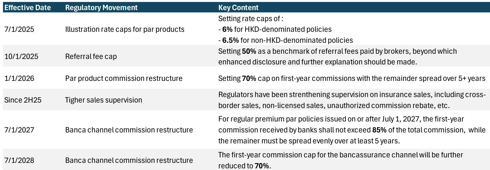
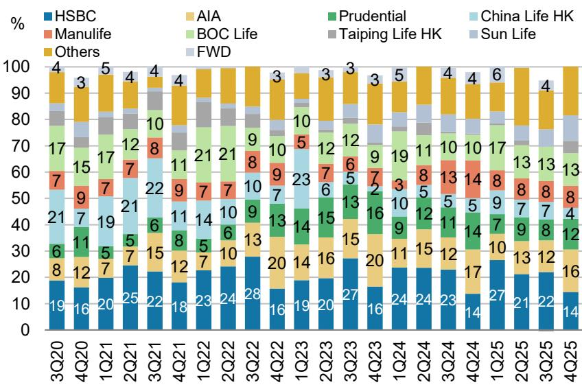
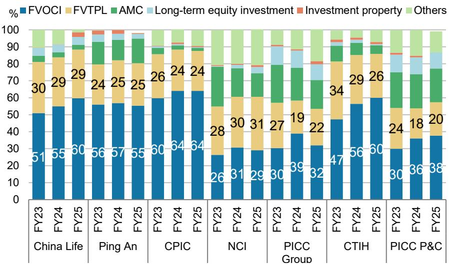

# 中国保险行业：风险拐点已过，下一阶段需要战略分化而非产品趋同

中国寿险行业正在经历一代人以来最具深远意义的结构性转型。截至2026年第一季度，居民金融资产规模已达320万亿元人民币，尽管宏观环境存在波动，但过去十年仍保持两位数增长。在这一不断扩大的资产池中，保险产品稳步占据更大份额——这一趋势持续的逻辑是清晰的。保险仍是国内相对少见兼具本金保障、合理回报与增值服务的金融产品。预计到2030年，居民金融资产规模将从2025年水平以8%的年复合增长率增长至435万亿元人民币。保险公司有望在居民新增储蓄中占据更大比例。

然而，更重要的故事并非关于整体增长，而是关于行业是否真正解决了其核心脆弱性：多年来困扰国内寿险公司的利差风险。在从传统型产品向分红型产品快速且近乎完全的转型之后，结合监管对定价利率和费用管控的压力，有迹象表明行业正接近——或已越过——负债成本的转折点。然而，这种产品转型的趋同性掩盖了战略定位上的深层分化，这种分化将在下一周期中区分领先者与落后者。

对于观察者而言，关键洞察在于：全行业的风险缓释降低了系统性尾部风险，但下一阶段的价值创造将取决于保险公司在产品策略、资产配置、渠道管理和资本效率方面的差异化能力。那些将分红型产品转型视为已完成任务而非战略优化起点的公司，可能面临被落下的风险。

## 分红型产品转型已消除最突出的利率风险，但产品策略的差异化现已成为关键变量

过去两年，国内寿险行业产品组合转型的速度和规模令人瞩目。截至2026年，上市保险公司已基本完成从传统型向分红型产品在个险和银保渠道的转型。2026年第一季度，多数上市保险公司期交首年保费中分红型产品占比约达90%，而2025年上半年这一比例不足50%。非上市保险公司也遵循了类似轨迹，2026年第一季度经营现金流同比增长，中位数增幅约为11%。

这一转型之所以重要，是因为分红型产品将相当一部分投资风险从保险公司转移至保单持有人。随着定价利率持续下行和费用管控趋严，行业新增业务的保证负债成本已开始显著下降。优质保险公司在2025年底已开始看到存量业务负债成本的下行拐点。对于其他公司而言，这一拐点可能要到2026年或2027年才会到来。

然而，在风险缓释环境下，分红型产品是否是最优选择仍是一个开放性问题，尤其是对于中小型公司而言。向分红型产品的趋同转型反映了监管引导和竞争压力，而非战略选择。随着行业走出这一转型期，产品策略可能日益分化。能够根据特定客户群体定制产品特征——如利润分享机制、退保费用和增值服务包——的保险公司将拥有明显优势。而那些简单地在所有渠道和客户群体中复制相同分红型产品模板的公司，将面临利润压缩和竞争趋同。

## 利差压力将持续两到三年，但行业正接近有利于有准备公司的转折点

尽管在降低负债成本方面取得了进展，但利差——即净投资回报表现与保证负债成本之间的差额——在未来两到三年内仍将持续快速收窄。这并非失败的信号，而是存量业务中保证成本较高的保单仍在账面上的算术结果。2026年新资产的回报表现相比2025年明显更高，受益于稳定的利率环境。然而，随着旧的高收益资产到期并被低收益资产取代，行业净投资回报表现仍在下降。

当新业务的负债成本下降幅度超过存量业务的拖累时，转折点将到来。对于优质保险公司而言，这一交叉点已经开始出现。对于更广泛的行业而言，可能还需两到三年。其含义是明确的：在降低保证成本、收紧费用管控和提升新业务质量方面最为积极的保险公司，将从当前的压力周期中脱颖而出，拥有更强的利润率和更具韧性的资产负债表。

除产品转型外，已采取多项措施。定价利率已下调，费用管控已收紧，内含价值假设——包括长期投资回报表现和风险贴现率——已在2023年和2024年变得更加现实。结果是，2025年新业务价值的利率敏感性已显著改善。存量业务价值的敏感性基本持平，但随着存量业务的逐步消化，未来几年有望看到改善趋势。

## 银保渠道提供明确的增长机会，但大型保险公司拥有中小型公司难以复制的结构性优势

2025年银保保费实现超过15%的新单增长，从2023年底和2024年初费用监管收紧后的短暂调整中恢复。然而，大型与中小型保险公司之间的渠道结构已出现明显分化。资产规模在100亿至1万亿元之间的保险公司，其总保费中50%至100%来自银保渠道。相比之下，资产规模超过1万亿元的保险公司保持更均衡的渠道组合，个险渠道贡献约60%至80%的保费。

这种分化之所以重要，是因为银保渠道由于佣金成本较高和保单持续性较低，其盈利能力天然低于个险渠道。大型保险公司可通过品牌认知、与银行网点的既有合作以及成本效率优势，在银保渠道保持领先。它们还在银保渠道加速向分红型产品转型，2026年第一季度期交首年保费中分红型产品占比超过80%。大型保险公司更注重期交缴费结构，而中小型公司则继续推动趸交销售。

监管环境可能进一步强化这些优势。随着监管进一步收紧，银保增长预计将变得更加合理和可持续。但对于缺乏规模、品牌实力和通过其他渠道交叉销售高利润产品能力的中小型保险公司而言，该渠道的经济效益仍将具有挑战性。战略含义是，银保应被视为大型多元化保险公司的规模和客户获取渠道，而非整个行业的可持续利润引擎。

## 回报表现曲线陡峭化和长久期债券配置创造更有利的环境，但IFRS 9下的权益配置策略引入新的盈利波动

国内10年期国债回报表现在2025年初触及约1.6%的低点后，2025年下半年回升至约1.8%，并在2026年基本保持稳定。更重要的是，回报表现曲线已变得陡峭，30年期利率在过去一年中上升更为显著。随着期限溢价持续扩大，长久期债券正变得更具吸引力。上市保险公司已增加政府债券配置，尽管2025年整体债券配置略有下降。

这种回报表现曲线陡峭化对保险公司具有结构性支撑作用，尤其是对拥有长久期负债的公司而言。它使保险公司能够锁定新购债券的更高回报表现，并改善资产与负债的期限匹配。然而，更重要的变化发生在权益端。

随着大多数非上市保险公司从2026年初采用IFRS 9，权益资产的分类及其对报告盈利的影响变得显著重要。领先保险公司已将权益配置提升至总投资资产的约15%至20%，包括股票和基金。我们认为进一步增加的空间有限，但权益投资可随保险资金整体规模的扩大而继续增长。

关键的战略分化在于配置方法。保险公司正采取不同策略：高股息、成长型和混合型方法。以公允价值计量且其变动计入其他综合收益的权益敞口在各公司间存在显著差异。以公允价值计量且其变动计入其他综合收益配置较低的保险公司仍有动力逐步增加高股息股票的敞口。然而，以公允价值计量且其变动计入当期损益的股票配置较高的保险公司面临盈利对权益市场波动高度敏感的风险。

这种分化在分红账户中尤为明显，其中以公允价值计量且其变动计入当期损益的配置持续上升。过去三年，分红账户中以公允价值计量且其变动计入当期损益的配置较高——意味着更多资产为交易收益而持有，包括股票、债券等——而整体以公允价值计量且其变动计入当期损益的配置保持相对稳定。这创造了明确的战略权衡：在分红账户中承担更多权益风险的保险公司可能为保单持有人带来更高回报，但也引入了更大的盈利波动性，需要更复杂的风险管理能力。

## 偿付能力约束将继续塑造竞争格局，强化大型保险公司的优势

“偿二代”二期框架的全面实施收紧了全行业的资本要求。偿付能力压力将继续影响部分保险公司的资产配置和负债增长。利率的滞后效应可能在2026年继续对资本构成压力，而“偿二代”三期的推出不太可能在2027年之前。

大型保险公司在这种环境下具有结构性优势。近年来监管机构持续放宽偿付能力规则和风险因子，但收益不成比例地流向业务质量更好、风险状况更多元化和资本生成能力更强的保险公司。2026年第一季度寿险公司的核心偿付能力比率环比下降，预计第二季度将进一步下降。

这种偿付能力约束不仅仅是技术性会计问题。它直接影响保险公司承保新业务、配置高收益资产和向股东返还资本的能力。能够在追求增长的同时维持充足偿付能力比率的保险公司将拥有显著竞争优势。而那些资本受限的公司将被迫优先考虑资本节约型产品、减少股息支付或寻求外部资本——所有这些都限制了战略灵活性。

领先保险公司还在探索创新和另类资产投资，包括资产支持证券、公募和私募房地产投资信托基金以及私募股权基金。这些投资提供收益增强和多元化效益，但需要中小型保险公司通常缺乏的复杂投资能力。2026年第一季度行业投资回报表现中位数约为0.65%，而综合投资回报表现中位数仅为约0.31%。随着领先保险公司将资本配置到中小型公司无法有效获取或管理的另类资产，表现前四分之一与后四分之一公司之间的差距可能扩大。

## 应对中国保险下一周期的决策框架

上述分析指向一个评估当前环境下保险公司的结构化框架。该框架包含四个维度：产品策略差异化、负债成本轨迹、资产配置成熟度和资本效率。

在产品策略方面，关键问题不在于保险公司是否已完成向分红型产品的转型——几乎所有公司都已做到。问题在于，保险公司是否利用分红型产品平台为特定客户群体创造差异化价值主张，还是仅提供一种主要依靠价格竞争的标准化产品。能够将分红型产品与增值服务——养老护理、医疗资源、财富传承规划——打包的保险公司，将获得更好的保单持续性和更高的利润率。

在负债成本轨迹方面，关键指标是新业务保证负债成本的趋势以及存量业务转折点的预期时间。已看到存量业务负债成本开始下降的保险公司，在利润率改善方面拥有多年的先发优势。应关注保证成本的下降速度以及新业务价值和存量业务价值对利率变化的敏感性。

在资产配置成熟度方面，关键区分因素并非整体权益配置，而是该配置在以公允价值计量且其变动计入当期损益和以公允价值计量且其变动计入其他综合收益分类之间的构成，以及获取另类资产的能力。以公允价值计量且其变动计入其他综合收益权益配置较高的保险公司拥有更稳定的盈利特征。能够获取另类资产的公司则具有更高的收益潜力，而无需承担过度信用风险。

在资本效率方面，相关指标是核心偿付能力比率轨迹以及保险公司从运营中内部生成资本的能力。能够在增长保费和股息的同时维持或改善偿付能力比率的保险公司，显然在产生经风险调整后的卓越回报。那些需要频繁资本注入或面临偿付能力比率下降的公司将受到战略约束。

行业已度过最大系统性风险点。分红型产品转型、监管收紧和更现实的内含价值假设已解决了最突出的脆弱性。但下一周期不会奖励趋同。它将奖励战略清晰度、运营纪律以及在日益复杂的市场中执行差异化愿景的能力。

*仅供参考。部分内容可能基于源材料通过AI辅助生成、翻译、总结或编辑，可能存在遗漏或错误。请独立核实。本文不构成研究、法律、税务、会计或其他专业建议。*

仅供参考。部分内容可能基于源材料通过AI辅助生成、翻译、总结或编辑，可能存在遗漏或错误。请独立核实。本文不构成研究、法律、税务、会计或其他专业建议。

