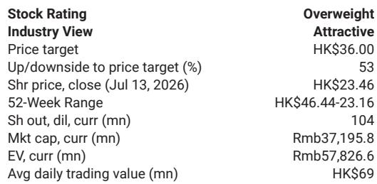
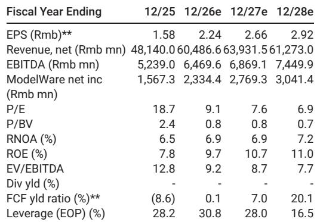
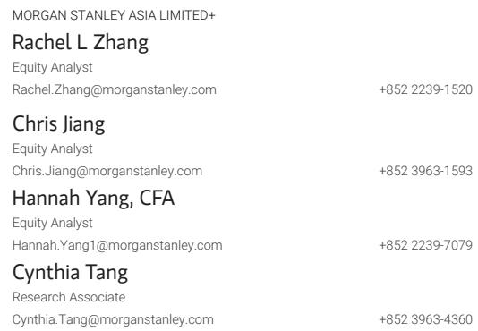

# CNGR 2026年上半年业绩：上游资源整合成为电池材料行业的关键优势

CNGR先进材料公布2026年上半年净利润为12.5-13.5亿元人民币，同比增长71-84%，超出市场普遍预期。第二季度单季净利润为6.95-7.95亿元，高于第一季度的5.55亿元，尽管存在外汇损失的影响。这一表现并非周期性波动。公司的业绩揭示了一个结构性变化：电池材料行业已进入一个阶段，即原材料所有权（而非单纯的加工规模）决定了盈利能力。CNGR 2026年上半年经常性净利润同比增长84-99%至12-13亿元，其增长构成说明了这一点。更高的电池材料销量推动了营收增长——前驱体出货量同比增长50%，利润率保持稳定；磷酸铁出货量增长25%，利润率转正——但真正的盈利加速器来自与镍矿项目相关的投资收益以及镍冶炼业务持续较高的盈利能力。对于评估电池供应链的观察者而言，其含义明确：控制上游镍资源的公司正在构建纯加工企业无法复制的护城河。

这一洞察的时机很重要，因为市场一直将电池材料视为一个商品化、利润率受压的行业。CNGR的业绩挑战了这一假设。公司2026年上半年的表现表明，当生产商获得原材料优势（特别是镍矿）时，它可以产生投资收益和冶炼利润，这些在很大程度上不受困扰前驱体和正极制造的“价格战”影响。市场尚未完全对这一差异化进行定价。CNGR在香港上市的公司股价为23.46港元，基于2026年预估的远期市盈率为9.1倍，这反映了市场认为所有电池材料公司都面临相同挑战的普遍看法。2026年上半年的盈利数据反驳了这一观点。

## 前驱体出货量增长50%且利润率稳定表明，单纯的规模不再保证定价权，但资源支撑的规模可以

2026年上半年前驱体出货量同比增长50%，关键是利润率保持稳定。这一组合是第一个证据，表明CNGR打破了销量增长与利润率压缩之间的典型权衡。在传统的商品加工模式中，快速扩张的销量会充斥市场，压低价格，侵蚀单位盈利能力。CNGR避免了这一陷阱，因为其销量增长得到了竞争对手（没有镍矿资产）无法匹敌的原材料成本基础的支持。

其机制很直接。CNGR的镍冶炼项目受益于专有的原材料优势，产生了持续较高的盈利能力。这种盈利能力通过两种方式体现在利润表中：直接通过冶炼板块的营业利润率，以及间接通过前驱体业务的更低投入成本。当竞争对手以市场价格采购硫酸镍时，镍价的每一个百分点波动都会侵蚀利润。当CNGR从自有矿石关联的冶炼业务采购时，它锁定了一个成本优势，成为抵御市场价格波动的结构性缓冲。

50%的销量增长也表明，CNGR在一个增长但竞争激烈的终端市场中正在获取市场份额。随着电动汽车的持续普及和储能系统部署的加速，全球前驱体市场正在扩张。但市场也挤满了中国和韩国的生产商。CNGR能够以两倍于整体市场的速度增长销量而不牺牲利润率，这表明客户更看重供应可靠性和成本稳定性，而非最低名义价格。这种偏好有利于一体化生产商。

对于观察者而言，在50%销量增长中保持稳定的利润率是一个诊断信号。它区分了那些仅仅是扩大规模的公司和那些在结构性成本优势下扩大规模的公司。前者在增长时利润率会压缩。后者将维持甚至改善利润率。CNGR 2026年上半年的数据将其牢牢置于第二类。

## 磷酸铁利润率从负转正表明，跨产品协同效应取决于原材料整合，而不仅仅是产品多元化

CNGR的磷酸铁业务在2026年上半年实现了25%的销量增长，更重要的是，其利润率转正。这是一个非显而易见的洞察。与富镍前驱体相比，磷酸铁是一种价值较低的电池材料，许多生产商难以使其单位经济性可行。CNGR成功将磷酸铁利润率从负转正，不仅仅是销量规模扩大的结果。它反映了公司将其镍矿优势扩展到更广泛材料平台的能力。

这种联系可能并不立即显现。磷酸铁不含镍。但CNGR的一体化运营在采购、物流和能源成本方面创造了跨产品效益。更根本的是，公司从镍冶炼中获得的盈利能力产生了内部现金流，可以支持磷酸铁业务的爬坡，而无需以不利条件进行外部融资。当一家公司能够承受新产品线的初期亏损，因为其核心镍业务正在产生高回报时，它可以比那些需要从第一天起就实现盈利的竞争对手坚持得更久。

磷酸铁业务的扭亏为盈对CNGR的客户关系也具有战略意义。电池制造商越来越多地采用双化学策略，在需要高能量密度的应用中使用富镍正极，在对成本敏感的部分使用磷酸铁锂。一个能够提供两种产品系列，并在每种产品上都展现出盈利能力的供应商，将成为更有价值的合作伙伴。CNGR服务于电池化学谱系两端的能力，增强了其与原始设备制造商和电池电芯生产商的谈判地位。

在前驱体利润率保持稳定的同一时期，磷酸铁利润率转正这一事实表明，CNGR的运营杠杆正在其整个产品组合中改善。这不是一个单一产品的故事。公司正在证明，其原材料整合创造了一种“水涨船高”的效应，提升了其所有材料业务，而不仅仅是镍密集型业务。

## 来自镍矿项目的投资收益正成为一个重要的利润中心，使CNGR的盈利与下游电池材料定价周期脱钩

在CNGR 2026年上半年的业绩中，最被低估的因素是与镍矿项目相关的投资收益贡献。公司明确将其部分盈利超预期归因于这些项目带来的更高投资收益，以及镍冶炼持续较高的盈利能力。这创造了一个双引擎盈利模式：销售电池材料的营业利润，以及上游镍资产股权带来的投资回报。

这种结构从根本上改变了CNGR公司的风险状况。一个纯粹的前驱体制造商完全暴露于正极材料市场的供需平衡和定价动态。当该市场过热且新产能涌入时，利润率压缩，盈利崩溃。CNGR的镍矿投资提供了一个平衡力量。即使前驱体利润率在未来供应过剩的情况下面临压力，来自镍项目的投资收益也可以部分抵消下降。公司的盈利流与电池材料周期的相关性降低。

镍矿投资收益还受益于与前驱体业务不同的需求驱动因素。镍用于不锈钢和其他工业应用，而不仅仅是电池。如果电池需求疲软但工业镍需求保持坚挺，投资收益流仍将保持韧性。这种镍价值链内的多元化给了CNGR一个大多数电池材料公司缺乏的对冲工具。

这对盈利建模有实际意义。仅基于前驱体销量和价格假设来预测CNGR盈利的分析师，将在镍价强劲时期系统性低估公司的盈利能力，并在镍价修正期间高估其脆弱性。市场似乎正在犯这个错误。基于2026年预估的9.1倍远期市盈率并未完全反映镍矿投资收益流所提供的盈利稳定性。随着观察者开始将此因素纳入估值模型，公司股价可能会向上重估。

## 基于CNGR 2026年上半年数据评估电池材料公司的三部分决策框架

CNGR的业绩为评估任何电池材料公司提供了一个可复制的框架。该框架包含三个顺序测试，一家公司必须通过所有三个测试才能被认为具有可持续的竞争优势。

第一个测试是原材料所有权。公司是否控制上游矿石资源，无论是通过直接所有权还是通过附带股权的长期承购协议？CNGR通过其镍矿项目通过了这一测试，这些项目产生投资收益并为其冶炼业务提供成本优势。在此测试中得分较低的公司——即所有原材料均按市场价格采购的纯加工商——面临结构性利润率风险，这是任何运营效率都无法完全抵消的。

第二个测试是销量增长期间的利润率稳定性。随着出货量的增长，公司的利润率是收缩、扩张还是保持不变？CNGR的前驱体利润率在50%的销量增长期间保持稳定，其磷酸铁利润率从负转正。这表明公司的成本结构随着规模扩大而改善，而非恶化。在销量增长期间显示利润率压缩的公司，很可能是在价格上竞争，而非在结构性成本优势上竞争。

第三个测试是核心加工业务之外的盈利多元化。公司是否拥有来自上游资产、投资收益或相邻产品线的实质性盈利贡献，且这些贡献与其主要电池材料定价周期不直接相关？CNGR的镍矿投资收益和镍冶炼利润提供了这种多元化。未能通过此测试的公司是单一周期赌注。它们的盈利将随电池材料周期起伏，其股价将反映这种波动性。

将此框架应用于更广泛的电池材料领域，可以得出一个清晰的结论。通过所有三个测试的公司数量很少。大多数生产商要么过于下游而无法拥有原材料，要么过于专业化而无法实现盈利多元化。CNGR 2026年上半年的结果表明，市场尚未完全区分这些类别。通过该框架的公司可能会实现更一致的盈利增长，并在行业低迷期间面临更低的下行风险。未通过的公司更容易受到利润率压缩和盈利波动的影响。

对于观察者而言，实际要点是将原材料所有权作为首要筛选标准。在其他条件相同的情况下，拥有上游镍或锂资产的公司将产生比没有这些资产的公司更稳定、更可预测的盈利。CNGR 2026年上半年的数据为这一论点提供了实证确认。71-84%的净利润增长并非一次性事件。这是一个商业模式的可预测结果，该模式经过精心设计，旨在镍和电池材料价值链的多个节点捕获价值。

*仅供参考。部分内容可能基于源材料通过AI辅助生成、翻译、总结或编辑，可能存在遗漏或错误。请独立核实。本文不构成专业建议。*

仅供参考。部分内容可能基于源材料通过AI辅助生成、翻译、总结或编辑，可能存在遗漏或错误。请独立核实。本文不构成专业建议。

