# 亚太地区研究简报

## 韩国暑期研修：结构性积极因素与技术性挑战

### MS & CO. INTERNATIONAL PLC, 首尔分行

**股票研究分析师**
Joon.Seok@morganstanley.com +82 2 399-4934

**Heewon Choi**
股票研究分析师
Heewon.Choi@morganstanley.com +82 2 399-4836

  
亚洲暑期研修 2026

MS与报告中涉及的公司有业务往来，并寻求开展此类业务。因此，读者应注意，该公司可能存在利益冲突，可能影响MS的客观性。读者应将MS视为其决策的单一因素之一。

分析师认证及其他重要披露信息，请参阅本报告末尾的披露章节。

+= 受雇于非美国关联公司的分析师未在FINRA注册，可能不是该会员的关联人士，且可能不受FINRA关于与标的公司沟通、公开露面以及交易研究分析师账户持有证券的限制。

## 韩国暑期研修 2026

## 韩国现状：持续表现优于同类市场

亚洲市场表现：2025年（以美元计）

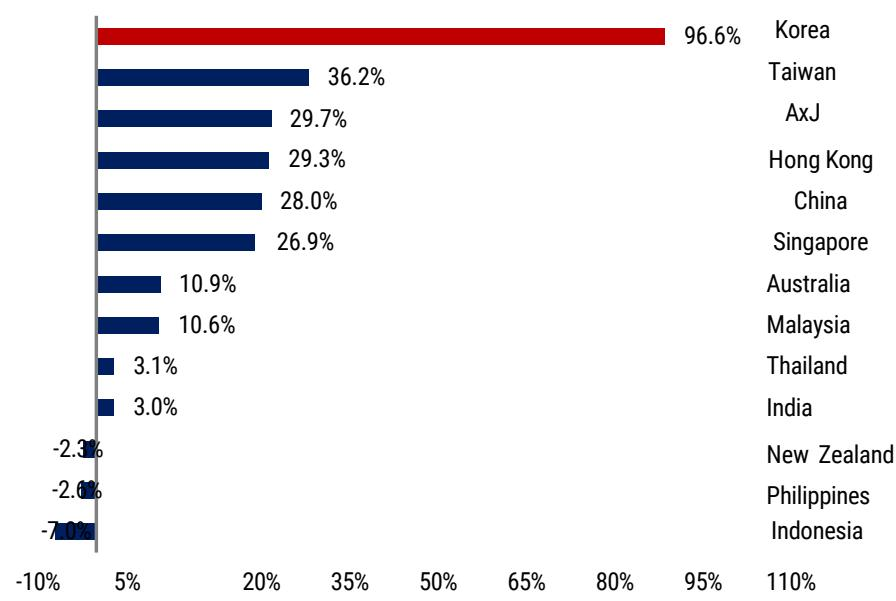  
亚洲市场表现：2026年至今（以美元计）

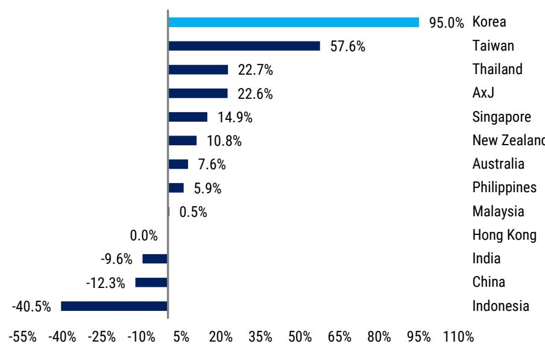

来源：Datastream, MSCI, MS。注：数据截至2026年7月10日。过往表现不代表未来结果。

## 韩国现状：结构性预期推动显著上行

<table><tr><td colspan="12">KOSPI：行业价格表现与2026年至今资金流向</td></tr><tr><td>(%, 十亿韩元)</td><td>KOSPI</td><td>信息技术</td><td>原材料</td><td>工业</td><td>能源</td><td>可选消费</td><td>金融</td><td>医疗保健</td><td>通信服务</td><td>必需消费</td><td>公用事业</td></tr><tr><td>指数权重</td><td>100%</td><td>64%</td><td>2%</td><td>12%</td><td>2%</td><td>6%</td><td>8%</td><td>3%</td><td>2%</td><td>1%</td><td>1%</td></tr><tr><td>2026年至今表现</td><td>77.4%</td><td>169.4%</td><td>-8.8%</td><td>31.9%</td><td>60.2%</td><td>27.5%</td><td>34.8%</td><td>-15.3%</td><td>-13.1%</td><td>6.4%</td><td>-17.3%</td></tr><tr><td>2025年表现</td><td>75.6%</td><td>142.7%</td><td>26.5%</td><td>106.1%</td><td>46.1%</td><td>35.3%</td><td>53.6%</td><td>21.1%</td><td>20.5%</td><td>21.8%</td><td>87.6%</td></tr><tr><td>外资净买入</td><td>-160,641</td><td>-146,539</td><td>1,513</td><td>1,550</td><td>1,747</td><td>-13,272</td><td>-3,340</td><td>1,790</td><td>-1,247</td><td>526</td><td>-451</td></tr><tr><td>国内散户净买入</td><td>108,533</td><td>100,948</td><td>-1,597</td><td>-2,652</td><td>-1,849</td><td>11,305</td><td>-803</td><td>-836</td><td>1,481</td><td>-516</td><td>1,062</td></tr><tr><td>国内机构净买入</td><td>37,593</td><td>30,636</td><td>-495</td><td>3,153</td><td>712</td><td>791</td><td>4,330</td><td>-1,202</td><td>-445</td><td>-21</td><td>-568</td></tr><tr><td>养老金净买入</td><td>-8,935</td><td>-4,076</td><td>-138</td><td>-2,032</td><td>377</td><td>43</td><td>-1,374</td><td>-974</td><td>-398</td><td>-137</td><td>-362</td></tr></table>

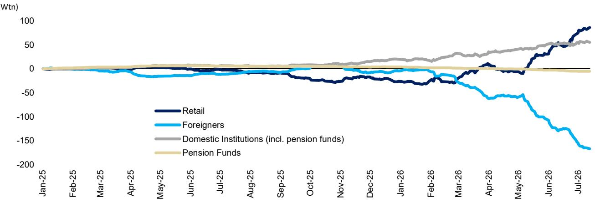  
来源：WiseFN, MS。注：数据截至2026年7月10日。

## 韩国现状：市盈率有所回落，市净率仍处高位

KOSPI 12个月远期市盈率  
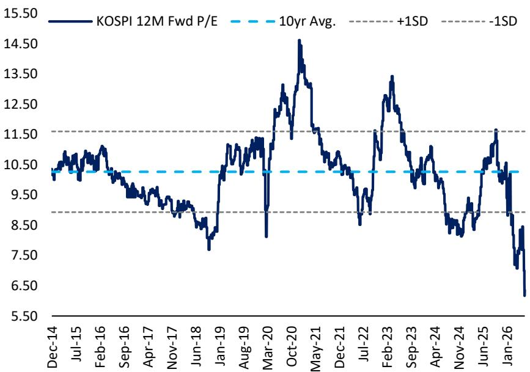

KOSPI 12个月远期市净率  
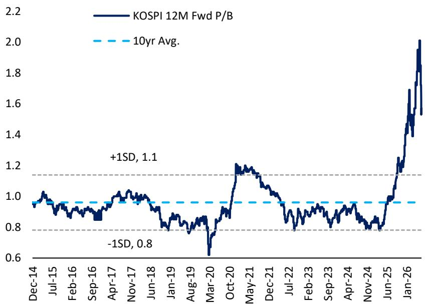  
来源：Factset, MS，数据截至2026年7月10日

## 韩国现状：行业构成进一步向信息技术倾斜

KOSPI各行业：按市值占比  
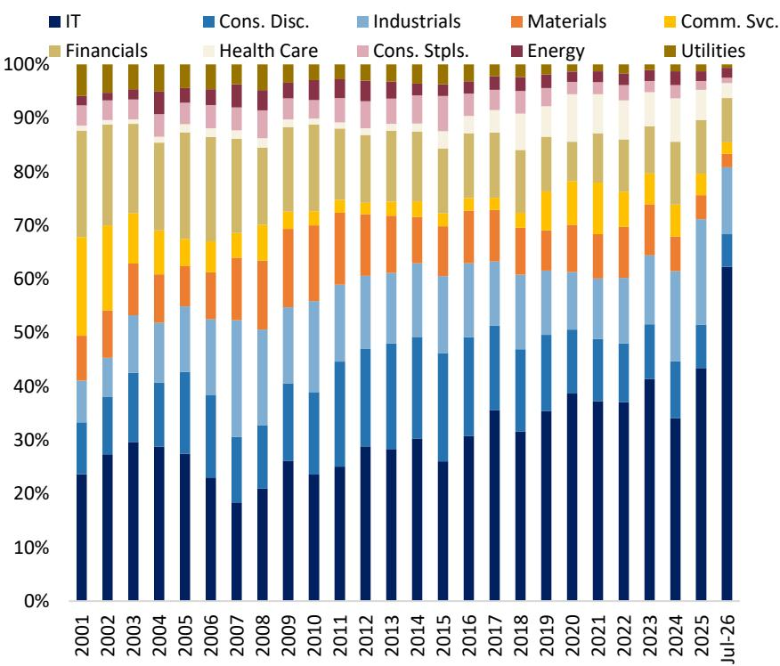  
来源：WiseFN, Bloomberg, MS。

KOSPI各行业：按年度净利润占比  
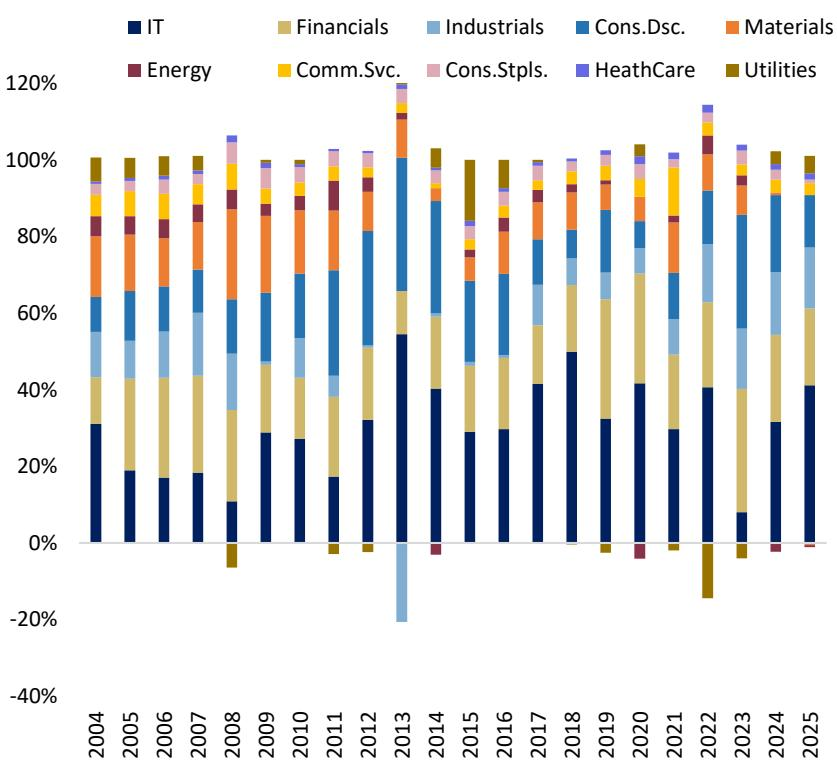  
来源：WiseFN, Bloomberg, MS。

## 韩国现状：国民养老金再平衡应属可控

<table><tr><td colspan="7">国民养老金资产配置计划</td></tr><tr><td rowspan="2" colspan="2">总计（仅金融投资）</td><td rowspan="2">实际（2026年4月）</td><td colspan="4">新目标</td></tr><tr><td>2026年底目标</td><td>2027年底目标</td><td>SAA缓冲</td><td>5年远期目标（2031年底）</td></tr><tr><td rowspan="2">权益</td><td>国内</td><td>25.1%</td><td>20.8%</td><td>20.8%</td><td rowspan="5">将于2026年底更新（不予披露）</td><td rowspan="2">55%</td></tr><tr><td>海外</td><td>36.2%</td><td>34.7%</td><td>35.6%</td></tr><tr><td rowspan="2">债券（含短期工具）</td><td>国内</td><td rowspan="2">24.0%</td><td>23.1%</td><td>21.8%</td><td rowspan="2">30%</td></tr><tr><td>海外</td><td>7.4%</td><td>7.4%</td></tr><tr><td colspan="2">另类投资</td><td>14.7%</td><td>14.0%</td><td>14.3%</td><td>15%</td></tr></table>

来源：国民养老金服务公司, MS。

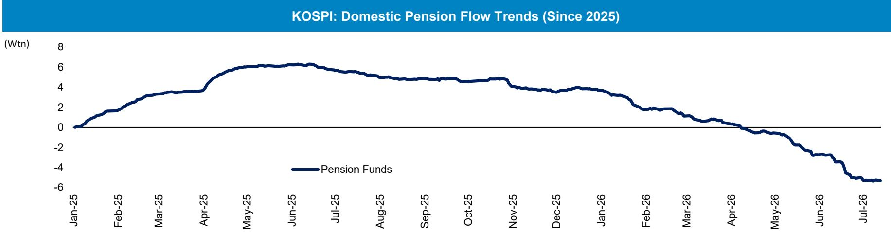  
来源：KRX, MS，数据截至2026年7月13日

## 结构性增长故事：机遇存在  
超级周期股票子行业价格表现（自2024年底起）  
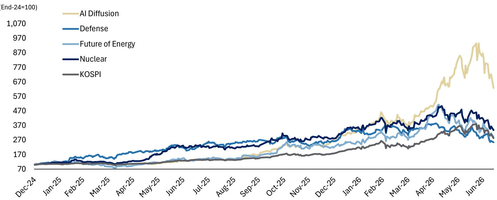  
来源：WiseFN, MS。过往表现不代表未来结果。

## 结构性增长故事：AI技术扩散——算力需求持续攀升

## 算力需求以非线性速率持续增长，推动基础设施需求

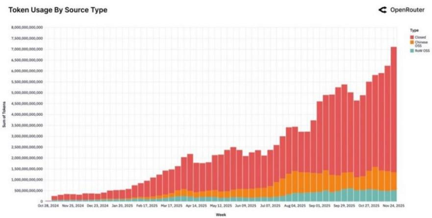

我们认为算力需求可能显著超过供给的原因：

- 谷歌高管预测，其算力需求约为MS对英伟达算力复合年增长率预测的3倍。

一年内，每周令牌使用量增长了约2,200%，且AI任务的平均复杂度正以非线性速率增加。

来源：OpenRouter。注：按模型类型划分的每周令牌量。堆叠柱状图显示按模型类别划分的令牌使用总量随时间变化。深红色对应专有模型（封闭），橙色代表中国开源模型，青色表示中国以外地区开发的开源模型。该图突出显示了2025年期间开源模型令牌份额的逐步增长，尤其是从年中开始的中国开源模型。更多详情，请在此处查找报告。

## 内存价格上涨给硬件OEM厂商带来成本压力

## 三大支柱

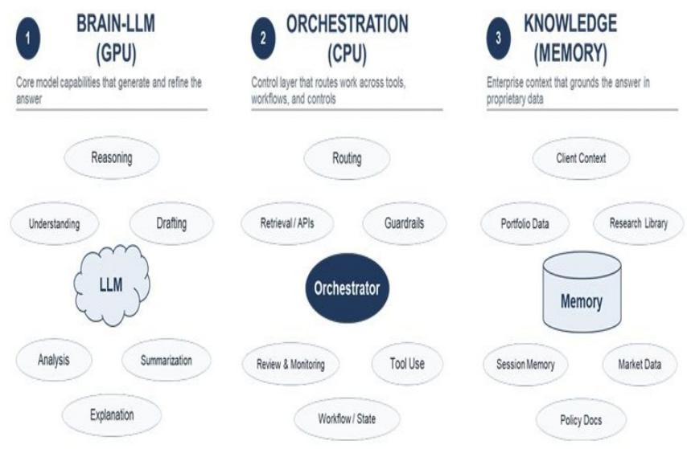

来源：MS。更多详情，请在此处查找报告。

## 结构性增长故事：AI技术扩散——不同行业公司如何采用AI？

公司正从AI应用中看到可量化的收益

提供可量化AI影响的公司占比  
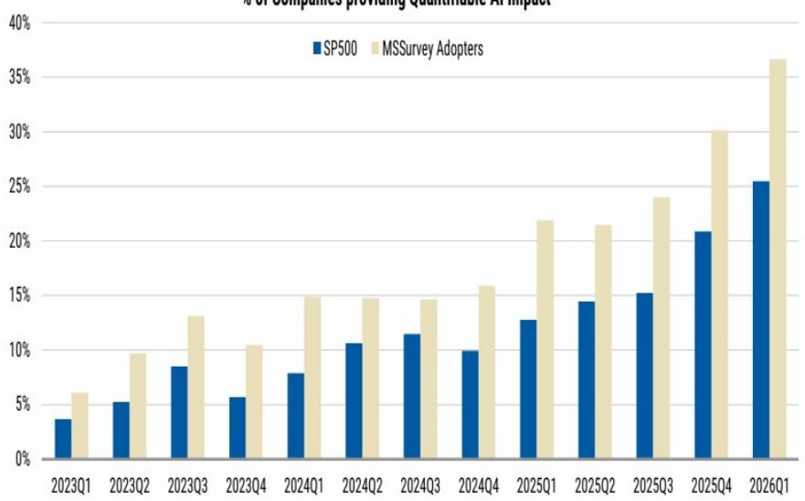  
大多数可量化收益与“财务影响”和“生产力提升”相关

来源：MS。请注意，提及多种可量化AI收益的公司在此图表中仅计数一次。更多详情，请在此处查找报告

各季度类别提及次数  
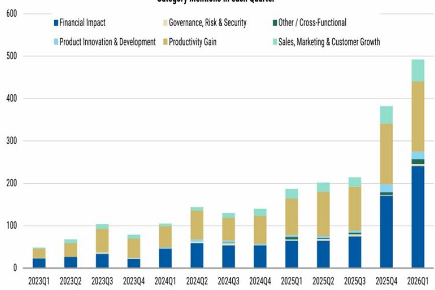  
来源：MS。更多详情，请在此处查找报告

## 结构性增长故事：AI技术扩散——我们处于周期的哪个阶段？

SOX指数估值 vs. 全球半导体收入同比变化

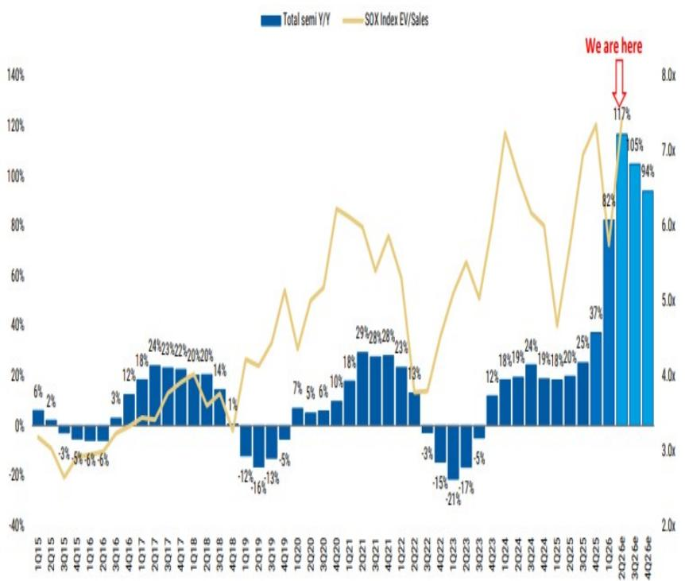  
盈利实力仍是主要驱动力

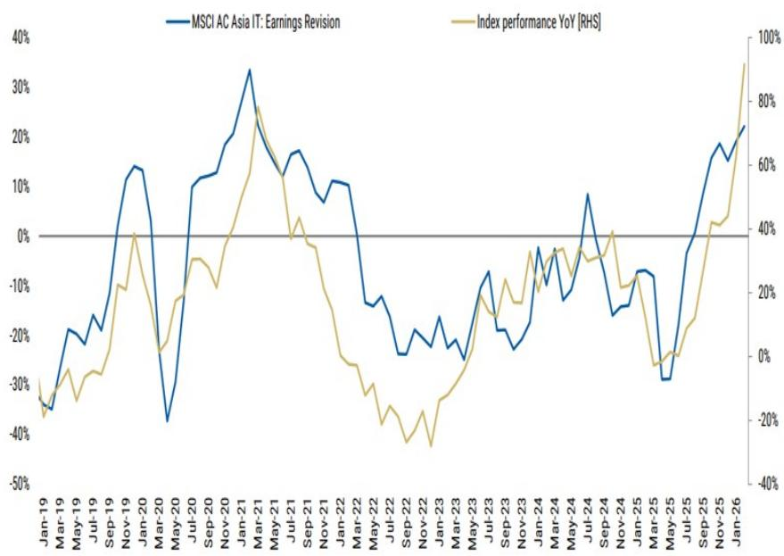  
来源：SIA, FactSet, MS (e) 估计。

## 结构性增长故事：工业领域的超级周期汇聚——多个工业子行业存在机遇

韩国：工业关键子行业

<table><tr><td>子行业</td><td>备注</td></tr><tr><td>发电</td><td>韩国的发电和电网生态系统正进入新阶段，其动力来自满足日益增长的国内电力需求以及海外机遇。韩国电力设备制造商正利用成本竞争力和成熟技术，在美国、中东和欧洲赢得大型招标，这些地区的电网现代化和可再生能源整合正在加速。在配件方面，我们认为对LNG出口终端的需求上升将导致对配件产品的需求增加。加之供应商格局有限，这应有利于韩国配件企业的收入/盈利增长前景至2026年。</td></tr><tr><td>核电</td><td>核能正经历结构性重估，因为鉴于未来AI数据中心对电力需求的预期增长，核能作为可持续、可调度的基荷电源仍不可替代。此外，近期私营部门主导的小型模块化反应堆部署加速，可能为韩国企业提供额外增长机会，因为它们与NuScale、TerraPower等多个小型模块化反应堆开发商建立了战略合作伙伴关系。</td></tr><tr><td>国防</td><td>美伊冲突后地缘政治紧张局势加剧，重新激发了读者对国防股的兴趣，尤其是防空领域，但需要有所选择。2026年新订单管道对陆上系统和航空航天有利，海军舰艇订单是摇摆因素，因为一旦中标，订单规模将相当可观。</td></tr><tr><td>海外EPC企业</td><td>尽管国内建筑业面临挑战，但韩国承包商在海外仍有持续机遇。传统的碳氢化合物和基础设施项目仍是主流，但未来在能源转型和核电EPC领域的机会也在增加。</td></tr><tr><td>造船厂</td><td>估值显著高于历史水平。读者似乎更倾向于第二个LNG订单周期，但对国防故事仍存疑问。目前存在一些规模可观的投标，例如韩国造船厂正在竞标的加拿大潜艇项目。</td></tr></table>

来源：MS

## 结构性增长故事：汽车行业——执行与机器人技术时机

现代汽车/起亚：美国市场份额 vs. 合并市值

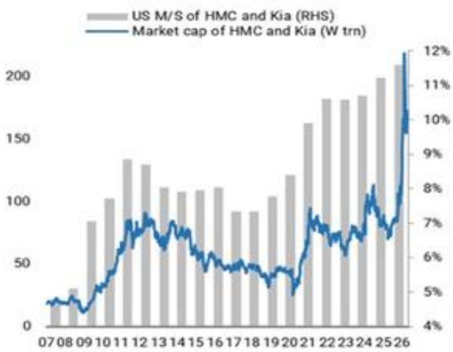  
来源：Motor Intelligence, 公司数据, WiseFN, MS

全球汽车：2026年预期市盈率 vs. 净资产回报表现  
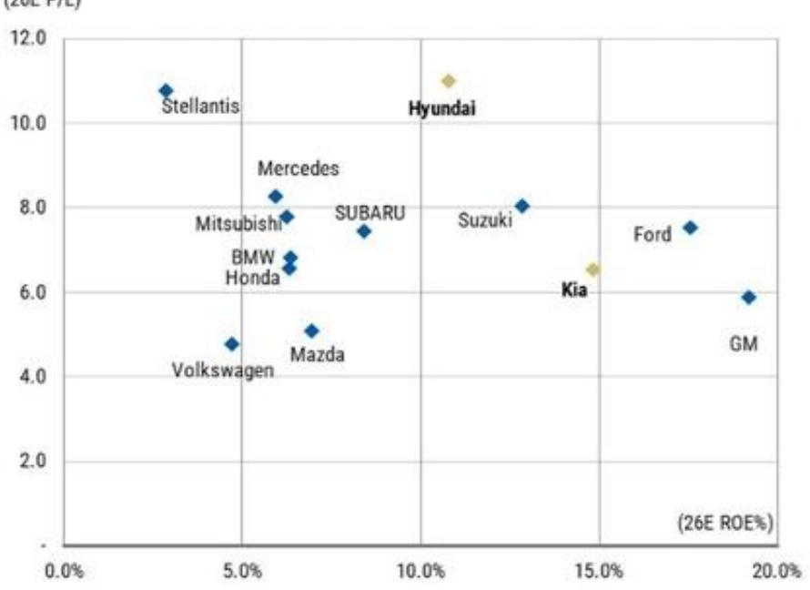  
来源：MS (e) 估计

## 结构性增长故事：奢侈品消费——平衡的国内需求增长偏向奢侈品及入境旅游

百货商店外国消费  
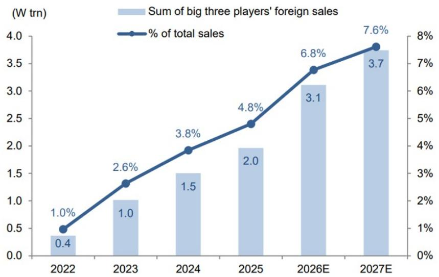

百货商店奢侈品销售增长  
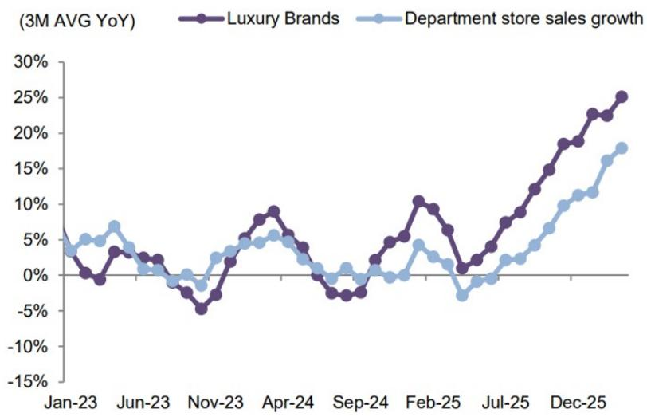

## 散户读者会坚持持有权益资产吗？流动性增加，但波动性亦增

家庭对利率上升的敏感性带来压力  
韩国：家庭债务趋势  
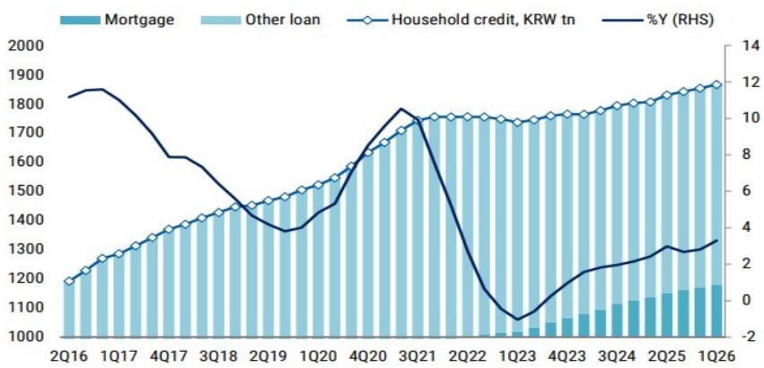

KOSPI+KOSDAQ保证金贷款余额  
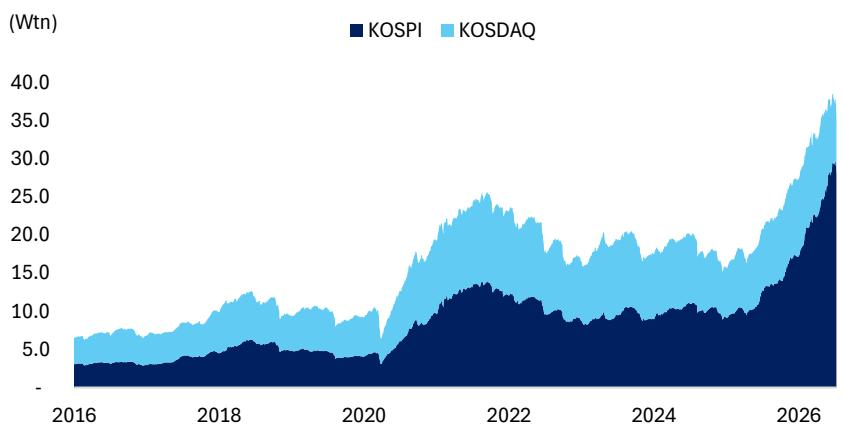

散户读者借入无担保贷款投资权益  
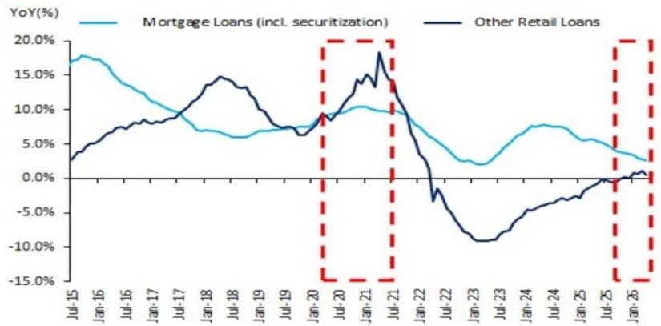  
来源：KOFIA, WiseFN, MS

杠杆化国内权益ETF资产管理规模趋势  
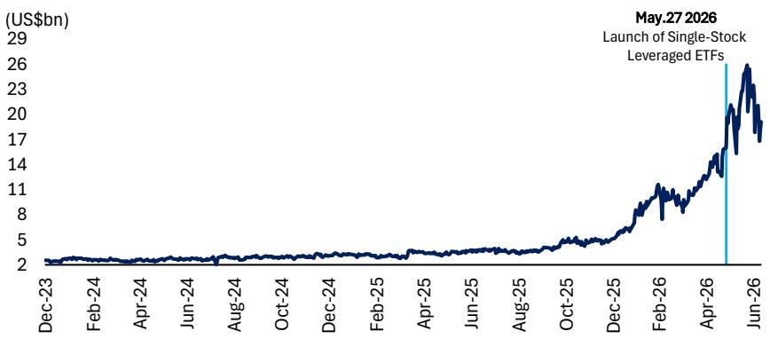  
来源：BoK, KOFIA, MS

## 散户读者会坚持持有权益资产吗？散户读者仍偏好波动性和主题，但略显成熟

KOSPI：年化波动率与散户交易额占比

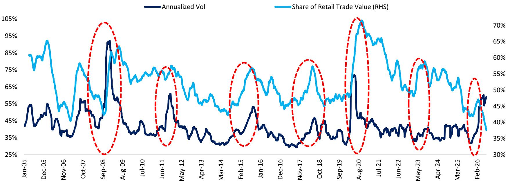

## 散户读者会坚持持有权益资产吗？当前周期中散户读者的持仓集中度较低

KOSPI价格趋势与按价格区间划分的散户净流量（2020-2021年）

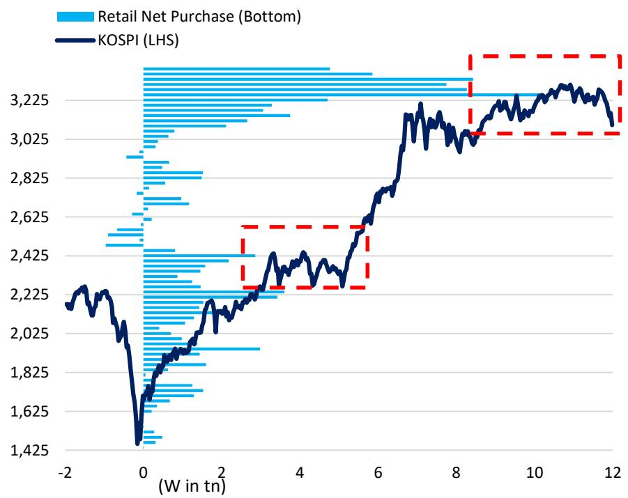  
来源：WiseFN, MS，数据截至2026年7月13日  
KOSPI价格趋势与按价格区间划分的散户净流量（2025年上半年至今）

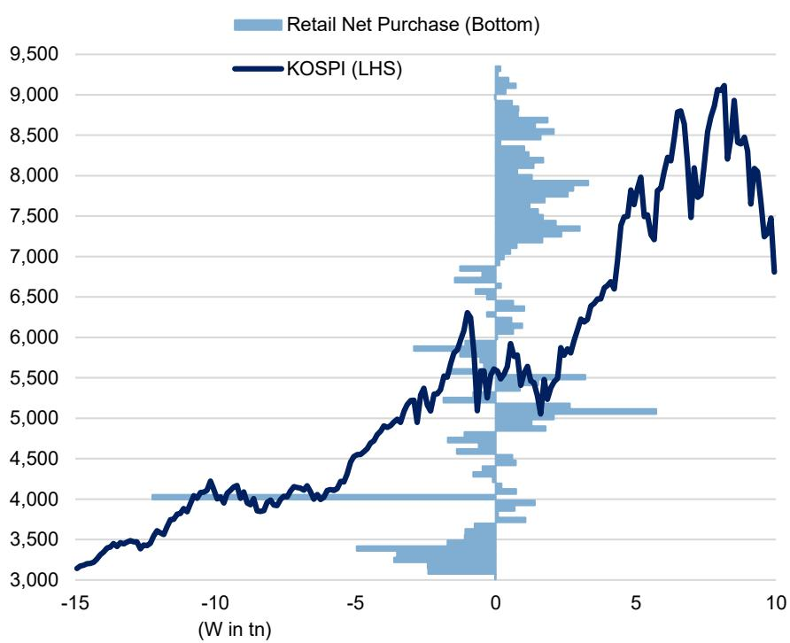

## 散户读者会坚持持有权益资产吗？散户读者应继续平衡国内与海外头寸

散户读者：月度净买入美国权益

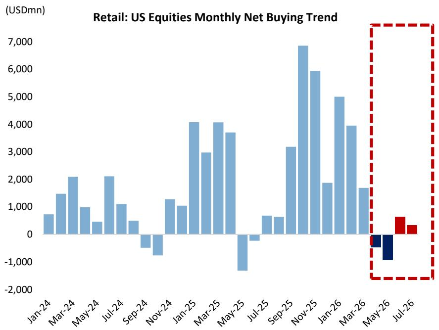  
散户读者：海外权益持仓

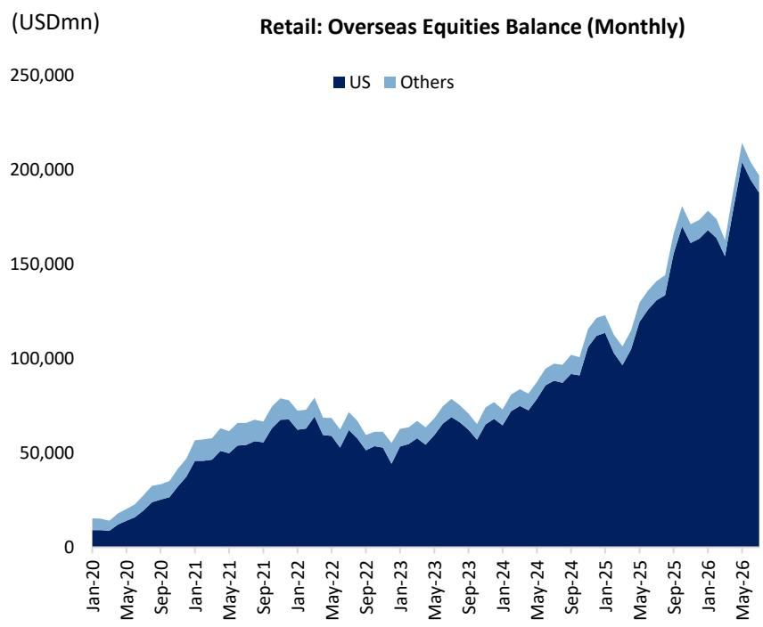

## 散户读者会坚持持有权益资产吗？权益渗透率取决于资金流向和市值趋势

家庭权益持仓——基准、乐观和悲观情景

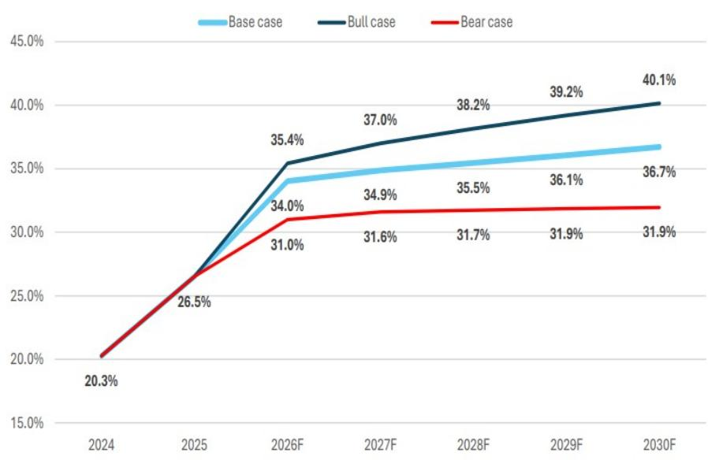

韩国——家庭金融资产总额趋势与预测（基准情景）

<table><tr><td>(万亿韩元)</td><td>2023</td><td>2024</td><td>2025</td><td>2026F</td><td>2027F</td></tr><tr><td>家庭金融资产总额</td><td>5,209.4</td><td>5,472.6</td><td>6,201.9</td><td>7,256.8</td><td>7,656.4</td></tr><tr><td>货币与存款</td><td>2,414.2</td><td>2,536.7</td><td>2,676.5</td><td>2,730.0</td><td>2,811.9</td></tr><tr><td>保险与养老金储备</td><td>1,457.6</td><td>1,579.0</td><td>1,650.3</td><td>1,815.3</td><td>1,906.1</td></tr><tr><td>股票以外的证券</td><td>168.6</td><td>199.6</td><td>182.1</td><td>192.1</td><td>217.1</td></tr><tr><td>权益及等价物</td><td>1,127.9</td><td>1,109.3</td><td>1,644.3</td><td>2,469.3</td><td>2,669.3</td></tr><tr><td>其他</td><td>41.1</td><td>48.1</td><td>48.7</td><td>50.0</td><td>52.0</td></tr></table>

<table><tr><td>(%)</td><td>2023</td><td>2024</td><td>2025</td><td>2026F</td><td>2027F</td></tr><tr><td>货币与存款</td><td>46.3</td><td>46.4</td><td>43.2</td><td>37.6</td><td>36.7</td></tr><tr><td>保险与养老金储备</td><td>28.0</td><td>28.9</td><td>26.6</td><td>25.0</td><td>24.9</td></tr><tr><td>债券持仓</td><td>3.2</td><td>3.6</td><td>2.9</td><td>2.6</td><td>2.8</td></tr><tr><td>权益及等价物</td><td>21.7</td><td>20.3</td><td>26.5</td><td>34.0</td><td>34.9</td></tr></table>

## 对资本市场/治理改革有何期待？改革预计将持续

<table><tr><td colspan="3">2026年需关注的关键进展与措施</td></tr><tr><td>措施/事件</td><td>备注</td><td>时间线</td></tr><tr><td colspan="3">2026年</td></tr><tr><td>商法典3.0 - 强制注销库存股措施</td><td>执政党议员提出了多项商法修正案，规定了不同期限内强制注销库存股，最终法案得以确认。执政党的KOSPI 5000委员会于2025年11月24日提交了修改商法中与库存股相关规则的议案。该法案于2026年2月25日获得国会通过，关键规则为库存股需在1年内注销，但现有库存股将获得额外6个月的宽限期，并规定了例外情况，但需股东批准。2026年2月25日获国会通过。</td><td>2026年3月5日颁布</td></tr><tr><td>资本市场规则框架升级</td><td>上届政府于2024年12月2日宣布了《资本市场法》修正案提案，重点修改与并购和业务重组交易相关的规则，以减少对少数股东的不利影响。新政府也希望修订《资本市场法》，但我们需要等待综合提案的确认，或者可能只是零散的修正。</td><td>2026年上半年</td></tr><tr><td>激励KOSDAQ市场投资的举措</td><td>2025年12月19日，金融委员会宣布了振兴KOSDAQ市场的措施，包括：（1）完善上市和退市要求，通过便利有前景的公司进入和确保表现不佳或不合规公司及时退出，增强市场活力；（2）通过提高机构读者参与度来改善市场信誉；（3）明确关键市场问题的审查标准并加强读者保护；（4）增强KRX内KOSDAQ市场部门的独立性和运营自主权，以鼓励积极努力。</td><td>2026年~</td></tr><tr><td>启动主权财富基金</td><td>政府一直在讨论启动一个国有战略投资实体，通常被称为“韩国版淡马锡”，旨在为战略行业提供长期资本。与韩国现有的主权财富基金KIC相比，新基金可能更侧重于战略性和国内投资，而非纯粹的金融或全球投资组合多元化。据企划财政部称，初始资金来源可能包括公共基金、政府拥有的资产或政策性金融机构，而非外汇储备。重点关注的关键行业/主题将包括半导体、AI相关行业、能源转型、医疗保健、航天、国防及其他战略行业。</td><td>2026年</td></tr><tr><td>国内流动性相关措施</td><td>近期，政府宣布了多项措施，以激励散户读者投资国内权益市场并确保长期投资，包括：（1）回流投资账户：RIA是一种政策驱动的投资账户，旨在鼓励国内散户读者返回韩国权益市场；该账户旨在通过为通过指定账户投资的资产提供税收优惠，来支持国内流动性并扩大国内散户读者基础。根据企划财政部的税收优惠提案，出售海外权益持仓并将收益再投资于国内权益的散户读者，其处置收益可享受一年期税收优惠。海外权益资本利得的税收优惠因处置时间而异。例如，在2026年第一季度汇回资金的读者有资格获得100%的豁免，而在2026年下半年汇回资金的读者则有资格获得部分豁免（例如50%）——尽管细节尚未最终确定。（2）个人储蓄账户：政府可能会提高甚至取消目前200万韩元的ISA免税限额；同时正在审查一项提案，将国家增长基金和BDC基金纳入ISA计划下的合格投资工具。与此同时，一位政策制定者提出了一项法案，建议提高ISA的投资限额，并将当前9%的税率降至5%，以激励通过ISA对国内权益市场进行长期投资。（3）引入国家增长基金和BDC基金：政府还考虑对投资于国家增长基金和BDC基金等政策驱动型基金给予比投资于传统权益型基金更强的税收优惠。根据该提案，税收优惠将适用于缴款和股息收入，这些基金的股息可能按较低税率单独征税。与此同时，政府计划在2026年1月中旬宣布以首尔都市区为重点的额外住房供应措施，此前2025年已出台住房市场政策，以稳定住房市场价格并打击投机需求。</td><td>2026年上半年</td></tr><tr><td>《反股价打压法》</td><td>所谓的《反股价打压法》是指对《继承与赠与税法》的一项拟议修正案，由民主党政策制定者李素英于2025年5月首次提出。该提案旨在防止控股股东在继承前故意压低公司股价以降低继承税或赠与税。根据该法案，如果上市公司的市净率低于0.8倍，则该股票在征收继承税时不会按市场价格估值，而是采用类似于非上市公司的评估方法，最低估值下限为0.8倍市净率，以消除人为压低价格的动机。</td><td>2026年</td></tr></table>

来源：MS。

## 对资本市场/治理改革有何期待？净资产回报表现呈上升趋势，但需观察可持续水平；股东总回报应有所改善

KOSPI年度股东总回报趋势

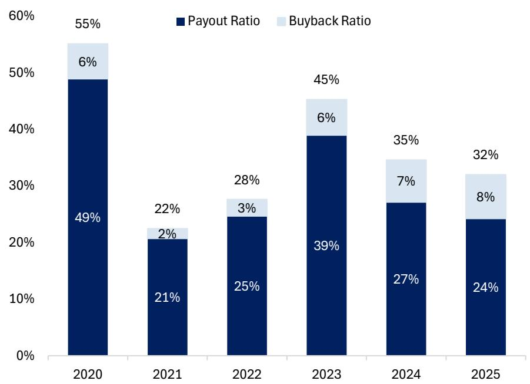  
来源：WiseFN, KRX, MS  
KOSPI年度净资产回报表现趋势

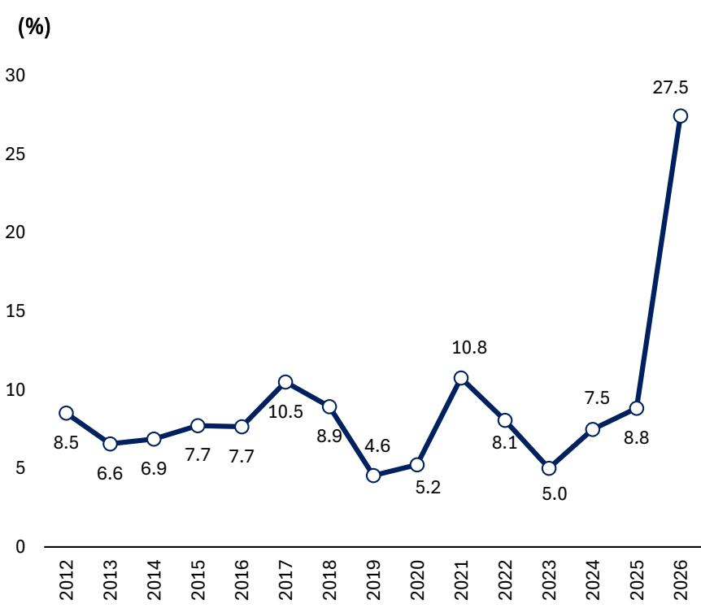  
来源：WiseFN, MS, E=WiseFN一致预期

## 对资本市场/治理改革有何期待？积极的资本管理是关键因素；近年来回购趋势上升  
韩国在资本管理方面仍低于同类市场

<table><tr><td rowspan="10">股息支付率</td><td>年份</td><td>MSCI韩国</td><td>MSCI日本</td><td>印度</td><td>中国</td><td>AxJ</td><td>EM</td><td>DM</td><td>欧洲</td><td>美国</td><td>澳大利亚</td></tr><tr><td>2017</td><td>16.1%</td><td>30.7%</td><td>29.7%</td><td>29.9%</td><td>33.4%</td><td>34.0%</td><td>43.8%</td><td>55.0%</td><td>38.6%</td><td>73.8%</td></tr><tr><td>2018</td><td>20.3%</td><td>29.3%</td><td>32.5%</td><td>30.1%</td><td>35.1%</td><td>35.8%</td><td>40.0%</td><td>53.3%</td><td>33.9%</td><td>75.4%</td></tr><tr><td>2019</td><td>32.9%</td><td>35.1%</td><td>36.3%</td><td>29.5%</td><td>39.3%</td><td>40.4%</td><td>42.6%</td><td>55.9%</td><td>36.2%</td><td>81.0%</td></tr><tr><td>2020</td><td>33.6%</td><td>49.3%</td><td>37.4%</td><td>27.9%</td><td>38.4%</td><td>40.0%</td><td>48.3%</td><td>62.5%</td><td>41.1%</td><td>68.1%</td></tr><tr><td>2021</td><td>21.5%</td><td>35.2%</td><td>33.1%</td><td>27.5%</td><td>34.8%</td><td>37.4%</td><td>36.5%</td><td>48.3%</td><td>30.0%</td><td>74.1%</td></tr><tr><td>2022</td><td>24.0%</td><td>33.1%</td><td>33.1%</td><td>29.3%</td><td>36.3%</td><td>39.7%</td><td>35.3%</td><td>42.9%</td><td>30.2%</td><td>67.4%</td></tr><tr><td>2023</td><td>36.9%</td><td>34.9%</td><td>32.3%</td><td>27.1%</td><td>37.8%</td><td>39.7%</td><td>37.3%</td><td>46.0%</td><td>31.7%</td><td>66.9%</td></tr><tr><td>2024</td><td>24.2%</td><td>35.1%</td><td>31.7%</td><td>28.6%</td><td>35.5%</td><td>37.8%</td><td>37.4%</td><td>48.3%</td><td>31.6%</td><td>69.5%</td></tr><tr><td>2025</td><td>20.7%</td><td>37.2%</td><td>33.6%</td><td>29.0%</td><td>35.8%</td><td>37.7%</td><td>36.1%</td><td>49.9%</td><td>29.4%</td><td>68.8%</td></tr></table>

股票回购

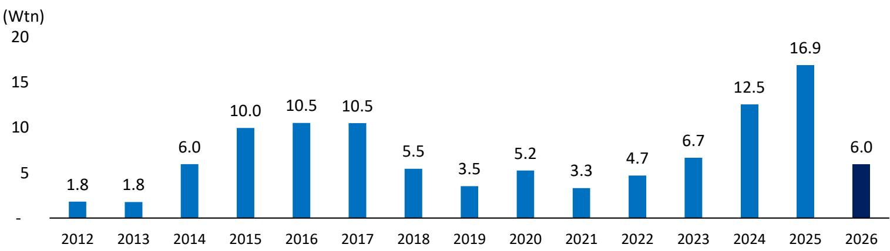  
来源：Refinitiv, KRX, MS。

## 对资本市场/治理改革有何期待？企业执行是关键；改革政策推动使关键利益相关者更加活跃

日本 vs. 韩国股东提案

股东提案总数

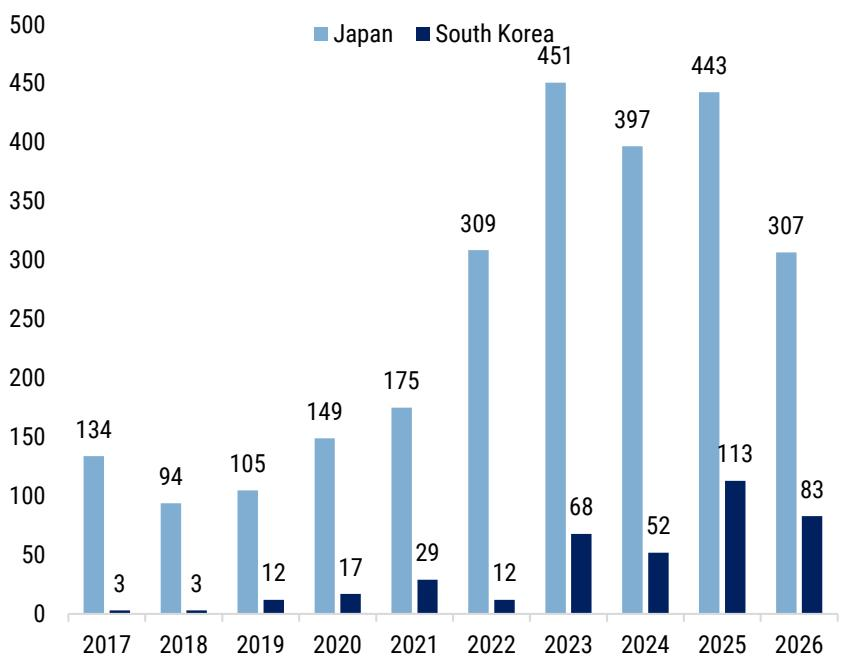  
韩国企业集团——需关注的因素

<table><tr><td></td><td>治理动力</td><td>所有权结构</td><td>业务组合</td><td>股息支付率（2026-2027年）</td><td>股票回购（2026-2027年）</td><td>利益相关者行动</td></tr><tr><td>韩华</td><td>积极</td><td>是</td><td>是</td><td>适度上行</td><td>不太可能</td><td>否</td></tr><tr><td>SK</td><td>积极</td><td>否</td><td>是</td><td>持平</td><td>不确定</td><td>可能</td></tr><tr><td>乐天</td><td>中性</td><td>否</td><td>是</td><td>显著下行</td><td>不太可能</td><td>是</td></tr><tr><td>LG</td><td>中性</td><td>否</td><td>是</td><td>适度上行</td><td>不确定</td><td>否</td></tr><tr><td>现代汽车</td><td>积极</td><td>是</td><td>是</td><td>适度上行</td><td>可能</td><td>是</td></tr><tr><td>三星</td><td>中性</td><td>可能</td><td>是</td><td>适度上行</td><td>仅三星电子</td><td>是</td></tr><tr><td>Kakao</td><td>中性</td><td>否</td><td>是</td><td>持平</td><td>不确定</td><td>否</td></tr><tr><td>斗山</td><td>中性</td><td>否</td><td>是</td><td>持平</td><td>不太可能</td><td>否</td></tr><tr><td>赛尔群</td><td>中性</td><td>是</td><td>否</td><td>持平</td><td>不确定</td><td>否</td></tr><tr><td>CJ</td><td>中性</td><td>否</td><td>否</td><td>适度下行</td><td>不太可能</td><td>否</td></tr><tr><td>新世界</td><td>中性</td><td>否</td><td>否</td><td>显著下行</td><td>不太可能</td><td>否</td></tr></table>

来源：Bloomberg, MS。更新于2026年7月10日。

来源：韩国经济日报（2025年8月25日）, WiseFN, MS。

## 我们处于周期的哪个阶段？回归2012-2019年周期还是继续上行？

韩国周期指标  
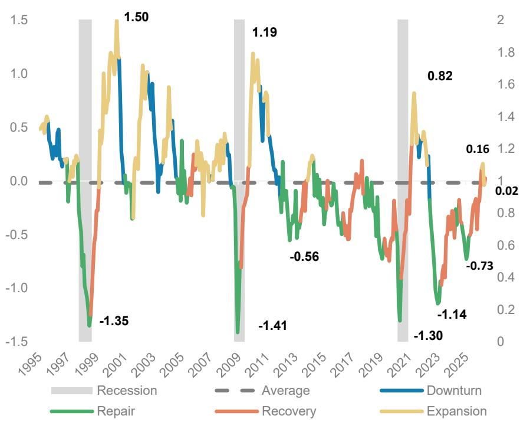

韩国周期指标 vs. KOSPI  
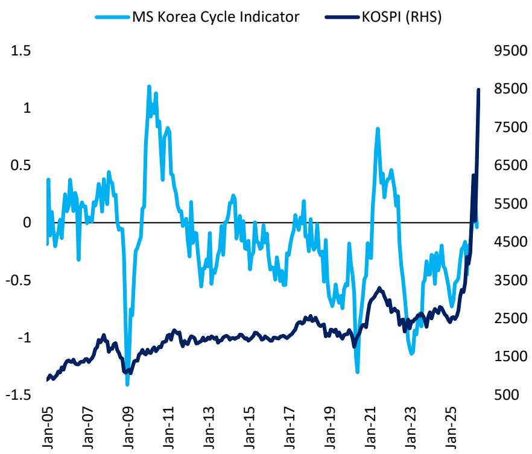

## 我们处于周期的哪个阶段？2026-2027年一致预期盈利持续上调；关注变化率

KOSPI一致预期营业利润趋势  
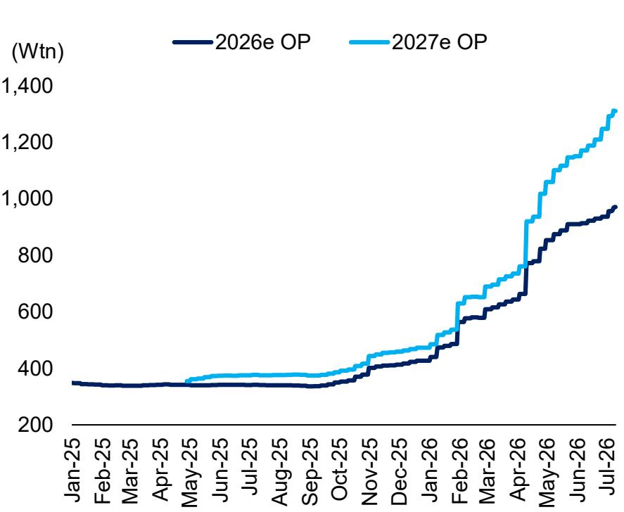  
一致预期营业利润修正趋势  
全球金融危机时期

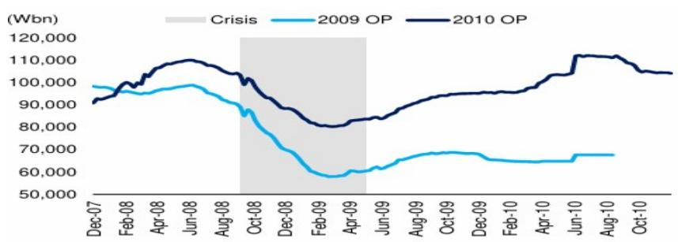

新冠疫情时期  
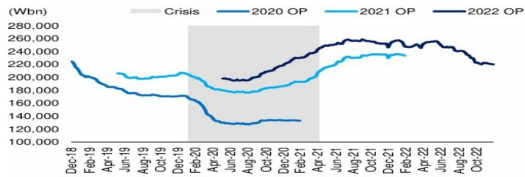

## 我们处于周期的哪个
