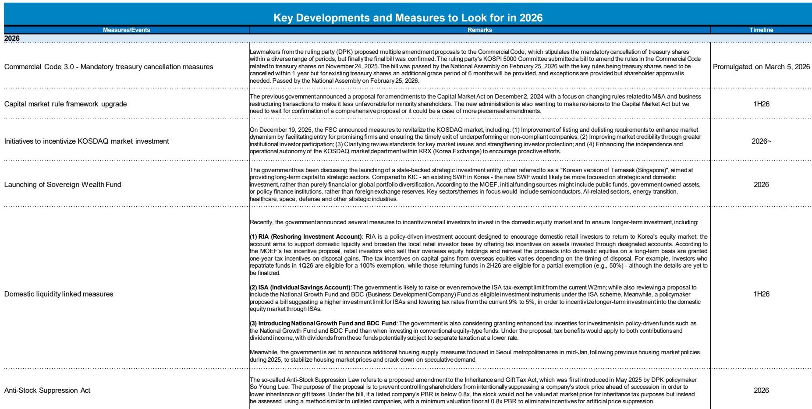
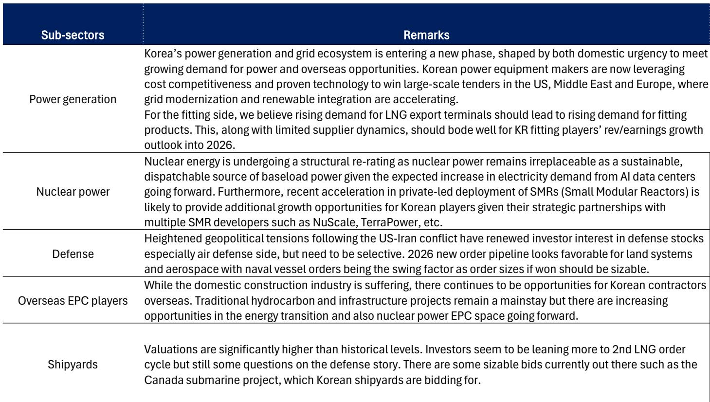
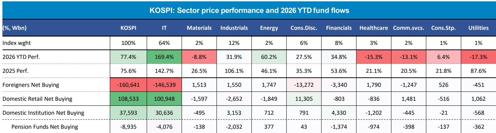

# 韩国市场结构性观察：AI扩散、产业周期与改革路径

韩国综合指数在2025年上涨75.6%后，2026年至今进一步上涨77.4%，以美元计成为亚洲表现突出的市场之一。但这并非全面复苏——全部涨幅集中在信息技术板块，该板块目前占指数权重64%，2026年至今回报达169.4%。外资今年净卖出韩国股票约160.6万亿韩元，而国内散户净买入约108.5万亿韩元。市场正围绕人工智能扩散与公司治理改革的结构性叙事运行，但技术面显示脆弱性在增加：远期市盈率有所压缩，但市净率仍处高位；行业集中度加剧；家庭杠杆进入权益市场的趋势上升。对观察者而言，问题不在于韩国是否有引人注目的结构性故事——它确实有——而在于如何驾驭叙事驱动的价格行动与流动性驱动的调整风险之间的差距。

韩国市场当前的核心张力在于结构性利好与技术性障碍之间。结构性支撑基于三大支柱：AI驱动的半导体与算力基础设施需求、发电/核能/国防/造船领域的多年产业超级周期、以及包括强制库存股注销和主权财富基金设立在内的资本市场改革政策推动。技术性障碍同样真实：市场依赖日益杠杆化的散户资金流、国家养老基金正积极从国内权益市场再平衡、以及远期市净率仍高于历史均值而远期市盈率已有所回落的估值结构。对机构观察者而言，启示明确：韩国市场的机会需要一种选择性、行业感知的方法，区分结构性赢家与动量驱动的落后者，并建立清晰的框架来决定何时增加风险敞口、何时减少。

## AI扩散创造了算力的非线性需求周期，但成本压力正在向下游迁移

韩国市场较强大的力量是AI驱动的半导体与算力基础设施需求。MS的分析显示，每周代币使用量一年内增长约2200%，AI任务平均复杂度以非线性速率上升。一位谷歌高管预测，算力需求约为MS对英伟达预测算力复合年增长率的约三倍。这种供需失衡并非周期性现象，它反映了AI模型在各行业部署方式的结构性转变。对韩国的直接影响是：三星电子和SK海力士是支撑这一周期的存储与逻辑芯片需求的主要受益者，IT板块在KOSPI中的主导地位是对这一现实的理性反映。

然而，报告也强调了一个重要的二阶效应：存储价格上涨正在给硬件OEM厂商带来成本压力。“三大支柱”框架——存储、逻辑、代工——显示，虽然韩国存储厂商受益于定价权，但下游硬件生态系统面临利润率压缩。这造成了IT板块内部的分化。并非所有KOSPI中的科技公司都处于同等位置；受益于存储定价顺风的公司与在硬件供应链中作为价格接受者的公司存在差异。观察者需要分解IT权重，聚焦于定价权最持久的领域。

## 产业超级周期的汇聚创造了半导体之外的第二条结构性增长线

韩国工业板块正经历由四个不同但相互强化的周期驱动的同步重估。发电与电网现代化正在加速，韩国设备制造商凭借成本竞争力和成熟技术在美国、中东和欧洲赢得大型招标。核能正经历结构性重估，因为AI数据中心对基荷电力的需求使核能不可替代，小型模块化反应堆开发的加速为拥有战略合作伙伴关系的韩国企业创造了额外机会。国防股在地缘政治紧张局势升级后重新获得关注，特别是在防空领域，2026年陆上系统与航空航天订单前景良好。海外EPC承包商继续在传统碳氢化合物和基础设施项目中寻找机会，能源转型和核能领域的业务范围不断扩大。

造船子板块呈现更微妙的图景。估值显著高于历史水平，虽然读者正押注第二轮LNG订单周期，但关于国防叙事的疑问依然存在。加拿大潜艇项目是一个重要的摇摆因素——如果中标，可能支撑当前估值；如果失利，下行空间可能较大。关键洞察在于，产业超级周期并非单一整体。观察者必须区分盈利可见性高且估值仍合理的子板块——如电力设备和核能——与叙事已超前于盈利兑现的子板块，如造船。结构性机会真实存在，但入场时机很重要。

## 资本市场改革是可信的催化剂，但其影响将是渐进的且在各行业间不均衡

韩国政府已实施多项直接针对“韩国折价”叙事的措施。2026年2月25日国会通过的《商法3.0》规定，库存股须在一年内注销，现有库存股有六个月宽限期，例外情况需经股东批准。这是向股东返还资本、改善股本回报率的具体机制。此外，政府宣布计划设立一个以淡马锡为蓝本的主权财富基金，初始资金来自公共基金和政府拥有的资产，聚焦于半导体、AI、能源转型、医疗保健、太空和国防等战略行业。

这些改革在结构上是积极的，但其影响将是渐进的且不均衡。强制库存股注销将主要惠及持有大量库存股的公司，这些公司通常是大型企业集团。主权财富基金将为权益市场提供新的长期国内需求来源，但其初始规模不确定，部署时间表将跨越数年。资本市场规则框架升级，包括《资本市场法》修正案，仍在进行中。改革最直接的影响是读者情绪，但转化为更高的可持续估值将取决于一致的执行和广泛的企业行为变化。

## 散户行为是主导性技术力量，其可持续性取决于收入与杠杆动态

KOSPI的上涨主要由国内散户推动，他们在2026年提供了108.5万亿韩元的净买入。这并非新现象——自2020年以来散户参与度一直较高——但当前周期显示出重要差异。散户持仓比2020-2021年期间更分散，净资金流分布在更多价格区间而非集中在峰值。这表明散户基础更成熟、投机性更低。然而，报告也揭示了令人担忧的趋势：散户正通过无担保贷款投资权益市场，保证金贷款余额处于高位，杠杆化国内权益ETF资产管理规模快速增长。

关键变量是家庭收入与债务动态。韩国家庭债务趋势显示对利率上升的敏感性增加，权益渗透率——目前占家庭金融资产的26.5%——在基准情景下预计到2027年将升至34.9%。在乐观情景下，权益渗透率可能进一步上升。风险在于，负面收入冲击或利率上升可能触发去杠杆周期，迫使散户卖出权益以偿还债务。报告的基准情景假设散户参与持续，但安全边际正在收窄。对机构观察者而言，这意味着散户驱动的流动性顺风是一把双刃剑：它提供短期支撑，但引入了对宏观冲击的脆弱性，可能迅速逆转资金流。

## 以策略性纪律驾驭韩国结构性上涨的决策框架

以下框架将报告分析转化为可操作的观察逻辑。核心问题是：在什么条件下，观察者应增加或减少对韩国权益市场的敞口？

第一，评估AI周期阶段。SOX指数估值相对于全球半导体收入增长表明，盈利实力仍是主要驱动因素，但周期正在成熟。如果存储价格开始下跌，或主要科技公司的AI资本支出指引令人失望，IT板块的领导地位将面临风险。在此情景下，减少IT敞口并转向产业超级周期中盈利较少依赖芯片定价的公司。

第二，监控散户资金流动动态。关键指标是保证金贷款余额、杠杆化ETF资产管理规模和无担保贷款增长。如果其中任何一项出现急剧加速，表明投机过度，增加调整概率。相反，如果散户资金流稳定或放缓，突然逆转的风险降低。国民养老金服务公司的再平衡计划——目标是将国内权益配置从25.1%降至2026年底的20.8%——是一个结构性逆风，将吸收部分散户驱动的买入。

第三，评估改革执行情况。强制库存股注销法已生效，但真正的考验将在2027年公司必须遵守时到来。如果合规率高且伴随股息增加，更广泛市场的估值重估将持续。如果公司找到漏洞或延迟，改革叙事将失去可信度。

第四，管理行业集中风险。KOSPI目前按市值计算64%为IT板块，IT板块在年度净利润中的份额更高。这种集中意味着单一行业冲击——如美国出口管制升级或存储需求的周期性下滑——将对指数产生不成比例的影响。审慎的配置应保持IT敞口，但通过具有不同需求驱动因素的工业、国防和核能头寸进行对冲。

最后，纳入估值纪律。KOSPI 12个月远期市盈率已从峰值回落，但远期市净率仍处高位。在结构性叙事驱动的市场中，估值是较差的择时工具，但它是有效的风险管理工具。当远期市净率超过历史均值两个标准差时，表明市场正在定价完美。此时，减少敞口并等待回调是纪律性操作。

韩国的故事是真实的。AI扩散、产业超级周期和治理改革是合法的结构性驱动因素。但市场已定价了相当一部分乐观情绪。当前的风险回报平衡倾向于有明确退出标准的选择性敞口，而非广泛基础的信念。

*仅供参考。部分内容可能基于源材料通过AI辅助生成、翻译、总结或编辑，可能存在遗漏或错误。请独立核实。这不构成专业建议。*

仅供参考。部分内容可能基于源材料通过AI辅助生成、翻译、总结或编辑，可能存在遗漏或错误。请独立核实。这不构成专业建议。

