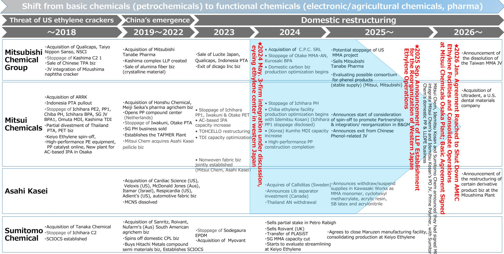
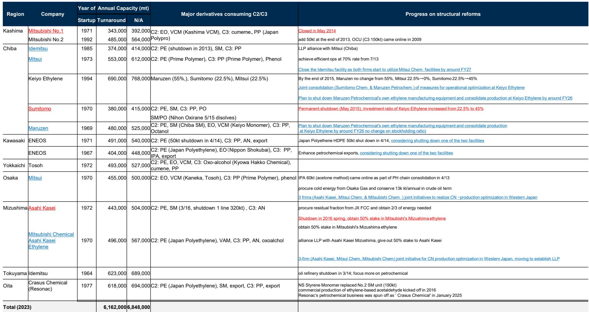
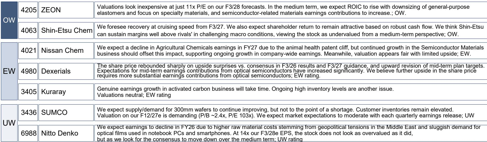

# 日本化工行业正被两股力量重塑：AI需求与结构性产能过剩——只有选对方向的公司才能胜出

日本化工行业正进入一个结构性分化的时期，这种分化将比任何周期性回升都更明确地区分领先者与落后者。一方面，AI驱动的半导体需求正将电子化学品和先进材料带入持续增长轨道。另一方面，石化巨头仍深陷全球产能过剩周期，该周期未见真正复苏迹象，仅有市场情绪的边际改善。战略启示很明确：能够将资源配置转向电子和特种应用的公司将捕获不成比例的价值，而那些固守大宗石化产品的公司则面临漫长的产能调整和利润压缩过程。

这种分化的时机至关重要。在经历了整个行业多年的估值低迷和读者怀疑之后，选择性重估的条件正在形成。根据分析，亚洲石化价格和价差不太可能进一步下跌，但也缺乏回升动力。这不是反弹前的底部，而是长期结构性调整前的平台。与此同时，电子化学品正受益于AI半导体扩张和传统半导体需求的逐步复苏，呈现出稳定的增长趋势。这两条轨迹之间的差距正在扩大，而市场尚未充分定价其影响。

使当前时刻具有战略重要性的是三个发展的交汇：AI相关半导体资本支出的加速、亚洲石化产能削减的首个可信迹象，以及日本化工公司仍被低估的状态。整个行业的观察指标仍处于低位，公司报价普遍看起来被低估。对于观察者和企业战略制定者而言，问题不在于行业是否会全面复苏，而在于哪些子板块和哪些公司能够从正在增强的力量中受益。

## 石化下行周期已企稳，但复苏将来自产能退出，而非需求反弹

全球石化行业一直受困于经典的结构性过剩：中国的大规模产能增加、下游需求疲软，以及许多生产商的乙烯利用率长期低于盈亏平衡水平。报告明确预期石化需求将持续疲软，乙烯利用率保持低位。分析师提到的情绪改善并非来自需求驱动的复苏，而是来自两个终于取得进展的供应侧发展。

首先，中国的“反内卷”政策正开始减缓新增产能的步伐，并可能鼓励一些国内生产商更理性地运营。在经历了多年使全球市场充斥大宗化学品的快速扩张后，这是一个有意义的转变。其次，或许更重要的是，有迹象显示韩国的石脑油裂解装置正在缩减规模。韩国石化生产商一直是产能扩张中最激进的之一，其产量的任何减少都将收紧区域供应平衡。

这里的关键洞察是，这些发展通过降低下行风险来改善前景，而非创造上行催化剂。报告的语言很精确：亚洲石化价格和价差不太可能进一步下跌，但可能缺乏回升动力。这是一个企稳论点，而非复苏论点。对于石化巨头板块的公司而言，这意味着盈利可能停止恶化，但除非更多产能退出市场，否则不会显著改善。

这种动态为行业重组创造了额外动力，报告明确指出了这一点。拥有多元化业务模式、能够交叉补贴其石化业务的公司具有更大的战略灵活性。而那些纯粹从事大宗化学品的公司则面临更有限的选择。因此，石化巨头板块的观察吸引力集中在那些积极将资源从大宗商品转向高增长领域的公司。

## 电子化学品是结构性增长引擎，由AI和更广泛的半导体复苏驱动

当石化行业在争取企稳时，电子化学品正经历着根本不同的需求环境。报告指出了两个并行驱动因素：AI半导体的扩张加速了对先进材料的需求，以及传统半导体的逐步复苏支撑了更广泛产品线的数量增长。

AI半导体主题在芯片设计和代工产能的背景下已被充分理解，但其对化工供应链的影响却较少被讨论。先进封装、高带宽内存以及AI加速器的热管理需求都依赖于专门的化学材料。硅片、光刻胶和高纯度工艺化学品是直接受益于半导体资本支出增加的关键投入品。

报告指出，对于硅片而言，用户库存水平仍然较高，这带来了短期阻力。然而，复苏趋势仍在继续，主要集中在300mm硅片。这是一个关键细节：300mm硅片是包括AI芯片在内的前沿逻辑和存储设备的基底。复苏集中在这一规格的事实证实了需求信号来自先进节点，而非通用半导体生产。

电子化学品的稳定增长趋势并非会逆转的周期性回升。这是一个由半导体制造材料强度增加和AI相关基础设施扩张驱动的结构性转变。在这一供应链中已建立地位的公司正受益于数量增长、定价能力以及大宗化学品生产商所缺乏的进入壁垒。报告关于Zeon和信越化学的观点反映了这一论点。

## 精细化学品提供选择性机会，以航空复苏和利基领导地位为锚点

精细化学品板块呈现出更微妙的图景，其中最引人注目的机会由特定终端市场的复苏驱动，而非广泛的行业趋势。碳纤维复合材料由于飞机应用的全面复苏而显示出显著的收入改善。商业航空是受疫情影响最严重的行业之一，飞机生产率的复苏现在正转化为对先进材料的实际需求。

报告将东丽列为该板块的首选，理由是其碳纤维业务的领先份额以及在纺织和功能化学品方面的实力。这是一家受益于多重结构性顺风的公司：航空复苏、汽车和工业应用的轻量化趋势，以及包括更高利润特种产品在内的多元化组合。

对于更广泛的精细化学品板块而言，机会集比电子化学品更窄。报告对该板块维持中性观点，表明上行空间集中在特定公司，而非全行业现象。战略启示是，观察者和企业规划者需要高度选择性，专注于在利基市场具有明确竞争优势的公司，而非期待广泛的改善。

## 导航三个子板块的决策框架

对于评估日本化工行业敞口的企业战略制定者和观察者而言，关键决策不在于是否进入该行业，而在于哪个子板块和哪些公司与当前的结构性力量相一致。以下框架将报告分析综合为可操作的标准。

**石化巨头：青睐具有多元化和重组选择权的公司。** 这里的论点并非石化行业会复苏，而是下行空间有限，并且能够将资本重新配置到高增长业务的公司将获得回报。报告关于住友化学、三井化学和旭化成的观点反映了这一逻辑。特别是住友化学，因其在农用化学品和IT相关领域的加速增长而受到关注，这些领域与其传统的石化业务不同。需要监测的关键指标是韩国和中国的产能调整速度，这将决定企稳论点是否成立或恶化。

**电子化学品：优先关注与AI相关需求和先进硅片格式的敞口。** 该子板块提供了最具吸引力的风险回报特征，因为需求驱动因素是结构性的，且日本领先供应商的竞争地位强劲。报告关于Zeon和信越化学的观点基于它们对半导体材料和硅片的敞口。需要监测的关键风险是用户库存去化的速度，这可能会造成短期波动。然而，潜在需求趋势是明确的：只要AI半导体投资持续增长，电子化学品将受益。

**精细化学品：聚焦在复苏终端市场具有主导地位的公司。** 这里的机会更窄但真实。东丽在碳纤维领域的领导地位及其对航空复苏的敞口使其成为该板块最具吸引力的公司。需要追踪的关键变量是飞机生产率，这将决定收入改善的时间和幅度。对于该板块的其他公司，前景更为复杂，报告关于郡是和帝人的观点分别表明近期催化剂有限。

贯穿所有三个子板块的统一主题是，结构性力量而非周期性力量将决定结果。AI需求是一种仍处于早期阶段的结构性力量。石化产能过剩是一种需要多年才能解决的结构性力量。航空复苏是一种现已稳固推进的结构性力量。与这些力量保持一致的公司和观察者将受益，而那些等待不太可能实现的全面行业复苏的则不然。

日本化工行业不是一个单一市场。它是三个不同的市场，具有不同的供需动态、不同的增长轨迹和不同的估值体系。战略要务是认识到这种分化并据此行动。

*仅供参考。部分内容可能基于源材料通过AI辅助生成、翻译、总结或编辑，可能存在遗漏或错误。请独立核实。这不构成研究、法律、税务、会计或其他专业建议。*

仅供参考。部分内容可能基于源材料通过AI辅助生成、翻译、总结或编辑，可能存在遗漏或错误。请独立核实。这不构成研究、法律、税务、会计或其他专业建议。

