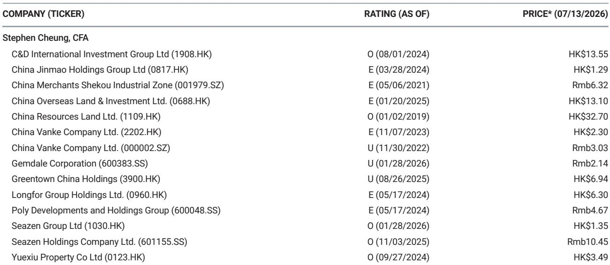
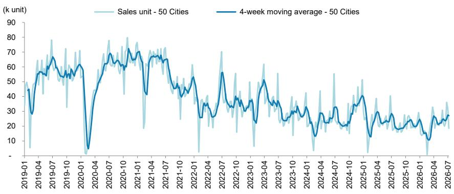

# 中国房地产市场并非全面复苏：一二手房分化暗示结构性调整，而非周期性转折

整体数据看似令人鼓舞。截至7月12日当周，50个城市的新房登记成交量同比增长8%。然而，这一单一数字掩盖了市场正在分化的现实，使得全面复苏的说法具有误导性。10个城市的二手房周成交量同比下降3%，而年初至今的新房成交量仍为-11%。最关键的信号并非周度的小幅回升，而是新房与二手房市场、一线与三线城市之间日益加深的分化，以及成交量与定价权之间的背离。这并非市场正在走出拐点，而是市场正在揭示一种结构性的重新调整，观察者应将其解读为重新定位的信号，而非全面重新进入的信号。

近期一份全球性机构关于中国房地产的报告中的数据为这一论点提供了实证基础。但战略层面的启示需要超越周度数据的噪音。新房市场8%的同比增长虽然积极，但较前一周24%的增幅已明显放缓。此前表现出韧性的二手房市场现已转为负增长。与此同时，六个城市的二手房挂牌价格指数从16.7%微降至16.3%，一线城市中介指数从54.7降至51.8。这些并非随机波动，而是形成了一个连贯的模式：市场正沿着城市层级、渠道和价格预期等维度发生分化。任何将此视为同质化复苏的策略都将导致资源错配。

这里的论点直截了当，但与乐观的整体数据形成对比。中国房地产市场正在经历结构性调整，其中一线城市的新房销售受到政策驱动的供给和选择性需求的支撑，而二手房市场——衡量家庭在当前价格水平下交易意愿的真实指标——正在走弱。三线城市已处于收缩状态。这意味着复苏是狭窄、脆弱的，并且可能持续如此。对于机构参与者、企业策略制定者而言，正确的应对方式是按地域和渠道进行严格区分，而非从总量数据中简单外推。

## 新房市场的表面强势掩盖了迅速收窄的支撑基础

50个城市新房周成交量同比增长8%，这类顶层数据容易支撑乐观叙事。但分解后揭示了其脆弱性。一线城市同比增长26%，较前一周的-6%大幅波动。二线城市增长15%，但低于前一周的37%。三线城市下降20%，逆转了前一周2%的增长。模式清晰：总量数据几乎完全由一线城市支撑，而即使是一线城市，也更多是波动驱动的反弹而非持续趋势。年初至今的数据仍为-11%，意味着周度改善尚未逆转累积的损失。

战略意义在于，新房市场日益成为一个政策管理的渠道。一线城市的开发商能够通过政府支持的审批和融资推出项目，形成了供给侧的推动力，这并不一定反映真实需求。当一线城市销量在一周内从下降6%跃升至增长26%时，这种波动表明是项目集中推出和政策时机所致，而非买家情绪的稳步改善。依赖周度数据来判断底部，是将行政节奏误认为市场动能。新房市场并非在复苏，而是在被管理成间歇性的活动爆发。

## 二手房市场疲软揭示终端用户正在抵制当前价格水平

二手房市场是衡量住房需求更诚实的指标，因为它较少受到开发商定价策略、政府审批时间和促销活动的影响。10个城市的二手房周成交量同比下降3%，明显逆转了前一周8%的增长。一线城市二手房成交量仅增长6%，低于前一周的14%。二线城市二手房成交量下降9%，从前一周的3%增长转为下降。年初至今的二手房成交量仍为正增长4%，但周度趋势正在恶化。

新房与二手房之间的分化是数据中最重要的模式。在健康的市场中，新房和二手房成交量应同向变动，反映广泛的需求。当新房上升而二手房下降时，表明买家正被开发商的激励措施、政府补贴或融资优势吸引到新房市场，而二手房市场——价格由个人卖家设定——的需求正在停滞。挂牌价格指数从16.7%降至16.3%，中介指数从54.7降至51.8，证实了卖家正在失去定价权，中介的乐观情绪也在减弱。二手房市场告诉我们，家庭不愿意在当前估值水平下交易。新房市场正以政策驱动的成交量掩盖这一现实。

## 三线城市收缩表明核心城市以外的下行周期尚未触底

三线城市是整个房地产市场的风向标。新房成交量同比下降20%，年初至今的数据可能更差，这些城市正经历需求真空，任何政策宽松都难以迅速填补。三线城市缺乏支撑一线城市需求的人口流入、就业密度和基础设施投资。它们也更易受到繁荣时期积累的未售库存的拖累。三线城市销量在一周内从增长2%转为下降20%，表明前几周的任何稳定都是暂时的，很可能由一次性项目完工或局部刺激措施驱动，而这些因素现已消退。

对于观察者而言，这意味着房地产下行并非单一事件，而是一个多速度的调整过程。一线城市可能正在接近底部，尽管二手房市场数据警告称，即使在那里，底部也并不稳固。二线城市正在减速。三线城市仍处于活跃下降中。任何将中国房地产视为同质化资产类别的策略，都忽略了数据中最重要的信号：市场正按城市层级进行自我分类，且这种分类正在加剧，而非收敛。资源配置应遵循这种分化，而非与之对抗。

## 应对分化市场的决策框架：关注流动性、城市层级敞口与二手房价格趋势

数据支持一个三因素框架来评估中国房地产的敞口。首先，二手房市场的流动性是最可靠的领先指标。当二手房成交量下降、挂牌价格压缩时，表明在当前价格水平下愿意购买的买家池正在缩小。这先于新房市场走弱，因为开发商最终必须与更疲软的转售市场竞争。其次，城市层级敞口决定了需求变化的幅度和时机。一线市场具有结构性优势，可缓冲下行冲击，但并非免疫。二线市场需要仔细监控库存和就业趋势。三线市场应被视为结构性承压，直到有证据表明需求持续改善，而不仅仅是间歇性的周度波动。第三，中介指数提供了实时的情绪检查。一线城市读数为51.8，低于54.7，仍高于50，表明持正面观点的中介多于负面，但变化方向比水平更重要。中介情绪的持续下降通常领先成交量下降四到六周。

这一框架得出了清晰的战略结论。对于机构参与者，正确的姿态是减少三线城市敞口，在一线城市保持选择性头寸，并观察二线城市二手房市场稳定迹象后再增加配置。对于房地产开发领域的企业策略制定者，优先事项应是加速三线和二线市场的库存清理，同时保留现金，以便在二手房市场定价稳定后，在一线城市进行机会性的土地收购。对于政策制定者，数据表明，广泛的刺激措施不如针对二手房市场流动性的定向措施有效，例如降低交易税或放宽对现有住房的抵押贷款限制。新房与二手房的分化并非统计异常；它是一个结构性信号，表明市场正在适应新的均衡，其中价格发现发生在转售市场，而非新房市场。

*仅供参考。部分内容可能基于源材料通过AI辅助生成、翻译、总结或编辑，可能存在遗漏或错误。请独立核实。本文不构成任何专业建议。*

仅供参考。部分内容可能基于源材料通过AI辅助生成、翻译、总结或编辑，可能存在遗漏或错误。请独立核实。本文不构成任何专业建议。

