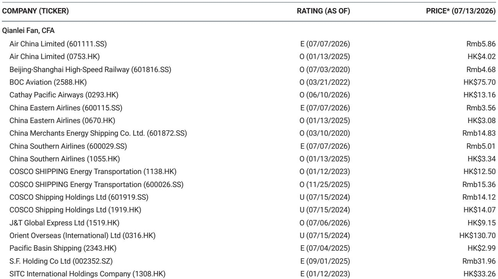
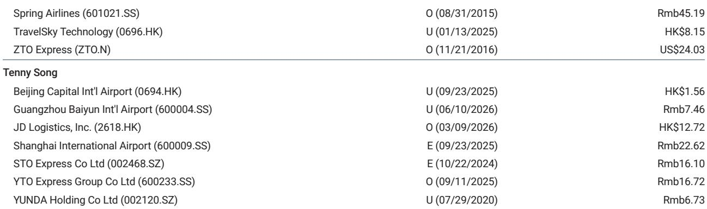
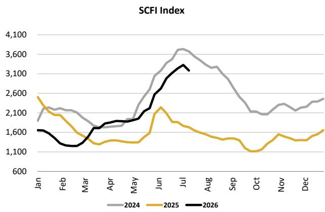

# 集装箱航运即期市场已现转折：SCFI下跌对下半年的启示

截至2026年7月10日，上海集装箱运价指数（SCFI）周环比下跌4.3%，这是过去数月运价异常上涨势头可能减弱的首个实质性信号。在关键的美国西海岸航线，7月1日的综合费率上涨（GRI）在数日内被完全抹去，承运商自身也承认，这一趋势可能延续至7月中旬航次并进一步下滑。这并非季节性疲软，而是结构性调整的开端，需要重新评估下半年的盈利预期、运力规划及供应链合同策略。

这一调整的时机至关重要，因为它恰逢市场已将持续的地缘溢价和紧张运力计入价格。关于红海绕行和霍尔木兹海峡中断将使运价在旺季保持高位的叙事，正与可观测的数据发生碰撞。此前因绕行好望角而主要受益的欧洲和地中海航线，也呈现出同样的疲软态势。7月运力部署较6月有所增加，而货主已转向观望姿态，拒绝为可自由支配的货量支付高企的运价。

这一转折点的战略意义不在于单周跌幅的大小，而在于所有主要贸易航线上多个看跌信号的同时汇聚。调整是广泛性的，而非个别现象。并且，它发生在传统旺季需求激增完全显现之前，这表明供给侧动态（而非仅仅是需求疲软）是主要驱动因素。

## 美国西海岸航线已见顶，7月1日GRI被抹去是其他航线的领先指标

市场转折最具体的证据来自美国西海岸，7月1日的综合费率上涨在数日内被完全抹去。这并非小幅回调。GRI代表着承运商集体试图实现运价阶梯式上涨，而当它在同月内被完全逆转时，表明市场缺乏支撑这一上涨的需求基础。美国东海岸的调整幅度较小，但方向一致。报告明确指出，美国航线可能已出现近期峰值。

这一点至关重要，因为跨太平洋航线是全球集装箱航运最大、利润最丰厚的贸易航线。如果该航线的运价峰值已成过去，那么推动2026年下半年共识预期上调的盈利动能便面临风险。承运商自身也预测，7月15日的运价可能从当前水平继续下跌。当对订舱量拥有最细致洞察的运营商们预示进一步下行时，短期内持续复苏的可能性较低。

对托运人和物流管理者而言，启示是明确的。那些在过去两个月以峰值即期运价锁定长期合同的企业，正面临直接的竞争劣势。重新谈判或将货量转向即期市场的窗口正在打开，并可能随着承运商试图通过停航来稳定运价而关闭。对于观察者而言，美国西海岸GRI被抹去是报告中相对少见最具可操作性的数据点。这是一个价格信号，表明市场已经消化了支撑上半年运价的地缘溢价。

## 欧洲航线运力增加正在打破红海溢价

欧洲和地中海航线讲述了一个不同但同样偏空的故事。这些航线曾是红海中断的主要受益者，因为船舶绕行好望角吸收了运力并推高了运价。然而，报告指出，7月运力部署较6月有所增加。这是一个关键转变。当承运商向一个此前紧张的航线增加运力时，由稀缺性带来的定价权便开始削弱。

其机制很直接。在红海绕行的高峰期，集装箱运力的有效供给减少，因为更长的航程意味着船舶每往返一次在海上停留的天数增加。这一动态现在正在部分逆转。根据班轮公司的说法，马士基通过其AE15服务重返红海已经影响了市场情绪。即使完全恢复红海航线需要数月时间，仅这一信号就足以改变承运商与货主之间的谈判动态。

货主方面，目前正处于观望模式。他们不急于以高运价预订远期运力，因为他们预期运价将进一步走软。这种行为转变是自我强化的。当需求方参与者预期价格下降时，他们会推迟采购，这反过来迫使承运商降低运价以提升7月下半月的装载率。报告证实，大多数班轮公司目前正是这样做的。供应增加与需求犹豫相结合，形成了一个负反馈循环，承运商若无协调一致的运力撤出，便难以打破。

对于战略规划者而言，教训是红海溢价始终是一个脆弱的构建。它依赖于中断的持续性和承运商快速重新部署运力的无能。这两个条件现在都在改变。那些围绕欧洲航线运价持续高企来构建下半年物流预算的公司，应重新审视这些假设。

## 调整是广泛性的，表明系统性转变而非单一航线事件

当前数据最显著的特征之一是下跌的一致性。SCFI各分项指数显示，欧洲航线下跌2.5%，地中海航线下跌3.3%，美国西海岸下跌6.2%，美国东海岸下跌2.0%。这不是由港口中断或区域需求冲击驱动的单一航线调整。这是所有主要贸易航线的同步变动。

当调整如此广泛时，解释因素必须是系统性的而非个别的。共同的驱动因素可能有三方面。首先，全球需求环境不足以吸收正在部署的运力。其次，随着进一步中断的概率下降，此前嵌入运价的地缘风险溢价正在被挤出。第三，库存周期可能正在转变，因为那些为应对旺季中断而提前发货的进口商现在发现库存充足。

报告对7月17日SCFI的明确负面展望强化了这一系统性观点。分析师并未预测触底，而是预测各航线将进一步下行。对于一个此前已将旺季上涨计入价格的市场而言，这是一个不应被忽视的反向信号。

其战略启示是，应基于2026年下半年将与上半年截然不同的假设，来审视对集装箱航运相关资产的投资组合敞口。如果即期运价继续下跌，推动第一季度预期上调的盈利动能不太可能持续。对于进出口商而言，争取有利合同条款的窗口正在扩大，但可能不会无限期持续。

## 应对集装箱航运转折点的决策框架

本报告中的数据可以转化为一个结构化的决策框架，适用于三个不同的利益相关方群体：承运商、托运人和观察者。每一方都面临不同的权衡，但底层逻辑相同。市场已从稀缺性驱动的定价机制，转变为运力驱动的竞争机制。

对于承运商，当务之急是运力管理。稳定运价最有效的工具是停航，即取消预定航次以减少有效供给。然而，停航的有效性取决于行业内的协调。如果一家承运商为获取市场份额而降低运价，而其他承运商试图维持运价，下行螺旋将加速。报告表明，这种竞争动态已经出现，因为大多数班轮公司正在降低运价以提升装载率。承运商应评估当前运价水平是否仍能覆盖每条航线的运营成本，如果不能，是撤出运力还是接受较低的利用率更为有利。

对于托运人，决策框架围绕时机和合同结构展开。美国西海岸7月1日GRI被抹去表明，在可预见的未来，即期运价可能仍低于合同运价。那些以高运价锁定长期合同的托运人，应评估将货量转向即期市场或重新谈判条款的代价。拥有灵活采购策略的托运人应扩大即期敞口，并推迟长期承诺，直至市场显示出稳定迹象。正如报告所指出的，货主的观望姿态是对下跌市场的理性反应。

对于观察者，框架是关于盈利可见性和估值支撑。集装箱航运相关资产往往随即期运价动量而波动。如果SCFI继续下跌，盈利下调周期将随之而来。观察者应评估其关注的公司是否有足够的合同收入来缓冲即期运价疲软的影响，以及资产负债表是否足够强劲以承受长期低迷。报告未对个股提供观点，但行业层面的启示是明确的。风险回报已发生转变，证明调整是暂时性而非结构性的责任，现在落在了看多者身上。

## 市场正以快于预期的速度挤出地缘溢价

当前调整中最被低估的动态是地缘溢价被挤出的速度。当马士基宣布通过AE15服务重返红海时，市场将此解读为进一步中断风险正在下降的信号。即使实际重新调整航线需要数月时间，这一声明也改变了叙事。当一家最大的运营商发出回归正常航线的信号时，承运商不能再以红海风险为由为高运价辩护。

报告明确指出，根据班轮公司的说法，这一发展已影响市场情绪。情绪在集装箱航运中很重要，因为市场是前瞻性的。运价是基于对未来供需的预期而设定的，而不仅仅是基于当前状况。如果市场相信红海绕行最终将解除，那么已嵌入运价的溢价将比实际物理绕行的解除消失得更快。

这对下半年展望有直接影响。此前共识观点认为，红海中断将使运价在旺季保持高位。这一观点现在正受到可观测市场数据的挑战。如果地缘溢价继续侵蚀，运价的下行风险将比大多数模型目前预测的更大。

对于那些围绕运价持续高企的假设来构建供应链策略的公司而言，现在是调整的时候了。等待确认触底，意味着将在机会窗口关闭后行动。数据是清晰的。调整已经开始，它是广泛性的，并且由可能持续的因素驱动。战略应对也应同样果断。

*仅供参考。部分内容可能基于源材料通过AI辅助生成、翻译、总结或编辑，可能存在遗漏或错误。请独立核实。本文不构成任何专业建议。*

仅供参考。部分内容可能基于源材料通过AI辅助生成、翻译、总结或编辑，可能存在遗漏或错误。请独立核实。本文不构成任何专业建议。

