# US Corporate & Securitized Credit | North America

# Data Center/AI Financing: What We Have Heard from Investors

AI-related issuance is surging as fixed income markets are proving flexible and companies are consistently willing to broaden financing beyond traditional avenues. We think investors are still adding exposure to AI/data centers in their portfolios, although sentiment is turning incrementally cautious on potential macro/thematic risks that lie ahead. We see a preference for shorter duration and amortizing structures.

## Key Takeaways

- Across the different credit markets, we think investors are showing a preference for deals and structures that help offset thematic risks (overbuild, obsolescence, and bottlenecks are the most often mentioned);

For data center construction debt, thematic risk manifests itself as asset risk at lease renewal; for corporate unsecured debt, thematic risk is inherent to the ongoing investment cycle, especially in the longer run, and therefore credit quality should matter;

For IG, hyperscalers' funding mix has been the main focus, with companies broadening their investor base overseas and signaling to the market their confidence in the capex cycle and in the monetization opportunities;

For HY, the debate has been around potential construction delays, evolving structures, and potential refinancing paths;

In securitized, investors are most focused on supply & demand dynamics. We do not think credit supply has thus far displaced ABS or CMBS issuance, but we're cautious that supply could come in lower-than-expected this year and going forward as other markets offer size and competitive cost of capital for data center companies pursuing rapid growth.

<table><tr><td colspan="2">MS & CO. LLC</td></tr><tr><td colspan="2">Fernanda Lima</td></tr><tr><td colspan="2">Strategist</td></tr><tr><td>Fernanda.Lima@morganstanley.com</td><td>+1 212 761-3021</td></tr><tr><td colspan="2">Carolyn L Campbell</td></tr><tr><td colspan="2">Strategist</td></tr><tr><td>Carolyn.Campbell@morganstanley.com</td><td>+1 212 761-3748</td></tr><tr><td colspan="2">Vishwas Patkar</td></tr><tr><td colspan="2">Strategist</td></tr><tr><td>Vishwas.Patkar@morganstanley.com</td><td>+1 212 761-8041</td></tr><tr><td colspan="2">Vishwanath Tirupattur</td></tr><tr><td colspan="2">Strategist</td></tr><tr><td>Vishwanath.Tirupattur@morganstanley.com</td><td>+1 212 761-1043</td></tr><tr><td colspan="2">James Egan</td></tr><tr><td colspan="2">Strategist</td></tr><tr><td>James.F.Egan@MorganStanley.com</td><td>+1 212 761-4715</td></tr></table>

MS | RESEARCH
2026 EXTEL GLOBAL
FIXED INCOME POLL
We appreciate your support
VOTE NOW
★★★★★

See our other related notes:

- Podcast | Thoughts on the Market: Inside the AI Debt Surge (19 Jun 2026)

- Sunday Start | What's Next in Global Macro: The Convergence of AI and Energy Financing (14 Jun 2026)

- Global Credit Strategy & Securitized Products Research: AI Debt Financing Tracker: Warming Up for a Hot Summer (9 Jun 2026)

- Securitized & Corporate Credit: Data Center Financing: Faster, Broader, Deeper (26 May 2026)

- Podcast | Deep Thoughts on Securitized Markets: Data Center Financing and Value Across Securitized and Corporate Credit | Ep. 360 (29 May 2026)

## Revisiting Our Risk Framework Definitions

Data-center debt financing remains a critical topic within the credit market, driving our above-consensus issuance forecasts and sector preferences, as well as the overall direction of spreads. In our mid-year outlook from late May, we updated our issuance estimates and spread targets for US credit. We followed this up with an in-depth report on the outlook for data center debt financing across the corporate and securitized markets.

Over the past few weeks, we have discussed our outlook across investors, ranging from macro accounts to core credit investors, and specialists within the corporate and securitized credit worlds. The discussions understandably have spanned a range of topics from hyperscaler capex intensity to market demand capacity, risks around the AI build-out, political backlash, and downside scenarios.

Over the past two weeks, the underperformance of AI-related debt – particularly among hyperscalers – amid a broadening out of issuance since June has been very topical. We address this topic briefly in the next section, and discuss our broader thoughts on the market at the MS Macro Forum on July 13 (webcast/slides). In this publication, we focus more on insights from our investor conversations and where our views differ from market consensus.

Exhibit 1: We're now at \$336bn of AI-related debt issuance YTD across global credit markets  
  
Source: Bloomberg, Trepp, CreditFlow, PitchBook, MS estimates. Data as of 7/10/26.

The details on investor feedback are in the following sections across investment grade, high yield, and securitized credit. However, before we go into the specifics, we clarify some of the terminology that came up in our client meetings and are regularly used in subsequent sections of this report.

The terms below are largely the primary risk vectors associated with the data center construction debt that came up frequency in our investor conversations based on what we are seeing in the HY market (and some in IG): construction risk, tenant risk, and macro/ thematic risk. We think these vectors will be significant drivers of relative value across different deals and within asset classes.

- Construction Risk: This is the risk associated with the actual build-out of the data center, i.e., can the developer deliver the data center on time to the tenant without material cost over-runs. Such risk is relatively new to the public corporate credit market, as it is typically underwritten as project finance via real-estate or infrastructure financing channels via construction loans. This creates an important differentiation between corporate and securitized credit: IG/HY deals have different degrees of construction risk (brownfield vs. greenfield, contractors involved, construction contracts, overall project complexity, and more). On the other hand, ABS/CMBS deals are fully stabilized assets post construction, which are cash-flowing (with one exception in CMBS).

- Tenant Risk: This is the risk associated with the tenant's ability to make lease payments on time and is a reflection of the tenant's creditworthiness. Once construction is completed, this becomes the key risk, which should be reflected in pricing/risks based on the counterparty's credit quality. There are some structural enhancements that can help mitigate tenant risk: 1) amortization features – in corporate credit, in most cases amortization is sculpted as an annual percentage of principal to maintain a minimum DSCR ratio in line with covenant requirements. In ABS, amortization can be triggered by a) breached DSCR or LTV levels before their anticipated repayment date (ARD) until the condition is cured, or b) if the transaction fails to refinance by the ARD, after which it starts fully amortizing down; in CMBS, there is no amortization mechanism; and 2) in cases in which the tenant has limited or no track record in the credit markets, higher-quality credits have offered backstops and/or lease guarantees (we also refer to those as IG wrappers).

- Asset Risk: This is the risk associated with the value of the asset itself, i.e., does the ultimate tenant/hyperscaler providing the credit support actually need the data center that has been built. The inputs associated with a data center facility could be location (proximity to metro markets), workload type (training vs. inference), environmental risks (areas that are subject to natural disasters and/or that can be directly impacted by climate changes), and technology obsolescence (rack power density, cooling and power systems, and other structural components that might impact the facility's ability to support AI hardware upgrades). Asset risk is already part of the underwriting assessment, but we think it likely becomes a more significant concern in the longer term, when the facilities have to go back to market for a lease renewal.

We also discuss broader risks that are applicable to both data center construction and corporate debt:

- Corporate Risk: In our view, corporate risk is directly linked to the companies' ability to monetize the ongoing investment cycle. Thinking of the investment grade universe, this ties back to hyperscalers being able to get the expected return on their investments in a timely manner; as for the leverage finance complex, it is subject to the companies' ability to establish a successful track record (neoclouds and former bitcoin miners/now data center developers are relatively new to their main business activities, and arguably – more importantly in this context – they are also new to the credit markets). In securitized credit, the data center companies that issue debt are often a secondary consideration to the assets themselves, but the recent challenges from telco company Extenet demonstrate that sponsor risk can be very real and cause problems for the bonds even if the underlying assets are still performing.

- Macro/thematic Risks: We think risks in this bucket derive from demand for compute and AI adoption, and we now divide these into two opposite camps:

• Surplus supply/demand underwhelming: Risks associated with supply ultimately exceeding demand in the future. It could be driven by overbuild (not only for the final data center capacity, but also across the supply chain as different industries are involved as suppliers), but also by efficiency gains (for compute, power, token usage, and others).

- Scarcity: Among access to power, supply chain bottlenecks, potential federal, state and local government restrictions (such as imposition of moratoria), and NIMBYism, build-out constraints become insurmountable. Capacity limitations drive price increases and users (both the consumer but also enterprises) have to rethink their AI adoption ambitions.

## Taking Stock of Recent Moves; Reiterate Our Supply Call and U/W IG Tech

The dynamic between supply and spreads for hyperscalers is a key theme in the IG market. Prior to June, investors had grown comfortable with the view that AI-related funding needs would largely come from hyperscalers and ORCL, while these issuers also sought to improve transparency and establish a more regular issue cadence in response to investor feedback. We think funding mix diversification via non-USD debt and equity issuance (Exhibit 7) also contributed to investor perception of manageable supply pressures in the USD market.

Since June, however, we think the "surprise" element has weighed on spreads (Exhibit 2). In the past ~40 days, the market saw sizable issuance from other mega caps, hyperscaler issuance ahead of earnings, and most recently an ORCL ratings downgrade by S&P. We think the latter is likely to bring fundamental/quality risks to the forefront.

As a result, consistent with our U/W view, we are seeing spread decompression across the AI complex vs. the market (Exhibit 3), while other sectors have held up well. We think this is largely a function of strong demand, meaning investors likely do not need to reduce exposure to other sectors to accommodate hyperscalers. To the extent that rates stay high, insurance and overseas appetite could mean that AI decompression persists but doesn't spill over to the overall IG index. However, if rates go lower (our baseline view), we think demand may also slow and lead to a broader repricing in the market, particularly if supply remains elevated.

Finally, the large transactions issued since June are trading wider than their new-issue pricing, a sign of sentiment shifting. We continue to forecast an above-consensus total IG supply of \$2.25tn (vs. ~\$1.33tn YTD) and expect spreads to underperform other fixed income markets. We remain U/W Tech within the IG market, due to our expectation for continued supply and potential credit quality headwinds.

Exhibit 2: IG index is ~2bp tighter YTD; HQ hyperscalers are now ~24bp wider YTD  
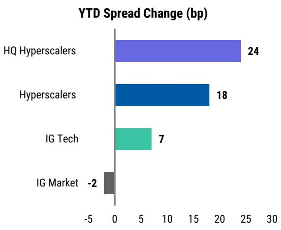  
Source: Bloomberg, MS. Data as of 7/10/2026 EoD.

Exhibit 3: High quality hyperscalers are now also wider to the broader IG market  
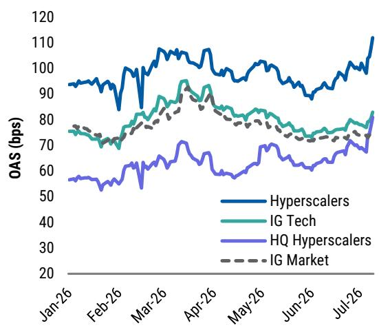  
Source: Bloomberg, MS. Data as of 7/10/2026 EoD.

## Investment Grade Credit: Issuance Estimates, Funding Mix, and Index Eligibility

The most frequently asked questions across IG revolved around our FY26 issuance estimates, how supply is impacting spreads (reinforced by recent volatility), equity funding vs. debt funding, and non-USD issuance out of the hyperscalers. With respect to data center construction bonds, market capacity and pipeline for large structured IG "private-style" deals also came up. Further, for such deals, since bonds are 144A for life, index eligibility and deal structure/marketability were also topics of questions.

Until recently, we think investors were more comfortable underwriting corporate risk over macro/thematic risk. This translated into demand for high-quality paper even if supply from such issuers is elevated, at the expense of lower-rated companies where supply might be muted. However, future credit profiles are very tied to the AI demand thematic. When it comes to the hyperscalers and Oracle, there is a fair and valid argument to be made that in the longer run there is a much higher degree of correlation between corporate and thematic risks, even more so for companies that don't benefit from ample business diversification.

There is broad awareness that actual leverage for hyperscalers and Oracle is increasing through the different off-balance sheet channels (e.g., purchase commitments, lease commitments, backstops and guarantees, asset-backed liabilities at SPVs, and more). However, while we await for investment returns to start playing out, credit quality, business diversification, financial policy, and other attributes matter for investment decisions, and we can already see differentiation across the various names (Exhibit 4). We think that ORCL's earlier-than-expected ratings downgrade could shift the debate beyond just supply to more fundamental tiering across the different players.

Exhibit 4: 10s30s curves for hyperscalers and ORCL  
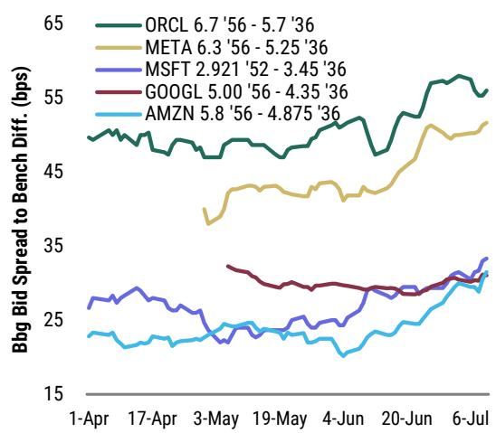  
Source: MS, Bloomberg. Note: Updated 7/12/26; levels based on a 3-day moving average.

Exhibit 5: QTSQST trades ~40bp wide to HUTRBA  
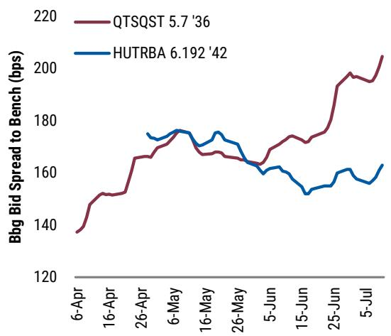  
Source: MS, Bloomberg. Note: Updated 7/12/26; levels based on a 3-day moving average.

We caveat that the sample set of data center construction bonds in IG is limited (see Exhibit 13). Within this sample, though, we think investors favor the deals with lower asset risk and higher-quality tenants. Tenant risk is ultimately corporate risk, and therefore investors are more familiar with how to underwrite this type of risk. Asset risk arises at the time of lease renewal, in our view, and becomes more acute when there is no amortization during the life of the lease. Looking at the relationship between Hut 8 and QTS bonds (Exhibit 5), a key takeaway that stands out is that construction risk and the issuer's limited track record as a developer can be offset with a construction guarantee and other structural enhancements, while asset risk remains a concern even when the tenant is a high-quality counterpart.

- For context, Hut 8's notes are a construction-phase financing, with construction risk mitigated by a design-build contract guaranteed by Jacobs Engineering. Importantly, the debt is structured to fully amortize within the 15-year lease term (which matches the maturity of the notes). QTS financing, by contrast, is for a fully-built and operational asset leased to MSFT for 20 years. The debt isn't amortizing and matures in 10 years. Refinancing risk isn't the only consideration, though, as even at lease renewal in 2046, Moody's estimates that ~50-65% of principal would still be outstanding.

## How is YTD issuance tracking vs. our estimates?

We're forecasting \$350-400bn of issuance within IG. We break down our issuance estimate into two categories: 1) \$250-300bn from the HQ hyperscalers + Oracle; and 2) ~\$100bn from other AI-related debt, which so far includes issuance from semiconductor companies, data center construction projects (both privately and publicly syndicated), data center REITs, and other companies directly related to the AI capex cycle.

As of July 10, AI-related debt issuance in the IG market totaled~\$222bn of YTD (or \$257bn when including the AVGO

Exhibit 6: USD IG issuance is at \$222bn YTD

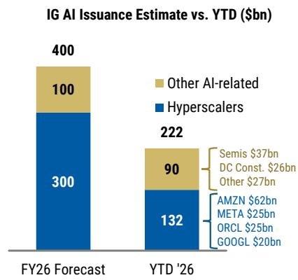  
Source: Bloomberg, company filings, MS.

chip financing transaction). To achieve our \$400bn estimate for AI-related issuance in the IG market pace in 2H would have to be at least the same as in 1H, which we think is quite possible when looking at current 2027 capex estimates.

We see some merit in investor feedback that USD issuance from hyperscalers and ORCL (\$132bn YTD) could end the year below \$250-300bn given the amount of non-USD issuance (\$62bn YTD), and that other AI-related debt could exceed \$100bn (vs. ~\$90bn YTD currently). However, given the pace at which capex needs are rising among the five main companies (+54% in 2027; see Exhibit 11), we maintain our current estimates and expect issuance to remain elevated in 2H, particularly as issuance capacity in other currencies is likely to have been exhausted in the near-term.

We expect the hyperscalers to continue to explore different financing avenues, with cost of capital being a secondary consideration vs. the opportunity of broadening the investor base (Exhibit 7). Since 2025, companies have issued debt in five non-USD currencies (EUR, GBP, CHF, CAD, and JPY), Amazon announced a \$17.5bn delayed drawn TL (DDTL) with a 3-year tenor and issued at S+75 (based on its current ratings), and both ORCL and GOOGL announced equity issuance transactions this year (Exhibit 8).

Exhibit 7: Hyperscalers & ORCL external funding mix now includes equity and six different currencies

Hyperscalers & ORCL External Funding Sources (USD bn)

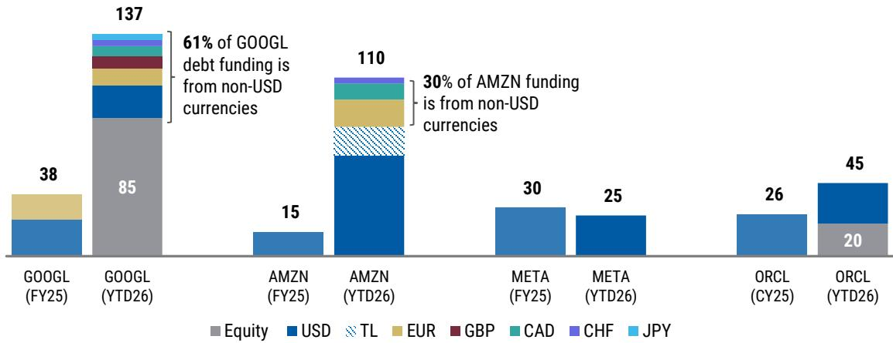  
Source: Bloomberg, Company filings, MS.

## What does equity issuance means for our supply estimates?

While we don't have specific information from the companies around the incentives behind equity issuance, we think fundamentally equity issuance can be a funding source in the following scenarios:

1. A solution for companies that can't access the credit markets. We acknowledge that common equity valuation might not be compelling in such cases, but we're thinking of preferreds and other instruments that include monetary incentives for investors that agree to participate. We don't think any of the hyperscalers fall in this bucket.

2. A way to prevent leverage from further increasing and therefore continue to access the credit markets. We place ORCL's announced equity issuance in this bucket.

3. An indication of commitment to a broad and sizeable investment cycle that requires significant capex for a number of years.

We also note that beyond AI-related capex, funding is also needed for acquisitions and other investments. This is particularly relevant for Alphabet, in the context of Waymo's latest funding round (\$16bn, with the vast majority funded by Alphabet - see pg. 39 of the 1Q26 10-Q), the Intersect acquisition for ~\$6bn (see pg. 25 of 1Q26 10-Q), and the Wiz acquisition for \$29.5bn (pg. 24 of the 1Q26 10-Q).

Our best guess is that the hyperscalers' comments on potential equity funding align with point #3 above, i.e., a large and broadening investment cycle that is unlikely to slow down any time soon, and hence companies may seek to have access to a broad range of funding

Est. Incremental Capacity (GW)

channels and preserve financing flexibility across markets. In other words, we don't see equity funding being a replacement for debt funding. Therefore, we aren't changing our supply estimates for now.

Exhibit 8: Bond and equity performance for GOOGL and ORCL

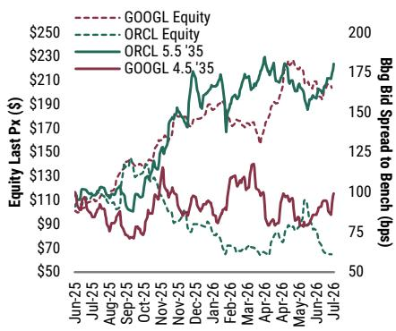  
Source: Bloomberg, MS. Note: Updated 7/12/26, using a 3-day moving average.  
Exhibit 9: Hyperscalers & ORCL equity performance YTD

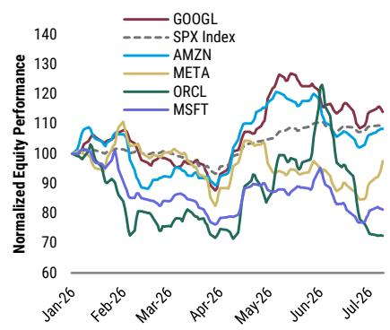  
Source: Bloomberg, MS. Note: Updated 7/12/26, using a 3-day moving average.

## Is there upward bias to 2027 capex estimates?

Yes, in our view. Thinking about the broader investment cycle, we believe the largest YoY increase still takes place in 2026. However, MS equity analysts' recently revised estimates already point to a 54% increase in 2027 (Exhibit 11 - we're looking at the high quality hyperscalers and ORCL for now). We outline a few reasons why:

## 1. Numerous incentives for more

forward-building (Exhibit 10): According to our equity colleagues, the numerous bottlenecks associated with data center constructions have extended the timeline from groundbreaking to operational launch to as much as three years. To the extent that permitting and zoning for data center construction continues gets stricter in response to local backlash, we think there is an incentive for hyperscalers to kick off projects for forward capacity sooner rather than later. According to MS's US public policy strategist Ariana Salvatore, the key risk to

Exhibit 10: High quality hyperscalers to add ~27 GW of add'l data center capacity in 2027

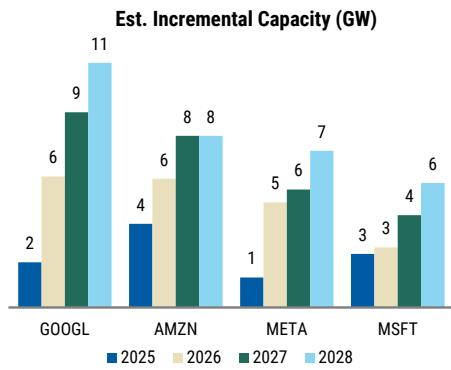  
Source: MS. See the following note:

monitor is that the local pushback against data centers becomes a federal issue – we think sensitivity to this risk likely increases as we start to approach the next presidential election in 2028.

2. Racks and servers are the biggest cost drivers for data centers. So far, public markets have seen more transactions to finance the construction of data center shells. Given the possibility of leasing such structures, we've seen a number of first-time issuers in both the IG and HY markets out of companies that aspire to be data center developers. As the shells near completion, we expect to see more financing for chips/compute, which actually represent ~60% of the cost to build a data center (Exhibit 12). The decision to own or lease chips will influence the financing framework (on vs. off balance sheet). Increasing memory costs, as well as newer generations of chips, could also result in higher costs per GW.

Exhibit 11: Current estimates point to a 54% increase for total capex from hyperscalers and ORCL in 2027  
  
Source: Company filings, Bloomberg & Visible Alpha for consensus, MS Equity Research. MS estimates for AMZN/GOOGL/META (covered by Brian Nowak) are from the following note: Internet: \$1.4trln of Capex, 4X in Compute Capacity, and AI Revenue Streams to Watch into '28 (12 Jul 2026). MS estimates are as of 5/4/26 for MSFT (covered by Josh Baer) and as of 4/23/26 for ORCL (covered by Sanjit Singh).

3. Volume vs. inflation. As we think of future capex growth, a frequent question is the split between volume growth and inflation/price increases, especially as we get more data indicating shortages and longer lead times for electrical and other types of equipment. Based on a 2025 report from Turner & Townsend that discusses data center construction costs, there's a 5.5% increase in the cost per watt of building a traditional data center. There is also a 7-10% cost premium for liquid-cooled data centers in the U.S.. Finally, 60% of survey respondents expect construction costs to increase by 5 to 15% in 2026, with 21% expecting >15% of inflation in the year.

Exhibit 12: Compute hardware, including servers/racks, HBM and CPU represent ~60% of the cost/GW to build a data center  
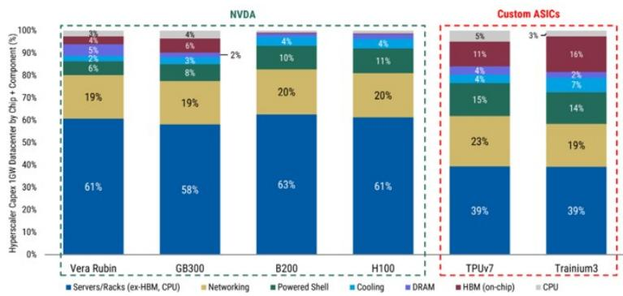  
Source: MS: screenshot of slide 26 from the following note: Internet: How Much Capacity Will \$2 Trillion of Hyperscaler Capex Bring By '27? (17 May 2026).

## Can index eligibility and offering format impact performance going forward?

As the IG construction bonds were issued as 144A-for-life with no registration rights, investors have been asking how the lack of index eligibility could impact their trading levels going forward. Benchmark weights and passive-fund demand can certainly impact holdings, liquidity, and spreads. To the extent it does impact performance of existing bonds (Exhibit 13), we think issuers are faced with two options: 1) offer a premium for index inclusion; or 2) consider moving to an unrestricted CUSIP, as other issuers have chosen to do. On the latter, we think it is worth circling back to our analysis from a few years ago on NFLX bonds after they got IG ratings. We learned back then that 144A-for-life bonds may, in certain circumstances, be converted into freely transferable, unrestricted global securities (which are eligible for index inclusion).

SIFMA guidance provides that, for already-outstanding 144A-for-life securities, an issuer may elect to implement a variant of the Rule 144 procedures to promote secondary-market liquidity or potential index eligibility. At any time after the securities have been outstanding for at least one year, assuming the conditions for free transferability by non-affiliates are satisfied and the governing documents do not prohibit the procedure, the issuer may deliver a free transferability certificate to the trustee. Once the certificate is delivered, the restricted securities can be moved into a new unrestricted global note with a new unrestricted CUSIP. Bloomberg would then be notified and update its systems to reflect the unrestricted CUSIP. This may support eligibility for index inclusion, though eligibility is not automatic and remains subject to the relevant index rules and other bond-specific criteria.

Exhibit 13: There's ~\$53bn outstanding in data center construction bonds that currently are not index eligible

<table><tr><td>Issue</td><td>Amt. Out. ($mn)</td><td>Market</td><td>Issued with Reg. Rights?</td><td colspan="3">Ratings (S&P/Moody's/ Fitch)</td><td>Issue Sprd to Bench (bps)</td><td>Current Sprd to Bench (bps)</td><td>Sprd Δ Since Issuance (bps)</td></tr><tr><td>RPLDCI 6.581 '49</td><td>27,294</td><td>PRIV PLACEMENT</td><td>N</td><td>A+</td><td>NR</td><td>NR</td><td>225</td><td>211</td><td>(15)</td></tr><tr><td>RDMICH 7.500 '45</td><td>14,000</td><td>PRIV PLACEMENT</td><td>N</td><td>NR</td><td>Baa3</td><td>BBB</td><td>329</td><td>348</td><td>19</td></tr><tr><td>HUTRBA 6.192 '42</td><td>3,250</td><td>PRIV PLACEMENT</td><td>N</td><td>(P)BBB-</td><td>NR</td><td>BBB-</td><td>185</td><td>161</td><td>(24)</td></tr><tr><td>HUTBPA 6.129 '42</td><td>4,250</td><td>PRIV PLACEMENT</td><td>N</td><td>NR</td><td>Baa2</td><td>NR</td><td>165</td><td>165</td><td>0</td></tr><tr><td>QTSQST 5.700 '36</td><td>4,600</td><td>PRIV PLACEMENT</td><td>N</td><td>NR</td><td>Baa2</td><td>NR</td><td>138</td><td>209</td><td>72</td></tr></table>

Source: MS, Bloomberg. Note: Spreads as of 7/10/2026, changes calculated using unrounded spreads.

Finally, the depth and capacity of the IG private placement 4(a) (2) format has come up in our investor conversations given the recent \$35bn deal for Broadcom (see this recent note from credit analyst Lindsay Tyler for additional details). Issuers may choose 4(a)(2) format because it allows them to raise capital privately, quickly, and with greater control over disclosure, investor selection, and documentation. This can be especially attractive for sponsor-backed issuers, project-finance SPVs, or highly bespoke financing structures, such as this one was (including multiple tranches with delayed draw features, per The Financial Times). With no public offering aspect involved, the deal can be privately negotiated with large sophisticated investors rather than built for public-style distribution. Also, according to The Financial Times, the debt could become tradeable in the institution-only 144A bond market.

## High Yield Credit: Evolving Structures, Construction Risk, and Refinancing Paths

Our conversations with HY investors had a slightly different flavor. While supply remained a key topic, investors concentrated more on understanding fundamental risk factors, potential take-out scenarios and refinancing paths, as well as potential rating agency upgrades once construction is complete.

Investors generally agree with our issuance estimates (\$50bn for HY/\$15bn for leveraged loans), and therefore questions were centered around key risks, how structures are changing given growing supply, and potential refinancing paths. The HY deals are 5NC2, and per our conversations, investors think bonds could be called on the first call date, as issuers would like to obtain lower cost of capital (given the deals would no longer have construction risk).

Construction risk over unsecured corporate risk in HY (Exhibit 14): Given the shorter tenor of bonds (and loans) in the HY market vs. the IG market, we think the debate for HY is, for now, mostly focused on construction risk. The preference for taking risk at the project level vs. the corporate level makes sense, in our view, given corporate issuers (and HY-rated tenants) are newer companies (vs. the IG-rated hyperscalers) with limited track record and are still growing into their capital structure.

Exhibit 14: CRWV unsecd bonds vs. project finance-like DC construction bonds in which CRWV is the tenant  
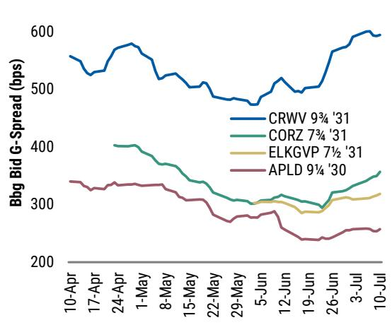  
Source: Bloomberg, MS. Note: Updated 7/12/26, using a 3-day moving average.

Exhibit 15: LTC ratios have increased since 4Q25, with more dispersion in the 2Q26 cohort  
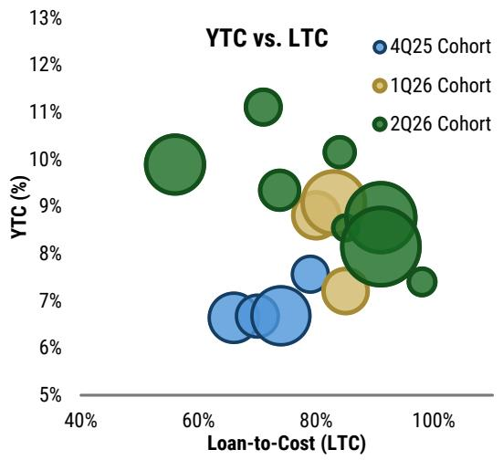  
Source: MS, Bloomberg, Moody's, S&P, and Fitch. Note: Updated 7/12/26.

Investors are building frameworks to evaluate the different assets and deal structures. We received a number of questions on construction delays, location (from environmental risks to distance vs. big markets given training vs. inference usage), design, and construction partners as well as construction contracts.

While construction risk remains a key topic in most conversations, investors generally agree with our view that construction delays could result in limited sell-off, and

ultimately in some dispersion based on developer's track record, but are unlikely to result in cancellations from tenants given constrained access to power, challenges related to permitting & zoning, and increasing supply-chain inflation and bottlenecks.

## How are the deal structures changing over time?

Current levels indicate a preference for deals that offer faster deleveraging, and we got the same feedback from investors during our conversations.

- Loan-to-cost (LTC) has increased (see Exhibit 15), especially for deals that have either a high-quality hyperscalers as tenant or an IG wrapper (by wrapper we mean either a full lease guarantee or a backstop);

- Amortization is starting later on (closer to the refinancing window) and has decreased (lower % of principal per year, with amortization payments often sculpted to meet minimum debt service coverage ratio requirements over time);

- Termination rights have evolved to benefit the developers, with termination rights for construction delays either fully removed or moved farther away in time (more than one year vs. six months initially);

- Cash waterfall post debt service (interest and amortization) has gotten looser (some of the 2025 deals had mandatory ECF offers in the waterfall, while the most recent deals will allow for any use of excess cash flow that isn't prohibited by the indenture);

- Construction projects are increasingly shifting to multi-phase/multi-building, with numerous staggered delivery dates and smaller data halls (which allow construction to move faster once developer and tenant agree on the design and other aspects of the first data hall).

- Cost per MW has increased, as well as the timeline between deal announcement and first delivery date, and between first and last delivery date. This is expected, in our view, due to inflation and supply-chain bottlenecks.

## Will we see construction delays?

Our initial expectation is that yes, we could see some delays. We estimate that >740 MW of critical IT capacity could come online during 2H26 (Exhibit 16), and we think that anchored investor expectations around potential delays will be key to support current trading levels. Other than brief mentions on issues, such as small delays due to tenant design changes, or substation construction items being difficult to source, we haven't heard public commentary from issuers about potential construction delays to date.

Exhibit 16: The first wave of deliveries starts in the fall, but most of the capacity from HY deals is expected to come online in 2027

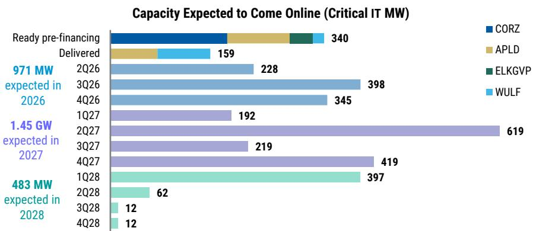  
Source: MS, Bloomberg, Moody's, S&P, and Fitch. Data as of July 2026.

We present some of the potential drivers of construction delays below. None of these are new to data center construction (an FTI Consulting report from October 2024 already flagged many of the same reasons discussed in this note and more), and we expect to get more data points on what is driving potential delays, if there are any. We expect some updates as we go into 2Q26 earnings.

1. Compressed timelines (construction is fast-paced, with timelines between 12-18 months in most cases; \$1bn construction projects could take 3-5 years depending on the complexity);

2. As much as the construction of the shells isn't extremely complex, the associated systems – power, cooling, and more – are very complex, which creates interface risk;

3. There could be design changes through different stages of the project, depending on when/how involved the tenant is since inception (we've seen this happening recently, but note that this isn't new to data center construction, and companies such as Digital Realty and Switch have flagged similar issues in their regulatory filings in the past);

4. Supply-chain bottlenecks and labor constraints are worsening (see some key stats on the Sunday Start from June 14);

5. Even with the existing
