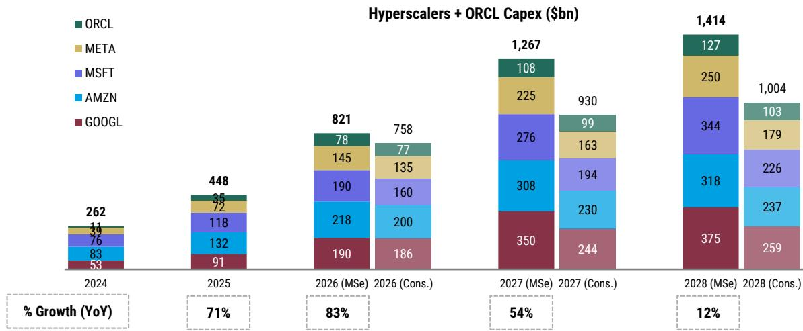
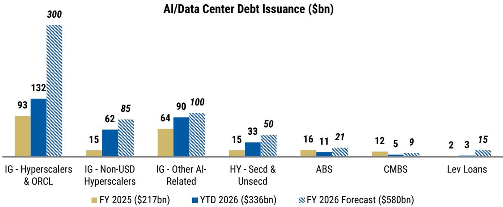

# MS：数据中心AI融资——我们从读者听到的

AI相关债务发行正在经历一场结构性变化。MS最新发布的读者反馈报告显示，截至7月10日，全球AI相关债务发行已达3360亿美元，但市场情绪正从“接纳”转向“谨慎”。过去40天内，超大规模企业发行量激增、甲骨文评级遭下调，AI相关债券利差已走阔24个基点。报告认为，这轮变化真正考验的不是融资能力，而是市场对AI回报表现周期的耐心。

## 1. 读者正在重新定义AI债务的不确定性层级

MS在报告中梳理了读者讨论中最常出现的三类不确定性：建设不确定性、租户不确定性和资产不确定性。建设不确定性指向开发商能否按时交付数据中心，这是企业信用市场中相对较新的变量——传统上这类不确定性通过项目融资或房地产融资渠道消化。租户不确定性则取决于承租方的信用质量，在ABS和CMBS结构中，摊销机制和信用增级措施可以在一定程度上缓释这一不确定性。

真正值得关注的是资产不确定性。报告指出，资产不确定性与数据中心的地理位置、工作负载类型、技术过时速度密切相关。当设施进入续租阶段时，资产不确定性才会真正暴露。目前市场上已出现分化信号：Hut 8的债券因有工程公司Jacobs Engineering的施工保证而获得市场认可，而QTS的债券尽管租给了微软，但由于债务不摊销、10年到期时仍有50%-65%本金未偿还，其利差比Hut 8宽约40个基点。

> **KC评论：** 读者对“租给谁”的信任度正在下降，对“到期时还剩下多少资产价值”的关注度在上升。不摊销的结构在利率节奏变化周期是杠杆工具，在利率高位和续租不确定时则变成不确定性放大器。

## 2. 供应冲击已从“可控”变为“扰动”

6月之前，读者普遍认为AI融资需求主要来自超大规模企业和甲骨文，且这些发行人正在改善透明度、建立定期发行节奏。非美元债务和股权融资的多元化也缓解了美元市场的供应不确定性。但6月以来，其他科技巨头的发行、超大规模企业在财报前的提前发债，以及甲骨文被标普降级，打破了这种平衡。

报告数据显示，研究级AI相关债券的利差已从年初至今走阔24个基点，而整体研究级指数反而收窄约2个基点。6月后发行的大规模交易目前交易价格均低于新发定价——这是情绪转向的明确信号。MS维持对研究级科技板块的“低配”判断，预计全年研究级AI相关发行量仍将达到3500-4000亿美元，下半年发行节奏至少要与上半年持平。

## 3. 融资渠道的拓宽正在改变信用评估框架

超大规模企业正在以前所未有的方式拓宽融资渠道。自2025年以来，这些公司已在欧元、英镑、瑞士法郎、加元和日元五个非美元货币市场发债。亚马逊还完成了一笔175亿美元的延迟提款定期贷款，期限3年，利差仅为S+75个基点。甲骨文和谷歌今年也宣布了股权融资交易。

报告认为，成本已不再是融资决策的首要考量，拓宽读者基础才是核心目标。但这也带来了新的问题：当公司通过表外渠道（购买承诺、租赁承诺、资产支持负债等）增加实际杠杆时，信用质量的真实变化更难被市场及时捕捉。甲骨文被提前降级可能只是一个开始，未来不同发行人之间的信用分层将更加明显。

> **KC评论：** 融资渠道越宽，市场对信用质量的审视就越细。表外杠杆的透明度问题，可能是下一轮信用定价分化的关键变量。

## 4. 高收益市场中的结构创新与再融资不确定性

在高收益市场，数据中心建设债券的结构设计正在快速演变。报告提到，读者最关心三个问题：建设进度是否可能延迟、结构条款是否足够保护债权人、以及未来的再融资路径是否清晰。与研究级市场不同，高收益数据中心债券的发行人往往是新进入信用市场的公司——包括所谓的“新云”企业和前比特币矿工转型的数据中心开发商。

这些公司缺乏长期信用记录，其业务模式尚未经历完整周期检验。报告认为，建设不确定性、租户信用和资产价值在高收益市场中的权重不同，读者需要更精细地评估每个交易的结构保护措施。目前高收益数据中心债券的样本量仍然有限，但已有的交易已显示出明显的定价分化。

MS这份报告的核心信号是：AI债务融资市场正在从“讲故事”阶段进入“验证”阶段。供应冲击、信用分层和资产不确定性正在取代融资便利性，成为市场定价的主导因素。对于读者而言，真正需要回答的问题不是“AI会不会改变世界”，而是“这些债务到期时，资产和现金流是否还在”。

For informational purposes only. Portions may be generated,translated,summarized,or edited with AI assistance based on source materials and may contain omissions or errors. Please verify independently. This is not investment,legal,tax,accounting,or other professional advice.

For informational purposes only. Portions may be generated,translated,summarized,or edited with AI assistance based on source materials and may contain omissions or errors. Please verify independently. This is not investment,legal,tax,accounting,or other professional advice.

