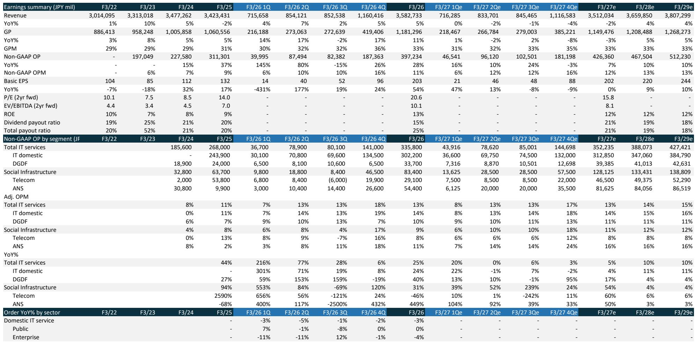
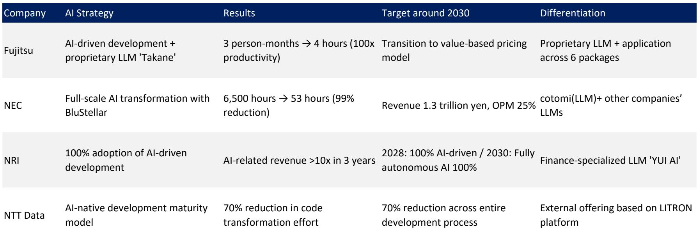
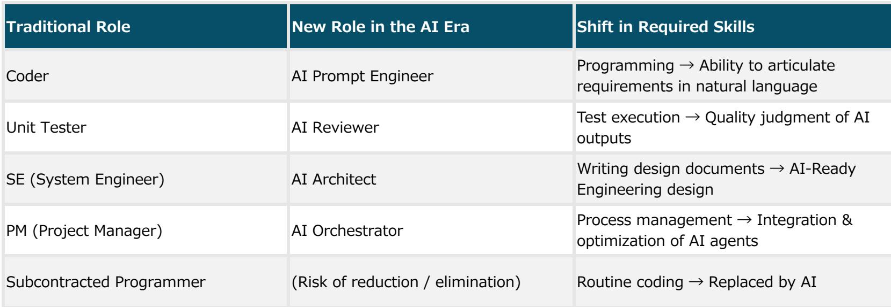

# AI驱动开发有望为日本头部IT承包商带来5-10个百分点的利润率提升

日本大型IT服务公司正面临一个结构性机遇，多数市场参与者尚未充分认识。数十年来首次，制约运营利润率的成本结构真正具备了可突破性。这一机制并非源于周期性需求或对客户的议价能力，而是技术驱动下对最大单项支出——外包成本——的削减。目前，外包成本占营收的31%至40%，这一比例从1991年的约20%持续攀升至2024财年的加权平均33.5%，已超过人力成本（27.3%），成为日本信息服务行业最主要的成本类别。

当前值得关注的原因在于，相关技术已从实验室验证阶段进入可复现的生产成果阶段。日本四家主要系统集成商——富士通、NEC、NOM综合研究所和NTT数据——已公开展示了贯穿软件开发生命周期的效率提升，幅度从70%到100倍不等。这些并非孤立的试点项目，每家公司均已公布覆盖全公司的部署路线图，并设定了截至2030年的具体目标。其共同逻辑是：AI驱动开发使得此前外包给多层分包体系（可延伸至六层）的工作得以回归内部完成。

战略意义直接明了：若头部承包商能够结构性降低外包成本，其运营利润率有望在当前10%至20%的基础上提升5至10个百分点。但实现这一提升并非自动完成，而是取决于三个关键变量：从人月计费向价值导向定价的转型能力、承担前期AI投入的意愿，以及克服数十年分包文化惯性的组织执行力。

## 多层分包结构：既是问题所在，也是机遇之源

日本IT服务业采用金字塔模式运作。约87%的合同软件开发商担任总承包商，但其中56.7%的企业同时也作为分包商承接业务。这种重叠结构意味着，总承包商入账的营收中有相当部分会立即流向下游。日本公平交易委员会记录显示，工作经常经过四至六层流转后才到达实际开发者手中。

成本负担并非均匀分布。总承包商承担的外包成本比例最高，因其处于金字塔顶端，每一层都吸收着利润率压缩。加权平均外包成本占销售比率为33.5%，但这一数字掩盖了巨大差异。对于缺乏内部交付能力的纯总承包商而言，该比率可能接近40%。这意味着每季度都有大量资金流出企业，仅换来分包商的可计费工时。

AI驱动开发从两个方向切入这一结构。首先，它大幅减少了开发各阶段所需工时，从需求定义、设计到实施、测试和运维。其次，它改变了内部工程师的技能构成，从编码和测试人员转变为AI监督者和质量审核者。两者结合意味着，原本需要分包团队完成的任务，可由更小规模、更高资历的内部团队在AI代理辅助下执行。外包成本线随之缩减，因为工作不再需要外流。

机遇并非渐进式。若一家运营利润率为15%、外包成本比率为35%的总承包商能将后者降低10个百分点——考虑到已展示的效率提升，这是一个合理目标——并将节省成本的一半转化为利润，其利润率将扩大5个百分点。对于处于区间高端的20%利润率公司，潜在提升可达10个百分点。这种结构性改善足以改变估值倍数。

## 四大系统集成商已证明效率提升真实且可扩展

富士通提供了最引人注目的单一数据点。在日本2024财年医疗报销修订的概念验证中，该公司在四小时内完成了此前需要三人月（约480小时）的系统修改，实现了100倍的效率提升。其背后的平台是一个以富士通专有大语言模型Takane为中心的多AI代理系统，该模型专精于日本法律文件和源代码。多个代理自主交接任务——解读法规修订、识别受影响区域、修改代码、创建并执行测试用例——同时，独立的多层质量控制机制利用资深系统工程师的隐性知识，在每个阶段验证输出。

富士通正从概念验证走向生产应用。2026年1月，该公司开始将该平台应用于67个打包业务应用，其中30个在医疗领域，37个在公共部门，系统规模总计150兆步。到2026财年末，公司计划扩展至金融、制造、流通及其他公共领域。关键的是，富士通已明确表示将把定价模式从人月计费转向结合基础费用与使用量收费的价值导向结构。同时，它正在重新定义工程师角色，将其定位为“前向部署工程师”，负责监督AI决策并确保质量。

NEC已宣布自身为“AI原生公司”，并在其BluStellar业务的所有约30个场景中应用AI。其日本制造的大语言模型cotomi，以约十三分之一的参数规模实现了与大型海外模型相当的性能，支持本地部署、私有云或公有云部署。NEC已在特定任务上展示了99%的工作量缩减——从6,500小时降至53小时——并为BluStellar设定了25%的非GAAP运营利润率目标，这一水平若无结构性成本削减将无法实现。

NOM综合研究所正采取分阶段推进策略。在2025和2026财年，该公司将AI嵌入代码生成和测试支持等下游流程。在其金融ASP项目中，部分案例已在详细设计、开发和单元测试阶段实现了10至30倍的效率提升。到2028财年，NRI目标实现AI驱动开发的100%采用。到2030财年，目标实现完全自主AI代理的100%部署。NRI还在开发金融专用大语言模型YUI AI，这使其在核心垂直领域拥有差异化定位。

NTT数据制定了最为结构化的路线图。其目标是通过三阶段成熟度模型，到2030年实现整个开发流程70%的工作量缩减。该公司已在Web应用开发中实现70%的工作量缩减，在商业数据库转换中实现50%的缩减。公司计划在2025财年将生成式AI应用于500个项目，到2027财年将AI赋能项目比例提升至50%，并在2030财年达成70%的缩减目标。其LITRON Builder平台提供了符合公司治理和安全要求的代理开发环境，NTT数据目标在2027财年前实现LITRON业务累计销售额200亿日元，生成式AI相关业务整体累计销售额1万亿日元。

## 瓶颈已从技术转向组织执行

尽管效率提升已得到验证，但从试点到规模化推广的行业转型仍面临一系列非技术性障碍。证据清晰：虽然88%的组织经常使用AI，72%的CEO担任最终决策者，但约三分之二仍停留在试点阶段。仅1%达到了德勤定义的“成熟”部署水平，仅19%展示了明确的回报。

瓶颈具有结构性特征。据Gartner调查，63%的组织将数据基础不完善视为障碍。据德勤调查，66%的组织尚未重新设计业务流程以支持AI采用。AI人才存在结构性短缺。波士顿咨询公司的“10-20-70法则”捕捉了一个持续模式：成功的AI转型需要约10%的努力用于算法，20%用于技术，70%用于组织变革，但多数公司却颠倒了资源分配。

日本面临额外的特定障碍。对系统集成商的依赖、遗留系统的持续存在，以及容忍度较低的企业文化，使得转型之路更为陡峭。仅13%的日本公司报告AI成果超出预期，而美国这一比例为51%。日本的企业级AI部署率为8.9%，在普华永道调查的五个国家中排名末位。

对头部IT承包商而言，这些障碍既是风险也是机遇。风险在于客户可能要求将效率提升转化为更低价格，从而压缩而非扩大利润率。机遇在于，能够帮助客户克服组织瓶颈的承包商——通过提供AI就绪的工程设计、流程再造咨询和托管部署——将开辟一条比传统系统集成利润率更高的新收入来源。

## 评估哪些承包商能把握利润率机遇的决策框架

评估日本IT服务公司的参与者需要一个框架，以区分结构性赢家与那些成果将被竞争稀释的企业。三个变量具有决定性作用。

第一个是定价模式转型。能够从人月计费转向价值导向或成果导向定价的公司，将保留更大份额的效率提升收益。富士通对此转型的明确承诺是一个积极信号。风险在于，客户（尤其是公共部门和受监管行业）可能抵制放弃他们熟悉的采购模式。成功的公司将是那些能够以可衡量方式展示价值——更快的上市时间、更低的缺陷率、更低的维护成本——并据此定价的企业。

第二个变量是前期投入能力。AI驱动开发需要在大语言模型基础设施、平台开发和员工再培训方面进行大量资本支出。NEC的cotomi和NTT数据的LITRON平台代表了多年、数十亿日元的投入。拥有强劲资产负债表和管理层对多年投入周期承诺的公司具有优势。那些试图仅凭当前现金流支撑转型而缺乏战略承诺的企业将落后。

第三个变量是组织惯性。多层分包结构不仅是一条成本线，更是一个由关系、依赖关系和制度知识构成的网络。数十年管理分包关系的总承包商已围绕该模式建立了流程和文化。拆解它需要的不仅是新技术，还有新的职业路径、新的绩效指标和新的风险管理框架。将这一挑战视为变革管理而非技术实施的公司，能将效率提升转化为利润。将其视为简单工具推广的公司，将看到收益通过定价压力和组织摩擦流失。

早期证据表明，四家主要系统集成商正采取正确举措，但结果差异将很大。在定价、投入和组织变革三个维度均执行到位的公司，有望在未来三至五年内将运营利润率实际提升5至10个百分点。在任何单一维度上失败的公司，将看到较小的提升，节省的成本将流向客户或被低效吸收。

## AI的竞争优势如今取决于规模化，而非采用

企业软件领域关于AI的叙事已经转变。过去两年，问题在于公司是否采用了AI工具。这一问题如今已有定论。相关的问题在于公司能否从试点走向规模化部署，而这一能力正是区分1%成熟采用者与三分之二仍处于试点阶段者的关键。

日本头部IT承包商在这一动态中占据独特位置。他们不仅是AI驱动开发的采用者，更是将帮助客户实现规模化的供应商。那些改善自身利润率的效率提升——富士通的100倍改进、NEC的99%缩减、NTT数据的70%目标——正是他们可以向客户提供的服务基础。在自身内部转型中取得成功的公司，将同时拥有可信度和平台，引领客户完成同样的转型。

外包成本的结构性削减是使这一转型对承包商自身具有财务变革意义的机制。但最终的机遇更为宏大。三十年来，日本IT服务业以低利润率、分散分包和缓慢效率增长为特征。AI驱动开发提供了一条走出这一均衡的路径。成功跨越定价、投入和惯性三大障碍的公司，不仅将改善自身利润率，更将重新定义行业结构本身。

*仅供参考。部分内容可能基于源材料通过AI辅助生成、翻译、摘要或编辑，可能存在遗漏或错误。请独立核实。本文不构成专业建议。*

仅供参考。部分内容可能基于源材料通过AI辅助生成、翻译、摘要或编辑，可能存在遗漏或错误。请独立核实。本文不构成专业建议。

