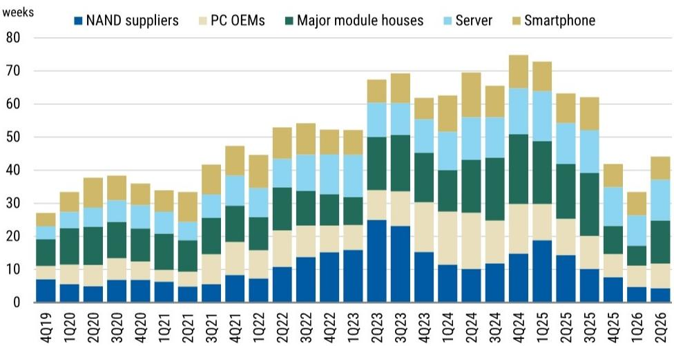
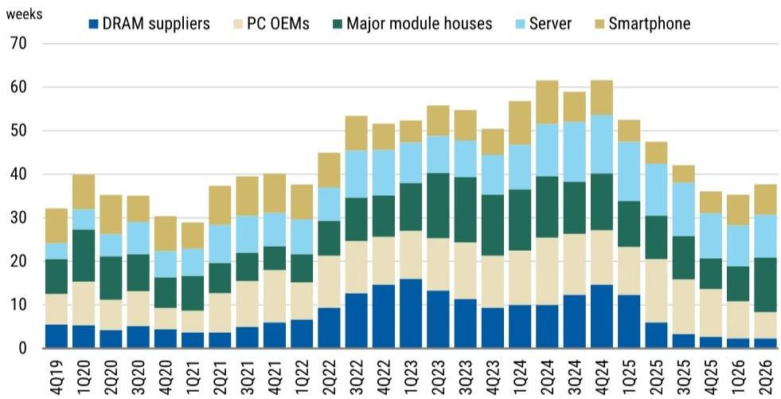
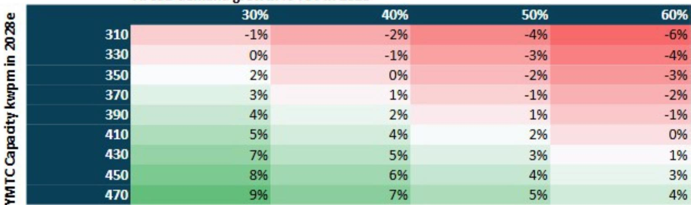

# MS：MS全球科技网络研讨会SK海力士ADRASML模拟芯

这份MS全球科技网络研讨会纪要，覆盖了存储、ASML、模拟芯片和800V数据中心等多个议题。其中值得关注的讨论，围绕存储周期的三个框架：市场对AI支出的定价是否过于乐观、长期协议（LTA）是否被重新定价、以及当前周期究竟处于什么位置。

报告的观察是，存储报价可能在2026年第四季度达到阶段性高点，但周期不会像过去那样快速变化，而是被拉长。这意味着，市场对存储的定价是理性的，而非狂热。

## 1. AI资本支出仍在加码，但2Q26才是验证节点

报告对超大规模云厂商的资本支出持“建设性”态度。图表显示，头部大模型的资金强度和ARR（年化营收）仍在上升。但一个关键限定条件是：基础设施变现不等于算力过剩。报告明确将2026年第二季度的资本支出数据视为“验证节点”——届时才能判断AI投入是否真正转化为可持续的营收，而非过度建设。

> **KC评论：** 报告没有直接讨论AI泡沫，但提到了“算力过剩”的不确定性。2Q26的资本支出数据，将是判断AI产业链是否健康的关键分水岭。

## 2. LTA并未被重新定价，市场比想象中冷静

疫情期间，模拟芯片领域的长期协议（LTA）曾引发一轮定价重估。但报告认为，当前市场对存储LTA的定价是“中性”的——没有出现明显的重新定价。原因在于，LTA正在被重新谈判，且存在强制去库存的不确定性。市场并未因LTA的存在而给予存储公司更高的估值倍数，这反映出读者对结构性增长与周期性波动的分歧仍在。

## 3. 周期见顶，但不会剧烈变化

报告最核心的观察是：DRAM合约价格同比增速正在从周期性高点回落，而估值（NTM P/B）尚未重新定价，这与报价在4Q26见顶的预期一致。但报告同时指出，库存水平在2Q26有所上升，主要由模组厂驱动。这意味着，周期正在从“加速”转向“减速”，但并非“明显波动”——周期被拉长了。

## 4. YMTC的产能是NAND市场的最大变量

报告对YMTC的产能做了详细的情景分析。YMTC正在建设Fab4和Fab5，每个产能约100kwpm。如果五座工厂全部用于NAND，其全球份额可能达到24%。在基准情景下（非AI NAND需求增长5%，AI SSD需求增长30-60%），NAND市场到2028年仍将保持紧平衡。但YMTC更激进的扩产，是最大的供应过剩不确定性。

## 5. ASML和模拟芯片：两个不同的复苏故事

ASML在2Q26业绩公布前，已跑输美国半导体设备板块33%。报告预计FY27和FY28的EUV出货量分别为92台和104台。模拟芯片方面，报告认为周期复苏正在进行，利润率扩张即将到来。这两个子行业与存储周期形成对照：设备股在消化前期涨幅，而模拟芯片正在走出低谷。

这份报告的价值不在于给出一个简单的结论，而是提供了一个观察框架：存储周期正在从“价格驱动”转向“结构驱动”。AI资本支出、LTA定价和YMTC产能，这三个变量将决定周期的长度和斜率，而非简单的供需缺口。

For informational purposes only. Portions may be generated,translated,summarized,or edited with AI assistance based on source materials and may contain omissions or errors. Please verify independently. This is not investment,legal,tax,accounting,or other professional advice.

For informational purposes only. Portions may be generated,translated,summarized,or edited with AI assistance based on source materials and may contain omissions or errors. Please verify independently. This is not investment,legal,tax,accounting,or other professional advice.

