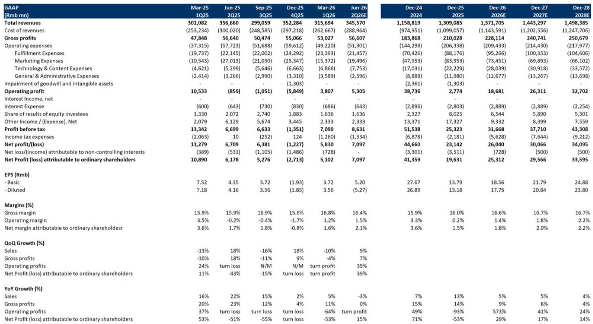
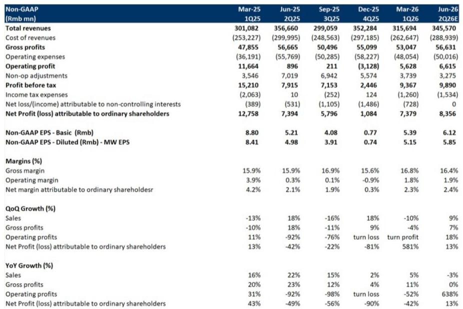
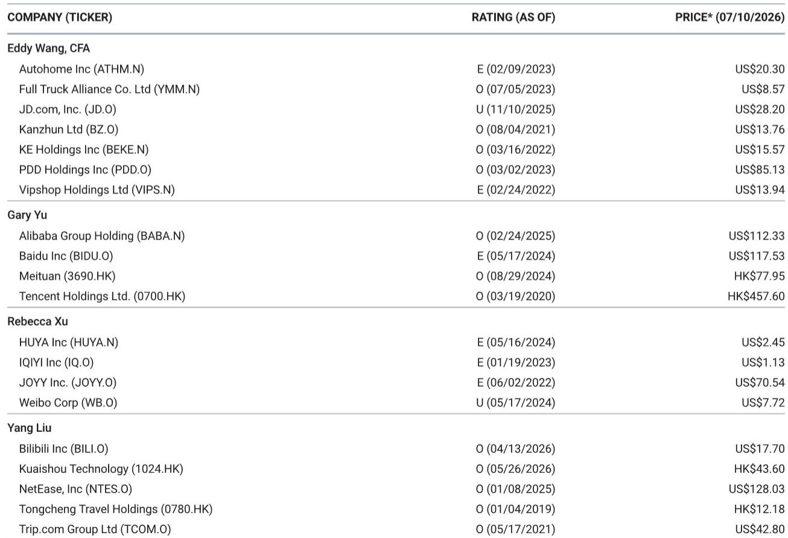

# 京东2026年第二季度：收入结构优化下的利润韧性

京东即将发布的2026年第二季度财报中，最值得关注的信号并非收入下滑，而是公司在零售收入下降5%的情况下，仍有望实现运营利润率同比提升。根据一份2026年7月13日的全球研究机构详细预测，京东零售（JDR）2026年第二季度收入预计同比下降5%，但运营利润率预计将提升5个基点。这种收入与利润关系的反转并非季度性异常，而是反映了京东盈利模式的结构性转变，那些仅关注收入增长的观察者可能低估了这一变化。

从常规标准看，2026年第二季度的基础情景并不乐观。电子和家电收入预计同比下降约10%以上。集团层面收入预计同比下降3%。这些核心数据会引发与宏观消费环境变化的比较，并引发对京东市场份额防御能力的疑问。但在表面之下，盈利构成的改善对市场定价的影响，远比单一季度的收入增长更为重要。

这一情景中的关键张力在于收入逆风与利润顺风之间的平衡。京东的日用百货品类预计将实现中个位数同比增长，其第三方平台收入预计将实现高个位数增长。这些利润率更高的收入来源正在增长，而核心电子品类则在收缩。日用百货的毛利率改善，与2026年第一季度观察到的趋势一致，是运营利润在收入下降时仍能扩张的机制。这并非传统意义上的成本削减，而是向结构性更高利润收入的组合转变。

观察者不应将2026年第二季度视为一个可以忽略的低谷季度。这是京东证明其盈利能力对耐用消费品周期的依赖程度低于市场预期的季度。该报告预测，2026年第二季度集团非GAAP净利润为84亿元人民币，同比增长13%。在收入下降的情况下实现利润增长，是评估京东商业模式是否更具韧性，还是这只是基数效应的暂时现象时，最重要的数据点。

## 收入结构分化掩盖了正在进行的有利利润组合转变

京东零售2026年第二季度的收入下降几乎完全由电子和家电品类驱动。该品类预计同比下降约10%以上，这是上年以旧换新补贴计划带来的高基数以及大额可选消费品消费情绪持续疲软的直接结果。但另外两条收入线则呈现出不同情况。

日用百货收入预计将实现中个位数同比增长。该品类包括日常必需品、快速消费品和家居产品，京东一直在这些领域投资于供应链效率和自有品牌开发。第三方平台收入预计将实现高个位数同比增长。平台收入比自营销售具有更高的利润率特征，因为京东赚取佣金和广告费，而无需承担库存风险或为这些交易承担履约成本。

这意味着，正在收缩的收入具有最低的利润率，而正在增长的收入则具有更高的利润率。日用百货的毛利率改善，是这种组合演变的直接结果。京东并非仅仅等待电子周期复苏，而是在积极重塑其收入构成，转向单位经济效益更高的品类和商业模式。

这对2026年下半年同样重要。报告预计，由于同比基数效应减弱，JDR收入增长将在2026年第二季度触底，并在下半年恢复。当电子品类稳定或恢复温和增长时，已经改善的日用百货和平台业务的利润贡献将叠加在复苏的基数之上。正是基于这一原因，2026年下半年的运营利润率改善预计将大于第二季度。

## 新业务亏损通过内部调整得到控制，而非全面削减

京东的新业务板块一直是市场关注的焦点，尤其是在2026年初外卖业务扩张产生显著亏损之后。2026年第一季度新业务亏损约104亿元人民币，其中约70亿元来自外卖业务，这引发了较高关注。2026年第二季度预计亏损98亿元人民币，其中外卖业务亏损收窄至约65亿元人民币，显示出温和的环比改善，但仍构成显著的盈利拖累。

报告中的关键洞察并非相对亏损水平，而是内部调整结构。外卖业务亏损的收窄，被另外两项举措——京东的社交电商和折扣平台“京喜”，以及其跨境电商业务“Joybuy”——的投资增加所抵消。这意味着，2026年下半年新业务总亏损预计将保持在第一季度和第二季度大致相同的规模。公司并未减少对新业务的总投入，而是在外卖业务成熟、其他举措需要规模化时，在投资组合内重新分配资本。

这对观察者而言有两层含义。首先，新业务板块并非失控的成本问题。季度亏损轨迹正在趋平，而非加速。其次，新业务总支出没有急剧减少，意味着京东并未从其战略扩张（包括外卖、折扣零售或跨境电商）中退缩，而是在动态管理投资组合。风险在于，“京喜”和“Joybuy”达到与外卖业务目前类似的亏损收窄轨迹所需时间可能长于预期。机会在于，其中一项或两项举措可能遵循从重投资到亏损收窄的类似路径。

报告预测，2026年全年集团非GAAP净利润为314亿元人民币。考虑到上半年贡献84亿元人民币，这意味着下半年净利润约为230亿元人民币。下半年的利润权重与预期收入增长重新加速、运营利润率改善的业务特征一致，即使新业务亏损仍处于较高水平。

## 市场定价隐含结构性变化预期，而非周期性波动

- 市盈率。报告发布时，该股票交易价格为28.20美元，意味着较目标价约有4%的下行空间。报告观点表明，分析师认为相对于更广泛的中国互联网板块（该板块具有“有吸引力”的行业观点），该股票的上行空间有限。

对于一个预计2026年至2029年盈利复合年增长率约为10%的业务而言，9倍的市盈率并非明显过高。约0.9倍的隐含PEG比率表明，市场并未为京东的盈利增长赋予任何溢价。这可能反映了对利润率改善可持续性的怀疑、对来自拼多多和阿里巴巴竞争压力的担忧，或认为电子品类复苏将乏力的观点。

但估值中存在一个更具体的张力。报告预测非GAAP净利润将从2025年的270亿元人民币增长至2026年的310亿元、2027年的350亿元和2028年的390亿元。这相当于三年内约13%的复合年增长率。对于一个13%增长率的公司给予9倍市盈率，要么意味着市场预期增长在2028年后将急剧放缓，要么意味着市场无论基本面如何，都对中国电商股票给予结构性折价。

观察者的决策框架并非关于京东是否会超出2026年第二季度的一致预期，而是关于这种允许在收入下降时实现利润增长的利润率结构是否持久。如果向更高利润的日用百货和平台收入的组合转变持续，并且新业务板块稳定，那么盈利轨迹支持高于9倍的市盈率。如果电子品类持续承压，且竞争动态迫使支出增加，那么当前的市盈率可能是合理的。

## 评估京东跨周期盈利能力的决策框架

以下框架将报告中的关键变量组织成结构化的评估体系。这不是预测，而是一组条件关系，用于判断京东当前估值是低估还是高估其内在盈利能力。

**变量1：电子和家电收入轨迹。** 该品类驱动收入核心数据，但贡献的增量利润率最低。如果2026年第二季度约10%以上的降幅在2026年下半年缓和至中个位数降幅，那么对总收入的拖累将变得可控。如果降幅在下半年持续保持两位数，那么来自日用百货和平台业务的组合转变收益可能不足以抵消销量损失。

**变量2：日用百货毛利率轨迹。** 报告将此确定为运营利润率扩张的主要驱动力。关键问题是日用百货的毛利率改善是否可持续，还是反映了单次采购收益、库存优化或竞争对手将效仿的定价行动。如果利润率改善是结构性的，则支持京东在收入持平或温和下降时仍能实现利润增长的论点。

**变量3：新业务亏损轨迹。** 当前预期是2026年下半年新业务总亏损保持平稳，每季度约90-100亿元人民币。如果外卖业务亏损收窄速度快于预期，节省的资金可重新配置给“京喜”和“Joybuy”，或直接计入利润。如果“京喜”或“Joybuy”需要比当前预测更多的资本，亏损水平可能增加。该板块的转折点在于新业务总亏损何时开始相对下降，而不仅仅是作为收入百分比下降。

**变量4：2026年下半年收入增长重新加速。** 报告预计，更轻松的同比比较将推动JDR收入增长从2026年第三季度开始复苏。这是日历的机械效应，而非消费者行为的变化。观察者应区分由比较驱动的周期性复苏和由市场份额增长或品类扩张驱动的结构性复苏。前者支持短期盈利，但不会改变长期增长率。

**变量5：在外卖和折扣零售领域的竞争定位。** 京东的外卖扩张和“京喜”投资使其分别与美团和拼多多直接竞争。报告假设这些投资保持当前规模，意味着京东愿意接受持续亏损以获取份额。如果竞争强度升级，亏损轨迹可能在改善前恶化。如果京东达到足够规模以收窄外卖业务亏损（正如目前似乎正在发生的那样），新业务板块对估值的压力将减小。

这五个变量并非独立。对京东最有利的情景是：电子收入稳定，日用百货利润率保持高位，新业务亏损趋于平稳然后下降，以及2026年下半年比较驱动的收入复苏提供顺风。在此情景下，相对于10-13%的盈利增长轨迹，9倍市盈率显得保守。

最不利的情景是：电子收入继续以两位数速度下降，日用百货利润率改善被证明是暂时的，外卖竞争加剧，以及“京喜”和“Joybuy”需要比预期更高的投资。在此情景下，9倍市盈率可能是公平甚至慷慨的。

报告的基础情景介于这两个情景之间。收入在短期内下降，但在更轻松的比较下复苏。利润率温和改善。新业务亏损稳定。盈利增长，但上行空间的安全边际不大。

报告最重要的结论是，京东的盈利能力比其表面看起来更少周期性。即使在其最大品类收缩时，公司也能实现利润增长。这并非看涨该股票的理由，而是提醒我们应超越2026年第二季度的收入核心数据，关注将决定9倍市盈率是价值陷阱还是机会的利润率结构。

*仅供参考。部分内容可能基于源材料通过AI辅助生成、翻译、总结或编辑，可能存在遗漏或错误。请独立核实。这不构成专业建议。*

仅供参考。部分内容可能基于源材料通过AI辅助生成、翻译、总结或编辑，可能存在遗漏或错误。请独立核实。这不构成专业建议。

