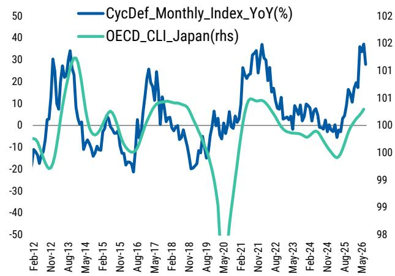
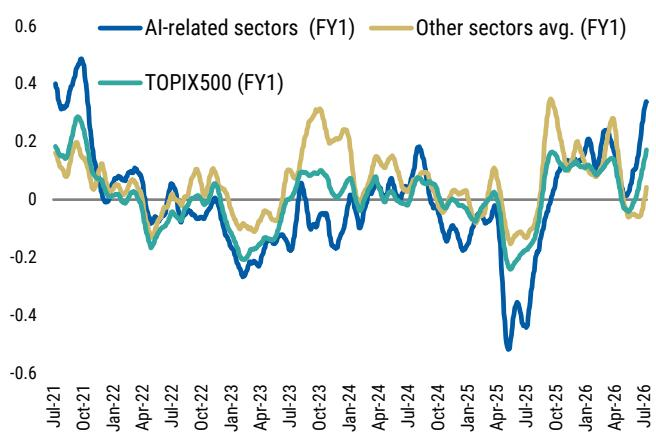

# MS：日本公司策略全球宏观环境亚洲之行反馈银行业兴趣重燃

亚洲读者对日本市场的兴趣正在发生一次值得关注的转向。MS策略师Sho Nakazawa与首席宏观环境学家Chiwoong Lee在7月初走访新加坡和香港机构后，发现一个此前不多见的组合：读者对日本银行板块的兴趣显著升温，其逻辑并非单纯押注利率上行，而是将其视为AI相关公司的短期对冲。

这份报告的核心信号是：市场对日本央行终端利率的定价已升至2%左右，但MS自己的预测仅为1.50%。两者之间的差距，恰恰是银行股后续走势的关键变量。

## 1. AI与非AI的极端分化正在接近一个临界点

读者反复追问同一个问题：AI与非AI公司之间极度简化的两极分化还能持续多久。报告指出，AI相关公司的盈利修正已处于历史高位，可能正在接近峰值。过去几年，AI公司的估值扩张与公司指引的连续上调同步发生，但多位读者注意到，即使Meta大幅上调资本开支计划，报价的正面反应也已弱于以往。

这意味着，AI相关公司超越市场预期的门槛已经实质性抬高。那些Beta和波动率相对较低的板块——游戏、内容/IP、系统集成商、医疗设备、食品和零售——开始进入部分读者的视野。报告记录了几位读者对选择性轮动进入这些领域的兴趣。

> **KC评论：** 报告没有断言轮动一定会发生，但提供了一个可观察的框架：如果AI相关公司的盈利修正从历史高位回落，资金寻找低波动替代品的动力会自然增强。关键在于美国超大规模云厂商和亚洲AI公司的资本开支指引能否继续超预期。

## 2. 银行股被重新定价的逻辑：财政担忧倒逼央行加速

读者对银行板块的关注，根植于一个更深层的宏观判断：日本财政纪律的担忧短期内难以消散。报告提到，所谓的“日本DOGE”支出改革倡议中，各部委的自我评估仅提出了一项废除现有特别税收措施的建议。这意味着财政不确定性溢价不会轻易消退，日本国债回报表现曲线将持续陡峭化。

如果财政担忧推升长端利率，同时美元兑日元继续上行，市场将越来越倾向于认为日本央行落后于曲线。这种判断会反过来施压央行加快加息步伐，从而推高终端利率的市场定价。报告明确指出，终端利率与银行股指数的历史相关性很强，而当前市场定价已升至2%左右，MS自己的预测仅为1.50%。两者之间的差距，意味着银行股的中期上行空间有限，但短期逻辑可能不同。

## 3. 日元弱势的结构性根源，让干预效果被普遍看淡

读者对日元结构性偏弱的看法高度一致。报告列出了三个支撑因素：日美利差在近期重新扩大、日本累积的数字贸易赤字持续构成贬值不确定性（主要反映向美国超大规模云厂商和IT公司支付的云服务和软件下载费用），以及财政改革进展缓慢。

多数读者认为，外汇干预的效果将有限且短暂。报告进一步区分了B2C和B2B行业在日元贬值环境下的利润传导能力：B2C部门在成本转嫁和消费者购买力之间的平衡上面临更大挑战。这一判断为行业选择提供了另一个筛选维度。

## 4. 中国宏观环境K型分化，但政策工具箱仍有空间

宏观环境学家Chiwoong Lee在交流中回应了关于中国宏观环境的提问。报告描述了一个正在加深的K型分化：出口和高端制造保持韧性，但国内需求持续走弱——5月零售额同比下降0.6%，为疫情以来首次负增长。二季度GDP跟踪值约为4.4%，低于政府4.5%的目标。

政策评估被定性为“微调而非转向”。截至5月，财政支出同比下降1.6%，约55%的财政和准财政预算在年中尚未使用，这意味着下半年仍有约2万亿元人民币的财政脉冲空间。但政策重点仍集中在“六网”基础设施（电网、AI算力、水利、下一代通信、城市地下基础设施和物流），而非消费或住房刺激。结构性阻力——尤其是社会保障体系改革的需求——短期内难以解决，这为国内需求的任何上行惊喜设置了天花板。

> **KC评论：** 报告对中国宏观环境的判断是“有空间但无意愿转向”。财政余量确实存在，但政策优先级的排序没有改变。对于关注日本市场的读者而言，中国需求的强弱直接影响日本出口企业的盈利预期，进而影响资金在AI与非AI之间的配置选择。

这份报告的价值不在于给出一个明确的交易方向，而在于提供了一个多层次的观察框架：AI主题的可持续性、日本财政与货币政策的互动、日元弱势的结构性根源，以及中国宏观环境分化对全球资金流向的影响。银行股被重新关注，只是这些变量交汇后的一个结果。

For informational purposes only. Portions may be generated,translated,summarized,or edited with AI assistance based on source materials and may contain omissions or errors. Please verify independently. This is not investment,legal,tax,accounting,or other professional advice.

For informational purposes only. Portions may be generated,translated,summarized,or edited with AI assistance based on source materials and may contain omissions or errors. Please verify independently. This is not investment,legal,tax,accounting,or other professional advice.

