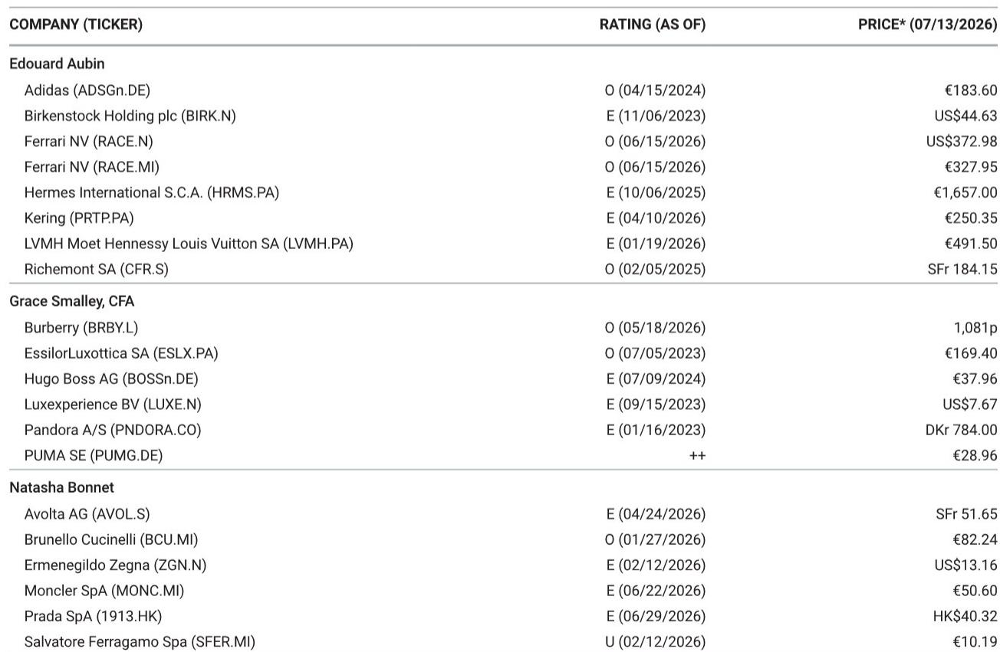
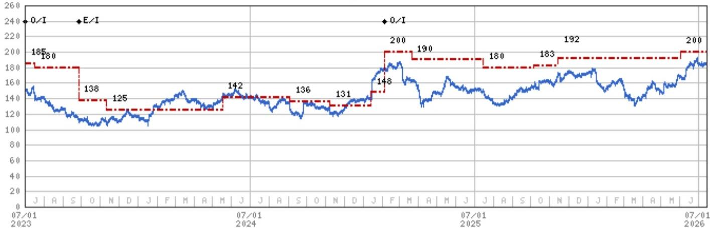

# MS：奢侈品行业关键辩论，周期性颠簸还是结构性重置

奢侈品财报季即将开启，市场最关心的问题不是哪家品牌卖得好，而是过去两年的节奏变化究竟是周期性颠簸，还是一次结构性重置。MS这份报告直接切入这个核心分歧，并给出了一个值得认真对待的框架：两种叙事都站得住脚，但财报本身可能无法给出最终答案。

报告认为，多头和空头的分歧最终都收敛到同一个变量——中国。但即便在中国，信号也远未统一。

## 1. 多头看到的是基数效应和AI财富，但空头看到的是8000万消失的客户

多头叙事的核心是“2022-2025年的需求低谷已经过去”。理由包括：基数开始变容易、美国需求仍具韧性、中国出现缓慢触底迹象、AI创造的百万富翁正在增加、GLP-1药物带动了高端服装的换季需求。报告引用了Knight Frank的数据：2021至2026年间，全球超高净值人群从55.1万增至71.3万，相当于每天有89人跨过3000万美元的门槛。

但空头指出一个更根本的问题：行业流失的不是消费强度，而是真实客户。根据Bain-Altagamma的数据，奢侈品客户基数从2022年的超过4亿降至2025年的约3.3亿，净流失约8000万人。Prada集团CEO Andrea Guerra在2024年11月的行业会议上直言，定价是行业“最大的失败”。当价格与价值之间的信任被破坏，弹性会结构性上升，且难以逆转。

> **KC评论：** 多头和空头争论的实质不是“需求是否恢复”，而是“恢复的是谁的需求”。如果流失的8000万客户是疫情后冲动入场的首次购买者，他们的离开可能不是暂时的。

## 2. 二手市场和“平替”文化是过去没有的结构性逆风

空头叙事中一个容易被忽视的论据是：二手市场和“平替”文化在过去的周期中并不存在。报告估计，全球奢侈品转售市场已增长至约500亿欧元，年增速4-6%。在中国，二手市场规模已相当于一手市场的约10%，正向日本约30%的水平靠近。同时，制造商直供的“平替”产品正在快速获得社会接受度。

这些变化意味着，即便品牌通过降价或推出入门款来吸引回流客户，它们面对的竞争格局已经永久改变。过去，消费者在预算受限时只能“不买”；现在，他们可以选择“买二手”或“买平替”。这对品牌定价权和稀缺价值的侵蚀是结构性的。

## 3. 中国从增长引擎变成了更难判断的变量，但长期渗透率仍有空间

报告指出，即便是最乐观的行业联系人，现在谈论的中国中期增长率也只是中到高个位数，而非2019年前持续双位数增长。中国约70%的家庭财富集中在房地产，而房地产复苏的时间线已被部分联系人推至2027年下半年。与此同时，相关市场今年以来的市值增长（约+10万亿元）已超过房地产资产的价值损失（约-6万亿元），但这种K型分化意味着：高净值人群消费尚可，但作为历史增长引擎的中间阶层仍受制于就业和工资信心。

不过，报告也给出了一个长期乐观视角：中国人均奢侈品消费仅约55美元，远低于韩国的超过325美元。如果中国能走向韩国的消费密度路径，市场空间仍然巨大。同时，新兴市场（中东、印度、东南亚、巴西、墨西哥、尼日利亚）的奢侈品需求合计已达约340亿欧元，接近中国的约420亿欧元。但这些市场的多元化效应需要数年才能显现，中国仍是2027-2028年的关键变量。

> **KC评论：** 中国消费复苏的节奏可能不是线性的。报告提到读者担心日本1990年代房地产节奏变化后的“多次假启动”，这个类比值得关注——如果中国也出现反复，那么任何单季度的改善都需要谨慎解读。

## 4. 财报季的真正考验：能否区分基数效应和真实改善

报告给出了一个可操作的观察框架。对多头而言，关键证据是：产品/组合调整（如入门款）能否持续恢复销量，而非仅美化一个季度；中国客流和消费能否在独立于市场财富效应的情况下持续改善。对空头而言，关键信号是：二手市场是否在蚕食一手客户漏斗；中国二三线城市的门店是否继续仍在调整；行业评论是否仍在强调定价/价值感知问题而非销量恢复。

报告最后提醒，读者应谨慎对待任何2026年上半年的加速，直到能够将其与基数效应区分开来。真正的考验是销量和客户趋势是否真正转向。

---

For informational purposes only. Portions may be generated,translated,summarized,or edited with AI assistance based on source materials and may contain omissions or errors. Please verify independently. This is not investment,legal,tax,accounting,or other professional advice.

For informational purposes only. Portions may be generated,translated,summarized,or edited with AI assistance based on source materials and may contain omissions or errors. Please verify independently. This is not investment,legal,tax,accounting,or other professional advice.

