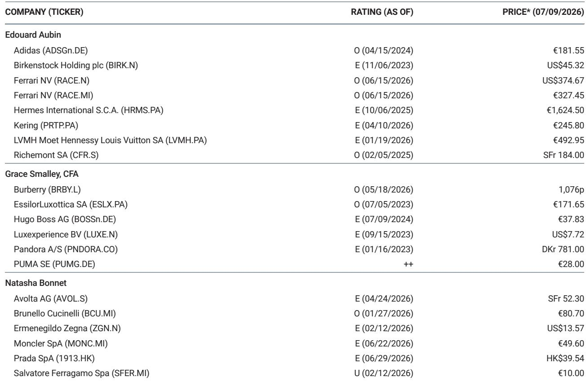

# 奢侈品的两极分化：行业不再同步复苏，而是结构性重组

对欧洲批发商和零售商的最新一轮渠道调研显示，这个行业已经不再步调一致。奢侈品贸易联系人的整体情绪并非全面改善或恶化，而是在分化。一些品牌被描述为“赢得游戏”，而另一些则面临“依然非常艰难的现实”。消费者“更加挑剔”，只有在看到明确价值时才会购买。中东游客流量持续下降，部分被更多但人均消费更低的美国游客所抵消。中国客户存在，但购买时“相当有目的性”。有抱负的消费者群体仍面临压力，而VIC和超高净值人群的消费比以往任何时候都多。

这不是一个等待同步反弹的周期性暂停。证据指向一种结构性分化，赢家与面临结构性挑战的品牌之间的差距正在扩大，而非缩小。第二季度的交易情况证实，品牌特定的轨迹现在远比宏观情绪重要。对于观察者和企业管理者来说，战略启示是明确的：过去那种乘着奢侈品浪潮上升的老方法已经过时。现在重要的是哪些品牌在新的两极分化格局中占据什么位置，以及它们当前的轨迹是自我强化还是可逆的。

渠道调研在统计上并不具有代表性，但多个独立专家反馈的方向一致性赋予了这些信息权重。当广泛的行业联系人样本独立识别出相同的、正在缩小的赢家群体和相同的、正在扩大的落后者群体时，这种模式值得关注。问题不再是奢侈品是否会复苏。问题是哪些品牌已经复苏，哪些品牌在结构上受损，哪些品牌被困在危险的中间地带。

## Brunello Cucinelli、爱马仕和Zegna证明，低调奢华现在是一种结构性优势，而非短暂趋势

Brunello Cucinelli在每一次调研中都被描述为表现突出的品牌，持续实现两位数增长。专家将其与Zegna和Loro Piana并列为男装“黄金三角”，这是一个拥有富裕客户坚定忠诚度的品牌集群。该品牌的低调奢华信誉是持久的，而非脆弱的。它已成为那些看重低调品质而非标志性身份象征的富裕客户的首选。

爱马仕仍然是奢侈品领域较强大、最具韧性的品牌之一。专家报告称没有看到该品牌的疲劳或过度曝光。Birkin和Kelly包的等待名单依然存在。客流量强劲，客户继续购买相邻品类，仅仅是为了参与爱马仕的生态系统。该品牌的稀缺性模式和垂直整合创造了一道任何竞争对手都尚未突破的护城河。

Zegna的势头依然强劲，男装定制需求保持稳健增长。专家在风格上将其与Brunello Cucinelli区分开来，指出Zegna更偏向正式、西装导向的定位，而Cucinelli则更具休闲、适合夏季的吸引力。两者都在获胜，但它们在同一个低调奢华主题的不同细分领域获胜。

共同点是，这些品牌不依赖有抱负的消费者。它们服务的客户群体的消费对短期宏观环境不确定性不敏感。对于评估奢侈品持仓的观察者来说，是否存在这种结构性需求，现在是相对少见最重要的区分因素。缺乏这种需求的品牌，要实现持续增长将面临更艰难的路径。

## Burberry和Saint Laurent表明，当传统与纪律相结合时，转型是可能的

Burberry是少数在所有专家中反馈持续积极的品牌之一。该品牌正在逐步重建吸引力和商业动力，其状况比一年前有了显著改善。专家将此归因于管理层决定将品牌与其传统重新连接。回归“根源和真实性”被描述为一个“伟大的赌注”，有助于重建相关性。

产品评论高度一致。风衣和围巾是核心产品，也是表现最好的品类。专家还强调了成衣，特别是女装领域的吸引力提升，以及手袋领域复苏的早期迹象。Burberry在促销方面的自律方法受到好评，管理层优先考虑品牌价值和全价销售。中国游客在欧洲积极寻找该品牌。虽然Burberry尚未与行业中较强的表现者相提并论，但共识观点是它已成功稳定下来，现在正进入复苏的下一阶段，即吸引力的提升正在推动销售增长。

Saint Laurent正在获得市场份额，其吸引力和销售业绩都呈上升趋势。该品牌比许多同行执行了更清晰的创意转型，并受益于与当前消费者偏好产生共鸣的明确身份。

这两个案例为奢侈品领域的转型研究提供了一个模板。必要的要素是：清晰的品牌传统锚点、自律的商业执行，以及一个愿意将品牌价值置于短期收入之上的管理团队。缺少其中任何一个要素，复苏都难以实现。

## Gucci和LV说明，在消费者信心不足时，陷入转型期的危险

Gucci的反馈揭示了一个品牌，其讨论的改善速度快于数据。Jackie、Bamboo和Horsebit等传统经典手袋系列重新引起关注。Demna的到来为Gucci的故事注入了新的活力和相关性。然而，大多数专家描述第二季度的销售趋势仍为两位数下降，表现依然高度波动。

从调研中得出的关键见解是，Gucci仍然是一个处于转型期而非复苏期的品牌。消费者在接触，但信心尚未恢复。一位专家评论说，Gucci的销售助理仍然需要主动推销产品，而在领先品牌，产品吸引力本身就足以驱动需求。这是一个根本性的区别。当一个品牌必须被推销而不是被购买时，它在结构上是脆弱的。

产品评论好坏参半。传统经典是主要的亮点，但孤立的产品成功不足以抵消更广泛的疲软。手袋不再被视为具有保值属性的购买，从而降低了购买的紧迫性。关于Demna的美学方法是否有可能缩小Gucci的吸引力，而非扩大其传统上服务的更广泛受众，存在争论。另一个不利因素是，中国消费者（历史上是Gucci最重要的客户群体之一）的持续疲软。

LV的势头仍处于不利地位，吸引力正在减弱。这个曾经定义奢侈品全球扩张的品牌，现在被描述为似乎失去了文化相关性。

对于这些品牌来说，风险不是暂时的下滑，而是相关性下降的长期时期。当一个奢侈品牌失去了作为有抱负和富裕消费者的默认选择的地位时，重新获得这一地位需要的不仅仅是一个新系列或一场营销活动。它需要从根本上重建品牌价值，这通常需要数年，而非几个季度。

## 驾驭两极分化奢侈品格局的决策框架

渠道调研支持一个基于三个维度评估奢侈品牌的结构化框架：客户群构成、创意清晰度和商业纪律。

第一个维度是客户群构成。拥有高比例VIC和超高净值人群消费的品牌，如爱马仕、Brunello Cucinelli和Zegna，在结构上免受有抱负消费者疲软的影响。依赖有抱负消费者的品牌，如Gucci和LV，面临的不利因素，在该客户群体复苏之前，任何产品创新都无法完全抵消。

第二个维度是创意清晰度。拥有连贯且广受好评的创意方向的品牌，如Brunello Cucinelli、爱马仕和Saint Laurent，正在获得市场份额。处于创意转型期的品牌，如Gucci、Dior和Fendi，无论其新方向的长期潜力如何，都面临一段不确定时期。调研表明，市场不会为品牌的未来潜力给予信用；它们奖励的是当前的执行力。

第三个维度是商业纪律。Burberry在全价销售方面的自律方法被明确引用为其轨迹改善的原因。通过促销或折扣追求销量的品牌，有可能进一步侵蚀其吸引力。在一个两极分化的市场中，溢价归于那些即使以短期收入为代价也要保护其价格定位的品牌。

应用这个框架，明确的结构性赢家是爱马仕、Brunello Cucinelli、Zegna和Saint Laurent。具有可信动力的转型故事是Burberry和Moncler。高风险转型期的是Gucci、Dior和LV，它们的复苏路径可见但不确定。面临结构性挑战的品牌包括Balenciaga、Fendi和Thom Browne，调研显示它们没有明确的改善催化剂。

## 赢家与落后者之间不断扩大的差距是自我强化的，并且可能持续

渠道调研最重要的见解不是哪些品牌本季度上涨或下跌。而是这种分化正在以自我强化的方式扩大。获胜的品牌吸引更多的VIC消费，这为产品和体验的投资提供了资金，从而进一步加强了它们的地位。落后的品牌失去VIC消费，这限制了它们的投资能力，从而加速了它们的衰落。

这种动态解释了为什么爱马仕和Brunello Cucinelli持续走强，而像Fendi和Thom Browne这样的品牌仍然停滞不前。这不仅仅是产品质量或营销支出的问题。这是一个结构性的反馈循环，奖励成功，惩罚弱点。

对于观察者来说，这意味着当前的排名可能会持续。今天获胜的品牌拥有结构性优势，这些优势会随着时间的推移而复合。今天落后的品牌面临的不利因素将会加剧，除非出现根本性的催化剂。渠道调研并未为那些面临结构性挑战的品牌识别出此类催化剂。

对组合构建的启示是明确的。集中持有结构性优势品牌，可能比分散投资于整个行业更为有效。奢侈品行业不再是一个单一的资产类别。它是一系列具有不同发展轨迹的独立业务，它们之间的差距仍在扩大。

*仅供参考。部分内容可能基于源材料通过AI辅助生成、翻译、总结或编辑，可能存在遗漏或错误。请独立核实。这不构成任何专业建议。*

仅供参考。部分内容可能基于源材料通过AI辅助生成、翻译、总结或编辑，可能存在遗漏或错误。请独立核实。这不构成任何专业建议。

