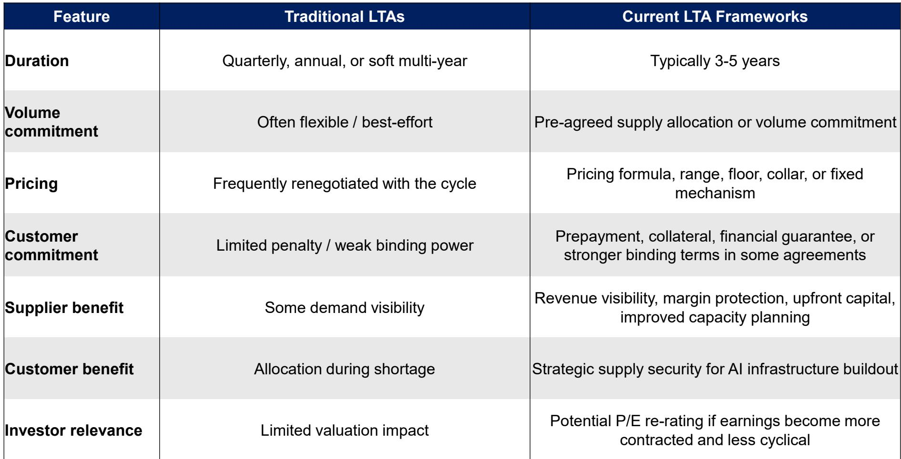
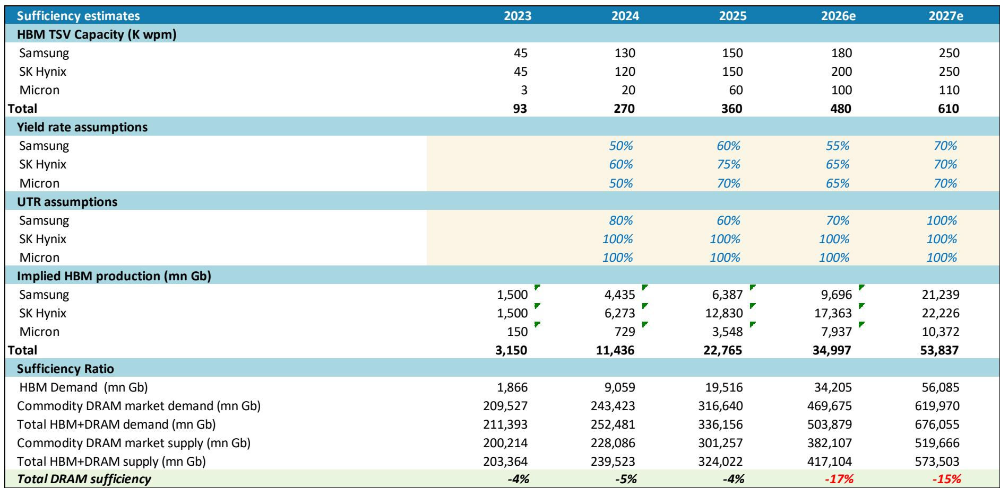
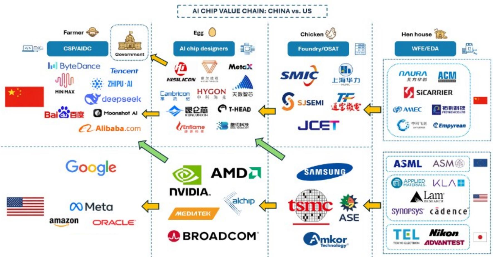

# MS：韩国科技亚太夏季学校AI内存与MLCC

当市场仍在为GPU的算力竞赛定价时，MS在2026年7月发布的韩国科技行业夏季学校报告中，提出了一个更根本的框架转变：AI正从“生成式”过渡到“代理式”，即从被动响应指令，转向自主规划、调用工具、执行多步骤任务。这一转变带来的直接后果，是计算瓶颈从GPU向CPU和内存的迁移。

报告的核心判断是，在代理式AI架构中，推理和工具调用所消耗的CPU资源，将远超传统大语言模型。这意味着，过去两年围绕英伟达GPU建立的叙事，可能正在让位于一个更复杂的硬件需求图谱。

## 1. 代理式AI的“三支柱”架构，重新定义了计算重心

MS将代理式AI拆解为三个核心层：大语言模型负责推理与生成，编排层（Orchestration）负责路由、工具调用与工作流控制，知识层（Memory）则提供企业上下文与专有数据。其中，编排层被类比为CPU，承担着调度与控制的“大脑”功能。

报告引用了一项来自佐治亚理工学院和英特尔的研究，指出在代理式工作负载中，CPU和内存的消耗占比显著上升。例如，多智能体并行调用、API请求、代码执行等动作，对CPU的依赖远高于传统的文本生成。这直接挑战了“算力即GPU”的简化认知。

> **KC评论：** 这张图的关键不在于GPU是否继续重要，而在于CPU和内存的增量需求被市场低估。如果代理式AI成为主流，服务器CPU和DRAM的采购逻辑将发生结构性变化。

## 2. 到2030年，代理式AI可能创造2380亿美元的CPU机会和221EB的DRAM需求

报告给出了一个量化的“牛市情景”测算：到2030年，代理式AI带来的CPU市场规模可达2380亿美元，同时产生221EB的DRAM需求。这一数字远超当前市场对AI硬件规模的线性外推。

背后的逻辑是，代理式AI需要更频繁的推理、更长的上下文记忆、以及更复杂的工具调用链。每一次“自主行动”都意味着一次新的计算循环，而非简单的单次问答。这种“循环放大”效应，使得硬件需求的弹性远高于市场预期。

## 3. 内存周期正在被结构性契约重塑，而非简单的供需波动

报告在内存部分提出了三个关键辩论：AI资本支出是否过度、长期协议（LTA）能否带来估值重估、以及当前周期是否接近拐点。结论是，尽管DRAM合约价格同比增速可能在2026年第四季度见顶，但LTA框架正在改变周期的性质。

传统的LTA多为季度或年度软性承诺，而当前的LTA已演变为3-5年、带有定价公式和预付机制的硬性契约。报告以苹果公司在2013-2025年间通过回购和分红贡献约70%的超额回报为例，类比内存公司如果通过LTA锁定现金流并提升股东回报，估值体系可能从周期性的低市盈率向更稳定的溢价水平迁移。

> **KC评论：** 市场习惯用“周期股”的框架给内存公司定价，但LTA的普及可能让这些公司的盈利波动性下降，从而触发估值重估。苹果的案例提供了一个可参照的路径，但前提是LTA的绑定力度和客户履约意愿需要持续验证。

## 4. 中国与美国在AI芯片价值链上的“脱钩”正在加速

报告单独列出了中国与美国在AI芯片价值链上的对比，指出双方在算力基础设施上的路径正在分化。美国以英伟达GPU和定制ASIC为主，而中国则在加速本土替代和自主芯片设计。这种“脱钩”不仅影响芯片设计环节，还波及到封装、基板、MLCC等上游材料。

对于读者而言，这意味着全球AI供应链的“双轨制”可能成为长期结构。任何单一市场的供需判断，都需要考虑另一市场的独立发展路径。

---

这份报告的价值不在于预测下一个季度内存价格，而在于提供了一个从“代理式AI”出发的硬件需求框架。当AI从“聊天”走向“行动”，计算的重心正在从GPU向CPU和内存迁移，而内存周期的性质也在被LTA悄然改写。这些变化，可能比市场预期的来得更快。

For informational purposes only. Portions may be generated,translated,summarized,or edited with AI assistance based on source materials and may contain omissions or errors. Please verify independently. This is not investment,legal,tax,accounting,or other professional advice.

For informational purposes only. Portions may be generated,translated,summarized,or edited with AI assistance based on source materials and may contain omissions or errors. Please verify independently. This is not investment,legal,tax,accounting,or other professional advice.

