July 13, 2026 04:01 AM GMT

US Equity Strategy | North America

# Micro Meets Macro: 2Q Earnings Preview

We expect the broadening to continue driven by earnings resiliency from the median stock. Our preferred cyclical exposures—Discretionary and Transports—are showing relative strength in terms of earnings revisions breadth. Our systematic transcript analysis shows momentum building around AI adoption.

- Earnings Strength Continues to Facilitate the Broadening in Leadership...In line with our views, the equal-weighted S&P 500 has outperformed the cap-weighted index since mid-May, driven by improving earnings across the index. The median S&P 1500 company is now delivering double-digit EPS growth—the strongest since the post-COVID recovery. While earnings revisions breadth is undergoing its typical July pause, our preferred cyclical exposures, Discretionary and Transports, continue to show relative strength. With our capex/sales factor consolidating, we're closely watching the market's reaction to capex guidance and whether improving pricing power continues to translate into stronger revenue growth, particularly in consumer-facing industries.

- Key Takeaways from Our Micro Meets Macro Roundtable with Lead Analysts...Discussion among our research teams reinforced AI as the dominant theme, with sustained enterprise spending across Semiconductors, Infrastructure Software, Networking and Cybersecurity. Industrials continue to benefit from broadening capex, reshoring and AI infrastructure investment, while Financials are supported by healthy credit growth and capital markets activity. Consumer trends are proving more resilient than expected, with Durables demand stabilizing and Travel, Gaming and Lodging reflecting an early-cycle recovery.

- Momentum Is Building Around AI Adoption, Supporting Our Broadening Call...In calendar 2Q26, 40% of companies identified as "adopters" by our analysts cited at least one quantifiable impact from AI adoption, up from 37% in 1Q26 and 21% in 2Q25. Across the broader S&P 500, roughly 25% of companies reported at least one measurable AI benefit, up from 14% a year ago. These trends support our broadening thesis as companies increasingly demonstrate tangible AI-driven benefits and productivity gains across a wider set of industries.

MS & CO. LLC
Michael J Wilson
Equity Strategist
M.Wilson@morganstanley.com +1 212 761-2532

Andrew B Pauker
Equity Strategist
Andrew.Pauker@morganstanley.com +1 212 761-1330

Diane Ding, Ph.D.
Quantitative Strategist
Qian.Ding@morganstanley.com +1 212 761-6758

Nicholas Lentini, CFA
Equity Strategist
Nick.Lentini@morganstanley.com +1 212 761-5863

# Micro Meets Macro

Last week, we held our quarterly meeting with lead analysts across US research and our economists/strategists to better connect micro and macro data points. We focused the session on AI investment, pricing power, input costs, consumer spending, and the industrial demand outlook.

## TMT

- Tech Hardware: Companies continue to raise prices to offset higher semiconductor and memory costs with little evidence of component cost deflation. Pricing power remains strongest in Servers and Storage, and enterprise demand has proven relatively inelastic versus more elastic consumer demand, reflected in PC shipments slowing from +3% y/y in 1Q to -5% y/y in 2Q. The team is hearing some news flow around layoffs on the cost management side.

- Semis: AI demand remains robust with rising token prices and continued strength across the ecosystem despite recent market pullbacks. Meta's strategy (neocloud) has created some investor debate, but underlying demand remains exceptionally strong, and the team expects hyperscalers to continue highlighting compute shortages this earnings season. Datacenter memory remains the primary bottleneck, with prices expected to rise another ~30% in 3Q and no signs of demand destruction. Outside of AI, broad market shortages are not expected but hot spots will likely pop up. Overall, fundamentals remain constructive despite recent volatility.

- Software: Software budgets are ticking higher and about one-quarter of AI budgets are funded outside of formal IT budgets. Momentum remains strongest in the infrastructure data layer and that's where stock performance has been concentrated. Cybersecurity spending is expected to become increasingly important as AI agents are deployed more broadly. SaaS remains more challenged with meaningful improvement likely still several quarters away. Neocloud demand remains robust with visibility extending well into 2028. The Software debate is in a slightly more constructive place than the beginning of the year due to Cyber, but investor consensus remains fairly negative on the application side.

- Cybersecurity, Telecom, Networking Equipment: Optical networking is cooling after a period of exceptionally strong momentum, though the team expects growth to reaccelerate in the back half of the year. Networking investment remains robust with spending increasingly shifting toward inference rather than training. Investment in tools for security analysts is accelerating, as AI is now involved in the majority of cyber-attacks.

- Business Services: Seeing strong capital markets activity with debt issuance up roughly 20%, which should be positive for the financial analytic vendors. MCP remains a key theme, supporting pricing power and reinforcing the value of proprietary data. Token costs were a recurring topic throughout the quarter but are being managed by productivity initiatives and workforce reductions. Companies also continue to evaluate business model shifts from traditional subscription models toward consumption-based or hybrid pricing structures.

## Consumer

- Hardlines/Broadlines/Food Retail: Durables demand has been soft for several years, but end market demand is beginning to catch up. Food-away-from-home continues to capture the incremental consumer dollar from grocery, suggesting the consumer is healthier than headline data implies. Grocery inflation is trending back toward ~3%, June spending improved versus May, and lower gas prices should provide additional support through the second half.

- Softlines/Brands: June demand trends were mixed, but we think weakened sequentially, resulting in a softer overall 2Q. Off-price has decelerated the most of any sub-sector q/q. Overall, the team does not view recent trends as evidence of broader consumer deterioration given 1Q benefited from one-time tailwinds. Earnings season is still expected to be healthy, although July faces the toughest y/y comparison, limiting the likelihood of near-term acceleration. Pricing remains inflationary versus the industry's typical deflationary backdrop, largely via mix. Inventories are balanced. In terms of the AI opportunity, SG&A has outpaced revenue growth for several years, which leaves scope for cost savings via efficiencies.

- Restaurants: High end spending is still solid but retail sales have slowed to 2-3% driven more by the fast food side. The World Cup didn't seem to have much impact within our restaurant coverage. Expecting demand to firm a bit above and will continue to be driven by high end.

- Gaming/Lodging/Airlines: Services trends continue to outperform the broader macro backdrop. RevPAR has accelerated from negative growth last year to +5% (+10% including the World Cup), more consistent with an early-cycle recovery. Strength is being driven by leisure demand, with both high- and mid-end consumers performing well while the low end remains under pressure. Gaming, leisure products, and cruises all remain positive overall, pointing to broad-based improvement led by the high-end consumer.

- Consumer Staples: Staples demand softened in May and early June, primarily in the more discretionary categories, and the gas/convenience channel more impacted by higher fuel costs, but trends have started to recover in the last couple weeks as Iran conflict risks recede. CPG companies continue to see limited pricing power. Globally, emerging markets remain resilient, supported in part by consumers who are more accustomed to operating through periods of volatility.

## Industrials

- Freight: The transportation outlook remains mixed. The quarterly Shippers' Survey reached its highest level since 2022, with net ordering at its strongest level since mid-2024, but conviction around the longer-term demand outlook is less strong. Recent strength appears to be driven more by improving supply availability than demand, where uncertainty persists.

- Airlines: Airline demand and booking intent remain healthy, with seven consecutive price increases absorbed without demand destruction. With oil prices moving lower, airlines are unlikely to roll back pricing, though sustained demand will remain the key test.

- Multis: The industrial backdrop continues to strengthen. Capex is broadening beyond data centers into areas such as capital goods. Production and short-cycle activity returned to positive growth in 1Q and are tracking well into 2Q. Reshoring progress suggests the U.S. industrial economy may be entering a sustained growth cycle as international production becomes more expensive than domestic. The key debate remains true end-demand versus channel build, with the team viewing the answer as somewhere in the middle. Equipment for data center capex is driving orders very far out. Price is optimistic looking forward. Current call is Industrial > Consumer and US > International within the Industrial coverage.

- Machinery: Manufacturing activity remained strong in 1Q and appears to be tracking similarly in 2Q with investment focused around efficiency and automation. Order activity remains healthy and capacity is generally ample outside of power equipment. That said, some uncertainty remains pertaining to tariffs. For example, one manufacturer noted that they are still trying to understand whether they should be optimizing their manufacturing plants in Mexico/other countries versus the US or vice versa. Construction seeing strong megaprojects (data centers and semis) but local/commercial is not as strong. On the positive side, non-residential hiring and new equipment orders are improving.

## REITs & Financials

- REITs: The CRE cycle appears to be entering its sweet spot. Organic growth reached nearly 4% in 1Q versus a 2.5% long-term average. CRE prices troughed in 4Q24 at -12% peak-to-trough and have since rebounded ~1.5%. With less concerns around further price degradation, transaction activity remains strong, up 23% in 2025 and continuing into 2026. CRE/multifamily mortgage debt are up 5% and origination activity is up 53% y/y. Capital availability remains healthy. M&A activity has reached ~$60B in 2026 YTD versus a 10-year full-year average of ~$45B.

- Consumer Finance: Credit data has been solid with delinquencies improving more than seasonality. Gas price impacts take 6 months minimum to flow through so not seeing stress there. Low-end consumer looking a bit better from credit card data. Mortgage volumes have slowed YTD but seeing a nice acceleration in home equity volumes.

- Banks: Loan demand has been exceptionally strong and broad-based, growing ~7.5% y/y versus 4% last year, led by healthy C&I and middle-market (both capex and working capital lending). Banks reported loan growth is exceeding expectations, though funding that growth is increasing via deposit costs, with forward-priced Fed hikes and branch expansion expected to add further pressure in 2H26 and 2027, prompting modest EPS estimate reductions. Credit quality across C&I, CRE and consumer remains stable, while capital markets activity continues to broaden. Broadening is important for banks as fee rates are generally smaller for megadeals and larger for mid-sized deals. Announced M&A was up 64% y/y, ECM volume was up 107% y/y, DCM was up 19% y/y in 2Q26. Pipelines should be strong, given companies are actively considering strategic actions amidst a supportive regulatory environment and record $1.8T 2Q M&A volumes (majority strategic deals).

- Fintech and Payments: MasterCard and Visa both reported a pickup in spending beginning in early May, with little change in spending patterns among lower-income consumers despite higher fuel prices. Chime and Cash App also noted improving account balances for consumers earning roughly $30k–80k, likely reflecting modest wage growth. Restaurant service providers are seeing an acceleration in same-store sales growth, which differs from a slightly negative long-term trend. There's some speculation that World Cup-related activity may be providing a temporary tailwind.

## Earnings Season Chartbook

- Banks kick off earnings this week alongside CPI/PPI inflation prints. The debate centers on continued capital market strength versus potential headwinds from rising deposit costs and forward curve repricing from market-implied Fed hikes. See US Banks: How Willing Is Your Bank to Pay Up for Deposits? June 2026 (7 Jul 2026) and Micro Meets Macro for more bottom-up commentary into earnings season.

- Despite the seasonal pause, S&P earnings revisions breadth stands at +24%, which is very strong in a historical context and reinforces our view that this remains an earnings-driven market.

- 2Q EPS expected at 19% Y/Y and sales at 9% Y/Y. A mid/high single digit beat rate is achievable.

- 2Q EPS estimates have been revised +2% higher into the quarter, contrary to the typical seasonal pattern where estimates are lowered modestly, thus the bar is slightly higher than it's been.

- Calendar 2026 earnings have revised higher to 24% y/y. Earnings growth contribution is roughly equal between top-line growth and margin expansion.

- Mag 7 earnings are expected to grow 30% in 2026 vs. 16% for the S&P 493. We are seeing early signs of estimates being revised higher for the S&P 493.

- Dispersion (both price and earnings) is elevated heading into the quarter and we expect this to persist during earnings season, giving room for idiosyncratic price action.

## Key Charts

Exhibit 1: 2Q Reporting Season by Market Cap  
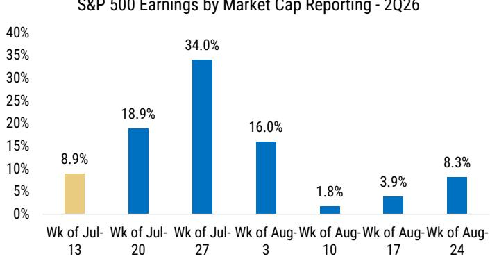  
Note: Includes 451 of S&P 500 companies and 95% of S&P market cap reporting from July 10 to Aug. 30  
Source: Bloomberg, MS

Exhibit 2: 2Q Reporting Season by Company Count  
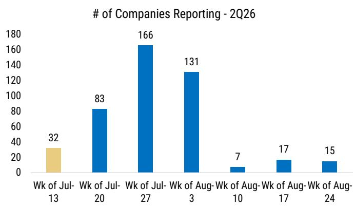  
Note: Includes 451 of S&P 500 companies and 95% of S&P market cap reporting from July 10 to Aug. 30  
Source: Bloomberg, MS

Exhibit 3: Forward SPS and EPS Expectations  
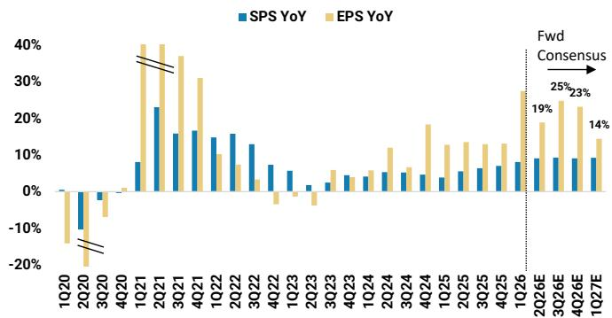  
Source: FactSet, MS

Exhibit 4: Operating Leverage is Set to Expand in 2026  
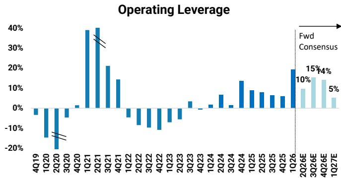  
Source: FactSet, MS

Exhibit 5: 2Q Estimates Push Higher into EPS Season  
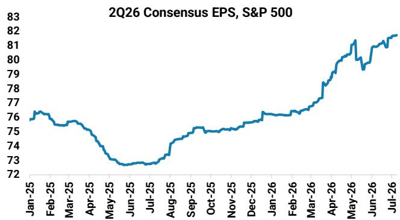  
Source: FactSet, MS

Exhibit 6: EPS Growth is Coming from Both Top-Line Growth and Margin Expansion  
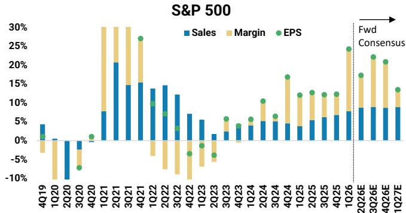  
Source: Refinitiv, MS

Exhibit 7: Blended Next 12M Earnings Rising Further  
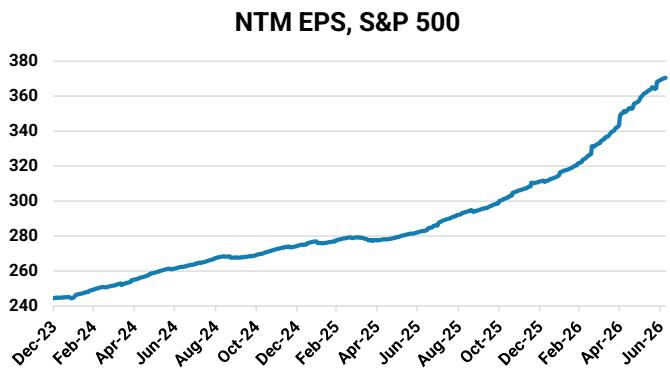  
Source: FactSet, MS

Exhibit 8: 2026/2027 EPS Estimates Continue to Revise Higher  
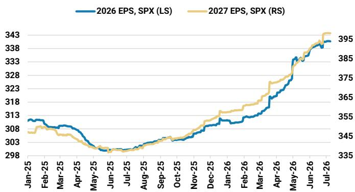  
Source: FactSet, MS

Exhibit 9: AI vs Non-AI Related Names within S&P 500  
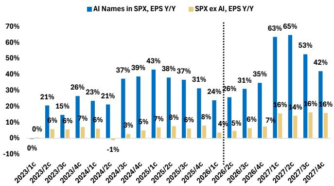  
Source: FactSet, MS

Exhibit 10: Mag 7 vs SP493 - SP493 Expecting up to 20% Earnings Growth Ahead but Mag 7 Stays Ahead (ex 1Q27 due to comps)  
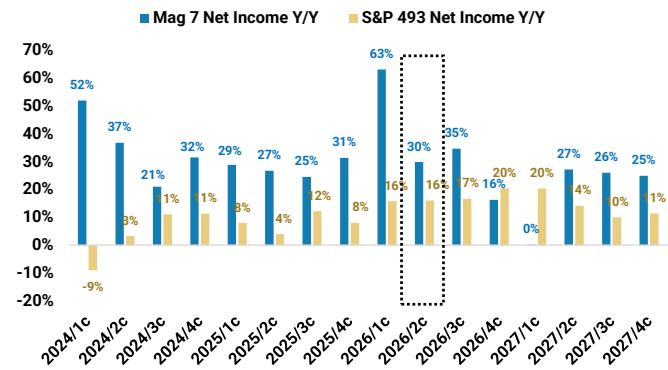  
Source: FactSet, MS

Exhibit 11: Mag 7 vs SP493 - Estimates are now equal in 2027  
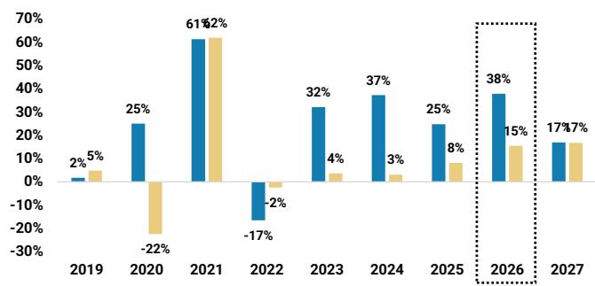  
Source: FactSet, MS

Exhibit 12: Contribution to S&P 500 Earnings Growth  
% of Net Income Growth  
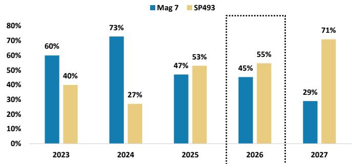  
Source: FactSet, MS

Exhibit 13: 2026 Net Income Revisions  
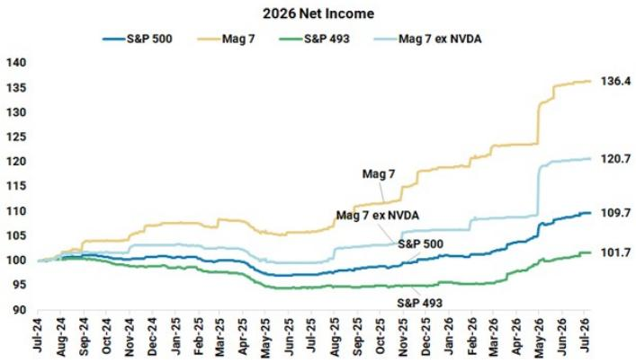  
Source: FactSet, MS

Exhibit 14: 2027 Net Income Revisions  
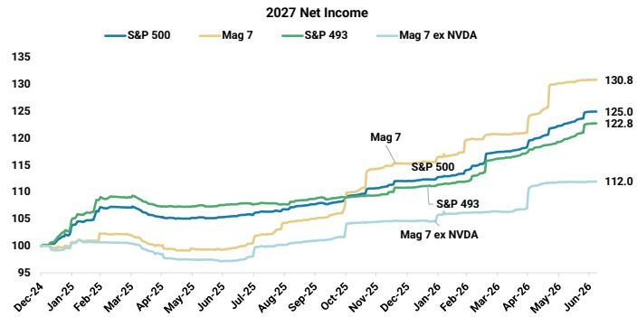  
Source: FactSet, MS

## Price Reaction (1Q 2026)

- 1Q saw +0.0% median T+1 price reactions on an absolute basis and -0.2% relative to the broad index.

- Staples, Discretionary, and Materials saw the strongest T+1 price reactions in 1Q26.

• Tech and Industrials saw negative T+1 price reactions in 1Q26.

Exhibit 15: 1Q Price Reaction by Sales/EPS Beats

1Q26 Earnings Season

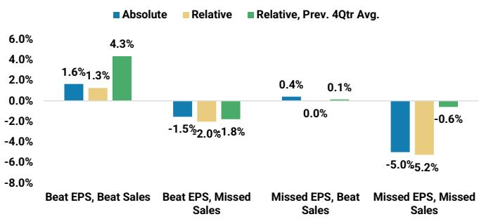  
Source: Factset, MS  
Exhibit 16: T+1 Price Reactions  
Median S&P 500 Stock Price Reaction T+1 Day Post Reporting Earnings

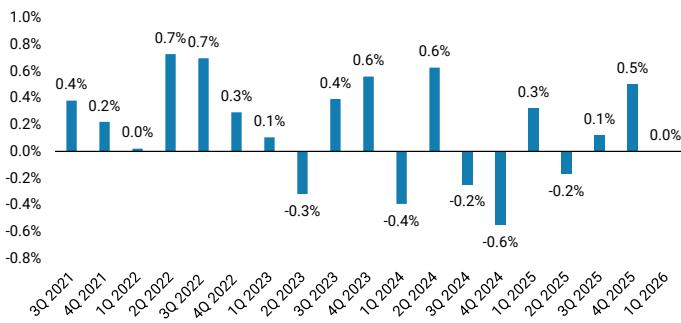  
Source: Factset, MS

Exhibit 17: T+1 Relative Price Reactions  
Median S&P 500 Stock Price Reaction T+1 Day Post Reporting Earnings, Relative Returns  
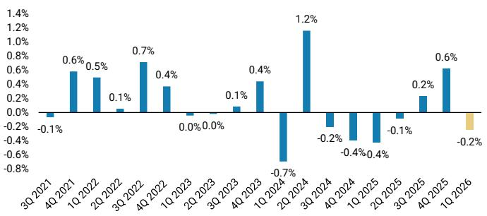  
Source: Factset, MS

Exhibit 18: Breadth of T+1 Price Reactions  
% S&P 500 Stocks With Positive Price Reactions T+1 Day Post Reporting Earnings  
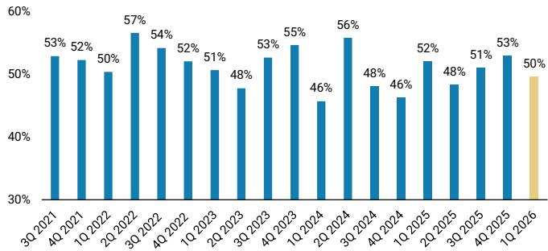  
Source: Factset, MS

## Surprise (1Q26)

• 1Q EPS surprise at 16.8%, strongly ahead of the historical average of 4.4%.

• 1Q Sales surprise at 1.9%, above the historical average of 1.3%.

Exhibit 19: Sales Surprise: Averages +1% Historically  
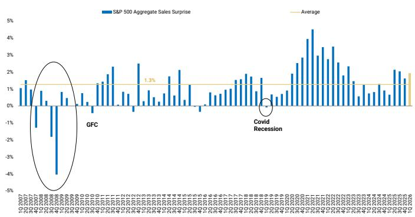  
Source: Factset, MS

Exhibit 20: EPS Surprise: Averages 4-5% Historically  
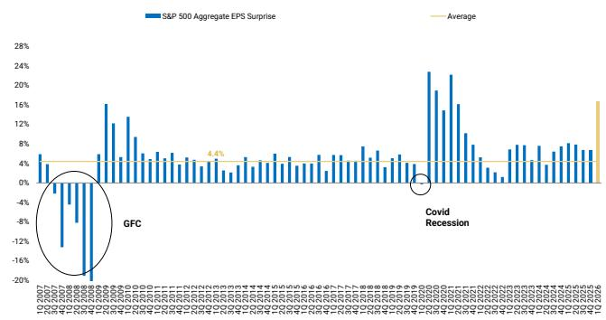  
Source: Factset, MS

Exhibit 21: Standard Deviation of T+1 Price Reactions  
Standard Deviation, T+1 Day Post Reporting Earnings  
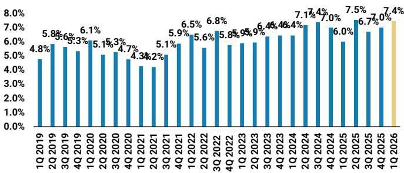  
Source: Factset, MS

Exhibit 22: Dispersion of T+1 Price Reactions  
Dispersion, T+1 Day Post Reporting Earnings (95th minus 5th Percentile)  
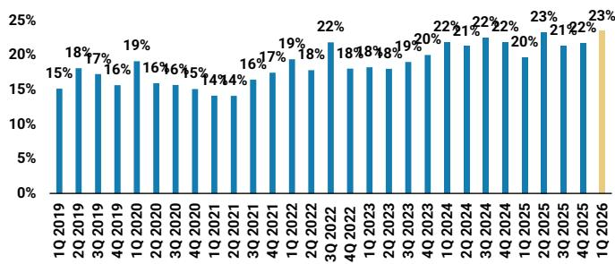  
Source: Factset, MS

## Company Guidance & Revisions

- S&P 500 earnings revisions breadth (FY2 estimates) is strong at +24% heading into Q2 earnings season with the recent consolidation typical in July.

- Our preferred cyclical trades- Transports and Discretionary- have seen relative strength in terms of EPS revisions breadth over the past two weeks.

- Energy, Materials, and Healthcare have seen the most negative ERB change over the past two weeks.

Exhibit 23: S&P 500 Earnings Revision Breadth  
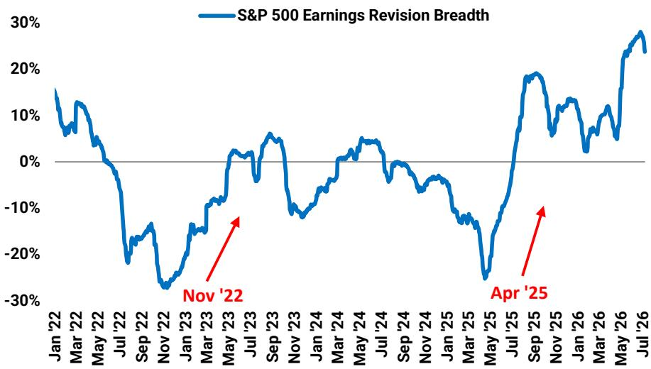  
Source: FactSet, MS

Exhibit 24: Change in Absolute Earnings Revisions Breadth by Sector & Industry Group

<table><tr><td rowspan="2"></td><td colspan="5">Earnings Revisions Breadth by Industry Group</td></tr><tr><td>2 Wk. Chg.</td><td>4 Wk. Chg.</td><td>8 Wk. Chg.</td><td>3 Mo. Chg.</td><td>6 Mo. Chg.</td></tr><tr><td>Autos</td><td>26%</td><td>31%</td><td>28%</td><td>44%</td><td>0%</td></tr><tr><td>Household &amp; Personal Products</td><td>13%</td><td>18%</td><td>21%</td><td>7%</td><td>5%</td></tr><tr><td>Transportation</td><td>5%</td><td>4%</td><td>9%</td><td>47%</td><td>39%</td></tr><tr><td>Retailing</td><td>3%</td><td>4%</td><td>18%</td><td>36%</td><td>15%</td></tr><tr><td>Staples</td><td>2%</td><td>7%</td><td>14%</td><td>24%</td><td>21%</td></tr><tr><td>Consumer Discretionary</td><td>1%</td><td>3%</td><td>12%</td><td>27%</td><td>16%</td></tr><tr><td>Consumer Services</td><td>1%</td><td>2%</td><td>4%</td><td>17%</td><td>5%</td></tr><tr><td>Diversified Financials</td><td>0%</td><td>2%</td><td>4%</td><td>21%</td><td>6%</td></tr><tr><td>Utilities</td><td>0%</td><td>0%</td><td>0%</td><td>-2%</td><td>0%</td></tr><tr><td>Food Beverage &amp; Tobacco</td><td>0%</td><td>9%</td><td>13%</td><td>38%</td><td>40%</td></tr><tr><td>Food &amp; Staples Retailing</td><td>-1%</td><td>-1%</td><td>10%</td><td>11%</td><td>-6%</td></tr><tr><td>Financials</td><td>-1%</td><td>1%</td><td>3%</td><td>13%</td><td>4%</td></tr><tr><td>Communication Services</td><td>-2%</td><td>-1%</td><td>-2%</td><td>-9%</td><td>8%</td></tr><tr><td>Media &amp; Ent</td><td>-2%</td><td>-2%</td><td>-2%</td><td>-4%</td><td>7%</td></tr><tr><td>Real Estate</td><td>-2%</td><td>-1%</td><td>0%</td><td>18%</td><td>30%</td></tr><tr><td>Software &amp; Services</td><td>-3%</td><td>3%</td><td>17%</td><td>46%</td><td>1%</td></tr><tr><td>Banks</td><td>-4%</td><td>2%</td><td>1%</td><td>12%</td><td>8%</td></tr><tr><td>Industrials</td><td>-4%</td><td>-5%</td><td>-3%</td><td>24%</td><td>30%</td></tr><tr><td>S&amp;P 500 Earnings Revisions Breadth</td><td>-4%</td><td>-3%</td><td>0%</td><td>15%</td><td>15%</td></tr><tr><td>Insurance</td><td>-4%</td><td>-1%</td><td>1%</td><td>-1%</td><td>-2%</td></tr><tr><td>Tech Hardware</td><td>-6%</td><td>-5%</td><td>7%</td><td>26%</td><td>31%</td></tr><tr><td>Commercial &amp; Professional Services</td><td>-6%</td><td>-5%</td><td>-4%</td><td>28%</td><td>23%</td></tr><tr><td>Consumer Durables</td><td>-6%</td><td>-6%</td><td>-1%</td><td>-11%</td><td>5%</td></tr><tr><td>Capital Goods</td><td>-6%</td><td>-7%</td><td>-6%</td><td>16%</td><td>29%</td></tr><tr><td>HC Equipment &amp; Services</td><td>-7%</td><td>-8%</td><td>-10%</td><td>-1%</td><td>2%</td></tr><tr><td>Tech</td><td>-8%</td><td>-2%</td><td>6%</td><td>15%</td><td>13%</td></tr><tr><td>Health Care</td><td>-8%</td><td>-10%</td><td>-10%</td><td>-1%</td><td>0%</td></tr><tr><td>Materials</td><td>-8%</td><td>-8%</td><td>-9%</td><td>17%</td><td>29%</td></tr><tr><td>Pharma, Biotech, &amp; Life Sciences</td><td>-9%</td><td>-12%</td><td>-9%</td><td>-2%</td><td>-3%</td></tr><tr><td>Semis</td><td>-13%</td><td>-4%</td><td>4%</td><td>16%</td><td>30%</td></tr><tr><td>Telecom</td><td>-15%</td><td>-15%</td><td>-22%</td><td>8%</td><td>41%</td></tr><tr><td>Energy</td><td>-23%</td><td>-25%</td><td>-24%</td><td>-22%</td><td>21%</td></tr></table>

Source: Factset, MS

Exhibit 25: Revisions to 2Q26, 2026, and 2027 Earnings Estimates

<table><tr><td></td><td colspan="3">YTD</td><td colspan="3">Since 5/31/2026</td></tr><tr><td>Sector, Industry Group</td><td>2Q26</td><td>2026</td><td>2027</td><td>2Q26</td><td>2026</td><td>2027</td></tr><tr><td>Communication Services</td><td>0.2%</td><td>12.3%</td><td>4.7%</td><td>-0.4%</td><td>-0.3%</td><td>-0.3%</td></tr><tr><td>Media &amp; Entertainment</td><td>-4.1%</td><td>10.9%</td><td>2.2%</td><td>-0.3%</td><td>-0.2%</td><td>-0.1%</td></tr><tr><td>Telecom</td><td>9.3%</td><td>8.2%</td><td>7.1%</td><td>0.0%</td><td>0.0%</td><td>-0.3%</td></tr><tr><td>Consumer Discretionary</td><td>-2.6%</td><td>3.9%</td><td>-0.3%</td><td>1.2%</td><td>0.0%</td><td>-0.2%</td></tr><tr><td>Autos</td><td>-5.4%</td><td>1.0%</td><td>-3.2%</td><td>2.1%</td><td>0.9%</td><td>0.6%</td></tr><tr><td>Consumer Durables</td><td>6.4%</td><td>-3.8%</td><td>-8.4%</td><td>18.9%</td><td>0.0%</td><td>-2.8%</td></tr><tr><td>Consumer Services</td><td>-6.7%</td><td>-2.8%</td><td>-1.0%</td><td>0.5%</td><td>-0.2%</td><td>-0.2%</td></tr><tr><td>Retailing</td><td>-1.4%</td><td>8.1%</td><td>1.7%</td><td>-0.4%</td><td>0.0%</td><td>0.1%</td></tr><tr><td>Energy</td><td>99.0%</td><td>54.6%</td><td>20.3%</td><td>1.7%</td><td>-1.7%</td><td>-1.0%</td></tr><tr><td>Financials</td><td>1.3%</td><td>2.1%</td><td>1.6%</td><td>2.0%</td><td>0.7%</td><td>0.3%</td></tr><tr><td>Banks</td><td>2.5%</td><td>4.0%</td><td>2.9%</td><td>2.1%</td><td>1.0%</td><td>0.3%</td></tr><tr><td>Diversified Financials</td><td>0.0%</td><td>0.6%</td><td>1.3%</td><td>1.0%</td><td>0.4%</td><td>0.5%</td></tr><tr><td>Insurance</td><td>2.8%</td><td>2.8%</td><td>-0.6%</td><td>4.6%</td><td>0.8%</td><td>-0.3%</td></tr><tr><td>Health Care</td><td>-15.9%</td><td>-5.7%</td><td>1.2%</td><td>0.0%</td><td>-0.1%</td><td>0.0%</td></tr><tr><td>HC Equipment &amp; Services</td><td>-0.7%</td><td>0.3%</td><td>-1.1%</td><td>0.0%</td><td>-0.1%</td><td>0.0%</td></tr><tr><td>Pharma, Biotech, &amp; Life Sciences</td><td>-25.1%</td><td>-9.2%</td><td>2.5%</td><td>0.0%</td><td>-0.1%</td><td>0.1%</td></tr><tr><td>Industrials</td><td>-4.9%</td><td>1.6%</td><td>1.7%</td><td>0.0%</td><td>-0.1%</td><td>-0.3%</td></tr><tr><td>Capital Goods</td><td>-1.9%</td><td>3.8%</td><td>1.8%</td><td>0.0%</td><td>-0.1%</td><td>0.1%</td></tr><tr><td>Commercial &amp; Professional Services</td><td>-1.9%</td><td>-1.0%</td><td>-0.4%</td><td>-0.1%</td><td>0.0%</td><td>0.0%</td></tr><tr><td>Transportation</td><td>-13.8%</td><td>-2.8%</td><td>3.3%</td><td>-0.1%</td><td>-0.1%</td><td>-1.6%</td></tr><tr><td>Materials</td><td>11.1%</td><td>14.9%</td><td>12.9%</td><td>0.3%</td><td>-0.3%</td><td>0.8%</td></tr><tr><td>Real Estate</td><td>0.2%</td><td>-0.3%</td><td>-0.5%</td><td>0.0%</td><td>-0.1%</td><td>-0.1%</td></tr><tr><td>Staples</td><td>-2.8%</td><td>-1.3%</td><td>-1.5%</td><td>-0.7%</td><td>-0.7%</td><td>-0.7%</td></tr><tr><td>Food &amp; Staples Retailing</td><td>-1.1%</td><td>0.1%</td><td>-0.2%</td><td>-0.4%</td><td>0.0%</td><td>-0.1%</td></tr><tr><td>Food Beverage &amp; Tobacco</td><td>-1.9%</td><td>-1.0%</td><td>-0.8%</td><td>-0.7%</td><td>-1.1%</td><td>-1.2%</td></tr><tr><td>Household &amp; Personal Products</td><td>-5.6%</td><td>-1.5%</td><td>-2.7%</td><td>-0.5%</td><td>-
