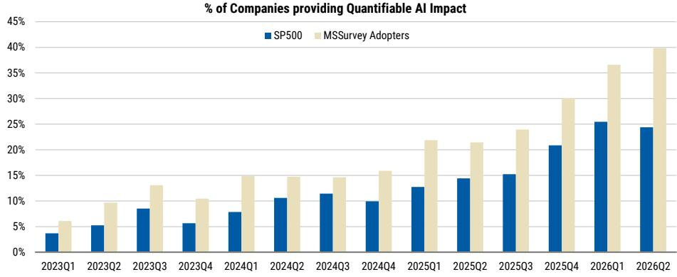
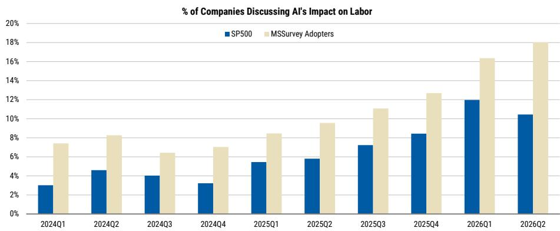

# MS：微观遇见宏观-二季度财报预览

这份MS在7月发布的二季度财报预览报告，核心判断并不复杂：市场领导权的扩散仍在继续，且这次有盈利数据支撑。报告发布时，等权标普500自5月中旬以来已经跑赢了市值加权指数，背后的驱动力是标普1500中位数公司正在实现两位数的每股盈利增长——这是后疫情复苏以来较强的水平。

报告认为，当前市场正在从少数AI龙头的集中交易，转向更广泛的盈利驱动行情。这不是一个风格切换的预言，而是基于财报修正广度、行业调研和AI采用率数据得出的判断。

## 1. 盈利修正广度在季节性回落中仍保持历史高位

每年7月，财报修正广度通常会季节性走弱，今年也不例外。但MS数据显示，标普500的盈利修正广度仍处于+24%的水平。在历史框架中，这属于非常强劲的位置。

报告特别指出，他们偏好的周期性板块——可选消费和交通运输——在修正广度上继续表现出相对优势。这意味着，市场对盈利的定价正在从防御性板块和AI龙头向外扩散，而非仅仅依赖少数公司的超预期表现。

> **KC评论：** 盈利修正广度衡量的是上调盈利预期的公司数量减去下调的数量。+24%意味着上调的公司比下调的多出近四分之一。在7月这个通常修正偏弱的月份，这个数字说明企业盈利的基本面比市场情绪所反映的要扎实。

## 2. AI采用率正在加速，但受益者不再只是半导体

报告中最具信息量的数据来自MS分析师对“AI采用者”的跟踪。在2026年二季度，40%被分析师认定为“采用者”的公司报告了至少一项可量化的AI影响，高于一季度的37%和去年同期的21%。在整个标普500中，大约25%的公司报告了至少一项可衡量的AI收益，而一年前这个比例只有14%。

这些数据支撑了MS的扩散论：AI正在从基础设施层向更广泛的行业渗透。报告在行业调研中进一步指出，网络安全支出预计将随着AI代理的广泛部署而变得更加重要；软件预算正在小幅上升，约四分之一的AI预算来自正式IT预算之外；网络研究正从训练转向推理。

AI采用率的上升不再只是半导体公司的故事，而是正在改变软件、网络安全、商业服务等多个行业的支出结构和竞争格局。

## 3. 消费端比头条数据更健康，但分化依然存在

报告在消费板块的调研中提供了一个值得注意的观察：外出就餐持续从杂货店抢走消费者的增量支出，这暗示消费者比头条数据所显示的更健康。汽油价格下降预计将在下半年提供额外支撑。

但分化同样明显。高端消费依然坚挺，而低端消费者仍面临不确定性。在软线品牌领域，6月需求环比走弱，但报告认为这不代表整体消费出现变化，因为一季度受益于一次性因素。库存处于平衡状态，定价仍具通胀性——主要通过产品组合而非直接提价。

对于关注消费板块的读者来说，这份报告提供的框架是：不要用总量数据判断消费健康度，而要关注支出结构的迁移——从商品到服务、从低端到高端、从线下到体验。

## 4. 工业周期正在从数据中心向外扩散

工业板块的调研显示，资本支出正在从数据中心向资本品等更广泛的领域扩散。生产和短周期活动在一季度恢复正增长，并在二季度保持良好势头。报告特别提到，回流趋势表明美国工业宏观环境可能正在进入一个持续增长周期，因为国际生产成本变得比国内更昂贵。

关键辩论在于真实终端需求与渠道补库之间的比例。报告认为答案介于两者之间。但一个明确的信号是：数据中心资本支出相关的设备订单排期非常远，定价前景乐观。报告给出的行业排序是：工业优于消费，美国优于国际。

对于关注制造业和资本品的研究者来说，这份报告提供了一个可复用的观察框架：区分真实需求与渠道库存，关注资本支出扩散的节奏，以及回流趋势是否可持续。

## 5. 资金板块的广度信号值得关注

银行板块的贷款需求异常强劲且广泛，同比增长约7.5%，高于去年的4%。商业和工业贷款以及中端市场贷款（包括资本支出和营运资金贷款）是主要驱动力。但报告也指出，存款成本上升和远期定价的加息预期将在2026年下半年和2027年增加不确定性，导致适度的每股盈利预期下调。

资本市场活动的广度对银行来说是一个重要信号，因为大型交易的费率通常较小，而中型交易的费率较大。二季度宣布的并购交易同比增长64%，股权资本市场交易量同比增长107%，债务资本市场交易量同比增长19%。这些数据表明，资金板块的盈利驱动力正在从净息差转向费用收入，而费用收入的增长更具可持续性。

MS这份报告的核心价值不在于预测二季度财报的具体数字，而在于提供了一个观察框架：盈利扩散正在发生，AI采用正在加速，消费和工业周期正在分化，资金板块的驱动力正在切换。对于市场参与者来说，关键问题不是“AI是否还有空间”，而是“AI之外的盈利增长是否足够支撑更广泛的市场表现”。

For informational purposes only. Portions may be generated,translated,summarized,or edited with AI assistance based on source materials and may contain omissions or errors. Please verify independently. This is not investment,legal,tax,accounting,or other professional advice.

For informational purposes only. Portions may be generated,translated,summarized,or edited with AI assistance based on source materials and may contain omissions or errors. Please verify independently. This is not investment,legal,tax,accounting,or other professional advice.

