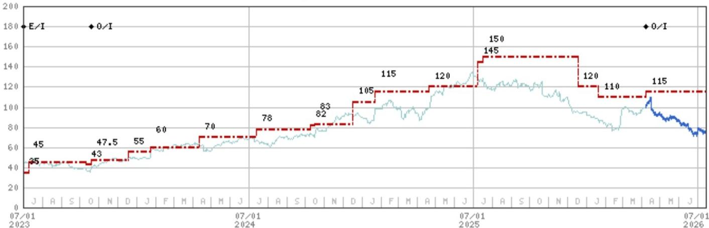
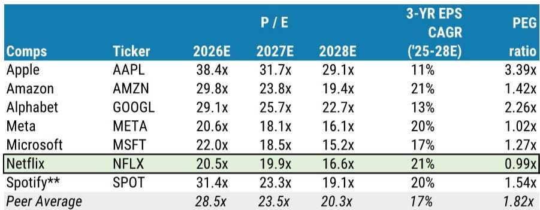
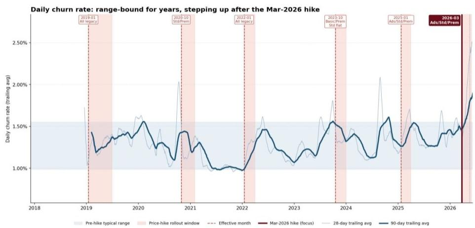

# MS：Netflix，我们看过这部电影——重申超配

报价从127美元跌至74美元，市盈率跌破20倍，读者对Netflix的担忧清单越拉越长：用户参与度增速节奏变化至个位数、涨价后流失率高于往常、内容缺乏吸引人的、AI冲击叙事不明。MS在最新报告中承认这些担忧“普遍被理解，部分被夸大”，但真正值得注意的判断是——他们用2022年的剧本作为参照系。当时Netflix用户首次出现负增长，报价跌至14-15倍市盈率后触底，随后靠打击密码共享和广告层驱动了一轮修复。报告认为，如果参与度继续出现变化，15倍左右仍是合理的底部参考。

这份报告的核心不是预测短期财报数字，而是在市场情绪最差的时候，重新拆解Netflix的定价权、内容策略和未被定价的期权。

## 1. 参与度焦虑被高估，真正该盯的是定价权

读者对Netflix的参与度增速从双位数降至低个位数感到不安。报告认为，这背后有三个结构性原因：基数效应（年播放量接近2000亿小时）、国际用户结构变化（日本用户看电视时间比美国少约60%）、以及短视频平台的竞争。但作为付费订阅服务，用户每月用钱包投票，而非用分钟数投票。参与度与营收增长之间的相关性，远没有市场想象的那么强。

报告引用的用户调研显示，Netflix的净留存得分在所有流媒体中最高（+18），用户认为当前约20美元/月的无广告套餐“物超所值”，直到价格超过30美元/月才会开始犹豫。这才是定价权的真实刻度。

> **KC评论：** 参与度焦虑的本质是读者用广告模式的逻辑去衡量订阅模式。Netflix不需要用户每天看三小时，只需要用户觉得每月20美元值得续费。调研数据表明，这个心理价位还有相当大的空间。

## 2. 2022年的底部剧本，提供了估值锚点

报告直接给出了一个历史类比：2022年夏天，Netflix用户连续两个季度负增长，报价跌至14-15倍远期市盈率后触底。当时驱动修复的是两个杠杆——打击密码共享（估计约1亿户未付费家庭）和推出广告层。今天，报告认为类似的修复路径仍然存在：2027年计划新增15个广告层市场（目前12个），以及新格式/合作带来的增量收入。

基于当前情绪和可比公司估值下移，报告将目标市盈率从30倍下调至22倍，与同业均值持平（此前为溢价）。这相当于承认，市场短期内不会给Netflix增长溢价，但22倍对于一家仍能实现20%以上EPS复合增长的公司来说，已经不算贵。

## 3. 未被定价的期权：短内容、直播和第三方捆绑

报告提到了几个市场尚未充分定价的方向。Netflix正在测试短内容（2-3分钟到20分钟以上），与出版商合作以更好竞争Instagram和TikTok。虽然这看起来有些防御性，但报告认为“测试和迭代新格式”比什么都不做要好。更值得关注的是，Netflix可能通过主应用捆绑销售其他流媒体服务（如Peacock），类似亚马逊和苹果的做法。报告估算，如果Netflix能捕获美国非Netflix流媒体支出的20%，可带来约10-12亿美元增量收入和约10美分EPS（2027-2028年）。

此外，AI带来的成本节省（报告估算约20-40%的潜在节省空间）也未被市场定价。这些期权虽然短期难以量化，但在估值压缩到22倍时，它们的价值不应被忽略。

## 4. 短期催化剂路径确实崎岖，但并非没有亮点

报告对二季度和三季度的预期偏保守：二季度营收约125亿美元（同比增约12%），三季度约130亿美元，全年营收指引507-517亿美元。但报告也指出，下半年直播体育赛事（MLB本垒打大赛、NFL圣诞比赛）和原创内容（《外滩探秘》第五季、《绅士们》第二季）可能带来参与度改善。同时，更积极的回购节奏（目前模型假设每季度约20亿美元）也可能缓解市场对资本配置的担忧。

> **KC评论：** 短期催化剂路径崎岖是事实，但报告的核心逻辑是：当市场把所有坏消息都定价进去之后，那些未被定价的期权——广告层扩张、新格式、AI成本节省——反而成为潜在的超额回报来源。2022年的剧本能否重演，取决于Netflix能否在参与度增速节奏变化的情况下，依然证明其定价权和盈利能力的韧性。

---

For informational purposes only. Portions may be generated,translated,summarized,or edited with AI assistance based on source materials and may contain omissions or errors. Please verify independently. This is not investment,legal,tax,accounting,or other professional advice.

For informational purposes only. Portions may be generated,translated,summarized,or edited with AI assistance based on source materials and may contain omissions or errors. Please verify independently. This is not investment,legal,tax,accounting,or other professional advice.

