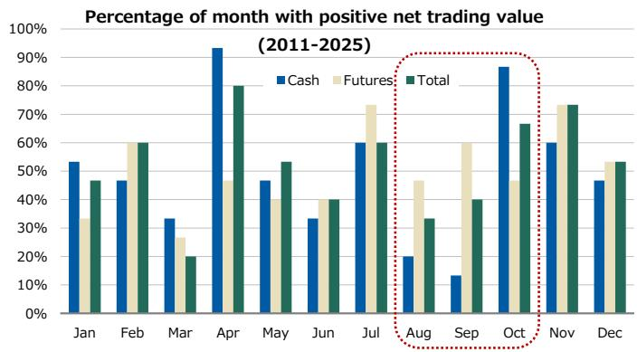
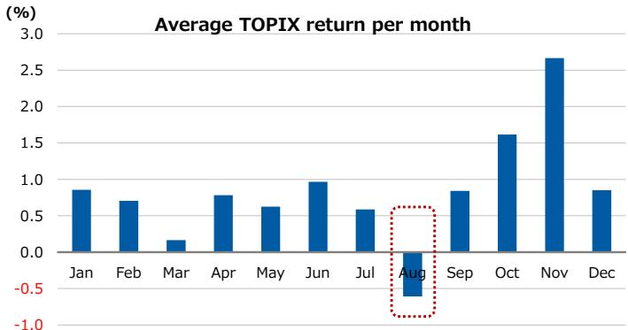
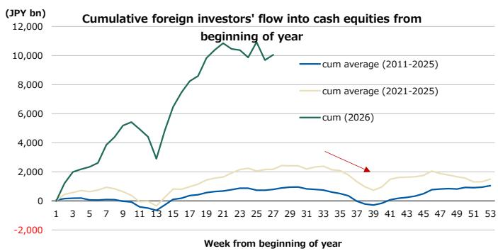
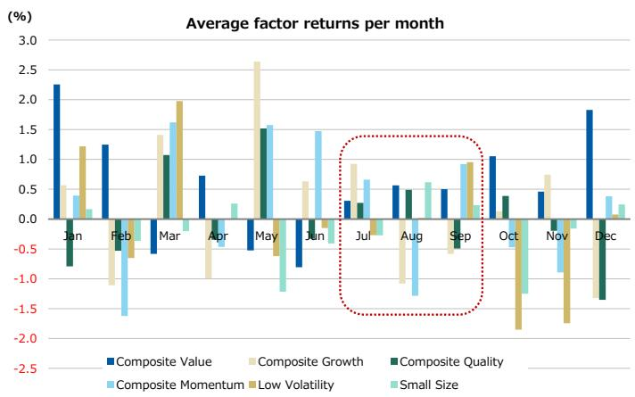
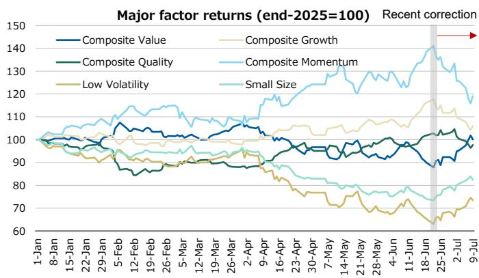
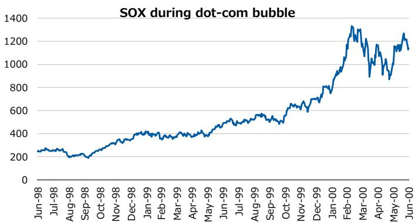
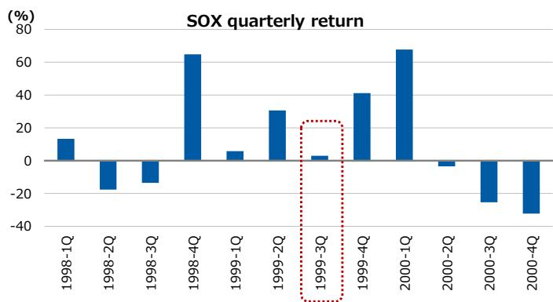
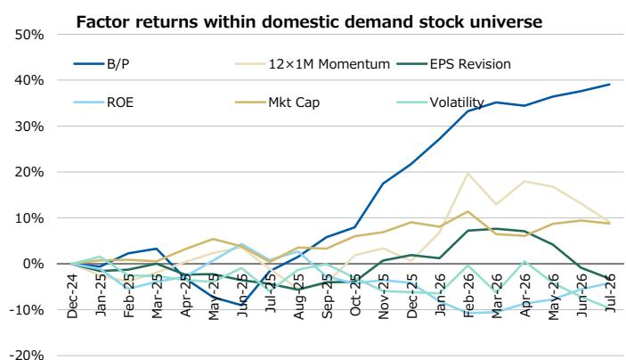
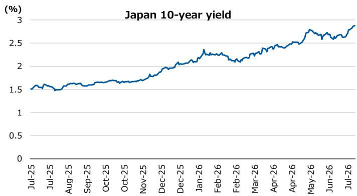

# 日本市场观察 | 日本

## 关于AI相关领域近期波动的思考

我们认为中期来看，AI相关领域的积极趋势尚未结束。不过，近期外资流入节奏的变化以及夏季持仓调整，可能使得短期内的反向波动持续存在。在此背景下，我们倾向于关注内需价值型方向。

### 核心要点

6月下旬以来的调整，可能反映了季节性因素与持仓调整的共同作用。

■ 2026年上半年，外资净买入日本现货股票约10万亿日元，因此后续的调整幅度值得关注。

我们认为AI相关领域的积极趋势尚未结束，但需留意短期动量可能出现的转变。

从战术角度看，我们更关注内需价值型方向，这类标的通常对利率变化有相对较好的韧性。

## MS MUFG SECURITIES CO., LTD.+

Ukyo Haraguchi, CFA
量化策略师
Ukyo.Haraguchi@morganstanleymufg.com

## MS & CO. INTERNATIONAL PLC+

Ronald Ho, CFA
量化分析师
Ronald.Ho@morganstanley.com +44 20 7425-2722

Stephan Heller
量化分析师
Stephan.Heller@morganstanley.com +44 20 7425-9753

## MS INDIA COMPANY PRIVATE LIMITED+

Rakhi Arora
量化分析师
Rakhi.Arora@morganstanley.com +91 22 6996-2259

## MS & CO. INTERNATIONAL PLC+

Stephan M Kessler
量化分析师
Stephan.Kessler@morganstanley.com +44 20 7425-2854

## MS MUFG SECURITIES CO., LTD.+

<table><tr><td colspan="2">Sho Nakazawa</td></tr><tr><td colspan="2">股票策略师</td></tr><tr><td>Sho.Nakazawa@morganstanleymufg.com</td><td>+81 3 6836-8926</td></tr></table>

  
日本夏季研究 2026

分析师认证及其他重要披露信息，请参阅本报告末尾的披露部分。

+= 非美国关联公司雇用的分析师未在FINRA注册，可能不是该会员的关联人士，且可能不受FINRA关于与标的公司沟通、公开露面以及交易研究分析师账户所持证券的限制。

## AI相关领域的短期夏季波动

AI相关领域自6月下旬以来出现调整。我们认为，近期的调整反映了外资大量买入后的技术性回调、6月动量收益的消化，以及夏季资金流动的季节性规律。虽然调整压力在短期内可能持续，但我们认为AI相关领域的积极趋势本身并未结束（参见2026年7月6日发布的《探索AI相关领域趋势的转折点》）。

7月至9月间最显著的季节性因素是外资流动。外资现货股票资金流动呈现明显的季节性特征，通常在8月和9月出现净流出，随后在10月转为净流入（图表1和图表2）。与此模式一致，市场指数在8月也往往表现相对平淡（图表3）。

从周度数据更细致地观察外资现货股票资金流动，历史上资金流出往往发生在8月下旬至9月底（图表4），这一时段大约持续六周。

图表1：外资月度平均净交易量（按读者类型）：8月和9月通常为现货股票净卖出，10月为净买入  

图表2：外资月度净买入为正的月份占比（按读者类型）  
  
来源：JPX, QUICK Workstation, MS；注：2011年至2025年。  
来源：JPX, QUICK Workstation, MS；注：2011年至2025年。

图表3：TOPIX月度平均回报：8月通常表现平淡  
  
来源：QUICK Workstation, MS；注：2011年至2025年。

图表4：按读者类型：外资年初至今累计现货股票资金流动  
  
来源：JPX, QUICK Workstation, MS

今年，在经历了一轮历史性的上涨之后，可以合理推测读者加快了获利了结和持仓调整的步伐。2026年上半年，外资净买入日本现货股票约10万亿日元（图表4），由此引发的回调幅度可能不容忽视。

从因子角度看，7月至9月通常没有明显的季节性规律（图表5。8月综合动量看似偏弱，但部分原因是少数极端值的影响）。然而，目前外资对AI及半导体相关标的的持仓似乎较高，从因子角度看，集中在动量、成长、大盘和高波动性上。因此，任何外资的持仓调整都可能引发这些因子的反转（图表6）。

图表5：主要因子月度平均回报  
  
来源：FactSet, MS；注：2011年至2025年。

图表6：2026年以来主要因子累计回报  
  
来源：FactSet, MS

尽管如此，我们认为这只是由季节性和持仓调整驱动的暂时性波动。即使在互联网泡沫时期，科技相关标的的上涨也并非一帆风顺。虽然机械地套用那段时期的经验并不恰当，但值得注意的是，在1999年7月至9月期间，尽管整体泡沫驱动上涨，相关表现也曾出现停滞（图表8）。因此，我们预计AI相关领域的趋势在短期波动后将重新显现。从时间点来看，考虑到今年外资的持仓调整似乎比往年更早，我们预计可能在9月初附近。

图表7：互联网泡沫时期的SOX指数  
  
来源：Bloomberg, MS

图表8：互联网泡沫时期SOX季度回报：1999年7月至9月出现间歇  
  
来源：Bloomberg, MS

因此，我们认为读者未必需要完全调整其在AI和半导体相关标的中期持仓。从因子角度看，我们维持对修正因子的中期积极看法。同时，作为应对夏季外资流入减弱和动量反转的战术性配置，我们更关注内需价值型方向。与包含外需导向型标的的更广泛市场不同，价值因子在2026年全年在内需标的中持续发挥作用（图表9）。此外，近期利率的上升（图表10）对短久期价值型标的相对有利。

以下图表11列出了部分看起来估值偏低且获得增持或中性评级的内需相关标的。

图表9：内需标的中关键因子的回报  
  
注：标的范围包括我们覆盖范围内国内销售占比至少90%的公司（不含金融业）。对于每个因子，累计回报代表做多第五分位（最高因子值）并做空第一分位（最低因子值）的多空组合的表现。  
来源：FactSet, QUICK Workstation, MS

图表10：日本10年期政府债券回报表现  
  
来源：Bloomberg, MS

图表11：作为潜在战术关注方向的价值型内需标的

<table><tr><td>代码</td><td>名称</td><td>东证17个行业</td><td>股价（日元，7/09）</td><td>市值（百万日元，7/09）</td><td>远期市盈率（倍）</td><td>市净率（倍）</td><td>评级</td></tr><tr><td>1662</td><td>JAPAN PETROLEUM EXPLORATION</td><td>能源资源</td><td>1,684</td><td>432,789</td><td>7.2</td><td>0.69</td><td>中性</td></tr><tr><td>1820</td><td>NISHIMATSU CONSTRUCTION</td><td>建筑与材料</td><td>5,404</td><td>225,841</td><td>10.4</td><td>1.09</td><td>中性</td></tr><tr><td>3231</td><td>NOM REAL ESTATE HOLDINGS</td><td>房地产</td><td>937</td><td>859,738</td><td>9.3</td><td>1.00</td><td>中性</td></tr><tr><td>3289</td><td>TOKYU FUDOSAN HOLDINGS</td><td>房地产</td><td>1,307</td><td>940,819</td><td>9.3</td><td>1.04</td><td>中性</td></tr><tr><td>3391</td><td>TSURUHA HOLDINGS</td><td>零售</td><td>2,361</td><td>1,072,530</td><td>25.8</td><td>1.22</td><td>中性</td></tr><tr><td>4540</td><td>TSUMURA</td><td>制药</td><td>3,800</td><td>291,682</td><td>10.8</td><td>0.88</td><td>中性</td></tr><tr><td>4553</td><td>TOWA PHARMACEUTICAL</td><td>制药</td><td>3,990</td><td>205,549</td><td>9.1</td><td>1.10</td><td>增持</td></tr><tr><td>4689</td><td>LY</td><td>IT服务及其他</td><td>447</td><td>3,074,668</td><td>14.6</td><td>1.02</td><td>增持</td></tr><tr><td>6750</td><td>ELECOM</td><td>电子与精密</td><td>1,807</td><td>166,644</td><td>12.8</td><td>1.35</td><td>增持</td></tr><tr><td>8218</td><td>KOMERI</td><td>零售</td><td>3,490</td><td>187,794</td><td>10.9</td><td>0.64</td><td>增持</td></tr><tr><td>8219</td><td>AOYAMA TRADING</td><td>零售</td><td>719</td><td>108,700</td><td>13.4</td><td>0.58</td><td>中性</td></tr><tr><td>8804</td><td>TOKYO TATEMONO</td><td>房地产</td><td>3,360</td><td>698,808</td><td>11.1</td><td>1.18</td><td>中性</td></tr><tr><td>9005</td><td>TOKYU</td><td>运输与物流</td><td>1,712</td><td>1,069,777</td><td>10.8</td><td>1.06</td><td>增持</td></tr><tr><td>9006</td><td>KEIKYU</td><td>运输与物流</td><td>1,545</td><td>425,912</td><td>13.7</td><td>1.06</td><td>中性</td></tr><tr><td>9009</td><td>KEISEI ELECTRIC RAILWAY</td><td>运输与物流</td><td>1,233</td><td>637,749</td><td>15.1</td><td>1.07</td><td>中性</td></tr><tr><td>9021</td><td>WEST JAPAN RAILWAY</td><td>运输与物流</td><td>2,906</td><td>1,323,861</td><td>13.2</td><td>1.10</td><td>中性</td></tr><tr><td>9023</td><td>TOKYO METRO</td><td>运输与物流</td><td>1,451</td><td>843,031</td><td>17.2</td><td>1.15</td><td>中性</td></tr><tr><td>9075</td><td>FUKUYAMA TRANSPORTING</td><td>运输与物流</td><td>5,610</td><td>219,879</td><td>11.6</td><td>0.70</td><td>中性</td></tr><tr><td>9076</td><td>SEINO HOLDINGS</td><td>运输与物流</td><td>2,702</td><td>507,111</td><td>16.0</td><td>0.99</td><td>中性</td></tr><tr><td>9142</td><td>KYUSHU RAILWAY</td><td>运输与物流</td><td>3,578</td><td>553,334</td><td>10.7</td><td>1.11</td><td>增持</td></tr><tr><td>9504</td><td>CHUGOKU ELECTRIC POWER</td><td>电力/燃气</td><td>929</td><td>359,667</td><td>10.8</td><td>0.43</td><td>增持</td></tr><tr><td>9505</td><td>HOKURIKU ELECTRIC POWER</td><td>电力/燃气</td><td>913</td><td>192,098</td><td>7.6</td><td>0.42</td><td>中性</td></tr></table>

来源：QUICK Workstation, MS  
注：国内销售占比90%以上的标的（不含金融业）。筛选自市净率最低的20%，且获得MS增持或中性评级的标的。

## 披露部分

MS中的信息和观点由MS MUFG Securities Co., Ltd.及其关联公司（统称“MS”）编制。

有关重要披露、股价图表以及本报告所涉及公司的股权评级历史，请访问MS披露网站 www.morganstanley.com/eqr/disclosures/webapp/generalresearch，或联系您的投资代表或MS，地址：1585 Broadway, (Attention: Research Management), New York, NY, 10036 USA。

有关本研究报告中所提及的任何推荐、评级或目标价相关的估值方法和风险，请联系客户支持团队：美国/加拿大 +1 800 303-2495；香港 +852 2848-5999；拉丁美洲 +1 718 754-5444（美国）；伦敦 +44 (0)20-7425-8169；新加坡 +65 6834-6860；悉尼 +61 (0)2-9770-1505；东京 +81 (0)3-6836-9000。或者，您也可以联系您的投资代表或MS，地址：1585 Broadway, (Attention: Research Management), New York, NY 10036 USA。

## 分析师认证

以下分析师特此证明，他们对本报告中所讨论的公司及其证券的观点准确表达，并且他们未曾且不会因表达具体的推荐或观点而直接或间接获得补偿：Rakhi Arora; Ukyo Haraguchi, CFA; Stephan Heller; Ronald Ho, CFA; Stephan M Kessler; Sho Nakazawa。

## 全球研究冲突管理政策

MS已根据我们的冲突管理政策发布，该政策可在 www.morganstanley.com/institutional/research/conflictpolicies 查阅。该政策的葡萄牙语版本可在 www.morganstanley.com.br 找到。

## 关于标的公司的重要监管披露

截至2026年6月30日，MS实益持有MS所涵盖的以下公司普通股权益证券类别1%或以上：Aoyama Trading, Hokuriku Electric Power, Japan Petroleum Exploration, Keisei Electric Railway, Kyushu Railway, Nishimatsu Construction, NOM Real Estate Holdings, Seino Holdings, Tokyo Tatemono, Tokyu, Tokyu Fudosan Holdings, West Japan Railway。

在过去12个月内，MS管理或共同管理了Chugoku Electric Power, Hokuriku Electric Power, Keikyu, Kyushu Railway, LY Corporation, Tokyo Metro, Tokyu, Tokyu Fudosan Holdings, West Japan Railway的公开（或144A）发行。

在过去12个月内，MS已从Aoyama Trading, Chugoku Electric Power, Hokuriku Electric Power, Kyushu Railway, LY Corporation, NOM Real Estate Holdings, Tokyo Metro, Tokyu, Tokyu Fudosan Holdings, West Japan Railway获得投资银行服务报酬。

在未来3个月内，MS预计将或打算从Aoyama Trading, Chugoku Electric Power, Elecom, Fukuyama Transporting, Hokuriku Electric Power, Japan Petroleum Exploration, Keikyu, Keisei Electric Railway, Komeri, Kyushu Railway, LY Corporation, Nishimatsu Construction, NOM Real Estate Holdings, Seino Holdings, Tokyo Metro, Tokyo Tatemono, Tokyu, Tokyu Fudosan Holdings, Towa Pharmaceutical, Tsumura, Tsuruha Holdings, West Japan Railway寻求投资银行服务报酬。

在过去12个月内，MS已从Chugoku Electric Power, Hokuriku Electric Power, LY Corporation, NOM Real Estate Holdings获得投资银行服务以外的产品和服务报酬。

在过去12个月内，MS已向或正在向以下公司提供投资银行服务，或与以下公司存在投资银行客户关系：Chugoku Electric Power, Elecom, Fukuyama Transporting, Hokuriku Electric Power, Keikyu, Keisei Electric Railway, Kyushu Railway, LY Corporation, Nishimatsu Construction, NOM Real Estate Holdings, Tokyo Metro, Tokyo Tatemono, Tokyu, Tokyu Fudosan Holdings, West Japan Railway。

在过去12个月内，MS已向或正在向以下公司提供非投资银行、证券相关服务，和/或过去曾达成协议提供服务，或与以下公司存在客户关系：Chugoku Electric Power, Hokuriku Electric Power, LY Corporation, NOM Real Estate Holdings。

主要负责编制MS的股权研究分析师或策略师的薪酬基于多种因素，包括研究质量、读者客户反馈、选股表现、竞争因素、公司收入以及整体投资银行收入。股权研究分析师或策略师的薪酬不与MS执行的投资银行或资本市场交易，或特定交易台的盈利能力或收入挂钩。

MS及其关联公司从事与MS所涵盖的公司/工具有关的业务，包括做市、提供流动性、基金管理、商业银行、信贷展期、投资服务和投资银行。MS以主承销商身份向客户出售和购买MS所涵盖公司的证券/工具。MS可能持有本报告讨论的公司或工具的债务头寸。MS作为主承销商交易或可能交易作为债务研究报告主题的债务证券（或相关衍生品）。

上述某些披露也旨在遵守非美国司法管辖区的适用法规。

## 股票评级

MS使用相对评级体系，采用“增持”、“中性”、“未评级”或“减持”等术语（定义见下文）。MS不对我们覆盖的股票分配“买入”、“持有”或“卖出”评级。“增持”、“中性”、“未评级”和“减持”不等同于买入、持有和卖出。读者应仔细阅读MS中使用的所有评级的定义。此外，由于MS包含分析师观点的更完整信息，读者应仔细阅读MS全文，而不仅仅从评级推断内容。在任何情况下，评级（或研究）不应被用作或依赖为研究交流。读者买卖股票的决定应取决于个人情况（例如读者现有持仓）和其他考虑因素。

## 全球股票评级分布

## （截至2026年6月30日）

下文描述的股票评级适用于MS的基础股权研究，不适用于公司生产的债务研究。

仅为披露目的（根据FINRA要求），我们在“增持”、“中性”、“未评级”和“减持”评级旁边包含了“买入”、“持有”和“卖出”的类别标题。MS不对我们覆盖的股票分配“买入”、“持有”或“卖出”评级。“增持”、“中性”、“未评级”和“减持”不等同于买入、持有和卖出，而是代表建议的相对权重（见下文定义）。为满足监管要求，我们将“增持”（我们最积极的股票评级）对应为买入建议；将“中性”和“未评级”对应为持有建议，将“减持”对应为卖出建议。

<table><tr><td></td><td colspan="2">覆盖范围</td><td colspan="3">投资银行客户（IBC）</td><td colspan="2">其他重要投资服务客户（MISC）</td></tr><tr><td>股票评级类别</td><td>数量</td><td>占总计百分比</td><td>数量</td><td>占IBC总计百分比</td><td>占评级类别百分比</td><td>数量</td><td>占其他MISC总计百分比</td></tr><tr><td>增持/买入</td><td>1544</td><td>42%</td><td>453</td><td>49%</td><td>29%</td><td>757</td><td>44%</td></tr><tr><td>中性/持有</td><td>1577</td><td>43%</td><td>390</td><td>42%</td><td>25%</td><td>769</td><td>44%</td></tr><tr><td>未评级/持有</td><td>3</td><td>0%</td><td>1</td><td>0%</td><td>33%</td><td>1</td><td>0%</td></tr><tr><td>减持/卖出</td><td>544</td><td>15%</td><td>89</td><td>10%</td><td>16%</td><td>204</td><td>12%</td></tr><tr><td>总计</td><td>3,668</td><td></td><td>933</td><td></td><td></td><td>1731</td><td></td></tr></table>

数据包括当前已分配评级的普通股和ADR。投资银行客户是MS在过去12个月内收到投资银行报酬的公司。由于四舍五入，“占总计百分比”列中的百分比可能无法精确加总至100%。

## 分析师股票评级

增持（O）。预计该股票的总回报将在风险调整基础上，在未来12-18个月内超过分析师行业（或行业团队）覆盖范围的平均总回报。

中性（E）。预计该股票的总回报将在风险调整基础上，在未来12-18个月内与分析师行业（或行业团队）覆盖范围的平均总回报保持一致。

未评级（NR）。目前分析师对该股票的总回报相对于分析师行业（或行业团队）覆盖范围的平均总回报，在风险调整基础上，没有足够的信心。

减持（U）。预计该股票的总回报将在风险调整基础上，在未来12-18个月内低于分析师行业（或行业团队）覆盖范围的平均总回报。

除非另有说明，MS中包含的目标价时间范围为12至18个月。

## 分析师行业观点

有吸引力（A）：分析师预计其行业覆盖范围在未来12-18个月内的表现相对于相关广泛市场基准具有吸引力，如下所示。

中性（I）：分析师预计其行业覆盖范围在未来12-18个月内的表现与相关广泛市场基准保持一致，如下所示。谨慎（C）：分析师对其行业覆盖范围在未来12-18个月内的表现相对于相关广泛市场基准持谨慎态度，如下所示。各区域基准如下：北美 - S&P 500；拉丁美洲 - 相关MSCI国家指数或MSCI拉丁美洲指数；欧洲 - MSCI欧洲；日本 - TOPIX；亚洲 - 相关MSCI国家指数或MSCI次区域指数或MSCI AC亚太（除日本）指数。

## 对MS Smith Barney LLC客户的重要披露

关于任何可能合理预期会影响MS Smith Barney LLC选择第三方研究提供商或第三方研究报告标的公司的重大利益冲突的重要披露，可在MS财富管理披露网站 www.morganstanley.com/online/researchdisclosures 上获取。有关MS的具体披露，您可以参考 https://www.morganstanley.com/eqr/disclosures/webapp/generalresearch。

每份MS报告均由代表MS Smith Barney LLC的人员审阅和批准。此审阅和批准由与代表MS审阅研究报告的同一人员进行。这可能会产生利益冲突。

## 其他重要披露

MS的政策是根据研究分析师和研究管理层认为适当的时机，基于发行人、行业或市场可能对研究观点或意见产生重大影响的发展情况，更新研究报告。此外，某些研究出版物旨在定期更新（每周/每月/每季度/每年），并且通常会按此频率更新，除非研究分析师和研究管理层根据当前情况确定不同的发布计划更为合适。

MS不担任市政顾问，本文所含观点或意见无意构成且不构成《多德-弗兰克华尔街改革和消费者保护法》第975条意义上的建议。

MS生产一种称为“战术观点”的股权研究产品。关于特定股票的“战术观点”中所含观点可能与针对同一股票的研究中的推荐或观点相反。这可能是由于不同的时间范围、方法论、市场事件或其他因素所致。如需获取特定股票的所有研究，请联系您的销售代表或访问Matrix网站 http://www.morganstanley.com/matrix。

MS通过我们专有的研究门户网站Matrix向客户提供，并由MS以电子方式分发给客户。某些（但非全部）MS产品也通过第三方供应商提供给客户，或通过替代电子方式重新分发给客户，以提供便利。如需访问所有可用的MS，请联系您的销售代表或访问Matrix网站 http://www.morganstanley.com/matrix。

对MS的任何访问和/或使用均受MS使用条款 (http://www.morganstanley.com/terms.html) 的约束。通过访问和/或使用MS，即表示您已阅读并同意受我们的使用条款 (http://www.morganstanley.com/terms.html) 的约束。此外，您同意MS根据我们的隐私政策和全球Cookie政策 (http://www.morganstanley.com/privacy_pledge.html) 处理您的个人数据并使用Cookie，包括用于设置您的偏好以及收集读者数据，以便我们为您提供更好、更个性化的服务和产品。要了解有关MS如何处理个人数据、我们如何使用Cookie以及如何拒绝Cookie的更多信息，请参阅我们的隐私政策和全球Cookie政策 (http://www.morganstanley.com/privacy_pledge.html)。请使用提供的链接查看MS India Company Private Limited的条款和条件以及最重要的条款和条件 (https://www.morganstanley.com/assets/pdfs/about-us-global-offices/india/Terms_and_conditions.pdf)，并使用以下链接查看审计报告 (https://ny.matrix.ms.com/eqr/research/webapp/researchdocs/MSICPL_Morgan_Stanley_Research_Audit_Report.pdf)。

如果您不同意我们的使用条款和/或您不希望同意MS处理您的个人数据或使用Cookie，请不要访问我们的研究。

MS不提供针对个人情况的研究交流。MS的编制未考虑接收者的具体情况和目标。MS建议读者独立评估特定投资和策略，并鼓励读者寻求财务顾问的建议。投资或策略的适当性将取决于读者的具体情况和目标。MS中讨论的证券、工具或策略可能不适合所有读者，某些读者可能没有资格购买或参与其中部分或全部。MS不是购买或出售任何证券/工具或参与任何特定交易策略的要约或要约邀请。您的研究价值和收入可能因利率、汇率、违约率、提前还款率、证券/工具价格、市场指数、公司的运营或财务状况或其他因素的变化而波动。期权或其他证券/工具交易权利的行使可能存在时间限制。过往表现不一定是未来表现的指引。对未来表现的估计基于可能无法实现的假设。如果提供，除非另有说明，封面上的收盘价是标的公司证券/工具主要交易所的价格。

主要负责编制MS的固定收益研究分析师、策略师或经济学家的薪酬基于多种因素，包括质量、准确性和研究价值、公司盈利能力或收入（包括固定收益交易和资本市场盈利能力或收入）、客户反馈和竞争因素。固定收益研究分析师、策略师或经济学家的薪酬不与MS执行的投资银行或资本市场交易，或特定交易台的盈利能力或收入挂钩。

MS中的“关于标的公司的重要监管披露”部分列出了MS持有公司普通股权益证券类别1%或以上的所有公司。对于MS中提及的所有其他公司，MS可能持有少于1%的证券/工具或衍生品投资，并且可能以与MS中讨论的方式不同的方式进行交易。未参与MS编制的MS员工可能持有提及公司的证券/工具或衍生品投资，并且可能以与MS中讨论的方式不同的方式进行交易。衍生品可能由MS或关联人士发行。

除有关MS的信息外，MS基于公开信息。MS尽一切努力使用可靠、全面的信息，但我们不保证其准确或完整。除我们打算停止对标的公司的股权研究覆盖外，我们没有义务在MS中的意见或信息发生变化时通知您。MS中提出的事实和观点未经MS其他业务领域（包括投资银行人员）的专业人士审阅，可能不反映他们所知的信息。

MS人员可能参与公司活动，例如实地考察，并且通常被禁止接受公司支付相关费用，除非获得研究管理层的授权成员事先批准。

MS可能做出与本报告中的推荐或观点不一致的投资决策。

致我们位于台湾或交易台湾证券/工具的读者：有关在台湾交易的证券/工具的信息由MS Taiwan Limited（“MSTL”）分发。此类信息仅供您参考。读者应独立评估投资风险，并对其投资决策全权负责。未经MS明确书面同意，MS不得向公共媒体分发，或被公共媒体引用或使用。属于台湾证券交易所推荐准则第7-1条范围内的非客户读者访问和/或接收MS，不得将MS提供给任何第三方（包括但不限于关联方、关联公司和任何其他第三方）或从事任何可能产生或看似产生利益冲突的与MS相关的活动。有关不在台湾交易的证券/工具的信息仅供参考，不构成对此类证券/工具的交易推荐或要约邀请。MSTL可能无法为客户执行这些证券/工具的交易。

MS未根据中国法律注册，与此报告相关的研究在中国境外进行。MS不构成在中国出售任何证券的要约或要约邀请。中国读者应具备投资此类证券的相关资格，并应自行负责从相关政府机构获得所有必要的批准、许可、验证和/或注册。本报告或其任何部分均不旨在或构成中国法律定义的证券投资咨询或顾问服务。此类信息仅供您参考。

MS在巴西由MS C.T.V.M. S.A.分发，地址位于Av. Brigadeiro Faria Lima, 3600, 6th floor, São Paulo - SP, Brazil；受Comissão de Valores Mobiliários监管；在墨西哥由MS México, Casa de Bolsa, S.A. de C.V分发，受Comision Nacional Bancaria y de Valores监管，地址：Paseo de los Tamarindos 90, Torre 1, Col. Bosques de las Lomas Floor 29, 05120 Mexico City；在日本由MS MUFG Securities Co., Ltd.分发，对于商品相关研究报告，仅由MS Capital Group Japan Co., Ltd.分发；在香港由MS Asia Limited（对其内容负责）和MS Bank Asia Limited分发；在新加坡由MS Asia (Singapore) Pte.（注册号199206298Z）和/或MS Asia (Singapore) Securities Pte Ltd（注册号200008434H）分发，受新加坡金融管理局监管（对其内容承担法律责任，如有任何与本报告相关的事宜，应与其联系），以及由MS Bank Asia Limited, Singapore Branch（注册号T14FC0118）分发；在澳大利亚向《澳大利亚公司法》定义的“批发客户”由MS Australia Limited A.B.N. 67 003 734 576分发，持有澳大利亚金融服务许可证号233742，对其内容负责；在澳大利亚向《澳大利亚公司法》定义的“批发客户”和“零售客户”由MS Wealth Management Australia Pty Ltd (A.B.N. 19 009 14-5 555, 持有澳大利亚金融服务许可证号240813)分发，对其内容负责；在韩国由MS & Co International plc, Seoul Branch分发；在印度由MS India Company Private Limited分发，公司识别号 (CIN) U22990MH1998PTC115305，受印度证券交易委员会（“SEBI”）监管，持有研究分析师（SEBI注册号INH000001105）、股票经纪人（SEBI股票经纪人注册号INZ000244438）、商人银行家（SEBI注册号INM000011203）以及国家证券存管有限公司存管参与者（SEBI注册号IN-DP-NSDL-567-2021）的许可证，注册办公地址：Altimus, Level 39 & 40, Pandurang Budhkar Marg, Worli, Mumbai 400018, India；电话：+91-22-61181000；合规官详情：Mr. Tejarshi Hardas，电话：+91-22-61181000 或电子邮件：tejarshi.hardas@morganstanley.com；投诉官详情：Mr. Tejarshi Hardas，电话：+91-22-61181000 或电子邮件：msic-compliance@morganstanley.com。MS India Company Private Limited (MSICPL) 可能使用AI工具提供研究服务。本文所含的所有推荐均由合格的研究分析师做出；在加拿大由MS Canada Limited分发；在德国和欧洲经济区（如需要）由MS Europe S.E.分发，受德国联邦金融监管局（BaFin）授权和监管，参考号149169；在美国由MS & Co. LLC分发，对其内容负责。MS & Co. International plc由审慎监管局授权，受金融行为监管局和审慎监管局监管，在英国分发其已编制的研究以及由其任何关联公司编制的研究，仅面向 (i) 属于《2000年金融服务和市场法（金融促销）令2005》（经修订，“该令”）第19(5)条规定的投资专业人士；(ii) 属于该令第49(2)(a)至(d)条规定的高净值实体；或 (iii) 可以合法地以其他方式传达或促使其传达从事投资活动（经修订的《2000年金融服务和市场法》第21条含义内）的邀请或诱导的人士。RMB MS Proprietary Limited是JSE Limited和A2X (Pty) Ltd的成员。RMB MS Proprietary Limited是由MS International Holdings Inc.和RMB Investment Advisory (Proprietary) Limited（由FirstRand Limited全资拥有）平等拥有的合资企业。MS中的信息由MS Saudi Arabia分发，受沙特阿拉伯王国资本市场管理局监管，仅面向专业读者。

MS中的信息由MS & Co. International plc (DIFC Branch)（受迪拜金融服务管理局（DFSA）监管）或MS & Co. International plc (ADGM Branch)（受阿布扎比金融服务监管局（FSRA）监管）传达，仅面向DFSA或FSRA（视情况而定）定义的专业客户。此研究相关的金融产品或金融服务将仅提供给我们认为满足专业客户监管标准的客户。按行业划分的MS不同研究评级或推荐的百分比分布，可向您的销售代表索取。

MS中的信息由MS & Co. International plc (QFC Branch)（受卡塔尔金融中心监管局（QFCRA）监管）传达，仅面向商业客户和市场交易对手，不适用于QFCRA定义的零售客户。

根据土耳其资本市场委员会的要求，此处提供的投资信息、评论和建议不属于投资咨询服务的范围。投资咨询服务仅由授权公司根据个人的风险和收益偏好提供。此处的评论和建议具有一般性质。这些意见可能不适合您的财务状况、风险和收益偏好。因此，仅依赖此处信息做出投资决策可能无法产生符合您预期的结果。

MS中包含的商标和服务标志是其各自所有者的财产。第三方数据提供商不对其提供的数据的准确性、完整性或及时性做出任何保证或陈述，
