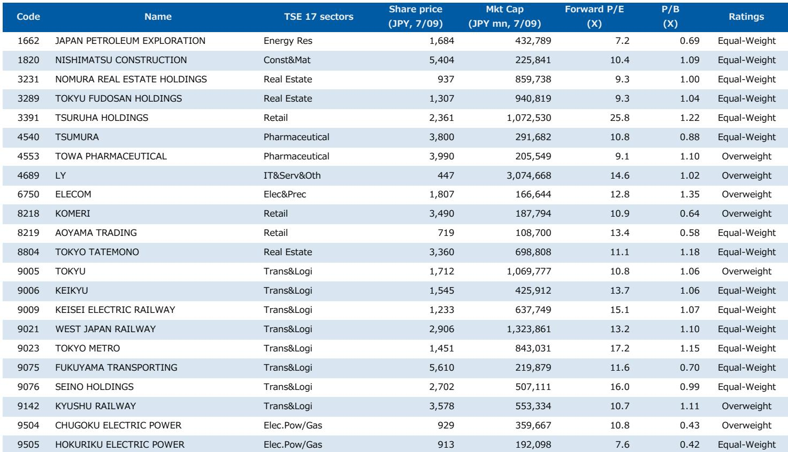
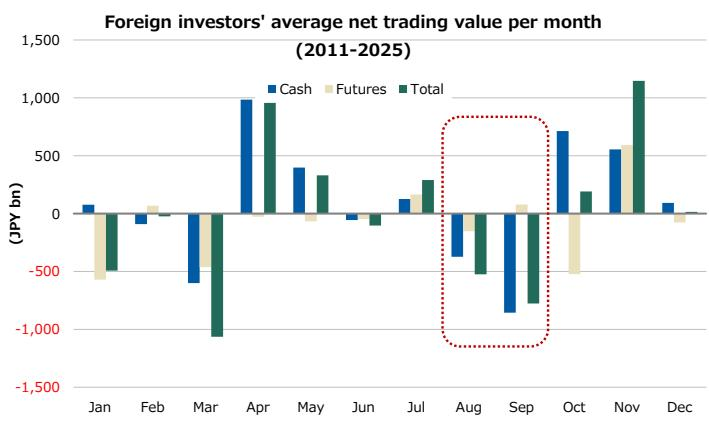

# 外国读者半年内净买入10万亿日元日本股票——这一事实本身构成了近期最大的观察点

由人工智能驱动的日本公司上涨行情尚未结束，但已进入一个结构性叙事与战术性现实相互拉扯的阶段。外国读者在2026年上半年净买入10万亿日元日本现货股票，这一规模远超近年任何可比时期。这些资金集中在人工智能和半导体相关公司，也正是6月下旬以来调整的源头。问题不在于基本逻辑发生了变化，而在于资金涌入过快，且8月和9月的季节性模式历史上往往伴随外资卖出。当最大的边际买家转为卖家时，他们持仓最重的股票往往下跌最快。

6月下旬以来的调整，反映了异常资金流入后的回撤、上半年持续上涨后的动能衰减，以及一个被充分记录的季节性规律：外国读者通常在8月和9月净卖出日本现货股票，在10月净买入。今年，由于持仓更为极端，卖出压力可能来得更早、力度更大。人工智能行情并未结束，但未来六到八周将考验读者是否有信心度过一次由资金流向和日历效应而非基本面驱动的反转。

战略问题并非是否放弃人工智能相关持仓，而是如何构建一个既能承受最拥挤交易中的暂时回撤，又能在季节性逆风过去后重新参与的资产组合。答案在于战术性转向内需价值股——这类资产被低估、低配，且在结构上不受即将主导短期市场的外资流向反转影响。

## 外资上半年创纪录买入为获利了结留下异常大的空间

2026年上半年外资买入规模在现代史上没有先例。现货股票净买入10万亿日元，代表了过去15年任何半年窗口期都未曾见过的外资参与水平。当单一读者类别在集中时段积累如此大的敞口，随后的调整——无论由组合再平衡、风险管理还是简单获利了结驱动——规模也将相应巨大。

历史记录具有参考价值。日本的外资现货股票资金流向呈现清晰的季节性模式：8月和9月净卖出，随后10月净买入。这一模式在2011年至2025年间持续成立。按周度看，资金流出历史上集中在8月下旬至9月底，约六周时间。其机制并不神秘：8月和9月交易量较低、流动性减少，机构读者倾向于在北半球秋季前降低风险。同期日本股票指数在8月平均回报为负。

今年，季节性模式可能因前期资金流入的规模而被放大。外国读者并非均匀地投入10万亿日元，而是集中在人工智能、半导体和科技相关公司——这些股票具有高动量、高增长、大市值和高波动特征。当最大买家退场时，这些因素恰恰最容易受到反转冲击。6月下旬开始的调整并非随机波动，而是一次由资金流向驱动的调整的前沿，兼具季节性和持仓逻辑。

## 互联网泡沫的类比并非预测，但提供了一个有用的警示参考

将人工智能相关股票的任何调整都视为买入机会的倾向可以理解，但这可能忽视一个值得关注的历史模式。在互联网泡沫期间，费城半导体指数并非直线上升。1999年7月至9月——正值泡沫整体上涨阶段——该指数出现停滞。那个夏季窗口的季度回报持平甚至为负，尽管长期趋势依然强劲向上。

这一类比并非机械的。当前人工智能周期由真实的收入增长和资本支出驱动，而非同样的投机性过度。但行为层面的要点成立：即使是较强劲的主题行情也会经历中断。1999年的中断并非趋势结束的信号，而是一次由仓位调整、夏季流动性减弱和动量自然消退驱动的季节性暂停。同样的力量今天正在发挥作用。

报告分析显示，今年外国读者的仓位调整似乎比往常更早。如果这一模式成立，最大压力期可能出现在8月下旬而非9月，并可能在9月初趋于稳定。这不是对崩盘的预测，而是认识到未来四到六周对任何重仓外资最积极买入股票的人来说，可能都不太舒适。

## 内需价值股提供战术性对冲，无需放弃人工智能主题

当前环境下最重要的战略洞察是，读者无需在维持中期人工智能敞口和降低短期风险之间做出选择。这两个目标可以通过战术性转向内需价值股来协调——这类资产在结构上低配、基本面便宜，且在操作上不受冲击更广泛市场的外资流向动态影响。

其逻辑基于三个支柱。首先，价值因子在2026年整个内需板块中持续发挥作用，即便更广泛市场由成长和动量主导。在内需股票池中做多最高价值五分位、做空最低价值五分位的多空组合今年已实现正累计回报。这不是理论构建，而是可观察的实时市场现象。

其次，内需股对外资流向反转的敞口较小，因为外资并未重仓它们。外资上半年买入的股票绝大多数是人工智能、半导体和大盘动量股。内需价值股——房地产、铁路、零售、医药、电力——不属于那类拥挤交易。当外资卖出时，他们会卖出自己持有的股票。内需价值股并非他们持有的对象。

第三，近期日本国债回报表现上升为短久期特征的价值股创造了顺风。较高的贴现率对长久期成长股现值的压缩程度大于对短久期价值股。在利率上升环境中，价值往往优于成长。10年期日本国债回报表现近几周走高，这一变动可能有利于那些市净率低、产生稳定国内现金流的股票。

## 未来六到八周的决策框架

以下框架将报告分析转化为近期资产组合构建的可操作选择。

首先，评估你对最易受外资流向反转影响因素的当前敞口。如果你的组合偏向动量、成长、大盘和高波动因子——尤其是这些敞口集中在人工智能和半导体相关公司——你正承担显著的战术性风险。问题不在于这些头寸是否会恢复，而在于你能否承受未来四到六周内这些头寸10%至15%的回撤，而不被迫在错误时机离场。

其次，考虑部分转向内需价值股作为战术性覆盖。报告识别了一个股票池：国内销售比率90%或以上（不含金融股）、市净率处于市场最低20%分位、且具有稳定或改善特征。这一池子包括房地产、铁路、零售、医药、电力和建筑领域的公司。它们不是高增长故事，而是稳定、产生现金的业务，定价反映了停滞预期，并在市场调整时提供安全边际。

第三，建立重新进入人工智能相关头寸的时间线。报告分析显示，今年外资仓位调整比往常更早，这可能将最大压力期推向8月下旬而非9月。如果这一模式成立，内需价值股的战术窗口可能相对较短——大约六到八周。到9月初，季节性逆风应开始消退，人工智能和半导体敞口的结构性理由应重新显现。

第四，不要将战术性转向与战略性观点改变混为一谈。人工智能相关股票的中期理由依然完整。调整由资金流向和季节性驱动，而非基本面前景恶化。风险不在于逻辑错误，而在于在拥挤交易中过度扩张的读者可能被迫在错误时机离场，锁定本可通过适度战术调整避免的损失。

## 调整是暂时的，但采取行动的机会并非如此

在这样的市场中，最危险的错误是假设因为长期故事完整，短期风险就可以忽略。事实并非如此。外国读者在六个月内买入10万亿日元日本股票。这是事实。季节性模式表明他们将在8月和9月卖出其中一部分。这也是事实。这两个事实的结合创造了一个真实、可衡量且可应对的短期风险。

解决方案不是恐慌，而是认识到市场正进入一个边际买家变为边际卖家的时期，并据此调整仓位。内需价值股并非人工智能主题的替代品，而是一座桥梁——一种在最热门交易可能面临持续卖出压力的时期保全资本和保持选择权的方式。

到9月初，季节性模式应会逆转，外资流向应再次转正，人工智能行情的结构性驱动因素应重新显现。成功度过未来六到八周的读者，将是那些将调整视为战术性事件而非战略性事件，并有纪律转向市场中最不受资金流向反转影响部分的读者。

*仅供参考。部分内容可能基于源材料通过人工智能辅助生成、翻译、总结或编辑，可能存在遗漏或错误。请独立核实。本文不构成专业建议。*

仅供参考。部分内容可能基于源材料通过人工智能辅助生成、翻译、总结或编辑，可能存在遗漏或错误。请独立核实。本文不构成专业建议。

