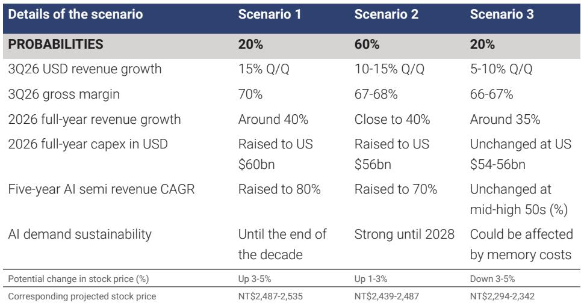
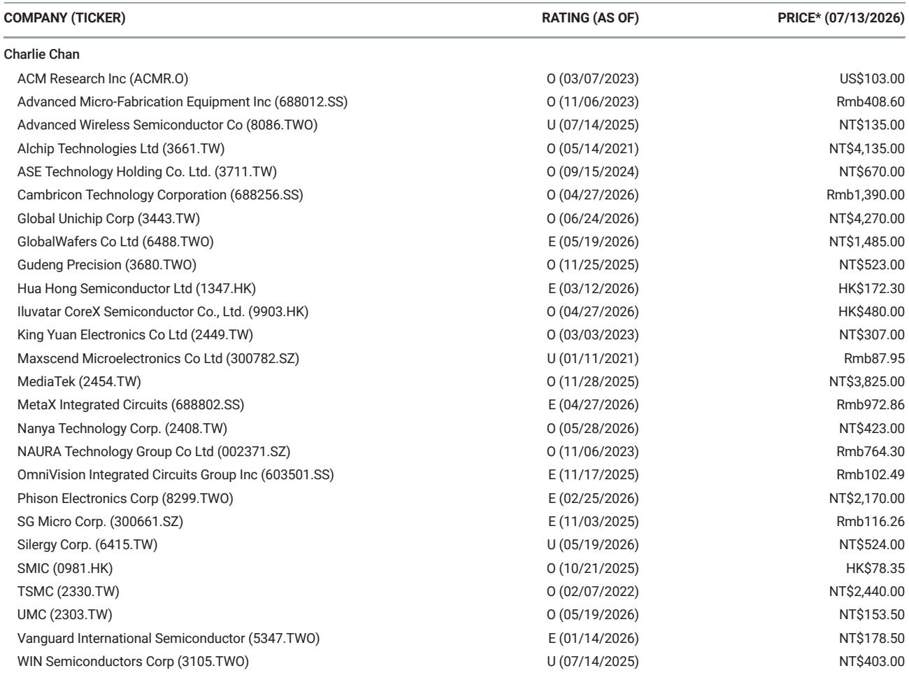
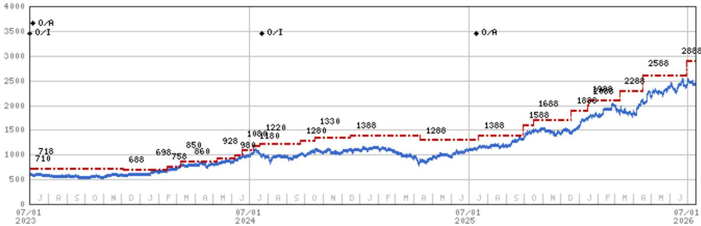

# MS：台积电，2Q26法说会预览与观察

市场对台积电7月16日法说会的关注点，大多落在第三季度营收环比增幅和全年资本支出是否上调。但MS在法说会前发布的这份报告，真正想传递的信号是：AI半导体需求的可持续性，正在成为比季度数字更关键的市场定价因子。

报告将法说会可能的结果拆成三种情景，并分别给出了对应的报价变动区间。最乐观情景下，台积电可能将2026年全年营收增长指引上调至接近40%，资本支出提高至560亿美元，同时将AI半导体五年营收复合年增长率从目前的50%中高段上调至70%。而这一情景的触发条件，不是季度数字本身，而是管理层对AI需求可持续性的表态——是否愿意将“强劲至2028年”的判断进一步延伸至“直至本十年末”。

## 1. 三种情景的核心差异不在营收，而在AI需求的时间跨度

MS给出的三种情景，概率分布并不对称。基准情景（概率60%）假设第三季度营收环比增长10%-15%，全年营收增长接近40%，资本支出上调至560亿美元，AI五年复合年增长率上调至70%。这一情景下，管理层对AI需求的判断是“强劲至2028年”。

最乐观情景（概率20%）则将AI需求可持续性延伸至“本十年末”，同时将五年复合年增长率上调至80%，资本支出提高至600亿美元。最悲观情景（概率20%）则假设AI需求可能受到内存成本影响，五年复合年增长率维持不变。

三种情景对应的报价变动区间分别为上涨3%-5%、上涨1%-3%和下跌3%-5%。从报价弹性来看，市场对AI需求可持续性这一变量的敏感度，已经超过了季度营收数字本身。

> **KC评论：** 这份报告最有价值的部分不是营收预测，而是将AI需求可持续性作为独立变量进行情景分析。读者可以留意的是，三种情景中，资本支出和AI复合年增长率是同步变动的，这意味着台积电的资本支出决策本质上是AI需求信心的映射。

## 2. 毛利率的边际变化，反映的是产能利用率与折旧成本的拉锯

报告对第三季度毛利率的预测区间为66%-70%，基准情景落在67%-68%，与第二季度基本持平。这一判断背后，是两股力量的角力：更高的产能利用率对毛利率形成支撑，但更高的成本和折旧则是抵消因素。

值得注意的是，最乐观情景下毛利率可以达到70%，这需要3纳米和2纳米产品的需求同时保持强劲。而最悲观情景下毛利率可能降至66%-67%，环比出现下滑。毛利率的边际变化，实际上反映了先进制程的产能爬坡节奏是否顺利。

## 3. 一个可复用的观察框架：将资本支出视为AI需求信心的代理变量

对于关注半导体产业链的读者，这份报告提供了一个可复用的分析框架：将台积电的资本支出指引视为AI需求信心的代理变量。

报告显示，2026年资本支出从最初520-560亿美元区间上调至560亿美元（基准情景），甚至可能进一步上调至600亿美元（乐观情景）。资本支出的每一次上调，都对应着管理层对AI需求可持续性的更乐观判断。反过来，如果资本支出维持不变，则意味着AI需求可能受到外部因素制约。

这一框架的价值在于，它将一个难以量化的变量——AI需求的可持续性——转化为一个可追踪的指标：资本支出指引的变化方向。

法说会即将召开，市场等待的不仅是数字，更是管理层对AI需求时间跨度的判断。这份报告已经给出了三种情景及其对应的报价区间，真正的变量，在于台积电愿意在多大程度上押注AI需求的持续性。

For informational purposes only. Portions may be generated,translated,summarized,or edited with AI assistance based on source materials and may contain omissions or errors. Please verify independently. This is not investment,legal,tax,accounting,or other professional advice.

For informational purposes only. Portions may be generated,translated,summarized,or edited with AI assistance based on source materials and may contain omissions or errors. Please verify independently. This is not investment,legal,tax,accounting,or other professional advice.

