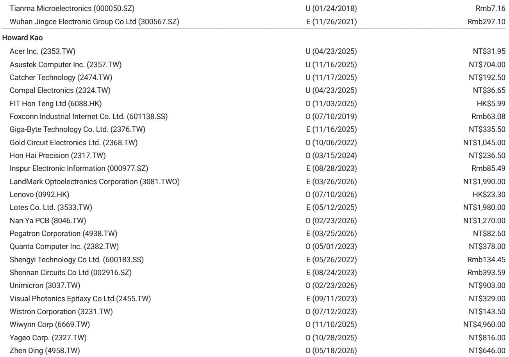
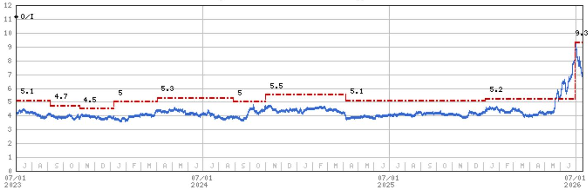
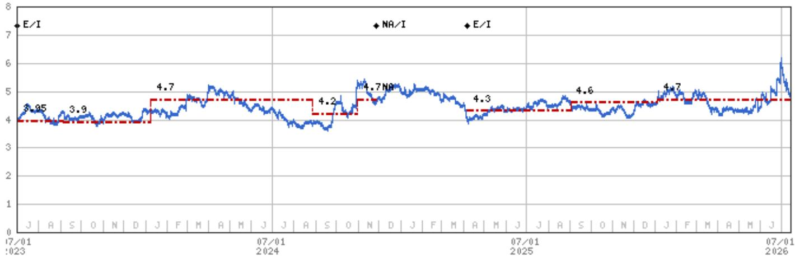

# TCL的业绩表现背后隐藏的战略分歧：规模与专注如何让京东方在面板竞赛中占优

TCL集团公布的2026年第二季度初步净利润，较分析师预期高出22%，其中间值达到22.54亿元人民币，同比增长146%至171%。这一数字似乎验证了公司涵盖大尺寸显示、中尺寸面板以及深度亏损的太阳能业务的多板块战略。然而，在表面之下，盈利构成揭示了一种结构性张力：TCL的显示子公司华星光电贡献了约19.5亿元的季度利润，环比基本持平，同比有所下降，而合并报表的太阳能子公司中环继续亏损超过13亿元。业绩超预期几乎完全来自太阳能业务亏损的收窄，而非显示业务的增长。这不是一个周期复苏的故事，而是一个企业集团折价正在显现的过程。对于研究中国面板领域的观察者而言，关键问题不在于TCL能否再次带来业绩惊喜，而在于其业务组合结构是否能让它像规模更大的竞争对手京东方那样高效地积累价值——后者拥有更高的估值倍数和更清晰的战略叙事。

时机之所以重要，是因为面板周期即将转向。预计电视面板价格将在2026年第三季度开始下降，因为下游品牌的订单动能低于季节性水平，削弱了面板制造商的定价能力。供应端表现出自律，但仅靠自律无法在需求放缓时阻止价格走弱。在这种环境下，相对优势将转向规模最大、显示业务占比最高、以及在新一代技术路径上最可信的参与者。与京东方相比，TCL在这三个方面均不占优，而初步业绩结果使这一分歧更加明显。

## 华星光电的显示盈利停滞，即便太阳能亏损收窄

TCL初步业绩中最关键的数字并非集团净利润超预期，而是华星光电第二季度盈利约为19.5亿元，环比仅增长5%，同比下降2%。这种停滞发生在公司自身描述大尺寸显示定价“相对稳定”、中尺寸显示受益于T9产线爬坡的时期。稳定的定价和销量增长本应带来超过个位数的环比利润改善。这意味着产品组合的不利因素或成本压力正在抵消销量增长。大尺寸高端细分市场的增长是真实的，但其利润池的扩张速度不足以抵消小尺寸OLED的拖累——报告明确指出该业务仍面临压力。华星光电的盈利正在一个水平上趋于平稳，按年化计算，其净资产回报率远低于分析师对2026年11%的预期。

与此同时，中环的净亏损在第二季度收窄至13.53亿至16.53亿元人民币之间，环比改善幅度为持平至18%，同比改善29%至42%。太阳能业务仍处于结构性供应过剩状态，亏损收窄反映了成本削减和海外组件出货量增长四倍，而非供需基本面的重新平衡。半导体材料子公司中环领先实现营收30亿元，环比增长8%，同比增长10%，出货量同比增长17%。这是一个亮点，但相对于太阳能亏损的规模而言仍然较小。因此，集团业绩超预期是太阳能业务亏损减少的结果，而非显示业务表现更好。这是一个脆弱的估值重估基础。

## 京东方在规模、显示业务纯度与玻璃基板方面的结构性优势创造了复利效应

分析师倾向于京东方而非TCL，基于在当前周期中可直接观察到的三个具体优势。第一，规模。京东方拥有全球最大的液晶面板产能，这使其在与面板买家及组件供应商的谈判中拥有更强的议价能力。当电视面板价格在2026年下半年开始下降时（如报告所预期），规模更大的参与者能更有效地吸收利润率压缩，因为其固定成本基础分散在更高的产出量上。TCL的华星光电是一流参与者，但其运营的10.5代线较少，缺乏让京东方能在下行周期中设定价格底线的相对产出量。第二，显示业务纯度。京东方来自显示面板的收入和利润占比远高于TCL。TCL的合并结构迫使读者承受一个仍在季度亏损超过13亿元的太阳能业务的波动。这造成了企业集团折价，而这种折价不太可能在太阳能部门实现持续盈利之前消失——考虑到多晶硅和组件的全球供应过剩，这一里程碑似乎还很遥远。第三，玻璃基板方面的进展更快。这是一种用于先进封装的新一代基板技术，尤其适用于人工智能和高性能计算芯片。与有机基板相比，玻璃基板具有更优越的电性能和尺寸稳定性。京东方一直在这一领域积极投入，分析师的报告明确将京东方更快的进展作为偏好的理由。如果玻璃基板在未来三到五年内成为有意义的收入来源，京东方将拥有先发优势，而TCL若没有同样专注的研发投入，将难以复制。

## 即将到来的周期下行将暴露最脆弱的业务组合结构

报告预期电视面板价格将从2026年第三季度开始下行，这并非对崩盘的预测。主要面板制造商之间的供应端自律应能防止大幅下跌。但从稳定或上涨的价格环境转向下跌，会改变每个参与者的计算方式。在价格上涨的环境中，即使是多元化的企业集团也能产生有吸引力的盈利增长，因为显示业务的顺风掩盖了其他板块的拖累。在价格下跌的环境中，拖累变得可见。TCL的太阳能亏损虽然收窄，但仍将是集团利润的重要减项。华星光电的显示盈利已经趋于平稳，将面临电视面板价格下跌带来的额外压力。T9产线的中尺寸显示爬坡可以部分抵消这种疲软，但不太可能完全弥补，因为中尺寸面板的利润率通常低于大尺寸高端面板。净效果是，TCL在2026年下半年的盈利轨迹相对于上半年的超预期表现可能会令人失望，仅仅是因为上半年的超预期是由一个暂时因素——太阳能亏损收窄——驱动的，而非可持续的显示业务动能。

京东方面临同样的面板价格逆风，但其更高的显示业务纯度意味着其盈利与面板周期的关联更直接。这看似是一个劣势，但实际上意味着京东方的盈利更可预测、更易于建模。研究者可以更有信心地应用周期调整后的倍数，因为他们无需估算一个不相关的太阳能业务的轨迹。此外，京东方的规模使其能在下行周期中维持更高的产能利用率，这比规模较小的竞争对手更好地保护了其利润率结构。分析师对京东方2026年市净率的目标倍数为2.5倍，而对TCL为1.7倍，这反映了这种结构性差异。倍数差距并非估值异常，而是对企业集团复杂性及较低显示业务敞口的合理折价。

## 在TCL与京东方之间配置资金的决策框架

对于在面板领域构建头寸的机构研究者而言，TCL与京东方之间的选择应遵循三个标准：周期阶段、组合容忍度与技术期权。

第一，周期阶段。如果研究者认为电视面板价格将在2026年底前保持稳定或上涨，TCL的多元化结构可能提供上行杠杆，因为显示板块将继续产生强劲利润，同时太阳能亏损收窄。当前的业绩超预期在短期内支持这一叙事。然而，如果研究者预期报告所预测的价格下跌，TCL的盈利将面临双重挤压：较低的显示利润率加上仍为负值的太阳能贡献。在这种情况下，京东方的纯业务结构和规模提供了更清晰的风险回报特征。报告明确预期价格从第三季度开始下跌，这支持倾向于京东方。

第二，组合容忍度。对特殊风险容忍度较高且愿意对太阳能周期进行深入研究的读者，如果认为中环正接近转折点，可能会发现TCL具有吸引力。海外组件出货量增长四倍是一个积极信号，但这尚不能证明盈利能力的结构性好转。太阳能行业的产能过剩是全球性的，太阳能组件和多晶硅的定价仍面临压力。偏好避免这种复杂性的研究者应配置京东方，其盈利故事完全由显示基本面和新出现的玻璃基板机会驱动。

第三，技术期权。玻璃基板尚处于早期阶段，但它们代表了一个独立于显示周期的潜在增长方向。京东方在这一领域的更快进展使其拥有一个可能在三年到五年内变得重要的技术看涨期权。TCL尚未展示出可比的进展，其研发资源分散在显示、太阳能和半导体材料之间。对于优先考虑长期技术敞口的研究者，京东方提供了更清晰的路径。

该决策框架得出了一个明确的结论：在当前周期阶段，面板价格预计将下跌且太阳能亏损持续的情况下，京东方的规模、显示业务纯度以及玻璃基板进展创造了更优的风险调整后回报特征。TCL的业绩超预期是真实的，但它是一个战术性事件，处于一个有利于规模更大、更专注的竞争对手的战略背景之中。

## 企业集团折价将持续至太阳能业务实现持续盈利

TCL管理层已展示出收窄太阳能部门亏损的能力，海外组件出货量增长令人鼓舞。但收窄亏损与产生利润并非同一回事。在中环能够持续产生正净利润之前，企业集团结构将继续对TCL的估值相对于纯显示业务同行造成折价。分析师对TCL的1.7倍市净率目标，相对于京东方的2.5倍，体现了这一折价。2026年上半年的业绩并未提供折价应缩小的证据。事实上，集团业绩超预期是由亏损减少而非利润扩张驱动的，这反而强化了结构性差距。

研究者应在未来几个季度关注两个具体数据点：华星光电的季度利润轨迹相对于行业面板价格指数的表现，以及中环迈向盈亏平衡的路径。如果华星光电的盈利表现优于价格下跌所暗示的水平，那将表明TCL的产品组合和成本结构比假设的更具韧性。如果中环比预期更早实现季度盈亏平衡，企业集团折价可能开始缩小。在这两个条件之一或两者实现之前，面板领域内的合理配置仍倾向于京东方。业绩超预期改变了一个季度的叙事，但并未改变该板块的结构性逻辑。

*仅供参考。部分内容可能基于源材料通过AI辅助生成、翻译、总结或编辑，可能存在遗漏或错误。请独立核实。本文不构成专业建议。*

仅供参考。部分内容可能基于源材料通过AI辅助生成、翻译、总结或编辑，可能存在遗漏或错误。请独立核实。本文不构成专业建议。

