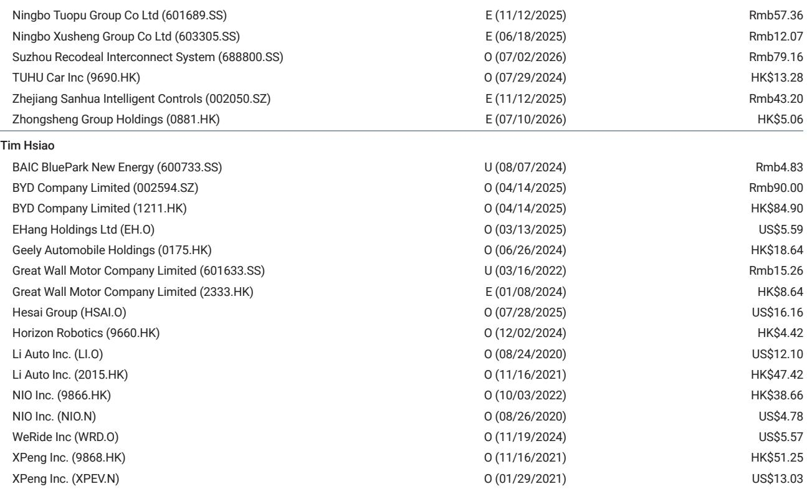
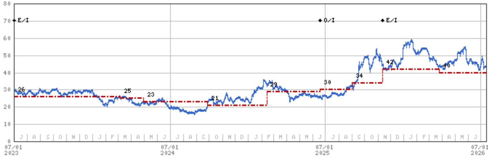
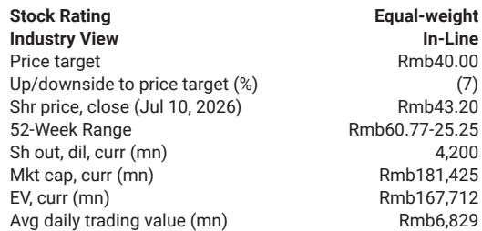

# 某机构：三花智控2Q26预览-收入表现好于预期

国内电动车和空调出货量同比变化的背景下，一家零部件公司二季度收入却实现了环比和同比双增长。某机构在7月13日发布的2Q26业绩预览中指出，三花智控的收入韧性主要来自三个被市场低估的结构性因素：中国电动车出口的强劲增长、一家美国大客户的双位数出货量增长，以及产品组合向高价值模块的持续迁移。

这份报告的核心判断是：三花智控正在经历从“国内周期驱动”向“全球客户+新产品线驱动”的收入结构切换。国内空调和电动车市场的调整并未直接转化为公司收入的同步下滑，因为出口和海外客户贡献的增量已经足以对冲国内的变化。

## 1. 电动车出口和海外大客户正在成为收入压舱石

报告明确提到，尽管中国国内电动车销量同比有所变化，但三花智控的电动车零部件收入依然保持增长。支撑这一判断的两个关键证据是：中国电动车出口的强劲增长，以及一家美国主要电动车客户的双位数出货量增长。

这意味着，三花智控的收入增长逻辑已经从“跟随中国电动车大盘”转变为“跟随中国电动车出口+海外头部客户”。对于一家零部件公司而言，这种客户结构的多元化是收入韧性的核心来源。

> **KC评论：** 市场往往将三花智控视为国内电动车周期的映射，但这份报告提示，出口和海外客户的权重正在上升。读者需要跟踪的不仅是国内月度销量，还有中国电动车出口数据以及特斯拉等海外客户的季度出货量。

## 2. 液冷业务正在从概念走向收入贡献

报告引用了管理层重申的目标：2026年液冷收入同比增长超过50%。更重要的是，三花智控不仅在做液冷系统的户外侧（一次侧）部件，还在开发室内侧（二次侧）部件。这意味着公司正在从单一部件供应商向子系统供应商延伸。

液冷业务的增长逻辑独立于空调和电动车周期。它对应的是AI数据中心散热需求的增长。如果这一业务按计划推进，三花智控将在2026年获得一条全新的收入增长曲线，且这条曲线的增速高于传统业务。

## 3. 成本端不确定性仍在，但公司有对冲手段

报告没有回避谨慎因素。二季度人民币对美元汇率变化带来的汇兑影响，以及铜和铝价格上涨对毛利率的挤压，都是实际存在的不确定性。但报告同时指出，公司通过套期保值部分对冲了原材料涨价的影响。

这是一个值得关注的细节：三花智控的成本结构中，铜和铝是主要原材料。当大宗商品价格上行时，市场往往线性外推其利润不确定性。但报告提示，公司的套保操作可以在一定程度上平滑这种影响。真正的不确定性在于，如果人民币汇率持续变化且大宗商品价格继续上行，套保能否完全覆盖仍需观察。

## 4. 一个可复用的观察框架

这份报告提供了一个分析零部件公司的框架：收入韧性 = 国内周期敞口 + 出口增速 + 海外客户集中度 + 新产品线渗透率。

对于三花智控而言，国内空调和电动车周期是“已知的仍在调整”，但出口、海外大客户和液冷业务是“被低估的正面”。市场定价往往聚焦于前者而忽略后者，这正是预期差所在。

报告没有给出明确的结论，但数据本身已经说明问题：在国内需求变化的背景下，一家零部件公司能够实现收入增长，靠的不是周期反转，而是客户结构和产品结构的主动调整。

For informational purposes only. Portions may be generated,translated,summarized,or edited with AI assistance based on source materials and may contain omissions or errors. Please verify independently. This is not investment,legal,tax,accounting,or other professional advice.

For informational purposes only. Portions may be generated,translated,summarized,or edited with AI assistance based on source materials and may contain omissions or errors. Please verify independently. This is not investment,legal,tax,accounting,or other professional advice.

