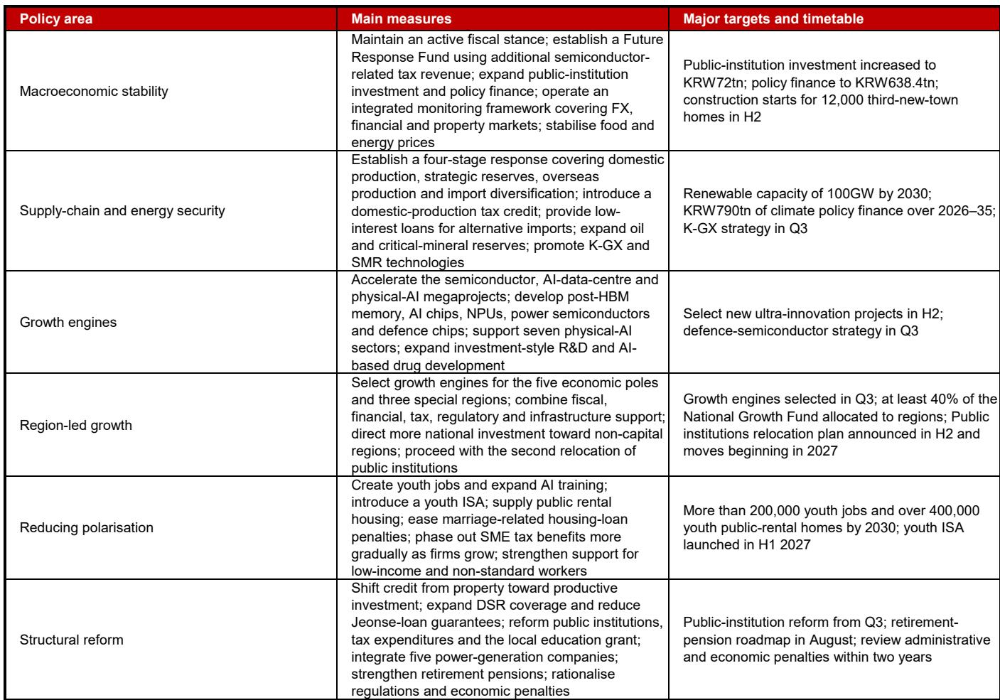

# 韩国3%增长目标：财政积极能否打破旧有框架？

韩国政府近期做出了一项在后疫情时代发达经济体中较为罕见的举措：将2026年GDP增长预测从2.0%上调至3.0%。这并非一次常规的统计修正，而是一项有意的政策宣示，表明国家意图打破多年来困扰韩国经济的低增长均衡。韩国央行和经合组织目前对该国潜在增长率的估计低于2%。政府现在将2026年实际增长目标定为3%，并更雄心勃勃地设定了长期将潜在增长率提升至3%的结构性目标。

经济现状与政府目标之间的差距，是这一预测中最核心的张力所在。弥合这一差距，不仅需要有利的半导体周期，更需要财政资源的根本性重新配置、在不引发通胀或汇率波动的情况下维持积极财政姿态的意愿，以及能够容忍高于趋势增长而不过度反应的政策框架。政府2026年7月的经济展望与政策方案提供了蓝图，关键在于执行能否匹配雄心。

数据本身引人注目。实际GDP增长率预计将从2026年的2.0%加速至3.0%，随后在2027年放缓至2.2%。名义GDP增长率从4.9%跃升至12.3%，反映了实际活动增强和通胀上升。经常账户盈余预计将几乎弹性较高，达到2900亿美元。海关出口预计同比增长40%。这些并非渐进式改善，而是政府对经济潜力的评估发生了转变。

对于观察者和企业策略制定者而言，关键问题是这一预测是合理目标还是理想上限。政策方案显示，政府确实在认真考虑运用财政工具来提升增长曲线，但路径狭窄，风险集中在通胀、汇率压力和政策独立性方面。

## 政府利用半导体红利为结构性财政扩张提供资金，且不新增债务

新政策框架中最重要的机制是重新分配半导体繁荣带来的额外税收。政府预计，芯片行业带来的额外企业税收将约占GDP的1%。根据常规财政规则，《国家财政法》要求将超额税收用于偿还债务。政府正示意将通过将这笔意外之财注入新的“未来准备基金”来规避这一约束，该基金将用于支持青年就业、下一代产业、区域发展和教育。

这不是传统的逆周期刺激，而是财政资源从减债向增长导向支出的结构性重新配置。政府实际上选择在经济已接近潜在水平运行时维持积极财政姿态，而非利用意外收入修复资产负债表。其逻辑是，半导体周期是暂时的，但对人力资本、基础设施和产业能力的投入可以提升长期增长轨迹。

政府可能在2026年下半年实施的第二次补充预算将完全由这笔额外收入提供资金，无需额外发行国债。这是一个关键约束，意味着财政扩张不会增加政府债务存量，从而维护了财政信誉并限制了主权评级下调的风险。但这也意味着刺激规模受限于意外收入的规模。如果半导体利润不及预期，财政空间将收窄。

从增长核算角度看，影响有意义但并非压倒性。假设财政乘数为0.2至0.3，补充预算可能在2026年为GDP增长贡献约0.2个百分点。这足以将增长推高至一些分析人士此前预测的2.5%基线之上，但仅凭此不足以实现完整的3.0%目标。其余部分必须来自私营部门对政府大型项目和结构性改革的响应。

## 半导体超级集群与AI基础设施投资是3%目标的真正引擎

政府提升潜在增长率至3%的长期战略基于三个核心项目：西南地区的大型半导体芯片集群、AI数据中心建设以及物理AI生态系统。这些并非新宣布，而是对现有产业政策承诺的加速和整合。新意在于这些项目与潜在增长目标之间的明确关联。

半导体集群是三者中最具体的。政府押注韩国能够在保持存储半导体领先地位的同时，向高带宽内存后技术、AI专用芯片、神经处理单元、功率半导体和国防芯片等领域拓展。税收优惠、基础设施支出和监管加速旨在防止芯片周期过早见顶，并将投资视野延伸至当前繁荣期之外。

AI数据中心和物理AI组件更具推测性，但潜在变革性更强。政府已确定七个物理AI领域进行定向支持，包括机器人、自主系统和AI驱动制造。目标是创建一个能够吸收半导体集群产出并产生下游生产力提升的国内生态系统。这是经典的产业政策逻辑：先建设上游产能，再创造下游需求。

风险在于下游需求实现速度慢于预期，使半导体行业暴露于全球需求周期而非国内吸收。韩国的出口依赖度仍然很高，2900亿美元的经常账户盈余预测意味着贸易顺差将继续成为增长的主要驱动力。大型项目的国内投资乘数需要时间才能传导至就业和消费。

## 积极财政支出强化了韩国央行的鹰派倾向，但不会引发连续加息

政府增长目标对政策的影响微妙但重要。韩国央行一直处于紧缩周期，央行自身对增长和通胀的预测将在2026年8月会议上上调，以更贴近政府预测。央行可能会承认增长势头稳固，且财政姿态正在增加需求压力。

然而，央行的反应函数主要由通胀而非增长主导。政府自身对2026年2.6%的通胀预测高于央行目标，且政府已明确承诺加大力度缓解价格压力。这造成了紧张：财政当局在刺激需求，而货币当局试图控制通胀。解决之道在于政策行动的先后顺序。

最可能的结果是，央行维持当前每季度25个基点的加息步伐，下一次行动在2026年7月，随后在2026年10月和2027年1月进一步加息，将终端利率推至3.25%。这不是鹰派加速，而是现有路径的延续，其合理性在于增长前景上修以及通胀持续高于目标。

政府的积极财政姿态通过降低央行紧缩导致急剧放缓的风险来支持这一路径。如果财政乘数为正且补充预算增加了需求，央行可以在不担心过度下行的前提下加息。风险在于，如果通胀加速超过2.6%，财政与货币政策可能失调。在这种情况下，央行将不得不在信誉与增长支持之间做出选择。政府对价格稳定的强调表明它理解这一风险，但财政扩张带来了通胀结果偏高的倾向。

## 决策框架：如何评估韩国增长目标的可靠性

对于观察者和企业策略制定者而言，政府的预测并非需要接受或拒绝的预言，而是一项创造特定风险与机遇的政策承诺。以下决策框架将政府计划转化为可操作的问题。

首先，评估财政执行风险。政府已宣布雄心勃勃的支出计划，但“未来准备基金”的规模和运作规则尚未最终确定。第二次补充预算取决于2026年8月的年中企业纳税申报。如果税收收入低于预期，财政扩张规模将小于计划。关键监测点是8-9月的财政战略公告，该公告将明确有多少意外收入将被支出，多少用于偿还债务。

其次，评估半导体周期持续时间。政府的增长目标假设当前芯片上升周期延续至2026年并进入2027年。如果全球对存储芯片的需求减弱，40%的出口增长预测将不切实际，税收意外收入也将缩水。政府的产业政策可以支持国内生态系统，但无法控制全球半导体周期。最重要的外部变量是主要科技公司AI相关资本支出的步伐。

第三，监测通胀与增长的权衡。政府对2026年2.6%的通胀预测高于央行目标，但低于会触发紧急紧缩的水平。如果通胀意外上行，央行将不得不更快加息，这将冷却国内需求并降低财政乘数。政府缓解价格压力的承诺表明它意识到这一风险，但可用于供给侧通胀管理的工具有限。

第四，评估结构性改革的可信度。政府概述了金融市场、外汇市场、养老基金和公共部门的改革。这些是长期举措，需要数年才能实施。2026年的增长目标不依赖它们，但3%的潜在增长目标确实依赖。如果结构性改革停滞，一旦半导体周期转向，经济将恢复至低于2%的潜在增长。政府维持2026年后增长的能力取决于放松管制、劳动力市场灵活性和资本市场发展的步伐。

第五，考虑汇率和外部稳定风险。2900亿美元的经常账户盈余预测意味着大量资本外流或储备积累。政府已承诺将汇率风险管理作为其宏观金融稳定框架的一部分。如果韩元大幅升值，出口竞争力将受损，增长目标将更难实现。政府在管理汇率稳定的同时维持积极财政姿态，是一项需要在外汇市场持续干预的微妙平衡。

## 增长目标可实现，但容错空间狭窄

韩国政府设定2026年3%增长目标的决定，是一场关于财政积极主义和产业政策力量的高风险押注。半导体周期提供了顺风，税收意外提供了财政空间，大型项目提供了结构性叙事。但目标并非预测，而是一项需要在财政支出、通胀管理和外部稳定方面近乎完美执行的政策目标。

最可能的结果是，韩国2026年实现2.5%至3.0%区间的增长，具体取决于半导体周期和财政实施步伐。政府的可信度将受到考验，不是看它是否恰好达到3.0%，而是看它能否在不引发通胀螺旋或汇率危机的情况下维持高于趋势的增长。如果成功，3%的潜在增长目标将成为现实的长期目标。如果失败，经济将回归政府试图摆脱的低增长均衡。

目前，方向是明确的。政府愿意利用半导体繁荣创造的财政空间来资助结构性扩张。韩国央行愿意容忍高于趋势的增长，只要通胀保持可控。私营部门被提供了明确的激励来投资于未来产业。这一组合是否足以实现3%的增长，将在2026年下半年见分晓，届时税收数据将出炉，半导体周期将揭示其真实轨迹。

*仅供参考。部分内容可能基于源材料通过AI辅助生成、翻译、总结或编辑，可能存在遗漏或错误。请独立核实。本文不构成专业建议。*

仅供参考。部分内容可能基于源材料通过AI辅助生成、翻译、总结或编辑，可能存在遗漏或错误。请独立核实。本文不构成专业建议。

