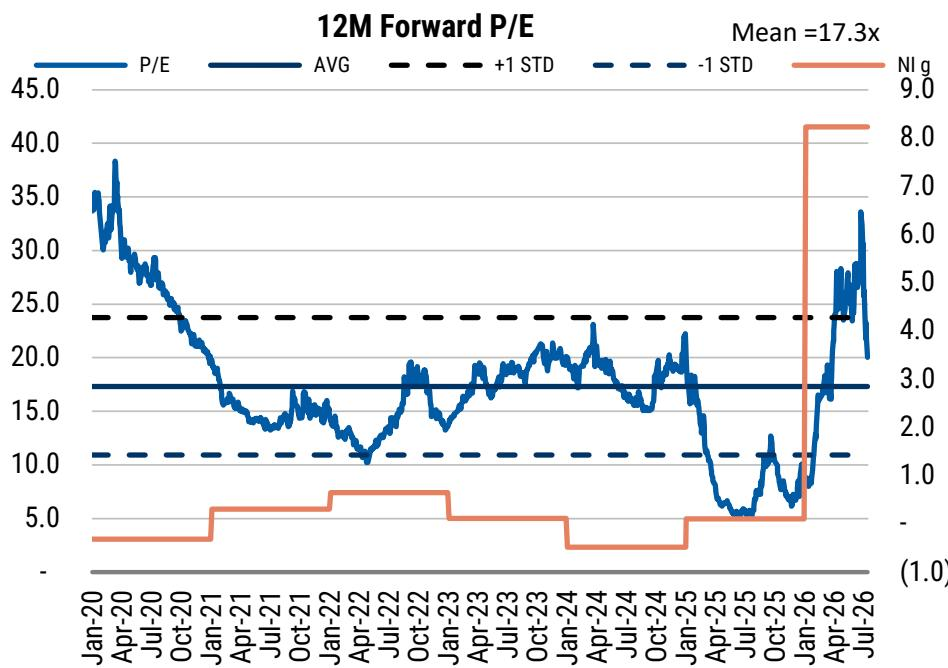
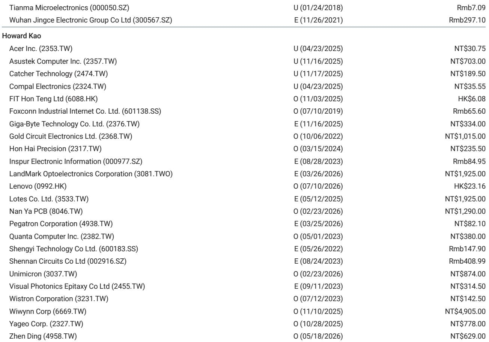
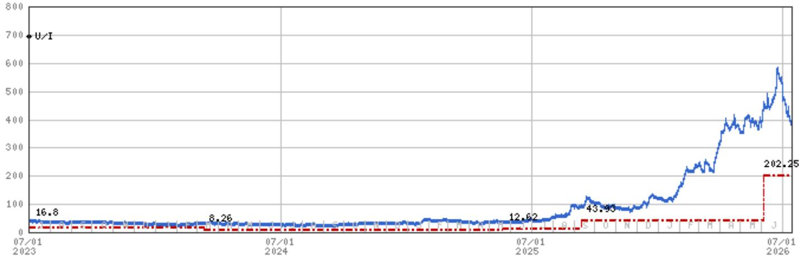

# 光纤超周期尚未被市场充分认知：为何50%回调创造了第二次观察窗口

长飞光纤光缆自2026年6月高点以来市值回落约一半，但推动其此前表现的核心驱动力——AI驱动的光纤超周期——不仅没有减弱，反而在加速。7月14日，公司发布正面盈利预告，显示2026年第二季度收益在19亿至25亿元人民币之间，这一结果使得全年75亿元净利润的预估变得高度可能。这较2025年8.14亿元的基数同比增长822%。

矛盾显而易见。公司估值已从34倍远期市盈率回落至约20倍，略高于历史均值17倍，但远低于+1标准差水平。读者正在抛售一家盈利轨迹仍在上行的公司。问题在于，市场是在正确预判周期顶点，还是误判了周期的持续时间。

答案取决于理解哪些因素发生了变化——以及哪些没有。引发回调的供给端风险是真实存在的，但其时间点和规模被市场误判了。未来两个季度的业绩发布周期很可能推动重新定价，不是因为市场情绪会自发改善，而是因为数据将大到无法忽视。

## 引发回调的供给风险真实存在，但时间点被误判

导致50%回调的主要催化剂并非需求失望，而是供给担忧。中国两个大型新项目公告——合盛硅业在新疆的3200吨年产能光纤预制棒项目（6月8日通过备案审批）和大族激光在张家港的2000吨预制棒项目——引发了合理担忧：历史高位的利润率将吸引产能扩张，最终压缩定价。

这一逻辑在方向上没有错，但在时间点上错了。毛利率轨迹说明了问题。长飞2026年第一季度毛利率为41.5%，预估显示2026年毛利率为50.9%，2027年为56.8%，2028年为47.4%。相比之下，2015年至2025年期间毛利率在19%-31%区间。这些是结构性利润率，而非周期性峰值，因为需求驱动力并非典型的电信升级周期，而是AI基础设施建设，这需要根本不同的光纤规格。

新项目需要18-24个月才能达到有意义的产量。在此期间，AI数据中心建设带来的需求正在加速，而非趋于平稳。盈利增长势头在未来6-12个月内不太可能出现实质性变化。市场已经定价了数据尚不支持的下行情景。

## AI光纤超周期在结构上不同于以往的电信周期

这不是4G或5G光纤部署周期的重复。那些周期由消费者带宽需求驱动，遵循可预测的S曲线：快速部署、容量饱和、价格压缩。AI数据中心周期在两个关键方面有所不同。

首先，AI集群内部的带宽需求比电信网络中的任何需求都高出数个数量级。长飞2026年6月宣布全球首次成功实现空芯光纤波分复用传输系统现场试验，每波长可达1.2 Tb/s，超长无中继跨度。这不是实验室里的新奇事物。这是对传统光纤在GPU集群互连中带来的热和延迟限制的直接回应。空芯光纤通过空气而非玻璃传输光，延迟降低约30%，并消除了高功率水平下限制实芯光纤容量的非线性失真。

其次，客户群体不同。电信运营商历史上优化每比特最低成本，会延迟升级直到容量利用率超过70-80%。AI超大规模计算公司优化每瓦性能与计算时间。他们愿意为降低延迟或增加每波长容量的光纤支付溢价，因为这些改进直接转化为更快的模型训练和更低的集群空闲时间。这从根本上改变了定价动态。

收入构成证实了这一转变。光通信产品（包括AI数据中心使用的光纤和光缆）预计2026年增长109%，而2025年为6%。光传输组件（包括数据中心互连中使用的有源和无源组件）也预计增长109%。这些不是增量增长率；它们代表了可寻址市场的阶跃变化。

## 盈利动能将在未来两个季度推动重新定价

重新定价最有力的催化剂不是叙事变化，而是超出共识预期的业绩表现。当前预估与共识之间的差异具有启示性。2026年，75.07亿元净利润的预估比68.22亿元的共识高出10%。2027年，127.30亿元的预估比100.02亿元的共识高出27%。

第二季度盈利预告验证了2026年预估。在19-25亿元区间的中点，2026年上半年盈利已接近40-50亿元，这意味着下半年只需实现25-35亿元即可达到全年目标。考虑到2026年收入预计同比增长92%，且毛利率从30.7%扩大至50.9%，该业务的经营杠杆非常显著。营业收入预计从2025年的16.20亿元增长至2026年的88.19亿元——增幅444%。

估值论证很直接。按当前H股约154港元的价格计算，2026年远期市盈率约为21倍。2027年，基于15.38元人民币每股收益的预估，市盈率降至约12倍。对于一家2027年净利润同比增长70%、净资产回报表现预计为50.8%的公司而言，12倍市盈率意味着市场正在定价一个数据尚不支持的严重盈利下滑。历史周期中5倍至38倍的远期市盈率区间表明，即使回归17倍的均值，也意味着较当前水平有显著上行空间。

## 导航光纤周期的决策框架

对于评估是否在当前水平参与的观察者而言，决策框架基于三个变量：需求持续时间、供给响应时间点和利润率轨迹。

关于需求持续时间，AI基础设施建设仍处于早期阶段。GPU集群互连、数据中心脊叶架构和长距离AI训练网络主干所需的光纤是一个多年的部署周期。2026-2028年收入预估分别为274亿元、345亿元和400亿元，意味着从2025年143亿元基数起约40%的复合年增长率。这不是一年的脉冲。

关于供给响应时间点，2026年6月宣布的新项目至少需要18个月才能达到商业生产。即使到那时，初始产出将是标准的电信级预制棒，而非能获得溢价定价的专业AI级光纤。市场担心的利润率压缩最早是2028年的事，而预估已经反映了这一点：毛利率预计从2027年的56.8%下降至2028年的47.4%，净利润预计2028年同比下降10%。市场正在定价分析师已经预测的下行情景。

关于利润率轨迹，关键洞察在于长飞19%-31%的历史利润率区间是在光纤作为差异化有限的商品时期形成的。AI周期通过空芯光纤、更高带宽规格和更严格的延迟要求引入了产品差异化。能够提供这些产品的公司拥有商品生产商无法匹敌的定价能力。2027年56.8%的预估毛利率意味着长飞的产品组合正在发生结构性转变，而非周期性波动。

## 可能使论点失效的风险是需求压缩，而非供给扩张

对论点最重要的风险不是新产能来得太快，而是AI基础设施需求减速快于预期。如果超大规模计算公司因资本配置变化、监管变化或AI模型开发放缓而暂停数据中心建设，光纤需求曲线可能比预估假设的2028年时间线更早趋于平缓。

这将是在2028年之前、从2027年开始触发盈利下行周期的情景。在这种条件下，公司估值将在盈利下滑之上面临倍数压缩，当前估值无法提供足够的安全边际。盈利轨迹是关键。如果2026年下半年业绩确认了需求轨迹，重新定价将随之而来。如果没有，回调将加深。

目前，证据指向前者。正面盈利预告、加速的收入增长和结构性利润率扩张都支持市场过度修正的论点。未来两个季度将提供确认或反驳这一观点的数据。结果的不对称性有利于在数据被完全定价之前行动的观察者。

*仅供参考。部分内容可能基于源材料通过AI辅助生成、翻译、总结或编辑，可能存在遗漏或错误。请独立核实。这不构成专业建议。*

仅供参考。部分内容可能基于源材料通过AI辅助生成、翻译、总结或编辑，可能存在遗漏或错误。请独立核实。这不构成专业建议。

