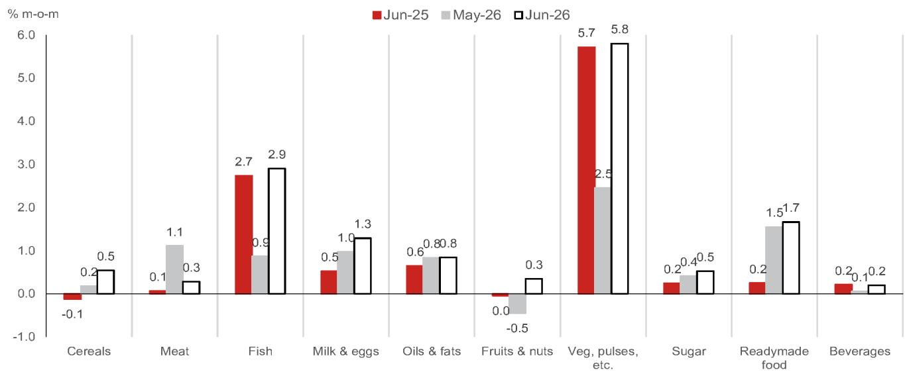
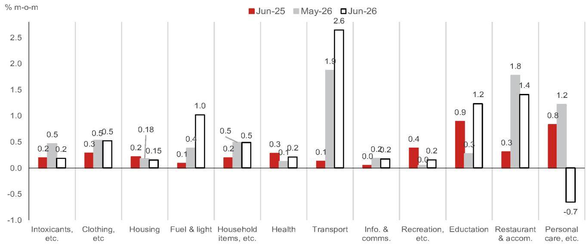
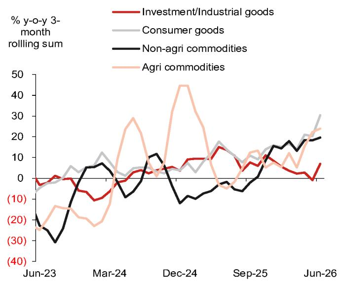
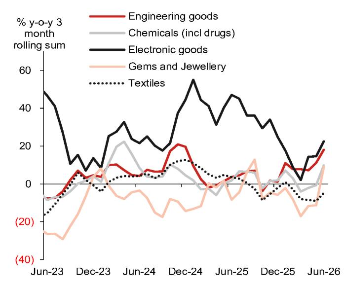

# 宏观观察：亚洲（除日本）

## 印度：6月通胀与贸易逆差数据均高于预期

对于FY27，我们预测通胀率为4.6%，经常账户赤字占GDP的1.2%，并预计印度储备银行将维持长期按兵不动。

- 6月CPI通胀同比升至4.4%，为18个月高点，高于5月的3.9%，主要受零售汽油/柴油价格上涨、食品通胀上升以及投入成本上涨缓慢、有选择地传导至部分核心子类别的影响。尽管如此，6月核心通胀同比持平于3.9%，超级核心通胀（核心剔除黄金/白银/铂金）仅从5月的2.3%微升至2.5%。

- 根据我们的估算，7月通胀同比预计将回落至约4.0%（6月：4.4%）。我们近期将FY27通胀预测从5.0%下调至4.6%，低于印度储备银行5.1%的预测。我们认为，鉴于中东地区持续的不确定性以及潜在通胀温和，货币政策委员会加息的障碍仍然较高。

- 商品贸易逆差数据意外走高，从5月的282亿美元升至6月的304亿美元。进口增速同比升至31.0%（5月为11.2%），受石油进口高企和核心进口稳健增长推动，反映了强劲的内需和更高的全球价格。6月出口增速同比放缓至15.5%，但仍具韧性，大部分行业表现广泛。

- 我们预计，由于一系列吸引资本流入的外部部门措施以及我们近期下调的经常账户赤字预测（下调0.7个百分点至GDP的1.2%，以反映原油价格下降、黄金/白银进口限制、强劲的汇款和韧性的出口），FY27的国际收支将转为超过400亿美元的盈余，高于我们此前约700亿美元赤字的预测。

## 食品与燃料驱动的通胀

## 燃料推动的上涨

6月CPI通胀同比升至4.4%（市场共识和NOM预测：4.2%），高于5月的3.9%（图1）。由于汽油和柴油价格在5月中旬上调（累计权重约5%），此次上调仅部分反映在5月数据中，剩余4.3-4.9%的环比（未经季调）涨幅体现在6月数据中。液化石油气钢瓶和管道天然气价格也出现大幅上涨（环比上涨2.3%）。

## ……伴随食品通胀上升

在燃料篮子之外，食品与饮料通胀同比从5月的4.5%升至5.1%，主要受蔬菜价格飙升（环比上涨7.4%）以及鸡蛋（3.7%）、香料（2.2%）、肉类、鱼类和牛奶（约1.1%）、油脂（0.8%）以及较小程度的谷物和糖（约0.5%）价格大幅上涨推动。豆类和水果（约0.3-0.4%）以及饮料（0.2%）价格较为疲软。

蔬菜价格通常在季风月份飙升，因此这一上涨与季节性趋势一致（图2），尽管高于我们基于高频数据的估计。较高的油脂通胀可能反映了全球价格上涨，因为印度依赖进口。昂贵的动物饲料，尤其是大豆，可能推高了动物蛋白产品的价格。柴油和化肥成本的上升也可能加剧食品通胀压力。尽管如此，充足的谷物和豆类缓冲库存以及政府灵活的需求侧管理，可能正在控制价格势头，尽管季风和播种情况令人失望。

## 核心通胀承受压力

6月核心通胀（CPI剔除食品与饮料、电力、燃气及其他燃料、汽油、柴油和润滑油）同比持平于3.9%，略高于我们3.8%的预测。我们估计超级核心通胀（核心剔除白银和黄金/钻石/铂金）从5月的2.3%升至6月的2.5%，仍处于温和水平，表明黄金和白银通胀在年度基础上持续贡献较大。

尽管如此，核心子类别中出现了因伊朗战争引发的投入成本上升而导致的价格上涨情况。餐厅和住宿服务继续领涨，再次录得月度价格大幅上涨（环比上涨1.4%，未经季调；图3）。在交通篮子中，燃料价格上涨很可能导致公路运输票价上调，而5月大幅上涨的机票价格在6月有所回落。我们还观察到服装鞋帽和家庭子类别中存在一些持续的价格压力，但总体通胀仍受到限制。

健康、住房（剔除燃料）、娱乐和麻醉品等类别的通胀势头仍然温和。教育服务出现上涨（环比上涨1.3%），但我们观察到去年6-7月也有类似上涨，这表明这些可能是与年度费用调整相关的季节性压力。

## 贸易逆差仍处高位

6月商品贸易逆差意外扩大至304亿美元（市场共识：265亿美元；NOM预测：274亿美元；5月：282亿美元），原因是进口增长加快，而出口增长保持稳定（图4）。服务贸易方面，6月顺差为151亿美元，较5月的157亿美元有所下降，且低于2026年前五个月约190亿美元的平均水平。这是由于服务出口增长乏力（约3%），而进口增长较强（12.7%）。

## 商品进口动态

6月进口增速同比从5月的11.2%升至31%，略高于我们的预期（NOM预测：26.2%），部分受到有利基数的提振。石油进口同比高达40%，这并不意外，原因是价格上涨的滞后影响和疲软的基数。我们估计宝石和珠宝进口收缩约8%，可能是对政府提高关税和限制黄金/白银进口的反应。核心进口（非石油/宝石和珠宝）在5月增长11.2%之后，6月强劲增长31.4%，反映了强劲的内需和更高的全球价格。化肥、电子产品、豆类和棉花等关键领域普遍回升（图5）。

## 商品出口动态

6月出口同比增长15.5%，低于5月的18%，也低于我们的预期（NOM预测：26.4%）。石油出口依然疲软，仅增长8.9%，远低于5月的55.1%，这可能是由于对石油产品出口征收暴利税以及信实工业贾姆讷格尔炼油厂（主要燃料出口商）的维护工作所致[1]。核心出口（非石油/宝石和珠宝）增长保持稳健，为15.3%，大部分行业表现广泛（图6）。

## NOM观点：通胀降低、经常账户赤字收窄、印度储备银行按兵不动

## 对6月数据的评估

6月通胀数据如预期反映了汽油和柴油零售价格上涨以及食品通胀上升。核心篮子中存在一些价格上涨的领域，但潜在势头仍然稳固。这表明消费者需求疲软，企业利润率可能面临压力。

## 下行与上行风险

在美国和伊朗暂时停火期间，原油价格大幅下跌。尽管零售燃料价格短期内不太可能回落，但较低的工业能源成本和商业部门能源限制的取消将有助于缓解企业的利润率压力。虽然未来几个月一些核心子类别可能继续反映投入成本上升的滞后影响，但我们预计这些压力不会持续。然而，美伊敌对行动重启，伴随原油价格上涨和霍尔木兹海峡中断，是一个上行风险。

季风降雨仍然不足，截至7月中旬比正常水平低19%。7月是夏播作物的关键月份，播种情况迄今令人失望，但正在逐步改善（截至7月10日同比下降16%，高于6月底的约-23%）。此外，正如我们最近讨论的，季风与食品通胀之间的关系历来不稳定（参见《印度：厄尔尼诺现象可能不会冲击经济》，2026年5月19日）。季风月份的蔬菜价格波动也是一个关键不确定性。低于往常的价格飙升——我们怀疑7月可能就是这种情况——可能会拉低整体通胀。

## 通胀预测

根据本月迄今的每日数据，我们估计7月通胀同比约为4.0%，低于6月的4.4%。我们近期将FY27的CPI通胀预测从5.0%下调至4.6%，低于印度储备银行5.1%的预测。我们预计通胀将在FY27第三季度（10月至12月）突破约5.0%，受到异常低基数的提振。

## 国际收支可能转为盈余

我们近期将FY27的经常账户赤字预测从GDP的1.9%下调至1.2%，主要反映了原油价格下降、黄金/白银进口限制持续、强劲的汇款、对美国贸易紧张局势的相对韧性以及美国未征收异常高额关税。

在资本账户方面，政策制定者推出了一系列吸引外资流入的措施，包括FCNR(B)存款激励、优惠的外部商业借款互换以及针对投资政府证券的FPI的税收减免（参见《印度：审慎管理货币的政策组合拳未涉及政策利率》，2026年6月5日）。第一个月的FCNR(B)流入似乎令人鼓舞（参见《印度：FCNR(B)流入开局良好》，2026年7月3日），尽管近期市场对流入规模的信心有所减弱。在我们的基准情景中，该计划将在FY27带来约550亿美元的流入。结合其他措施，我们预计国际收支将从大幅赤字转为超过400亿美元的盈余，高于我们此前约700亿美元赤字的预测（参见《印度：国际收支转变——从赤字到盈余》，2026年6月19日）。

## 印度储备银行可能长期按兵不动

鉴于通胀低于印度储备银行FY27预测的5.1%，以及中东地区持续的不确定性，我们认为货币政策委员会成员可能会利用潜在通胀温和提供的缓冲，将重点放在最大限度地减少对增长的损害。一系列吸引资本流入的外部部门措施表明，印度储备银行不太愿意通过利率防御汇率来削弱其通胀目标。我们维持印度储备银行将在全年维持长期政策按兵不动的观点。

图1：CPI通胀概览

| % 同比 | 权重 (%) | 2026年4月 | 2026年5月 | 2026年6月 |
|---|---|---|---|---|
| CPI | 100.0 | 3.5 | 3.9 | 4.4 |
| 食品与饮料 | 36.8 | 4.0 | 4.5 | 5.1 |
| 槟榔、烟草与麻醉品 | 3.0 | 4.8 | 4.8 | 4.8 |
| 服装与鞋类 | 6.4 | 2.8 | 3.0 | 3.2 |
| 住房、电力等 | 17.7 | 1.7 | 1.7 | 2.0 |
| 家具等 | 4.5 | 1.6 | 1.9 | 2.2 |
| 健康 | 6.1 | 1.6 | 1.5 | 1.4 |
| 交通 | 8.8 | 0.0 | 1.8 | 4.3 |
| 信息与通信 | 3.6 | 0.5 | 0.3 | 0.4 |
| 娱乐、体育与文化 | 1.5 | 2.1 | 2.0 | 1.7 |
| 教育服务 | 3.3 | 3.1 | 3.0 | 3.3 |
| 餐厅与住宿 | 3.3 | 4.2 | 5.7 | 6.9 |
| 个人护理等 | 5.0 | 17.7 | 18.5 | 16.7 |
| 核心通胀（剔除食品与饮料、燃料与电力、汽油、柴油与润滑油） | 53.0 | 3.7 | 3.9 | 3.9 |
| 超级核心通胀（核心剔除宝石与珠宝） | 51.9 | 2.2 | 2.3 | 2.5 |

来源：CEIC和NOM全球经济学

图2：食品与饮料子类别通胀（% 环比）

来源：CEIC和NOM全球经济学

图3：非食品子类别通胀（% 环比）

来源：CEIC和NOM全球经济学

图4：贸易概览

| % 同比 | 2026年2月 | 2026年3月 | 2026年4月 | 2026年5月 | 2026年6月 |
|---|---|---|---|---|---|
| 出口 | -0.8 | -7.4 | 14.2 | 18.0 | 15.5 |
| 石油 | -40.2 | 5.9 | 36.8 | 55.1 | 8.9 |
| 非石油/宝石与珠宝 | 6.6 | -7.5 | 10.4 | 12.3 | 15.3 |
| 进口 | 24.1 | -6.5 | 10.0 | 20.6 | 31.0 |
| 石油 | 9.0 | -35.9 | -10.1 | 53.8 | 40.0 |
| 宝石与珠宝 | 157.3 | -17.9 | 51.1 | -0.6 | -7.9 |
| 非石油/宝石与珠宝 | 14.0 | 10.2 | 15.4 | 11.2 | 31.4 |
| 贸易差额（十亿美元） | -27.1 | -20.7 | -28.2 | -28.2 | -30.4 |

| 连续势头（% 环比，季调后） | | | | | |
|---|---|---|---|---|---|
| 出口 | -0.6 | -7.2 | 21.0 | 3.3 | -2.2 |
| 石油 | -29.9 | 49.5 | 34.5 | 20.6 | -33.3 |
| 非石油/宝石与珠宝 | 0.6 | -14.1 | 20.7 | 3.3 | 1.3 |
| 进口 | -6.8 | -13.9 | 31.3 | -5.4 | 5.4 |
| 石油 | -3.4 | -23.2 | 68.6 | 13.4 | -1.4 |
| 非石油/宝石与珠宝 | -1.0 | -0.9 | 9.8 | -3.7 | 8.6 |
| 贸易差额（季调后，十亿美元） | -30.5 | -23.8 | -34.8 | -29.3 | -34.2 |

来源：CEIC和NOM全球经济学

图5：按类别划分的核心进口增长

来源：CEIC和NOM全球经济学

图6：按关键类别划分的核心出口增长

来源：CEIC和NOM全球经济学

## 附录A-1

本报告由NOM金融咨询与证券（印度）私人有限公司（NFASL）编制。有关NOM集团实体的详细信息，请参阅免责声明。

## 分析师认证

我们，Aurodeep Nandi和Sonal Varma，特此证明：(1) 本研究报告中所表达的观点准确反映我们个人对任何或所有标的证券或发行人的看法；(2) 我们的薪酬中没有任何部分直接或间接与本研究报告中的具体建议或观点相关；(3) 我们的薪酬中没有任何部分与NOM国际公司、NOM国际有限公司或任何其他NOM集团公司执行的任何特定投资银行业务挂钩。

## 重要披露

## 研究报告在线获取及利益冲突披露

NOM集团研究报告可在www.NOMnow.com/research、彭博、Capital IQ、Factset、LSEG上获取。

重要披露内容可访问http://go.NOMnow.com/research/m/Disclosures阅读，或向NOM国际公司索取。如果您在访问网站时遇到任何困难，请发送电子邮件至grpsupport@NOM.com寻求帮助。

负责编制本报告的分析师的薪酬基于多种因素，包括公司的总收入，其中一部分来自投资银行业务。除非另有说明，本报告首页列出的非美国分析师未在FINRA规则下注册/具备研究分析师资格，可能不是NSI的关联人员，并且可能不受FINRA规则2241关于与所覆盖公司沟通、公开露面以及研究分析师账户持有证券交易的限制。

NOM全球金融产品公司（NGFP）、NOM衍生品产品公司（NDP）和NOM国际有限公司（NIplc）已在美国商品期货交易委员会和美国国家期货协会注册为掉期交易商。NGFP、NDPI和NIplc通常从事掉期及其他衍生品交易，其中任何一项均可能成为本报告的主题。

## 免责声明

本出版物包含由第1页确定的NOM集团实体准备的材料，并且（如适用）包含一名或多名NOM集团员工的贡献，其各自隶属关系在第1页或本出版物其他地方指定。本文中使用的术语“NOM集团”指NOM控股公司及其关联公司和子公司，包括：(a) NOM株式会社（NSC），东京，日本；(b) NOM金融产品欧洲有限公司（NFPE），德国；(c) NOM国际有限公司（NIplc），英国；(d) NOM国际公司（NSI），纽约，美国；(e) NOM国际（香港）有限公司（NIHK），香港；(f) NOM金融投资（韩国）有限公司（NFIK），韩国（有关在韩国金融投资协会注册的NOM分析师信息可在KOFIA内部网http://dis.kofia.or.kr上找到）；(g) NOM新加坡有限公司（NSL），新加坡（注册号197201440E，受新加坡金融管理局监管）；(h) NOM澳大利亚有限公司（NAL），澳大利亚（ABN 48 003 032 513），受澳大利亚证券和投资委员会监管，持有澳大利亚金融服务许可证号246412；(i) NOM马来西亚有限公司（NSM），马来西亚；(j) NIHK台北分公司（NITB），台湾；(k) NOM金融咨询与证券（印度）私人有限公司（NFASL），孟买，印度（注册地址：Ceejay House, Level 11, Plot F, Shivsagar Estate, Dr. Annie Besant Road, Worli, Mumbai- 400 018, India；电话：91 22 4037 4037，传真：91 22 4037 4111；CIN No: U74140MH2007PTC169116，SEBI股票经纪业务注册号：INZ000255633；SEBI投资银行业务注册号：INM000011419；SEBI研究业务注册号：INH000001014 - 合规官：Pratiksha Tondwalkar女士，电话：91 22 40374904，投诉邮箱：investorgrievancesra@NOM.com 网页：链接

对于涉及印度上市公司或由印度NFASL研究分析师撰写的报告：(i) 证券市场投资存在市场风险。投资前请仔细阅读所有相关文件。(ii) SEBI的注册和NISM的认证绝不保证中介机构的业绩或向读者提供任何回报保证。(iii) NFASL提供研究服务的条款和条件已在NFASL网页上披露。

(l) NOM受托研究与咨询有限公司（NFRC），东京，日本。(m) NOM东方国际证券有限公司（NOI）是NOM集团、东方国际（集团）有限公司和上海黄浦投资控股（集团）有限公司共同控股的合资企业。根据中华人民共和国法律（为本文件目的，不包括香港、澳门和台湾），NOI获准在中国提供证券研究和研究交流，并独立于NOM集团其他成员运营；特别是，NOI在中国证券中的权益不会向任何其他NOM集团实体披露或与其持仓合并，其他NOM集团实体在中国证券中的权益也不会向NOI披露或与其持仓合并。研究报告首页上NOI旁边的个人姓名表示该个人受雇于NOI，根据研究合作协议为NIHK提供研究协助。研究报告首页上员工姓名旁边的“NSFSPL”表示该个人受雇于NOM结构融资服务私人有限公司，根据公司间协议为某些NOM实体提供协助。研究报告首页上个人姓名旁边的“Verdhana”表示该个人受雇于PT Verdhana Sekuritas Indonesia（“Verdhana”），根据研究合作协议为NIHK提供研究协助，并且Verdhana和该个人均未在印度尼西亚境外获得许可。

本材料：(I) 仅供您个人参考，我们不据此招揽任何行动；(II) 不应被解释为在任何司法管辖区出售或招揽购买任何证券的要约，在该等司法管辖区此类要约或招揽将属非法；(III) 除与NOM集团相关的披露外，基于我们认为可靠的来源信息，但未经NOM集团独立核实。

除与NOM集团相关的披露外，NOM集团不保证、陈述或承诺（明示或暗示）本文件公平、准确、完整、正确、可靠或适合任何特定目的或适销性，并且在法律/法规允许的最大范围内，不对因使用本文件及相关数据而采取的任何行动（或决定不采取行动）承担责任（无论是因疏忽或其他原因，以及全部或部分）。在法律/法规允许的最大范围内，NOM集团的所有保证和其他承诺特此排除，NOM集团不对因使用、误用或分发本材料或其中包含的信息或以其他方式与之相关的任何损失承担责任（无论是因疏忽或其他原因，以及全部或部分）。

本文所表达的意见或估计为截至原始发表日期的最新意见，本文中包含的信息（包括其中包含的意见和估计）如有更改，恕不另行通知。然而，NOM集团明确否认任何更新或修订本文件的义务，因此没有责任更新或修订本文件。本文中的任何评论或陈述均为作者的观点，可能与NOM集团内部其他方持有的观点不同。客户应考虑本报告中的任何建议或推荐是否适合其特定情况，并在适当时寻求专业建议，包括税务建议。NOM集团不提供税务建议。

在适用法律/法规允许的范围内，NOM集团及其高级职员、董事、员工和关联方可能作为委托人、代理人或其他身份进行交易，或持有本文提及的发行人或证券的多头或空头头寸，或买入或卖出这些证券、商品或工具，或基于这些证券、商品或工具的期权或其他衍生工具。NOM集团公司也可能担任发行人金融工具的市场做市商或流动性提供者（根据英国适用法规的定义）。如果市场做市商活动是根据美国或其他司法管辖区的特定法律法规的定义进行的，则将在具体的发行人披露中单独披露。

第三方内容提供商不（明示或暗示）保证任何信息的公平性、准确性、完整性、正确性、及时性或可用性，包括评级，并且不对因使用或误用此类内容而导致的任何错误或遗漏（无论是否疏忽）或任何结果负责。第三方内容提供商不提供明示或暗示的保证，包括但不限于任何适销性或特定用途适用性的保证。第三方内容提供商不对因使用或误用其内容（包括评级）而导致的任何直接、间接、附带、示范性、补偿性、惩罚性、特殊或后果性损害、成本、费用、法律费用或损失（包括收入或利润损失以及机会成本）承担责任（无论是因疏忽或其他原因，以及全部或部分）。信用评级是意见陈述，而非事实陈述或购买、持有或出售证券的建议。它们不涉及证券的 suitability 或证券用于投资目的的 suitability，不应被依赖为研究交流。

本文档中的任何MSCI来源信息均为MSCI公司的专有财产。未经MSCI事先书面许可，不得以任何形式复制、再传播、重新分发或使用这些信息及任何其他MSCI知识产权，包括创建任何金融产品和任何指数。这些信息按“原样”提供。用户承担使用这些信息的全部风险。MSCI、其关联方以及任何参与或相关计算或编制信息的第三方特此明确否认对任何本材料或其中包含的信息或以其他方式与之相关的任何原创性、公平性、准确性、完整性、正确性、适销性或特定用途适用性的所有陈述、保证或承诺。在不限制前述规定的前提下，MSCI、其任何关联方或任何参与或相关计算或编制信息的第三方均不对任何类型的任何损害承担责任（无论是因疏忽或其他原因，以及全部或部分）。MSCI和MSCI指数是MSCI及其关联方的服务标志。

Russell/NOM日本股票指数的知识产权和其他权利属于NOM受托研究与咨询有限公司（“NFRC”）和FTSE Russell（“Russell”）。NFRC和Russell不保证该指数的公平性、准确性、完整性、正确性、可靠性、有用性、适销性、适销性或适用性，并且不对任何指数用户和/或其关联方使用该指数进行的商业活动或服务负责。

读者应将本文件视为其做出投资决策的单一因素，因此，本报告不应被视为识别或暗示与任何投资决策相关的所有直接或间接风险。NOM集团制作多种不同类型的研究产品，包括但不限于基本面分析和定量分析；一种研究产品中的建议可能因时间范围、方法论或其他原因而与其他研究产品中的建议不同。NOM集团以多种不同方式发布研究产品，包括在NOM集团门户网站上发布和/或直接分发给客户。不同的客户群体可能根据其个人需求从研究部门获得不同的产品和服务。

本文中呈现的数字可能涉及过往表现或基于过往表现的模拟，这些并非未来或可能表现的可靠指标。如果信息包含对未来表现和业务前景的预期、预测或指示，此类预测可能并非未来或可能表现的可靠指标。此外，模拟基于模型和简化假设，可能过度简化且无法反映未来的回报分布。本文档中为说明目的创建和发布的任何数字、策略或指数均不旨在作为欧洲基准法规定义的“基准”的“使用”。某些证券受汇率波动影响，可能对投资的价值、价格或收入产生不利影响。

关于固定收益研究：建议分为两类：战术性建议，通常持续最多三个月；或战略性建议，通常持续6-12个月。然而，交易建议可能随时根据情况变化进行审查。交易建议还提供“止损”水平；如果触及，将自动关闭交易建议。建议中显示的价格和回报表现是在提交发布时获取的，基于当时的彭博、LSEG或NOM指示性价格和回报表现。显示的价格和回报表现不一定是可以执行交易建议的价格和回报表现。

本文所述的证券可能未根据1933年美国证券法（“1933年法案”）注册，在这种情况下，除非已根据1933年法案注册，或符合1933年法案注册要求的豁免条件，否则不得在美国或向美国人发行或出售。除非适用法律允许，否则任何交易均应通过您所在司法管辖区的NOM实体执行。

本文件已获批准在英国作为投资研究由NIplc分发。NIplc由审慎监管局授权，并受金融行为监管局和审慎监管局监管。NIplc是伦敦证券交易所成员。本文件不构成英国适用法规意义上的个人建议，也未考虑个别读者的特定投资目标、财务状况或需求。本文件仅面向英国适用法规意义上的“合格交易对手”或“专业客户”，因此不得重新分发给此类目的的“零售客户”。

本文件已获批准在欧洲经济区作为投资研究由NOM金融产品欧洲有限公司（“NFPE”）分发。NFPE是一家根据德国法律注册为有限责任公司的公司，在法兰克福/美因法院商业登记处注册，注册号为HRB 110223。NFPE由德国联邦金融监管局授权和监管。

本文件已获NIHK批准在香港由NIHK分发，NIHK受香港证券及期货事务监察委员会监管。本文件仅面向香港适用法规意义上的“专业读者”，因此不得重新分发给非此类目的的“专业读者”的人士。

本文件已获批准在澳大利亚由NAL分发，NAL在澳大利亚受ASIC授权和监管。本文件也已获批准在马来西亚由NSM分发。

在新加坡，本文件由NSL分发，NSL是《金融顾问法》（第110章）定义的豁免金融顾问，并受新加坡金融管理局监管。NSL可根据《金融顾问条例》第32C条规定的安排，分发其外国关联公司制作的这份文件。本文件面向《证券与期货法》（第289章）定义的认可读者、专家读者或机构读者。如果本文件的接收者不是认可读者、专家读者或机构读者，NSL仅在法律要求的范围内对此类接收者承担本文件内容的法律责任。新加坡的接收者应就本文件引起或与之相关的事项联系NSL。本文件旨在广泛分发。它未考虑任何特定个人的具体投资目标、财务状况或特殊需求。接收者在承诺购买任何证券之前，应考虑其具体的投资目标、财务状况或特殊需求，包括在单独约定下，寻求独立财务顾问关于投资适宜性的建议，由接收者自行决定。除非1933年法案S条例的规定禁止，本材料在美国由NSI分发，NSI是一家在美国注册的经纪交易商，根据1934年美国证券交易法规则15a-6的规定，NSI对其内容负责。准备本文件的实体允许NOM集团内独立运营的关联公司向其客户提供此类文件的副本。

本文件未获批准分发给沙特阿拉伯王国“授权人员”、“豁免人员”或“机构”（由资本市场管理局定义），或阿拉伯联合酋长国“市场交易对手”或“专业客户”（由迪拜金融服务局定义），或卡塔尔国“市场交易对手”或“商业客户”（由卡塔尔金融中心监管局定义），由NOM沙特阿拉伯、NIplc或任何其他NOM集团成员（视情况而定）分发。本文件及其任何副本不得由未经授权的人员带入、传输或分发，直接或间接，进入沙特阿拉伯、阿联酋或卡塔尔，或分发给沙特阿拉伯境内的“授权人员”、“豁免人员”或“机构”以外的任何人，或阿联酋的“市场交易对手”或“专业客户”以外的任何人，或卡塔尔的“市场交易对手”或“商业客户”以外的任何人。未能遵守这些限制可能构成违反阿联酋、沙特阿拉伯或卡塔尔法律的行为。

对于涉及台湾上市公司或由台湾研究分析师撰写的报告：

本文件仅供参考。您应独立评估投资风险，并自行承担投资决策的责任。未经NOM集团书面授权，任何媒体或个人不得复制或引用本报告的任何部分。根据台湾《证券商受托买卖有价证券管理规则》和/或其他适用法律法规，您不得向他人（包括但不限于关联方、关联公司和任何其他第三方）提供本报告，或从事与本报告相关的任何可能涉及利益冲突的活动。关于NOM国际（香港）有限公司台北分公司无法执行的证券/工具的信息仅供信息参考，不应被解释为建议或招揽交易此类证券/工具。

本材料不得在印度尼西亚分发，或传入印度尼西亚共和国境内，或传递给印度尼西亚公民（无论其居住地或所在地）或印度尼西亚实体或居民，方式构成印度尼西亚法律下的公开发行。本文提及的证券不得在印度尼西亚发行或出售给印度尼西亚公民（无论其居住地或所在地）或印度尼西亚实体或居民，方式构成印度尼西亚法律下的公开发行。

研究报告首页上NOI旁边的个人姓名表示本文件是NOI在中国发布的研究报告的翻译版本。在所有其他情况下，本文件由未在中国获得提供证券研究许可的NOM集团或其子公司或关联公司（统称“离岸发行人”）编制。本研究报告未获批准或旨在在中国境内分发。任何相关的A股分析（如有）并非为位于或注册于中国的任何人制作。接收者不应依赖本研究报告中包含的任何信息做出投资决策，离岸发行人不对此承担任何责任。未经NOM集团成员事先书面同意，不得以任何形式或通过任何方式（I）复制、影印、复制或复印本材料的任何部分；或（II）重新传播、重新发布或重新分发本材料。如果本文件通过电子传输方式分发，例如电子邮件，则无法保证此类传输安全或无错误，因为信息可能被拦截、篡改、丢失、销毁、延迟到达或不完整，或包含病毒。因此，发送方不对因电子传输而可能产生的本文件内容中的任何错误或遗漏承担责任（无论是因疏忽或其他原因，以及全部或部分）。如需验证，请索取硬拷贝版本。

## NOM株式会社

关东财务局注册的金融工具公司（注册号第142号）

会员协会：日本证券业协会；日本投资管理协会；日本金融期货协会；第二类金融工具业协会；以及日本证券型代币发行协会。

NOM集团通过其合规政策和程序（包括但不限于利益冲突、中国墙和保密政策）以及维护中国墙和员工培训来管理与研究报告制作相关的利益冲突。

有关本文件中所含任何研究交流制作中使用的方法或模型的更多信息，可通过联系NOM首页所列的研究分析师获取。披露信息可应要求提供，披露信息可在NOM披露网页上获取：

版权所有 © 2026 NOM金融咨询与证券（印度）私人有限公司，印度。保留所有权利。
