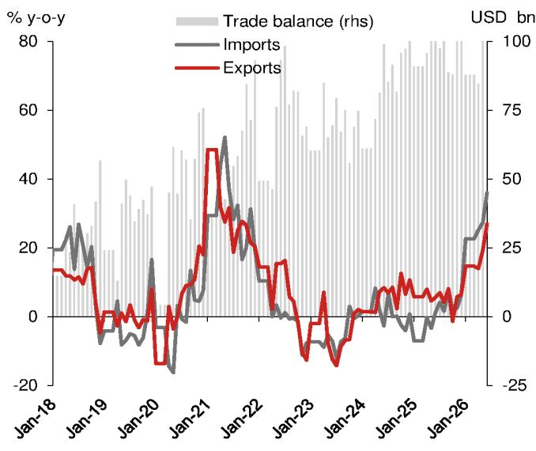
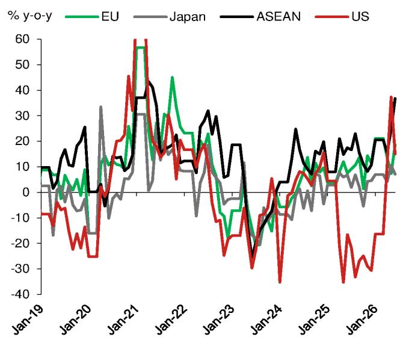
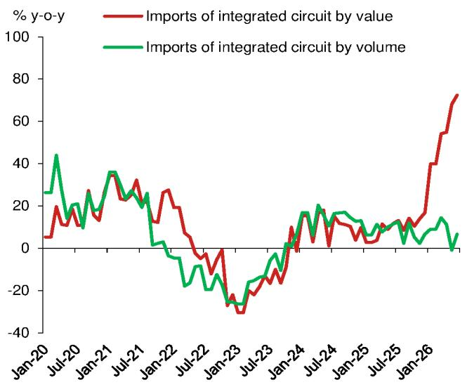
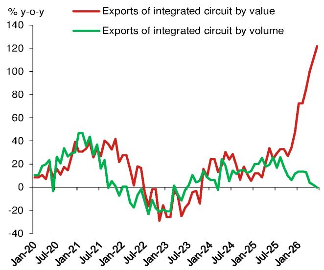
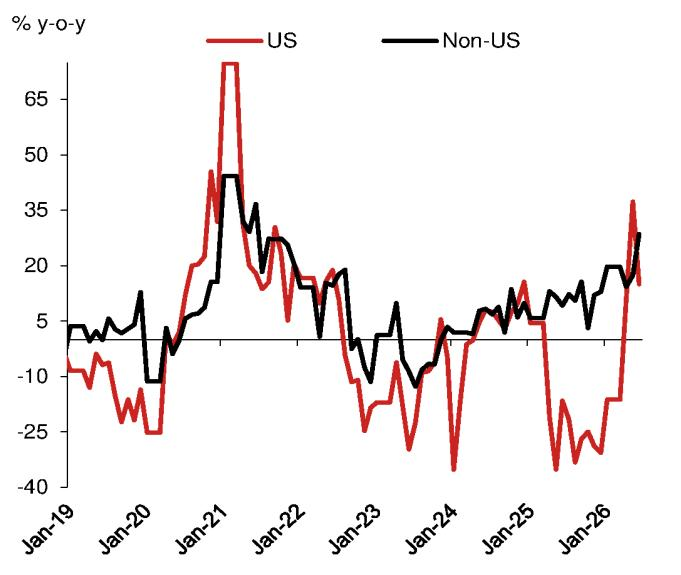
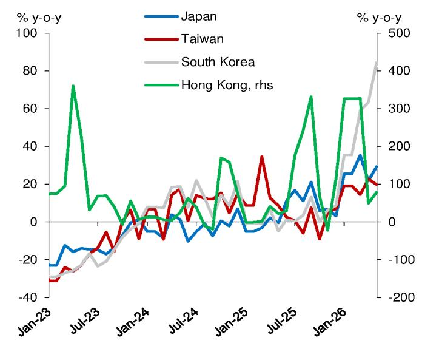

# 宏观观察：6月进出口增速均有所回升

## 出口与进口增速双双走高

以美元计，6月出口同比增速升至27.0%（市场预期：19.0%；前值：16.2%），高于预期，较5月的19.4%明显上升。进口增速亦从5月的27.4%升至6月的36.0%，同样高于市场预期（市场预期：26.1%；前值：26.2%）。受此影响，6月贸易顺差从5月的1054亿美元进一步扩大至1256亿美元，创下月度顺差的历史新高。

正如我们近几个月所指出的，半导体贸易的活跃仍是6月出口和进口高增长的主要驱动因素，价值增长与数量增长之间的差距依然较大，芯片价格的持续上涨超过了数量增长的影响。据我们估算，集成电路对6月整体出口增长的贡献约为6.5个百分点。加上与当前全球人工智能发展密切相关的自动数据处理设备（贡献额外2.9个百分点），与人工智能相关的出口合计贡献了整体出口增长的9.4个百分点。尽管对总出口增长的贡献比例较前两个月略有回落，芯片仍是相对的主要驱动力，凸显了全球人工智能周期的重要作用。此外，价格因素在6月出口和进口增长中继续扮演重要角色。汽车也是6月出口增长的关键驱动因素，其贡献仅次于人工智能相关产品。

对美出口增速从5月的37.3%明显放缓至6月的15.0%，主要受基数效应影响，但仍保持两位数增长。对欧盟和东盟的出口增速则有所上升，其中对欧盟出口增速从5月的7.3%升至6月的18.6%，反映了持续的贸易不平衡状况，正如我们近期指出的，下半年相关贸易关系可能面临更多关注。

进口方面，原油进口量继续明显收缩，6月同比下降41.3%（5月：-29.0%），拖累进口增长0.6个百分点，这反映了在价格较高背景下采购量的主动调整。更大的驱动因素仍是集成电路，仅此一项就为6月进口增长贡献了11.9个百分点。从韩国进口的增速从5月的84.3%进一步升至6月的84.8%，也显示出技术类进口的强劲势头。

## 半导体贸易的价值增长态势保持完整

由人工智能驱动的全球技术周期继续支撑半导体贸易，6月价格与数量的分化依然明显。

- 集成电路出口价值增速从5月的111.0%进一步升至6月的122.3%，而数量增速则转为负值，为-0.4%（5月：2.1%），这意味着价格贡献约为122.7个百分点，价格效应超过100%，且较5月的108.8个百分点进一步扩大。
- 集成电路对6月整体出口增长的贡献为6.5个百分点（占总量的24.1%），其中价格效应贡献了全部增长，凸显了芯片价格上涨对名义出口增长的显著影响。
- 进口方面，集成电路在进口中的占比高于出口。集成电路进口价值增速从5月的68.0%升至6月的72.3%，数量增速则升至6.6%（5月：-1.0%），价格效应对6月增长的贡献为61.7个百分点，较5月的69.8个百分点有所收窄。
- 据我们计算，仅集成电路一项就贡献了6月整体进口增长的11.9个百分点（占32.9%），其中价格效应贡献了绝大部分。

## 对新兴市场出口增速普遍高于发达市场

发达市场方面，受基数效应影响，对美出口增速从5月的37.3%明显放缓至6月的15.0%，而对欧盟出口增速则从7.3%升至18.6%。在相关关系变化的背景下，对日出口增速从5月的10.7%降至6月的7.1%，而对韩出口增速则因芯片贸易活跃而从42.7%进一步升至43.7%。对新兴市场的出口普遍加速，对东盟、印度和非洲的出口增速分别从5月的24.7%、19.3%和18.6%升至6月的36.8%、40.8%和28.0%。

## 对美贸易增长仍处较高水平

随着有利基数效应消退，对美出口增速从5月的37.3%降至6月的15.0%。不过，由于增速仍处较高水平，对美出口累计增速在6月转正，从5月的-2.7%升至0.2%。考虑到2025年下半年对美出口平均增速为-27.7%，2026年下半年基数效应仍将提供支撑。随着相关关税框架的延续，近几个月可能出现了部分对美出口的前置现象。尽管新的贸易安排可能对约300亿美元的非敏感商品互惠降低关税，但这可能仅覆盖对美出口的约10%左右。

从美国进口的增速从5月的20.4%进一步升至6月的25.2%，这可能与农产品采购的增加有关。大豆进口总量增速从5月的-10.3%回升至6月的18.8%。受此影响，对美贸易顺差从5月的260亿美元和2025年6月的267亿美元扩大至6月的289亿美元。作为相关协议的一部分，飞机采购的恢复应有助于从美国的进口。6月26日，国内最大的航空公司宣布将购买7架波音飞机，金额约36.2亿美元，并有权选择额外购买3架，总潜在价值为52.4亿美元。

## 电子产品出口增速持续走高

在全球人工智能周期背景下，电子产品出口价值增速持续走高，主要受价格效应而非实际数量驱动。集成电路出口增速从5月的111.0%进一步升至6月的121.9%，全球芯片价格仍处高位。自动数据处理设备及部件（主要是计算机及其零件）出口增速在6月保持53.2%的高位（5月：66.1%）。手机出口增速从5月的43.9%放缓至6月的27.8%，同样受投入成本上升带来的价格效应驱动。

运输设备方面，在全球电动汽车需求增长的背景下，汽车（含底盘）出口增速从5月的39.3%升至6月的69.5%。汽车零部件出口增速也从5月的5.1%明显升至6月的19.0%。船舶出口增速从5月的29.7%进一步升至6月的42.4%。

劳动密集型产品出口增速在6月普遍改善。其中，服装、鞋类、箱包和玩具的出口增速分别为3.0%、-1.1%、1.7%和-6.4%，均高于5月的-4.1%、-10.3%、-4.9%和-7.0%。

## 进口增速在能源和芯片价格上涨背景下继续加快

进口增速也从5月的27.4%升至6月的36.0%，高于市场预期（市场预期：26.1%；前值：26.2%），主要受除石油外的主要大宗商品进口回升以及人工智能相关技术产品的价格效应推动。

除石油外的普通进口价值增速从5月的12.1%升至6月的33.5%，受人工智能相关产品以及除石油外的主要大宗商品共同驱动。与人工智能关联度更高的加工贸易进口价值增速从5月的44.9%进一步升至6月的51.2%，受包括存储芯片在内的人工智能相关产品价格上涨推动。集成电路进口价值增速从5月的68.0%进一步升至6月的72.3%，数量增速则从-1.1%回升至6.6%。

原油进口方面，受价格和数量双重因素影响，价值增速从5月的15.3%明显降至6月的-7.4%。数量方面，尽管油价回落，6月同比降幅仍从5月的-29.0%扩大至-41.3%。

其他主要大宗商品的进口数量增速在6月普遍回升。煤炭和大豆的进口数量增速分别从5月的-7.7%和-15.3%回升至6月的29.5%和7.8%。铁矿石进口数量增速从5月的-0.4%回升至6月的6.4%。铜进口数量增速从5月的4.7%小幅降至6月的4.0%。

---

**图1：商品贸易相关指标**

| 商品贸易相关指标 | 2026年6月 | 2026年5月 | 2026年Q2 | 2026年Q1 | 2025年 | 2024年 |
|---|---|---|---|---|---|---|
| 出口（同比%） | 27.0 | 19.4 | 20.2 | 14.7 | 5.4 | 5.8 |
| 按目的地：美国 | 15.0 | 37.3 | 20.1 | -16.3 | -20.0 | 4.9 |
| 欧盟 | 18.6 | 7.3 | 13.1 | 21.1 | 8.4 | 3.0 |
| 日本 | 7.1 | 10.7 | 7.3 | 6.9 | 3.5 | -3.5 |
| 东盟 | 36.8 | 24.7 | 25.1 | 20.5 | 13.4 | 12.0 |
| 进口（同比%） | 36.0 | 27.4 | 29.5 | 23.2 | 0.2 | 1.0 |
| 按来源地：美国 | 25.2 | 20.8 | 18.6 | -17.6 | -14.6 | -0.1 |
| 按贸易方式： | | | | | | |
| 普通进口 | 25.3 | 12.5 | 11.8 | 11.8 | -4.2 | -3.1 |
| 非油普通进口 | 33.5 | 12.1 | 19.0 | 16.4 | -3.1 | -2.8 |
| 原油进口 | -7.4 | 15.3 | 7.0 | -4.7 | -8.8 | -3.9 |
| 加工贸易进口 | 51.2 | 44.9 | 43.5 | 34.8 | 11.9 | 5.7 |
| 大宗商品（数量） | | | | | | |
| 原油 | -41.3 | -29.0 | -30.3 | 8.9 | 4.4 | -1.9 |
| 铁矿石 | 6.4 | -0.4 | 2.3 | 10.5 | 1.8 | 4.9 |
| 铜 | 4.0 | 4.7 | 3.6 | -14.2 | -6.4 | 3.4 |
| 煤炭 | 29.5 | -7.7 | 2.1 | 1.3 | -9.6 | 14.4 |
| 大豆 | 7.8 | -15.3 | 4.1 | -3.1 | 6.5 | 5.7 |
| 贸易差额（十亿美元） | 126 | 105 | 316 | 262 | 1181 | 993 |
| 按目的地：美国 | 26 | 26 | 76 | 49 | 280 | 361 |

数据来源：海关总署、Wind、NOM全球经济研究

**图2：主要产品出口情况**

| 主要出口商品（美元计） | 2026年6月 | 2026年5月 | 2026年Q2 | 2026年Q1 | 2025年 | 2024年 | 2026年6月对出口增长贡献（百分点） |
|---|---|---|---|---|---|---|---|
| | 同比% | | | | | | |
| 车辆 | | | | | | | |
| 汽车及底盘 | 69.5 | 39.3 | 50.4 | 58.5 | 21.4 | 15.5 | 2.30 |
| 汽车零部件 | 19.0 | 5.1 | 10.2 | 4.7 | 2.5 | 6.6 | 0.48 |
| 电子产品 | | | | | | | |
| 自动数据处理设备及部件 | 53.2 | 66.1 | 55.3 | 26.7 | -1.4 | 9.9 | 2.91 |
| 集成电路 | 122.3 | 111.0 | 111.4 | 77.5 | 26.6 | 17.3 | 6.48 |
| 手机 | 27.8 | 43.9 | 27.0 | -4.7 | -9.4 | -3.2 | 0.63 |
| 音视频设备及零件 | 12.4 | 19.1 | 13.1 | 13.2 | 5.5 | 4.6 | 0.13 |
| 液晶显示面板 | 9.4 | -5.2 | 0.4 | 15.3 | 11.0 | 9.0 | 0.08 |
| 机械产品 | | | | | | | |
| 通用机械设备 | 15.2 | 2.4 | 4.6 | 7.1 | 6.1 | 14.2 | 0.27 |
| 船舶 | 42.4 | 29.7 | 15.9 | 48.7 | 27.0 | 57.3 | 0.58 |
| 医疗设备 | 17.0 | 17.3 | 16.4 | 11.5 | 6.0 | 7.0 | 0.09 |
| 房地产相关产品 | | | | | | | |
| 陶瓷产品 | -48.9 | -53.2 | -52.6 | 9.2 | -3.3 | -15.7 | -0.33 |
| 家用电器 | 15.4 | 9.5 | 10.6 | 1.5 | -3.9 | 14.0 | 0.38 |
| 照明及零件 | -4.3 | -11.8 | -11.7 | -5.3 | -12.4 | -0.2 | -0.05 |
| 家具及零件 | 9.0 | 1.9 | 2.3 | 3.0 | -6.2 | 5.7 | 0.15 |
| 大宗商品及工业品 | | | | | | | |
| 钢材 | 10.3 | -2.3 | -0.4 | -10.8 | -1.3 | -1.1 | 0.21 |
| 未锻造铝及铝材 | 76.9 | 38.4 | 48.0 | 16.5 | -3.3 | 15.2 | 0.40 |
| 石油制品 | 30.6 | 35.6 | 24.4 | 3.6 | -8.5 | -13.3 | 0.31 |
| 稀土 | 178.8 | 237.4 | 202.1 | -9.0 | 4.6 | -36.0 | 0.01 |
| 农产品 | 20.0 | 5.1 | 9.5 | 5.3 | 1.1 | 4.1 | 0.50 |
| 水产品 | 10.5 | -1.2 | 3.3 | -3.8 | 0.0 | 1.3 | 0.05 |
| 粮食 | 23.1 | -25.5 | -9.2 | 8.8 | 27.3 | -18.9 | 0.01 |
| 化肥 | -54.8 | 7.5 | -16.4 | 22.6 | 57.9 | -11.5 | -0.23 |
| 中药材及中成药 | 33.5 | -1.2 | 13.2 | 10.8 | -7.2 | -0.4 | 0.01 |
| 劳动密集型产品 | | | | | | | |
| 塑料制品 | 17.5 | 12.7 | 12.8 | 7.5 | -1.4 | 5.2 | 0.52 |
| 箱包及容器 | 1.7 | -4.9 | -4.7 | -1.1 | -13.5 | -3.3 | 0.02 |
| 服装及衣着附件 | 3.0 | -4.1 | -0.9 | -0.4 | -5.0 | 0.0 | 0.14 |
| 鞋类 | -1.1 | -10.3 | -9.1 | -8.0 | -11.3 | -5.0 | -0.01 |
| 玩具 | -6.4 | -7.0 | -8.4 | -14.8 | -12.7 | -1.7 | -0.07 |
| 纺织纱线、织物及制品 | 12.2 | -0.3 | 4.2 | 2.8 | 0.4 | 5.5 | 0.45 |
| 机电产品 | 34.3 | 27.4 | 27.4 | 21.4 | 8.3 | 7.4 | 20.49 |
| 高新技术产品 | 52.6 | 51.0 | 47.6 | 28.6 | 7.4 | 4.7 | 12.63 |

注：主要产品按HS编码重新组合。农产品、机电产品和高新技术产品为更广泛的类别，可能相互重叠并与其他主要产品重叠。

**图3：出口增速、进口增速与贸易差额**

注：我们使用1-3月数据的平均值以大致平滑春节因素影响。
数据来源：海关总署、Wind、NOM全球经济研究

**图4：按目的地划分的出口构成**

注：我们使用1-3月数据的平均值以大致平滑春节因素影响。
数据来源：海关总署、Wind、NOM全球经济研究

**图5：集成电路进口增速——价值增长与数量增长的明显分化**

数据来源：海关总署、Wind、NOM全球经济研究

**图6：集成电路出口增速——价值增长与数量增长的巨大分化**

数据来源：海关总署、NOM全球经济研究

**图7：对美出口增速与非美目的地出口增速**

注：我们使用1-3月数据的平均值以大致平滑春节因素影响。
数据来源：海关总署、Wind、NOM全球经济研究

**图8：按贸易方式划分的进口构成**

数据来源：海关总署、Wind、NOM全球经济研究

---

*本文内容仅供研究参考，不构成任何操作建议。*
