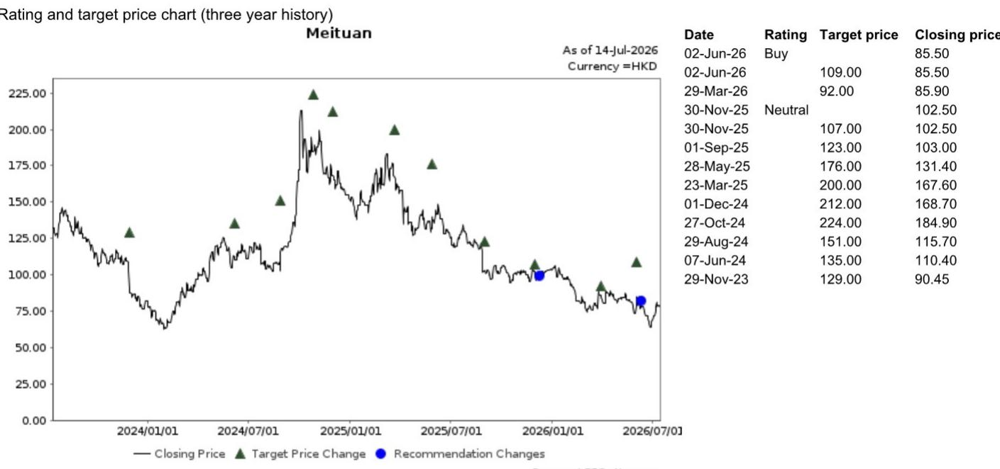
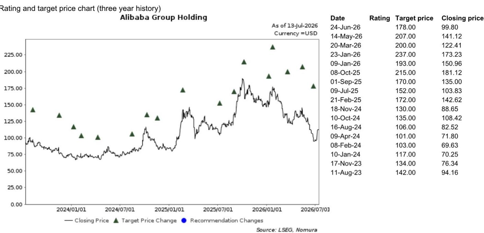
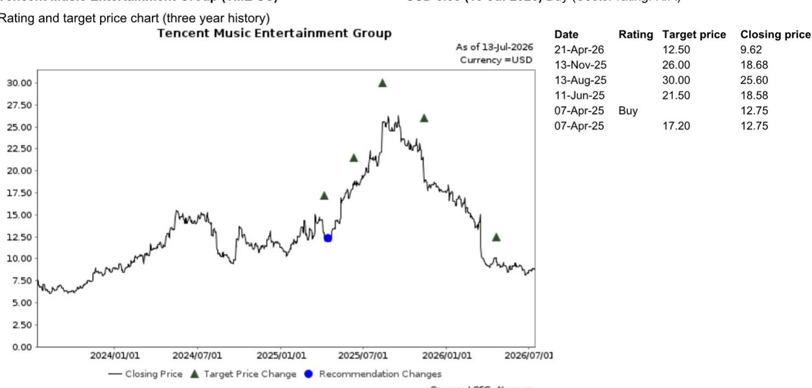

# 中国互联网与新媒介

## 互联网经济领域的专家洞察

来自OTA、电子商务和生成式AI行业的10位专家的综合见解

NOM中国互联网团队近期举办了2026年中中国互联网洞察专家电话会议系列。共邀请了10位行业专家，就本地生活服务、AI音乐、中国电子商务、跨境电商、旅行、大语言模型、在线医疗、短剧和AI动画等多个垂直领域分享了见解。以下提供这些电话会议的核心要点。请参阅每个核心要点下提供的链接，获取每位专家的详细见解。

## 据专家称，抖音本地生活服务业务目标是在2026年下半年某个时间点实现盈亏平衡

据专家称，Moonshot AI（未上市；一家领先的中国生成式AI初创公司）的年度经常性收入预计将在年底前超过10亿美元，主要受海外API使用和强大的AI编码能力驱动。除AI编码外，专家认为下一个增长前沿将是医疗、教育和金融行业的AI解决方案，在这些领域，高质量的专有数据将成为除专业AI能力之外的关键差异化因素。为了保护利润率并改善变现，Moonshot正转向对其旗舰模型采用闭源策略，同时利用国产芯片降低推理成本。虽然专家认为像Moonshot这样的纯AI实验室可能通过保持专注而超越大型互联网平台，但我们仍然认为，像阿里巴巴和字节跳动（未上市）这样的主要互联网平台由于其雄厚的资金、数据生态系统以及拥有最先进大语言模型的战略需求，仍然是强大的竞争者。

## Moonshot AI专家：闭源大语言模型是大规模变现的可行路径

来自Moonshot AI专家电话会议的要点

据专家称，抖音本地生活服务板块在2026年上半年继续保持稳健增长，退款/取消前的总交易额约为5510亿元人民币（同比增长44%）。相比之下，我们预计美团（3690 HK）同期到店板块的总交易额为6290亿元人民币（同比增长11%）。然而，专家指出，2026年上半年抖音本地生活服务的核销率约为57-58%，而根据我们的估计，美团的核销率可能远高于80%。因此，净交易额的差距可能比总交易额所显示的更大。专家认为，在本地生活服务领域，美团展现出比抖音更成熟和精细的运营框架。美团的运营优势主要源于高度个性化的补贴设计、先进的会员运营以及优越的跨场景交易转化。

研究分析师

中国互联网与新媒介

Jialong Shi - NIHK
Jialong.shi@NOM.com
+852 2252 1409

Rachel Guo - NIHK

据专家称，抖音本地生活服务的品类结构正在演变：酒店和旅行板块已成为主要增长驱动力，得益于强劲的酒店预订业务，而到店餐饮和购物则受到宏观环境的更大影响。据专家称，抖音本地生活服务业务的战略重点似乎正从纯粹的总交易额扩张转向提升变现和盈利能力，该平台可能目标是在2026年下半年某个时间点实现盈亏平衡。为此，专家强调了抖音提升盈利能力的努力，包括今年对所有品类更严格地收取佣金，这反映出对变现的优先考虑超过了激进的规模扩张。

rachel.guo@NOM.com +852 2252 1400

来自抖音本地生活服务专家电话会议的要点

## 大语言模型专家：开源并非公开的蓝图

专家指出，高端英伟达芯片持续供应紧张和价格上涨，使得国产AI加速器越来越有吸引力。虽然中国模型提供商普遍在降低token价格，但专家强调了基础模型和高级模型之间的明显分化。提供商正在积极降低处理标准化任务的基础模型的价格以获取客户，同时对其高级模型维持溢价定价。专家认为，模型提供商可以通过将模型深度嵌入企业工作流程来增强企业客户忠诚度。这种整合使得切换模型变得非常耗时且成本高昂，从而有效阻止客户流失。

专家认为，DeepSeek（未上市）在推理工作负载期间凭借卓越的运营效率拥有独特的成本优势。这种效率对于托管相同开源DeepSeek模型的其他平台来说极难复制。专家认为，金融服务、办公效率、编码、制造、法律和医疗是最有可能率先采用大语言模型的行业。因此，据专家称，这些行业预计将成为大语言模型提供商未来的核心收入来源。

来自大语言模型专家电话会议的要点

## Soda Music：借助AI音乐获取市场份额

据专家称，字节跳动（未上市）旗下的音乐流媒体平台Soda Music，截至2026年5月已达到约5000万日活跃用户和1.5亿月活跃用户，日活跃用户预计年底将达到约6000万，同比增长约50%，而2025年增长近100%。专家认为，这种放缓反映了抖音流量导流的边际收益递减，因为可转化的用户池几乎接近饱和。专家指出，由于用户基础稀释以及来自短剧和小说等内容的竞争，日均用户使用时长已从峰值的60-70分钟下降至约50分钟。该平台与Tomato Music存在内部竞争，尽管用户画像不同：Soda Music针对更年轻和更多男性用户，而Tomato则面向年龄较大、女性为主的用户群体。专家预计短期内这两个平台没有合并计划。

据专家称，Soda Music在2026财年的收入可能增长30%，主要由广告增长驱动，其收入结构约为70%来自广告，30%来自订阅——这与腾讯音乐以订阅为主的模式不同。据专家称，Soda Music要求盈亏平衡运营，限制了版权支出和整理版内容获取。尽管与同行（即腾讯音乐和网易云音乐）相比版权覆盖较少，但专家认为，鉴于字节跳动在AI方面的大量投入、与内部AI团队的紧密联系以及抖音庞大的数据生态系统（能够更好地理解用户偏好和发现趋势），Soda Music在AI音乐开发方面可能具有优势。

尽管围绕AI生成混音的侵权担忧已引起行业参与者的关注，但专家认为，在猫鼠游戏中，很难阻止AI生成混音的扩散。关于线下演唱会和粉丝经济业务，专家表示Soda Music不太可能追求资源密集型项目，包括大型偶像演唱会和K-pop风格的粉丝活动。相反，它将继续执行小规模、由赞助商资助的线下活动（三四线城市音乐节、校园活动），作为成本效益高的用户获取渠道。

来自Soda Music专家电话会议的要点

## 抖音电商在规模增长与盈利能力之间寻求平衡

抖音2026年618商品交易总额增长未达内部目标（同比增长约19%，而预期为24%-25%），原因是整体电商行业增速放缓，受消费减弱和以旧换新补贴贡献减少的影响。作为一名基层运营经理，专家认为抖音电商正在执行战略转型，从激进的收入增长转向平衡增长模式，优先考虑盈利能力，为其AI基础设施和大语言模型（例如火山引擎和豆包）提供资金。因此，专家认为，2026财年商品交易总额的合理增长目标应为同比增长15%-16%（而2025财年为同比增长29%），低于年初设定的19%目标。

专家还指出，豆包与抖音电商之间的合作，即代理型商务，仍处于早期阶段。尽管如此，专家认为这是明年的最重要战略举措之一。目前的重点不在于短期的商品交易总额贡献，而是产品迭代、数据整合、供应链整合以及产品目录理解。据专家称，豆包需要处理和理解庞大的产品库，然后才能作为有效的AI购物助手。

来自抖音电商专家电话会议的要点

## 航空旅行专家：运量下降和监管收紧给机票行业带来挑战

据专家称，2026年上半年中国航空公司承运的航空旅客总量达到3.75亿人次，同比增长1%。然而，增长轨迹极不均衡。虽然2026年第一季度录得约7%的同比增长，但第二季度出现了4-5%的同比下降。这一收缩主要是由中东地缘政治冲突导致的燃油价格飙升引起的。

展望夏季出行高峰季节（7月和8月），专家持谨慎态度，预计航空旅客量将同比下降4%。尽管燃油附加费已开始下降，且民航局在6月份开始下调，但同比来看仍处于高位。

此外，由主要航空公司改变佣金和分销政策所引发的监管环境收紧，目前正对在线旅行社的机票收入构成影响。

来自航空旅行专家电话会议的要点

## TikTok Shop物流专家：对极兔速递的积极交叉影响

专家指出，TTS的电商增长依然强劲，2026年上半年商品交易总额达到约350亿美元。东南亚和美国仍是主要贡献者，2026年上半年增长约一倍。据专家称，对于极兔速递而言，近期前景仍受其与TTS深度整合的支撑。凭借其强大的履约能力、广泛的网络覆盖和成本优势，极兔在大多数东南亚市场继续处理TTS包裹的非常高份额。在印度尼西亚，监管审查可能促使TTS引入更多区域物流供应商，但专家认为，鉴于极兔的规模、服务质量以及与潜在引入的区域参与者相比的成本竞争力，其近期份额损失风险可能是可控的。此外，据专家称，轻资产的第三方物流和本地仓库生态系统在东南亚比资本密集型的FBT模式更适合TTS，尤其是在该地区平均订单价值相对较低的情况下。

来自TikTok Shop物流专家电话会议的要点

## AI制作剧专家：AI在短剧业务中的局限性充分显现

红果最初完全依靠真人演员的实拍短剧建立业务。然而，自去年以来，鉴于AI工具的进步和AI生成内容的成本优势，该平台加大了对AI生成剧集的激励。据专家称，通过利用实拍和AI生成剧集的双重增长，红果的应用保持了强劲的用户增长势头，其旗舰短剧应用在2026年6月达到1.2亿日活跃用户和3.3亿月活跃用户，其独立动画剧应用达到1650万日活跃用户和4000万月活跃用户。同时，据专家称，在商业化方面，除了红果平台上产生的150亿元人民币电商商品交易总额外，红果的核心收入同比增长约87%至200亿元人民币，其中广告贡献约97%。专家预计全年核心收入将达到420-450亿元人民币，意味着同比弹性较高。

然而，红果对AI生成内容变得更加谨慎。专家指出，此类AI生成内容的副作用也已显现，包括内容质量较低、流行周期较短以及与观众的情感共鸣较弱，这可能导致用户留存率下降、用户使用时长缩短，从而削弱平台的广告价值，尤其是对品牌广告主而言。因此，据专家称，AI生成内容目前占总观看量的不到30%，红果现在正使用推荐权重、收入分成调整和更严格的内容审核，将其份额控制在该水平以下。

总体而言，专家表示，AI生成剧集对用户获取、内容供应和生产效率仍然是有利的，但红果不太可能不计成本地追求AI增长。据专家称，红果似乎优先考虑生态系统健康和可持续的广告变现。另外，我们认为，红果控制AI生成内容增长的决定可能会影响视频生成AI工具（如Seedance）的商业化，因为动画工作室很可能是此类AI工具的关键客户群。

来自短剧平台专家电话会议的要点

## 附录A-1

本报告由NOM International (Hong Kong) Ltd. (NIHK) 编制。关于NOM集团实体的详细信息，请参阅免责声明。

## 分析师认证

我们，Rachel Guo 和 Jialong Shi，特此证明：(1) 本研究报告中所表达的观点准确反映了我们个人对所述任何或所有标的证券或发行人的看法；(2) 我们的薪酬中没有任何部分直接或间接与本研究报告中的具体推荐或观点相关；(3) 我们的薪酬中没有任何部分与NOM Securities International, Inc.、NOM International plc或任何其他NOM集团公司执行的任何特定投资银行业务挂钩。

## 发行人特定监管披露

本文中使用的术语"NOM"和"NOM集团"指NOM Holdings, Inc.及其关联公司和子公司，包括NOM Securities International, Inc. ('NSI') 和 Instinet, LLC ('ILLC')，均为美国注册经纪交易商和SIPC成员。

主要提及的发行人

<table><tr><td>发行人</td><td>代码</td><td>价格</td><td>价格日期</td><td>股票评级</td><td>行业评级</td><td>披露</td></tr><tr><td>极兔速递</td><td>1519 HK</td><td>HKD 9.15</td><td>14-Jul-2026</td><td>买入</td><td>不适用</td><td></td></tr><tr><td>美团</td><td>3690 HK</td><td>HKD 79.20</td><td>14-Jul-2026</td><td>买入</td><td>不适用</td><td>A10</td></tr><tr><td>阿里巴巴集团控股</td><td>BABA US</td><td>USD 112.35</td><td>13-Jul-2026</td><td>买入</td><td>不适用</td><td>A10</td></tr><tr><td>腾讯音乐娱乐集团</td><td>TME US</td><td>USD 8.83</td><td>13-Jul-2026</td><td>买入</td><td>不适用</td><td></td></tr></table>

A10 NOM集团是该发行人证券/相关衍生品的注册做市商。

  
评级说明请参见图表后的股票评级键

估值方法 我们使用EV/EBIT作为主要估值方法，基于18倍2026财年预期EV/EBIT得出目标价HKD14。该股票的基准指数为恒生指数。可能阻碍目标价实现的风险：下行风险：1) 市场竞争加剧；2) 包裹量增长慢于预期；3) 成本优化弱于预期；4) 特定国家监管风险

<table><tr><td>日期</td><td>评级</td><td>目标价</td><td>收盘价</td></tr><tr><td>24-Jun-26</td><td></td><td>178.00</td><td>99.80</td></tr><tr><td>14-May-26</td><td></td><td>207.00</td><td>141.12</td></tr><tr><td>20-Mar-26</td><td></td><td>200.00</td><td>122.41</td></tr><tr><td>23-Jan-26</td><td></td><td>237.00</td><td>173.23</td></tr><tr><td>09-Jan-26</td><td></td><td>193.00</td><td>150.96</td></tr><tr><td>08-Oct-25</td><td></td><td>215.00</td><td>181.12</td></tr><tr><td>01-Sep-25</td><td></td><td>170.00</td><td>135.00</td></tr><tr><td>09-Jul-25</td><td></td><td>152.00</td><td>103.83</td></tr><tr><td>21-Feb-25</td><td></td><td>172.00</td><td>142.62</td></tr><tr><td>18-Nov-24</td><td></td><td>130.00</td><td>88.65</td></tr><tr><td>10-Oct-24</td><td></td><td>135.00</td><td>108.42</td></tr><tr><td>16-Aug-24</td><td></td><td>106.00</td><td>82.52</td></tr><tr><td>09-Apr-24</td><td></td><td>101.00</td><td>71.80</td></tr><tr><td>08-Feb-24</td><td></td><td>103.00</td><td>69.63</td></tr><tr><td>10-Jan-24</td><td></td><td>117.00</td><td>70.25</td></tr><tr><td>17-Nov-23</td><td></td><td>134.00</td><td>76.34</td></tr><tr><td>11-Aug-23</td><td></td><td>142.00</td><td>94.16</td></tr></table>

HKD 79.20 (14-Jul-2026) 买入 (行业评级: 不适用)  

<table><tr><td>日期</td><td>评级</td><td>目标价</td><td>收盘价</td></tr><tr><td>02-Jun-26</td><td>买入</td><td></td><td>85.50</td></tr><tr><td>02-Jun-26</td><td></td><td>109.00</td><td>85.50</td></tr><tr><td>29-Mar-26</td><td></td><td>92.00</td><td>85.90</td></tr><tr><td>30-Nov-25</td><td>中性</td><td></td><td>102.50</td></tr><tr><td>30-Nov-25</td><td></td><td>107.00</td><td>102.50</td></tr><tr><td>01-Sep-25</td><td></td><td>123.00</td><td>103.00</td></tr><tr><td>28-May-25</td><td></td><td>176.00</td><td>131.40</td></tr><tr><td>23-Mar-25</td><td></td><td>200.00</td><td>167.60</td></tr><tr><td>01-Dec-24</td><td></td><td>212.00</td><td>168.70</td></tr><tr><td>27-Oct-24</td><td></td><td>224.00</td><td>184.90</td></tr><tr><td>29-Aug-24</td><td></td><td>151.00</td><td>115.70</td></tr><tr><td>07-Jun-24</td><td></td><td>135.00</td><td>110.40</td></tr><tr><td>29-Nov-23</td><td></td><td>129.00</td><td>90.45</td></tr></table>

评级说明请参见图表后的股票评级键  
估值方法 我们将外卖业务估值160亿美元，基于7倍2028财年预期市盈率并折现至2026财年。我们将即时购物业务估值50亿美元，基于15倍2027财年预期市盈率并折现至2026财年。我们将到店、酒店和旅行业务估值210亿美元，基于8倍2027财年预期市盈率并折现至2026财年。我们将新业务估值280亿美元，基于1.5倍2026财年预期市销率。由此得出的目标价为HKD109。该股票的基准指数为恒生指数。可能阻碍目标价实现的风险：下行风险包括：(1) 外卖或到店消费领域的竞争加剧；(2) 新业务表现不及预期。

USD 112.35 (13-Jul-2026) 买入 (行业评级: 不适用)  
  
评级说明请参见图表后的股票评级键  
估值方法 我们将阿里巴巴的中国电商业务估值890亿美元，基于5倍2027财年预期市盈率；其阿里云业务估值2700亿美元，基于7倍2028财年预期市销率；其非核心资产（包括国际电商业务）的净估值为400亿美元。由此得出的目标价为USD178。该股票的基准指数为纳斯达克综合指数。可能阻碍目标价实现的风险：下行风险包括：因投资增加导致的利润率下行风险；与支付和互联网金融行业相关的监管风险，可能损害阿里巴巴的主营业务及其在蚂蚁集团的价值。

USD 8.83 (13-Jul-2026) 买入 (行业评级: 不适用)  
  
评级说明请参见图表后的股票评级键

估值方法 我们将腾讯音乐的在线音乐订阅业务估值47亿美元（2026财年预期市盈率6倍），非订阅音乐业务估值87亿美元（2026财年预期市盈率20倍），社交娱乐业务估值8.04亿美元（2026财年预期市盈率3倍）。由此得出的目标价为USD12.50。该股票的基准指数为纳斯达克综合指数。

可能阻碍目标价实现的风险：下行风险：在线音乐用户使用时长流失高于预期；在线音乐服务付费用户增长低于预期；用户对更高价格的SVIP渗透率低于预期；对腾讯音乐广告和直播等变现举措的监管进一步收紧。

## 重要披露

## 研究报告的在线获取及利益冲突披露

NOM集团的研究报告可在www.NOMnow.com/research、Bloomberg、Capital IQ、Factset、LSEG上获取。

重要披露信息可于http://go.NOMnow.com/research/m/Disclosures阅读，或向NOM Securities International, Inc.索取。如果您在访问网站时遇到任何困难，请发送电子邮件至grpsupport@NOM.com寻求帮助。

负责编制本报告的分析师的薪酬基于多种因素，包括公司的总收入，其中一部分来自投资银行业务。除非另有说明，本报告首页列出的非美国分析师未在FINRA规则下注册/具备研究分析师资格，可能不是NSI的关联人士，并且可能不受FINRA Rule 2241关于与所覆盖公司沟通、公开露面以及研究分析师账户持有证券交易等限制的约束。

NOM Global Financial Products Inc. (NGFP)、NOM Derivative Products Inc. (NDP) 和 NOM International plc. (NIplc) 已在美国商品期货交易委员会和美国国家期货协会注册为掉期交易商。NGFP、NDPI和NIplc主要从事掉期及其他衍生品交易，其中任何一项均可能成为本报告的主题。

## 评级分布 (NOM集团)

NOM集团全球股票研究部发布的所有评级的分布如下：

58% 被授予报告评级，出于强制披露目的，该评级被归类为报告评级；其中33%的公司是NOM集团的投资银行客户\*。0% 具有此评级的公司（在EEA受监管市场上市交易）曾接受NOM集团提供的重大服务\*\*。

39% 被授予中性评级，出于强制披露目的，该评级被归类为持有评级；其中57%的公司是NOM集团的投资银行客户\*。0% 具有此评级的公司（在EEA受监管市场上市交易）曾接受NOM集团提供的重大服务。

3% 被授予减持评级，出于强制披露目的，该评级被归类为报告评级；其中15%的公司是NOM集团的投资银行客户\*。0% 具有此评级的公司（在EEA受监管市场上市交易）曾接受NOM集团提供的重大服务。

\*NOM集团的定义见本报告末尾的免责声明部分。

\*\* 根据欧盟市场滥用监管法规的定义

## NOM集团股票研究评级体系及行业定义

评级体系是一个相对体系，表明相对于为每只个股确定的特定基准的预期表现，并受有限的管理层酌情权约束。分析师的目标价是基于分析师确定的适当估值方法对股票当前内在公允价值的评估。估值方法包括但不限于贴现现金流分析、预期股本回报率和倍数分析。分析师也可能指出相对于所述目标价的预期相对涨跌幅度，定义为（目标价 - 当前价格）/ 当前价格。

## 股票

'买入'评级表示分析师预计该股票在未来12个月内将跑赢基准。'中性'评级表示分析师预计该股票在未来12个月内将表现与基准一致。'减持'评级表示分析师预计该股票在未来12个月内将跑输基准。'暂停'评级表示评级、目标价和估计已暂时暂停，以遵守适用的法规和/或公司政策。标记为'未评级'或显示为'无评级'的证券和/或公司不在常规研究覆盖范围内。读者不应期望NOM就此类证券和/或公司提供持续或额外的信息。基准如下：美国/欧洲/亚洲（除日本）：请参阅估值方法了解股票相关基准的解释，可访问：http://go.NOMnow.com/research/m/Disclosures；全球新兴市场（除亚洲）：MSCI新兴市场（除亚洲）指数，除非估值方法中另有说明；日本：Russell/NOM大盘指数。

## 行业

'看多'立场表示分析师预计该行业在未来12个月内将跑赢基准。'中性'立场表示分析师预计该行业在未来12个月内将表现与基准一致。'看空'立场表示分析师预计该行业在未来12个月内将跑输基准。标记为'未评级'或显示为'不适用'的行业未被分配评级。基准如下：美国：标普500指数；欧洲：道琼斯STOXX 600指数；全球新兴市场（除亚洲）：MSCI新兴市场（除亚洲）指数。日本/亚洲（除日本）：不分配行业评级。

## 目标价

如果讨论到目标价，它表示分析师对12个月时间范围内股价的预测，部分反映了分析师对公司盈利的估计。任何目标价的实现都可能受到总体市场和宏观经济趋势、与公司或市场相关的其他风险的阻碍，并且如果公司的盈利与估计不符，则可能无法实现。

## 免责声明

本出版物包含由第1页确定的NOM集团实体编制的内容，并且（如适用）包含一个或多个NOM集团实体的贡献，其员工及其各自隶属关系在第1页或本出版物其他地方指定。本文中使用的术语"NOM集团"指NOM Holdings, Inc.及其关联公司和子公司，包括：(a) NOM Securities Co., Ltd. ('NSC') 日本东京，(b) NOM Financial Products Europe GmbH ('NFPE')，德国，(c) NOM International plc ('NIplc')，英国，(d) NOM Securities International, Inc. ('NSI')，美国纽约，(e) NOM International (Hong Kong) Ltd. ('NIHK')，香港，(f) NOM Financial Investment (Korea) Co., Ltd. ('NFIK')，韩国（关于在韩国金融投资协会注册的NOM分析师的信息可在KOFIA内联网http://dis.kofia.or.kr上找到），(g) NOM Singapore Ltd. ('NSL')，新加坡（注册号197201440E，受新加坡金融管理局监管），(h) NOM Australia Ltd. ('NAL')，澳大利亚（ABN 48 003 032 513），受澳大利亚证券和投资委员会监管，持有澳大利亚金融服务牌照号246412，(i) NOM Securities Malaysia Sdn. Bhd. ('NSM')，马来西亚，(j) NIHK, Taipei Branch ('NITB')，台湾，(k) NOM Financial Advisory and Securities (India) Private Limited ('NFASL')，印度孟买（注册地址：Ceejay House, Level 11, Plot F, Shivsagar Estate, Dr. Annie Besant Road, Worli, Mumbai- 400 018, India；电话：91 22 4037 4037，传真：91 22 4037 4111；CIN No: U74140MH2007PTC169116，证券经纪业务SEBI注册号：INZ000255633；商人银行业务SEBI注册号：INM000011419；研究业务SEBI注册号：INH000001014 - 合规官：Ms. Pratiksha Tondwalkar，91 22 40374904，投诉邮箱：investorgrievancesra@NOM.com 网页：链接

对于涉及印度上市公司或由印度NFASL研究分析师撰写的报告：(i) 证券市场投资存在市场风险。投资前请仔细阅读所有相关文件。(ii) SEBI授予的注册以及NISM的认证绝不保证中介机构的业绩或向读者提供任何回报保证。(iii) NFASL获取研究服务的条款和条件在NFASL网页上披露。

(I) NOM Fiduciary Research & Consulting Co., Ltd. ('NFRC') 日本东京。(m) NOM Orient International Securities Co., Ltd ("NOI")，是由NOM集团、东方国际（集团）有限公司和上海黄浦投资控股（集团）有限公司共同控股的合资企业。根据中华人民共和国法律（为本文件目的，不包括香港、澳门和台湾），NOI在中国境内获准提供证券研究和研究交流，并且独立于NOM集团其他成员运营；特别是，NOI在中国证券中的权益不会向任何其他NOM集团实体披露或与其持仓合并，其他NOM集团实体在中国证券中的权益也不会向NOI披露或与其持仓合并。研究报告首页上NOI旁边印有的个人姓名表明该个人受雇于NOI，根据研究合作协议为NIHK提供研究协助。研究报告首页上员工姓名旁的'NSFSPL'表明该个人受雇于NOM Structured Finance Services Private Limited，根据公司间协议为某些NOM实体提供协助。研究报告首页上个人姓名旁的'Verdhana'表明该个人受雇于PT Verdhana Sekuritas Indonesia ('Verdhana')，根据研究合作协议为NIHK提供研究协助，且Verdhana或该个人均未在印度尼西亚境外获得许可。

本材料：(I) 仅供您个人参考，我们不据此征求任何行动；(II) 不应被解释为在任何司法管辖区出售或征求购买任何证券的要约，如果此类要约或招揽在该司法管辖区属于非法行为；并且 (III) 除与NOM集团相关的披露外，基于我们认为可靠的来源信息，但未经NOM集团独立核实。

除与NOM集团相关的披露外，NOM集团不保证、陈述或承诺（明示或暗示）本文件是公平、准确、完整、正确、可靠或适合任何特定目的或适销的，并且在法律/法规允许的最大范围内，不对因使用本文件及相关数据而导致的任何行为（或决定不作为）承担责任（无论是因疏忽或其他原因，以及全部或部分）。在法律/法规允许的最大范围内，NOM集团的所有保证和其他承诺特此排除，NOM集团不对因使用、误用或分发本材料或其中包含的信息或以其他方式与之相关的任何损失承担责任（无论是因疏忽或其他原因，以及全部或部分）。

此处表达的意见或估计是截至原始发布日期的最新意见，并且本材料中的信息（包括其中包含的意见和估计）如有变更，恕不另行通知。然而，NOM集团明确表示不承担任何更新或修订本文件的义务，因此也没有责任。本文中的任何评论或陈述均为作者本人的观点，可能与NOM集团内部其他方持有的观点不同。客户应考虑本报告中的任何建议或推荐是否适合其特定情况，并在适当时寻求专业建议，包括税务建议。NOM集团不提供税务建议。

在适用法律/法规允许的范围内，NOM集团和/或其高级职员、董事、员工和关联方可能以委托人、代理人或其他身份进行交易，或者持有本文提及的发行人或证券的多头或空头头寸，或买入或卖出这些证券、商品或工具，或基于这些证券、商品或工具的期权或其他衍生工具。NOM集团公司也可能担任发行人金融工具的做市商或流动性提供者（根据英国适用法规的定义）。如果做市商活动是根据美国或其他司法管辖区的特定法律法规给出的定义进行的，则将在具体的发行人披露中单独披露。

本文件可能包含从第三方获得的信息，包括但不限于信用评级机构的评级，例如标准普尔。NOM集团特此明确否认对从第三方获得的任何信息（包括评级）的原创性、公平性、准确性、完整性、正确性、及时性或可用性作出任何陈述、保证或承诺，并且不对因使用或误用此类信息而导致的任何直接、间接、附带、示范性、补偿性、惩罚性、特殊或后果性损害、成本、费用、律师费或损失（包括收入或利润损失以及机会成本）承担责任（无论是因疏忽或其他原因，以及全部或部分）。禁止以任何形式复制和分发第三方内容，除非事先获得相关第三方的书面许可。第三方内容提供商不（明示或暗示）保证任何信息（包括评级）的公平性、准确性、完整性、正确性、及时性或可用性，并且不对因使用或误用此类内容而产生的任何错误或遗漏（无论原因如何）或结果负责。第三方内容提供商不提供明示或暗示的保证，包括但不限于任何适销性或特定用途适用性的保证。第三方内容提供商不对因使用或误用其内容（包括评级）而导致的任何直接、间接、附带、示范性、补偿性、惩罚性、特殊或后果性损害、成本、费用、律师费或损失（包括收入或利润损失以及机会成本）承担责任（无论是因疏忽或其他原因，以及全部或部分）。信用评级是意见陈述，而非事实陈述或购买、持有或出售证券的建议。它们不涉及证券的适合性或证券的投资目的适合性，不应被依赖为研究交流。本文件中的任何MSCI来源信息均为MSCI Inc.的专有财产。未经MSCI事先书面许可，不得为任何目的（包括创建任何金融产品和任何指数）全部或部分复制、转载、再传播、再分发或使用此信息及任何其他MSCI知识产权。此信息按"原样"提供。用户承担使用此信息的全部风险。MSCI、其关联方以及任何参与或涉及计算或编制信息的第三方特此明确否认对本材料或其中包含的信息或以其他方式与之相关的任何原创性、公平性、准确性、完整性、正确性、适销性或特定用途适用性的所有陈述、保证或承诺。在不限制前述规定的前提下，MSCI、其任何关联方或任何参与或涉及计算或编制信息的第三方在任何情况下均不对任何类型的损害承担责任（无论是因疏忽或其他原因，以及全部或部分）。MSCI和MSCI指数是MSCI及其关联方的服务标志。

Russell/NOM日本股票指数的知识产权和其他权利属于NOM Fiduciary Research & Consulting Co., Ltd. ("NFRC") 和 FTSE Russell ("Russell")。NFRC和Russell不保证指数的公平性、准确性、完整性、正确性、可靠性、有用性、适销性、适销性或适合性，并且不对任何指数用户和/或其关联方使用该指数进行的商业活动或服务负责。

读者应将本文件视为其做出投资决策的单一因素之一，因此，本报告不应被视为识别或暗示与任何投资决策相关的所有直接或间接风险。NOM集团制作多种不同类型的研究产品，包括但不限于基础分析和定量分析；一种研究产品中包含的建议可能因时间范围、方法或其他方面的不同而与另一种研究产品中包含的建议不同。NOM集团以多种不同方式发布研究产品，包括在NOM集团门户网站上发布产品和/或直接分发给客户。不同的客户群体可能会根据其个人需求从研究部门获得不同的产品和服务。

本文中呈现的数字可能涉及过往表现或基于过往表现的模拟，这些并非未来或可能表现的可靠指标。如果信息包含对未来表现和业务前景的预期、预测或指示，此类预测可能不是未来或可能表现的可靠指标。此外，模拟基于模型和简化假设，可能过度简化且不能反映未来的回报分布。本文件内为说明目的而创建和发布的任何数字、策略或指数，均不旨在用作欧洲基准监管法规所定义的"基准"。某些证券受汇率波动影响，可能对投资的价值、价格或由此产生的收入产生不利影响。

关于固定收益研究：建议分为两类：战术性，通常持续最多三个月；或战略性，通常持续6-12个月。然而，交易建议可能会在情况发生变化时随时进行审查。还提供了交易的"止损"水平；如果触及，将自动关闭交易建议。建议中显示的价格和回报表现是在提交发布时获取的，并基于当时Bloomberg、LSEG或NOM的指示性价格和回报表现。所示价格和回报表现不一定是交易建议可以执行的价格。

本文所述的证券可能未根据美国1933年证券法注册，在这种情况下，除非已根据1933年证券法注册，或符合1933年证券法注册要求的豁免条件，否则不得在美国或向美国人发售或出售。除非管辖法律允许，否则任何交易均应通过您所在司法管辖区的NOM实体执行。

本文件已获NIplc批准在英国作为投资研究分发。NIplc由审慎监管局授权，并受金融行为监管局和审慎监管局监管。NIplc是伦敦证券交易所成员。本文件不构成英国适用法规意义上的个人推荐，也未考虑个人读者的特定投资目标、财务状况或需求。本文件仅针对英国适用法规意义上的"合格对手方"或"专业客户"读者，因此，不得再分发给此类目的的"零售客户"。

本文件已获NOM Financial Products Europe GmbH ("NFPE") 批准在欧洲经济区作为投资研究分发。NFPE是一家根据德国法律注册成立的有限责任公司，在法兰克福/美因茨法院商业登记处注册，编号HRB 110223。NFPE由德国联邦金融监管局授权和监管。

本文件已获NIHK批准，由NIHK在香港分发。NIHK受香港证券及期货事务监察委员会监管。本文件仅针对香港适用法规意义上的"专业读者"，因此，不得再分发给非此类目的的"专业读者"。

本文件已获NAL批准在澳大利亚分发。NAL在澳大利亚由ASIC授权和监管。

本文件也已获NSM批准在马来西亚分发。

在新加坡，本文件由NSL分发。NSL是根据金融顾问法
