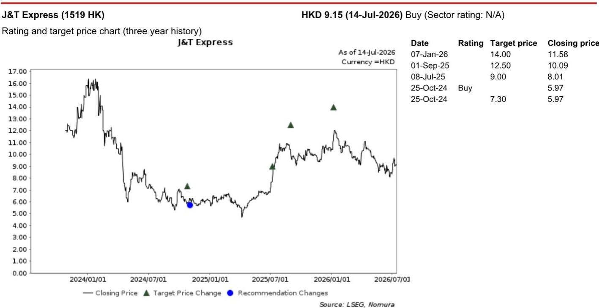

# 中国互联网企业从规模优先转向注重盈利能力——这一转变在AI、电商和内容领域产生连锁效应

抖音本地生活业务在2026年上半年实现约5510亿元人民币的总交易额，同比增长44%。这个数字看起来不错，但实际核销率只有57-58%。相比之下，美团的核销率超过80%。两者在净交易额上的差距远比表面数字显示的更大。这个数据点反映了中国互联网经济正在经历的战略转变。在多年追求规模之后，大型平台现在开始重新平衡，转向盈利能力、变现能力和运营纪律。这种转变并非整齐划一，也并非没有代价，但它是真实的，其影响远超任何一家公司的季度业绩。

这一新趋势至少在五个领域可见：本地生活、电商、大语言模型、AI生成内容和跨境物流。在每个领域，都出现了相同的模式——平台在控制增长目标、收紧成本结构、将资本重新配置到可防御的护城河上。对于观察者和策略制定者来说，问题不在于这种转变是否会发生，而在于哪些公司最有能力执行这一转变，以及哪些连锁效应将重塑竞争格局。

## 抖音本地生活业务目标在2026年下半年实现盈亏平衡，但与美团的运营差距仍是结构性问题

抖音本地生活业务在2026年上半年总交易额同比增长44%，但平台的战略重点正从单纯扩大规模转向提升变现能力和盈利能力。据行业人士透露，抖音可能计划在2026年下半年某个时候实现盈亏平衡。为此，平台今年开始对所有品类更严格地收取佣金，表明其优先考虑收入而非激进扩张。

问题在于，抖音的运营体系仍不如美团成熟。核销率差距——抖音约57-58%，美团超过80%——并非暂时现象。它反映了补贴设计、会员运营和跨场景交易转化方面的深层结构性差异。美团在个性化补贴分配以及跨餐饮、外卖和旅行预订的用户转化能力方面，形成了一个抖音仅靠流量难以复制的飞轮。抖音的品类结构也在变化：酒店和旅行预订已成为主要增长动力，而到店餐饮和购物受宏观环境影响较大。这种结构性变化可能有助于短期利润率，但也使平台面临周期性风险，而美团更多元化的本地生活业务能更好地应对这些风险。

战略含义很明确。抖音正在用收入增速换取盈利路径。这种取舍是理性的，但也意味着放弃了无限增长的叙事。美团凭借更高的核销率和更精细的运营能力，在下一阶段竞争中拥有结构性优势，这是任何流量都无法完全抵消的。

## 电商平台下调增长目标以资助AI基础设施建设，资本配置逻辑正在改变

抖音电商业务在2026年618期间未达到内部商品交易额增长目标，同比增长约19%，低于预期的24-25%。这一差距反映了更广泛的行业放缓，原因是消费减弱以及以旧换新补贴的贡献减少。更重要的是，这反映了一个有意的战略转变。据一位运营经理透露，抖音电商正从激进的收入扩张转向平衡增长模式，优先考虑盈利能力，以资助AI基础设施和大语言模型开发——具体来说是火山引擎和豆包。

2026财年的商品交易额增长目标已下调至15-16%，而2025财年为29%，年初目标为19%。这不是战术性撤退，而是一个资本配置决策。平台选择投资AI能力——代理式电商、产品目录理解和AI购物助手——以牺牲短期电商增长为代价。专家指出，豆包与抖音电商的整合仍处于早期阶段，当前重点是产品迭代、数据整合和供应链理解，而非商品交易额贡献。

这为观察者带来了新的考量。传统的电商商品交易额增长指标正变得不那么有参考价值，因为平台将资源转向AI基础设施，而这些投资可能几个季度内都不会产生可衡量的回报。风险在于，AI投资未能转化为差异化的购物体验，导致平台在牺牲电商市场份额的同时，未能建立起可防御的AI护城河。机会在于，代理式电商的先行者可能重塑消费者发现和购买产品的方式，从而创造超越价格和选择的新的竞争优势。

## 大语言模型市场正在分化为标准化和高端两个层级，闭源策略保护利润率

中国的大语言模型市场正在经历明显的分化。提供商对处理标准化任务的基础模型大幅降价，将其作为获客工具。同时，他们对高级模型维持高价。这种双重定价策略反映了这样一种认识：标准化的大语言模型服务将不可避免地面临利润率压缩，而差异化的能力——尤其是深度嵌入企业工作流程的能力——可以拥有定价权。

月之暗面，一家领先的中国生成式AI初创公司，预计到年底年化经常性收入将超过10亿美元，主要来自海外API使用和强大的AI编码能力。该公司正转向对其旗舰模型采用闭源策略，以保护利润率并提高变现能力，同时利用国产芯片降低推理成本。这一举措代表了一个更广泛的趋势：纯粹的AI实验室可能通过保持专注和敏捷性超越大型互联网平台，但现有企业——阿里巴巴、字节跳动等——凭借其庞大的资本、数据生态系统以及拥有最先进大语言模型的战略需求，仍然实力雄厚。

一位大语言模型专家指出，DeepSeek在推理工作负载方面具有明显的成本优势，这是其他托管相同开源模型的平台难以复制的。这揭示了一个关键见解：开源模型并不能使竞争环境变得公平。推理效率——以更低成本运行模型的能力——是一种专有的运营优势，而不仅仅是模型架构的功能。金融服务、办公效率、编码、制造、法律和医疗保健预计将成为大语言模型的主要采用者，这些领域很可能成为大语言模型提供商未来的核心收入来源。对观察者而言，这意味着大语言模型市场不会是一场赢家通吃的竞争，而是一个细分化的格局，运营效率、数据质量和工作流程整合将决定哪些参与者能获得最大价值。

## AI生成内容被限制以保护平台健康，颠覆了AI规模越大越好的假设

红果，一个短剧平台，其业务建立在真人演员的实拍内容之上。自去年以来，随着AI工具的进步和AI生成内容的成本优势，该平台加大了对AI生成剧集的激励。在用户获取方面，效果显著：红果旗舰短剧应用在2026年6月达到1.2亿日活跃用户和3.3亿月活跃用户，而其独立动画剧应用达到1650万日活跃用户和4000万月活跃用户。核心收入同比增长约87%，达到200亿元人民币，其中广告贡献了97%。

然而，红果现在对AI生成内容变得更加谨慎。副作用已经显现：质量较差、流行周期较短、与观众的情感共鸣较弱。这些因素导致用户留存率下降、用户使用时间缩短，并稀释了平台的广告价值——尤其是对品牌广告主而言。AI生成内容目前占总观看量的不到30%，红果正在通过推荐权重、收入分成调整和更严格的内容审核，将其份额控制在这一水平以下。

这是一个反直觉但具有战略意义的举措。传统观点认为，随着工具改进和成本下降，AI生成内容的份额将不可阻挡地增加。红果的决定表明，平台健康和广告变现可能为AI内容设置一个上限，这个上限低于该技术的技术潜力。对于构建视频生成AI工具的公司——如字节跳动的Seedance——这创造了需求侧风险。如果主要内容平台限制AI生成材料的份额，这些工具的可寻址市场可能小于预期。教训是，AI采用不仅仅是一个技术问题；它是一个关于生态系统质量和长期用户参与度的战略选择。

## 跨境电商物流仍是亮点，但监管和结构性风险正在上升

TikTok Shop的电商增长依然强劲，2026年上半年商品交易额达到约350亿美元。东南亚和美国仍是主要贡献者，同比增长约一倍。对于物流提供商极兔来说，近期前景得益于其与TikTok Shop的深度整合。极兔在大多数东南亚市场继续处理TikTok Shop包裹的很高份额，这得益于其强大的履约能力、广泛的网络覆盖和成本优势。

然而，监管审查正在加强。在印度尼西亚，监管机构可能推动TikTok Shop引入更多区域物流提供商，可能稀释极兔的市场份额。一位专家指出，鉴于极兔的规模、服务质量以及与潜在引入的区域参与者相比的成本竞争力，其近期份额损失风险可能是可控的。此外，轻资产的第三方物流和本地仓库生态系统在东南亚比资本密集型的商家自配送模式更适合TikTok Shop，尤其是考虑到该地区平均订单价值相对较低。

结构性结论是，跨境电商物流正进入一个需要平衡监管风险和运营规模的阶段。极兔的竞争护城河不仅仅是成本问题，更是管理监管复杂性的同时保持服务质量的能力。对于观察者来说，关键问题是极兔能否在监管机构推动更多竞争时保持其份额，或者平台是否会被迫接受更低的利润率以换取合规。

## 决策框架：如何评估从增长转向盈利的公司

这五个领域的共同点是，中国互联网平台正在做出有意的取舍。增长目标被下调，成本被收紧，AI投资通过放缓其他业务来获得资金。对于观察者和策略制定者来说，挑战在于区分那些执行纪律性转变的公司和那些将竞争弱点伪装成战略克制的公司。

一个决策框架应评估三个维度。第一，**运营成熟度**：核销率更高、补贴设计更好、会员运营更精细的公司——如本地生活领域的美团——更有能力在不牺牲增长的情况下变现其用户基础。第二，**资本配置清晰度**：那些透明地将资源重新配置到AI基础设施，而非简单全面削减成本的公司，是在做一个可以在12到24个月内评估的赌注。第三，**生态系统可防御性**：拥有专有数据、闭源模型或深度整合物流网络的公司，拥有竞争对手难以通过开源技术或第三方物流复制的护城河。

在这三个维度上得分高的公司，很可能在这一转型中变得更强大。那些下调增长目标但没有明确再投资计划的公司，或者限制AI内容但没有提高质量策略的公司，可能在周期转变时发现自己处于较弱的竞争地位。

*仅供参考。部分内容可能基于源材料通过AI辅助生成、翻译、总结或编辑，可能存在遗漏或错误。请独立核实。这不是专业建议。*

仅供参考。部分内容可能基于源材料通过AI辅助生成、翻译、总结或编辑，可能存在遗漏或错误。请独立核实。这不是专业建议。

