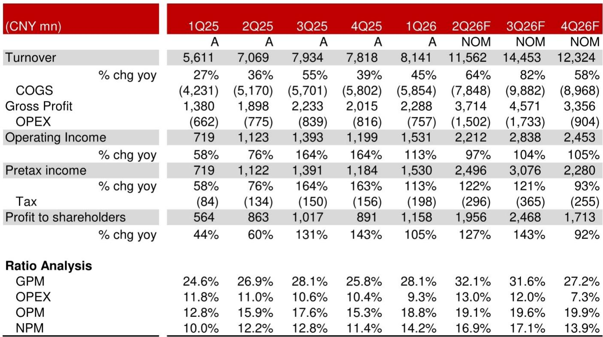
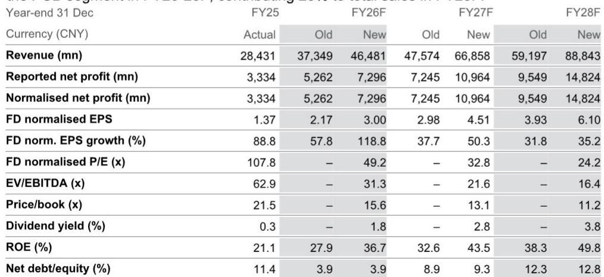
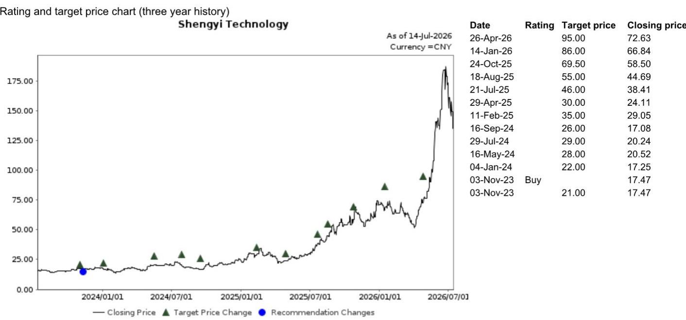

# 生益科技：涨价与产品升级推动上半年业绩表现

生益科技在7月13日收盘后发布了一份超出市场预期的上半年业绩预告：净利润31至33亿元，同比增长117%至131%；扣非净利润27.2至29.2亿元，同比增长97%至112%。相关研究在随后的报告中上调了这家全球第二大覆铜板（CCL）制造商的盈利预测——未来三年的营收预测上调24.5%至50.1%，每股收益预测上调38.7%至55.2%。

这份报告的核心观察并非涨价本身，而是涨价背后正在发生的结构性变化：生益科技正在从AI基础设施的“受益者”转变为“全球参与者”，其高端CCL市场的份额集中趋势仍在持续。

## 1. 上游材料供应变化推动的涨价，正在验证AI CCL市场的集中化

上半年CCL价格同比涨幅超过50%，直接驱动因素是铜箔、玻璃纤维等上游材料的供应变化。相关研究认为这一趋势在下半年仍将持续，继续支撑收入和利润率扩张。

但比涨价更值得关注的是市场格局的变化。报告明确指出，尽管市场对主要客户的技术升级节奏存在关注，但AI CCL市场已经完成集中化。生益科技在M9/M10级CCL、PTFE等新技术路线上的储备，使其在AI基础设施市场的单机价值量升级机会中占据有利位置。研究预计其CCL及半固化片业务在FY26-28F的收入年复合增长率将达到40%，到FY28F贡献总销售的67%。

> **观察：** 涨价是短期因素，但真正支撑估值重估的是“高端CCL市场已无新进入者”这一格局判断。报告隐含的意思是：即使下游客户的技术路线出现波动，生益科技在高端CCL的份额也不会被侵蚀，因为竞争对手已经跟不上。

## 2. ASIC客户的产品升级，正在打开PCB业务的第二增长曲线

CCL并非生益科技相对少见的增长引擎。报告显示，其核心ASIC客户已经开始产品升级，带动了高多层PCB（HLC）产品在第二季度的需求走强，这一趋势预计在下半年延续。

更关键的是客户结构的多元化。相关研究认为生益科技可能正在逐步拓展海外市场（ASIC、交换机）和国内市场（AI服务器、交换机）的更多AI客户，以降低单一客户集中度不确定性。PCB业务在FY26-28F的收入年复合增长率预计为48%，到FY28F贡献总销售的28%。

这一判断与市场对“AI PCB需求是否过度集中于单一客户”的关注形成对照。报告给出的信号是：ASIC生态的扩张正在为PCB业务创造新的需求来源，而不仅仅是依赖单一客户。

## 3. 盈利预测的上修，反映的是产品组合的结构性改善

相关研究将FY26-28F的毛利率预测上调了0.6至1.4个百分点，这并非单纯来自涨价，而是产品组合改善的结果。随着AI相关CCL和PCB产品在收入中的占比提升，公司的整体利润率正在经历结构性抬升。

从财务数据看，FY25到FY28F，毛利率从26.5%预计升至32.4%，净利率从11.7%升至16.7%，ROE从21.1%升至49.8%。这些数字背后是同一个逻辑：AI基础设施的扩张正在将生益科技从一家周期性大宗商品制造商，转变为一家技术驱动的成长型公司。

报告也指出了需要关注的不确定性：下游5G、服务器、汽车电子等领域的PCB需求可能低于预期，以及CCL市场竞争加剧可能压缩利润空间。但这些不确定性在当前AI驱动的需求周期中，尚未构成对核心判断的挑战。

对于关注AI基础设施产业链的读者，这份报告提供了一个可复用的观察框架：当一家上游材料公司开始同时受益于涨价周期和技术升级，且市场格局已经完成集中化时，其盈利能力的持续性往往被低估。生益科技的故事，本质上是在回答一个更根本的问题——AI基础设施的价值链中，哪些环节正在从“配套”变成“主导”。

For informational purposes only. Portions may be generated,translated,summarized,or edited with AI assistance based on source materials and may contain omissions or errors. Please verify independently. This is not investment,legal,tax,accounting,or other professional advice.

For informational purposes only. Portions may be generated,translated,summarized,or edited with AI assistance based on source materials and may contain omissions or errors. Please verify independently. This is not investment,legal,tax,accounting,or other professional advice.

