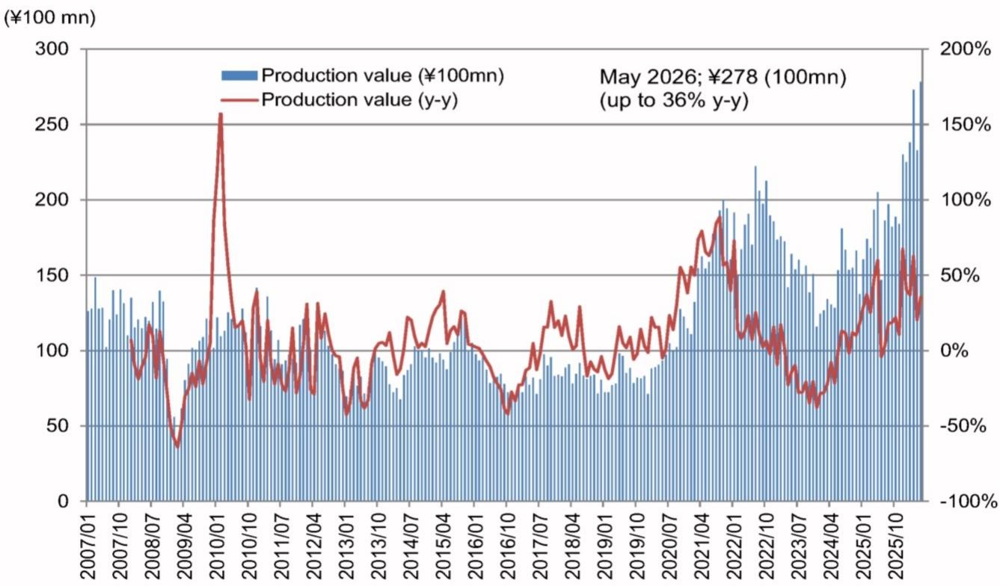
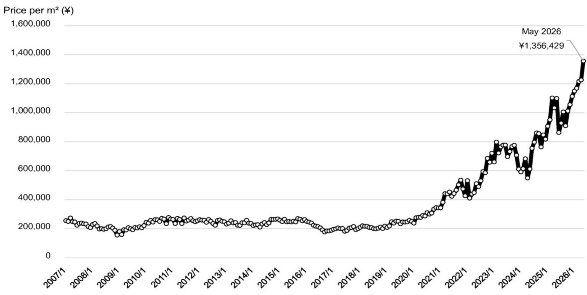

# 行业观察：半导体封装领域更新——封装基板出货金额同比增长36%

日本电子元件出货数据在5月出现了一个值得关注的信号：封装基板（刚性模组基板）出货金额同比上升36%，达到278亿日元，不仅超过3月创下的273亿日元历史高点，平均每平方米单价也同步刷新纪录。这份行业研究笔记的核心判断并非出货量本身，而是隐藏在数字背后的竞争结构变化——先进封装的技术重心，正从单纯的“互联密度”转向“供电与散热”的系统能力。

5月出货数据中，面积仅增长10%，但单价同比上升23%，达到每平方米135.6万日元。行业分析师推断，相关封装出货将在今年夏季（最晚8月）正式启动，当前数据已经反映了逐步爬坡的迹象。单价持续走高，说明高价值、高复杂度封装产品的占比在扩大，而不是整体需求放量。

## 1. 技术论文揭示了供电瓶颈

在5月佛罗里达ECTC会议上，相关公司工程师发布了一篇关于EMIB-T的技术论文。EMIB-T是一种2.5D封装方案，不使用中介层，而是通过嵌入式硅桥连接芯片。论文中最关键的信息是：该方案在硅桥中首次加入了TSV（硅通孔）和MIM电容，以强化供电网络。论文数据显示，相比上一代方案，电压下降幅度改善了68%至80%。

行业分析师指出，这一改进间接说明，传统方案在加速器封装中存在供电不足的问题。通过增加TSV和电容层，才让该方案具备了支持四芯片、120x120mm封装基板、最多集成12个HBM4的能力。这一技术路径的调整，本质上是对供电瓶颈的回应。

## 2. 生态优势在于供电与散热，相关公司正在追赶

行业观察认为，台积电在封装基板内的供电和热管理方面拥有明显优势，这得益于其3DFabric联盟的协同开发模式。相关公司则正在构建类似的生态系统，但起步较晚。决定封装生态竞争力的核心技术，报告列出了四项：供电、散热、共封装光学（CPO）和3D堆叠（混合键合）。

目前台积电在供电和散热上的领先，并非单一技术突破，而是长期与设备商、材料商联合开发的结果。相关公司要在2026年实现EMIB-T的批量生产，不仅需要解决硅桥本身的工艺问题，还需要补齐生态短板。行业观察注意到，谷歌正在开发四芯片结构的加速器，并已出现采用EMIB-T的动向，这可能是相关公司生态落地的第一个关键客户。

> **行业评论：** 封装竞争正在从“能不能连起来”转向“能不能稳定供电”。相关技术论文中68%-80%的电压改善数字，是理解这一轮技术路线选择的关键锚点。如果供电问题不能解决，即使互联密度达标，也无法用于高性能AI加速器。

## 3. 结构调整暗示了中介层尺寸的物理极限

行业报告提到，有观点认为相关结构将从4芯片改为2芯片，另一方案则可能采用2模块、3D堆叠的设计。这一调整的背后逻辑是：当中介层尺寸超过5.5倍光罩尺寸后，与HBM4的布线难度显著上升。相关公司可能将未来路线图建立在3.5D封装（3D堆叠与2.5D封装的结合）上，直到更大尺寸中介层的技术可见性提高。

这意味着，先进封装并非简单的“做得更大”就能解决问题。HBM4的布线密度增加，对中介层的信号完整性和供电能力提出了更高要求。芯片架构从4芯片缩减为2芯片，不是技术倒退，而是在现有物理约束下做出的务实选择。

5月封装基板出货数据创下新高，单价持续攀升，反映的是这一轮技术升级带来的价值集中。真正值得关注的不是出货量本身，而是谁能在供电、散热、生态协同这三个维度上建立系统优势。相关公司在这一领域的竞争，将直接影响未来两到三年AI加速器的封装方案选择。

For informational purposes only. Portions may be generated,translated,summarized,or edited with AI assistance based on source materials and may contain omissions or errors. Please verify independently. This is not investment,legal,tax,accounting,or other professional advice.

For informational purposes only. Portions may be generated,translated,summarized,or edited with AI assistance based on source materials and may contain omissions or errors. Please verify independently. This is not investment,legal,tax,accounting,or other professional advice.

