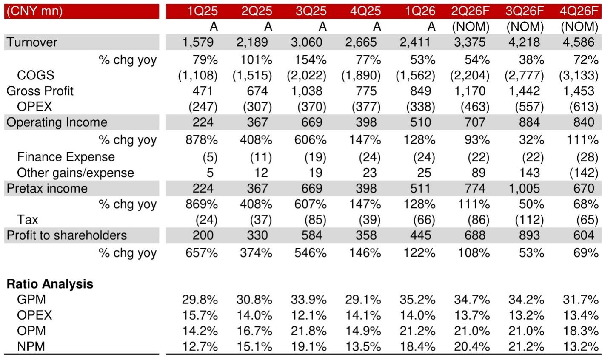
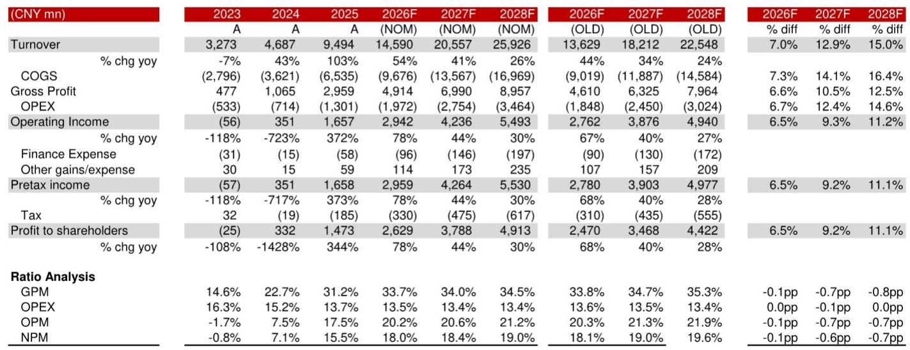
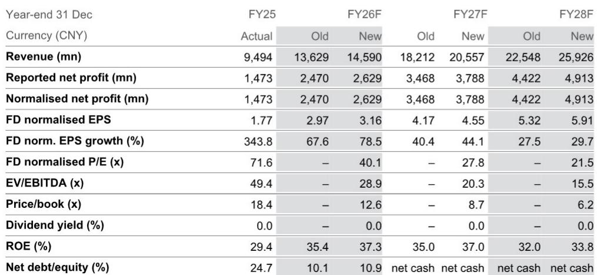

# NOM：生益电子，1H26利润预告确认上升趋势

一份来自7月13日收盘后的业绩预告，让市场重新审视AI硬件供应链的利润释放节奏。生益电子预计2026年上半年营收同比增长49%-58%，净利润同比增幅达到104%-114%。NOM在随后发布的报告中指出，这轮增长并非简单的产能填满，而是产品结构升级带来的定价权迁移——ASIC客户的新一代产品（Trainium 3）已经开始出货，AI交换机市场的需求也在同步加速。

报告的核心判断是：AI服务器和交换机对PCB的用量与层数要求正在推高单板价值，而这一趋势在2026年下半年和2027年仍会持续。对于一家PCB厂商而言，真正重要的不是产能扩张的速度，而是能否在ASIC和交换机两个市场同时拿到份额。

## 1. Trainium 3出货是利润加速的直接原因，但更关键的是产品生命周期

生益电子在2季度已经感受到来自大客户的产品升级拉动。NOM认为，Trainium 3的生命周期才刚刚开始，下半年出货量有望继续爬坡。这份业绩预告的利润增速远超营收增速，说明毛利率在改善——报告预计2026年毛利率将从2025年的31.2%提升至33.7%，并在后续两年稳定在34%以上。

> **KC评论：** 毛利率提升是产品结构升级的直接证据。如果只是产能利用率恢复，毛利率改善幅度不会这么大。报告也提到上游材料涨价给PCB厂商带来成本不确定性，但产品组合优化可以部分对冲——这一点在利润增速上已经体现。

## 2. 服务器仍是最大收入来源，但交换机市场正在成为第二增长曲线

NOM预计，服务器业务在2026年将贡献生益电子约66%的收入，2026-2028年收入复合增速约为28%。但报告同时强调，AI交换机市场的需求正在加速，无论是海外还是中国本土市场，交换机升级周期都会带来PCB层数和工艺要求的提升。这意味着，公司不仅依赖单一ASIC客户，交换机市场的多元化客户基础正在形成。

## 3. 客户集中度正在下降，但需要时间验证

目前生益电子对全球最大ASIC客户的收入占比约为50%。NOM预计这一比例到2028年将降至42%。报告认为，公司在高多层PCB、电信设备和网络交换机领域的技术积累，有助于其拓展国内AI客户。中国本土AI研究的加速，也为公司提供了客户多元化的机会。

> **KC评论：** 客户集中度下降是长期逻辑，但报告没有给出具体的国内客户名单或订单时间表。对于一家依赖大客户产品升级的公司，2027年之后能否维持当前的增长斜率，关键要看新客户导入的速度和交换机市场的实际放量节奏。

## 4. 一个可复用的观察框架：产品结构升级比产能扩张更能解释利润弹性

这份报告提供了一个分析PCB公司的框架：先看产品结构是否在向高多层、高价值方向迁移，再看客户组合是否在分散。产能扩张是必要条件，但不是充分条件——真正决定利润弹性的，是单板价值能否持续提升。生益电子2026年净利润增速远超营收增速，正是这一框架的验证。

报告上调了2026-2028年营收预测7%-15%，但毛利率预测反而小幅下调0.1-0.8个百分点，以反映上游材料涨价不确定性。这说明，即便产品结构在改善，成本端的不确定性仍然存在。对于关注AI硬件供应链的读者，而在于提供了一个判断利润可持续性的分析视角。

For informational purposes only. Portions may be generated,translated,summarized,or edited with AI assistance based on source materials and may contain omissions or errors. Please verify independently. This is not investment,legal,tax,accounting,or other professional advice.

For informational purposes only. Portions may be generated,translated,summarized,or edited with AI assistance based on source materials and may contain omissions or errors. Please verify independently. This is not investment,legal,tax,accounting,or other professional advice.

