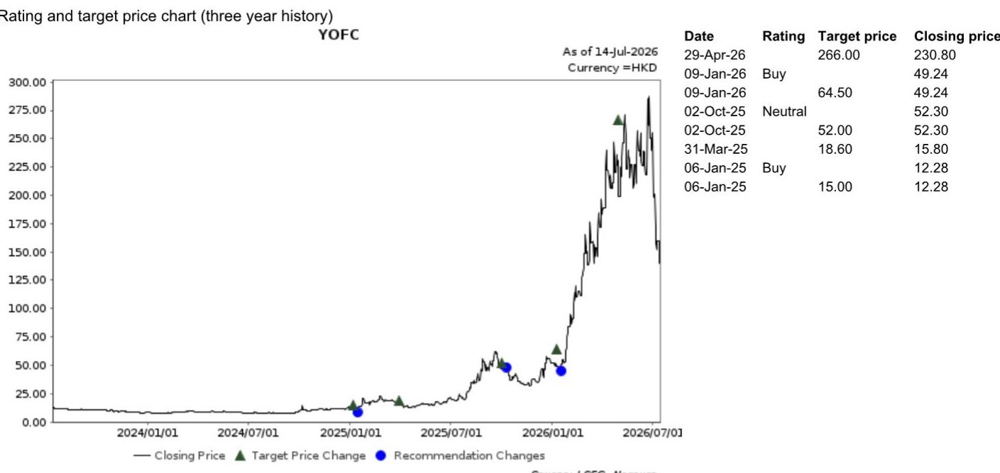

# NOM：长飞光纤2Q26盈利超预期反映涨价

长飞光纤在7月14日收盘后发布了半年报盈利预告，上半年净利润预计在24亿至30亿元人民币之间，同比增长711%至914%。这个数字本身已经超出市场预期——NOM此前对第二季度的利润预测是10亿元，而实际中值达到22亿元，翻了一倍以上。

但真正值得关注的不是利润超预期多少，而是利润来源的结构。NOM认为，这次盈利跳升主要反映的是光纤产品在电信和数据通信两个市场同时实现全面涨价，背后是需求激增与主要光纤预制棒厂商供给受限的共同作用。

过去三周，长飞报价下跌了46%，同期恒生指数上涨2%。市场担忧的是产能加速扩张和新进入者带来的竞争加剧。这份盈利预告能否扭转市场情绪，取决于读者如何理解涨价周期的可持续性。

## 1. 涨价不是短期行为，而是供需结构在重新定价

第二季度单季净利润中值22亿元，同比增长1222%至1639%。这个增幅远超产量增长能解释的范围。NOM的判断很清晰：涨价是核心驱动力，而且是在电信和数据通信两个市场同时发生。

电信市场的需求来自5G建设和光纤到户的持续部署，数据通信市场的需求则来自AI数据中心对高速互联的拉动。两个市场同时收紧供给，光纤和预制棒厂商的议价能力在二季度集中释放。

这里的关键不是涨价本身，而是涨价能否持续。如果只是短期供需错配，报价的修复空间有限。但如果涨价反映了行业产能扩张周期进入瓶颈，那么利润中枢的上移就有结构性支撑。

> **KC评论：** 市场此前担心的产能扩张和新进入者，其实恰恰说明现有厂商在涨价周期中拥有先发优势。新建产能从投产到满产通常需要12到18个月，这段时间内现有厂商的定价权不会轻易被稀释。

## 2. 市场情绪与基本面之间出现了罕见的背离

过去三周长飞报价下跌46%，而同期恒生指数上涨2%。这个跌幅已经不能用基本面出现变化来解释——二季度利润预告恰恰证明基本面在加速改善。

市场担忧的逻辑是：高利润会吸引更多资本进入，导致产能过剩和价格战。这个逻辑在长期维度上成立，但在短期维度上，盈利预告本身就是一个信号——现有厂商的利润正在加速兑现，而新进入者从决策到投产还有相当长的时间窗口。

NOM认为，这份盈利预告会改善市场情绪，并创造短期交易机会。这个判断的前提是，市场对产能扩张的担忧被过度定价了。

## 3. 估值已经反映了最悲观的预期

以当前报价计算，长飞对应FY27F市盈率约为13.7倍。基于23.7倍FY27F市盈率，与相关市场电缆公司市盈率中位数一致。

13.7倍和23.7倍之间的差距，反映的是市场对竞争加剧的担忧。但如果二季度的盈利趋势能够延续，这个估值差距可能会快速收窄。

NOM在观察提示中列出了三个节奏变化不确定性：电信运营商需求弱于预期、AI网络业务扩张不及预期、海外市场拓展低于预期。同时也列出了三个上行不确定性：电信需求恢复快于预期、高端AI产品渗透加速、海外扩张超预期。

这份报告没有给出明确的概率判断，但二季度的数据已经让上行不确定性变得更具体、更可验证。

> **KC评论：** 读者可以关注的一个观察框架是：光纤预制棒的供给瓶颈何时缓解。如果主要厂商的扩产计划在2027年前无法落地，那么当前的涨价周期可能比市场预期的更长。这个时间差。

---

For informational purposes only. Portions may be generated,translated,summarized,or edited with AI assistance based on source materials and may contain omissions or errors. Please verify independently. This is not investment,legal,tax,accounting,or other professional advice.

For informational purposes only. Portions may be generated,translated,summarized,or edited with AI assistance based on source materials and may contain omissions or errors. Please verify independently. This is not investment,legal,tax,accounting,or other professional advice.

