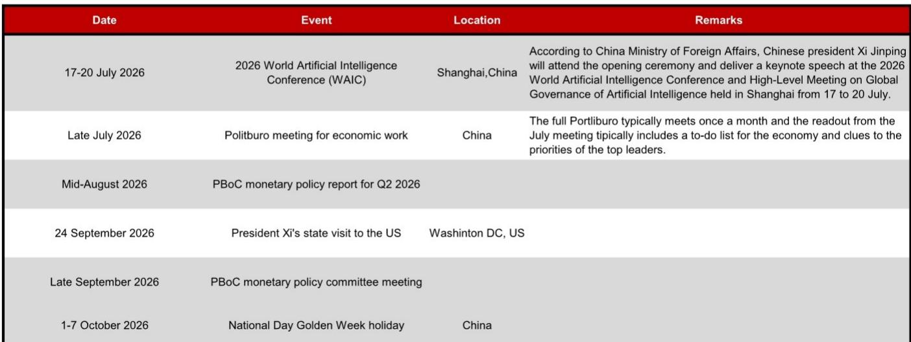
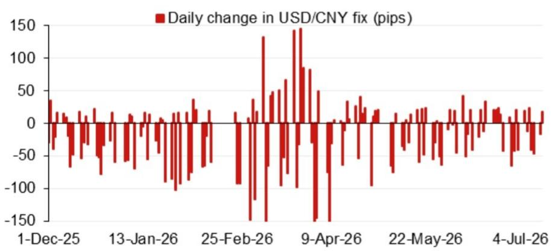
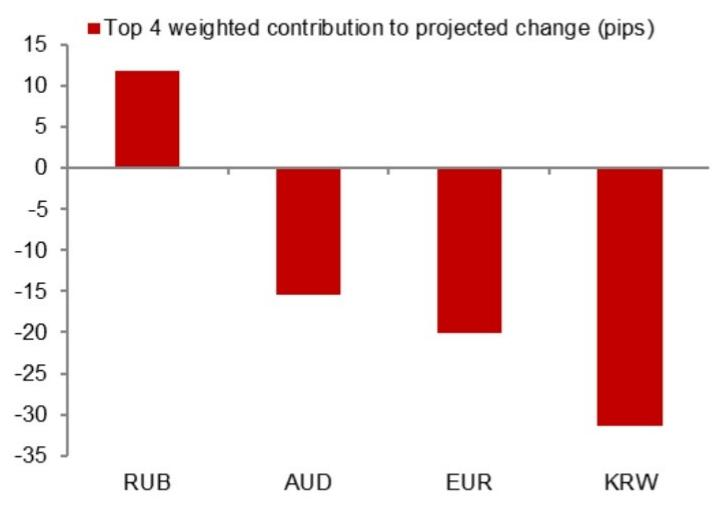

# 从央行定价模型看汇率信号：渐进但有序的路径

2026年7月15日，中国人民银行美元/人民币定价模型给出的中间价预测为6.7681，较前一日的6.7990下调了309个基点。这并非随机波动。剔除逆周期因子后，模型预测值较前一日官方收盘价低98个基点，表明央行正在主动引导定价相对于市场报价走低。当计入逆周期因子后，预测值升至6.7745，仍较前一日定价低245个基点。原始模型与调整后数值之间的差距揭示了央行的考量：希望汇率有所变化，但希望控制节奏。

这一信号之所以重要，是因为调整的时间窗口正在收窄。未来几周将密集出现具有重要政治意义的事件：7月17日至20日在上海举办的世界人工智能大会，国家主席习近平将发表主旨演讲；7月下旬的政治局会议，通常为下半年经济工作定调；以及9月下旬习近平主席对华盛顿的国事访问。这些事件都对央行自由调整汇率形成约束。因此，定价模型不仅是技术工具，更是战略沟通手段。它向市场表明，央行认为汇率面临调整压力是不可避免的，但打算通过可控、可预期的过程来引导，而非无序波动。

核心观点很简单：央行正利用其每日定价机制，为汇率渐进调整预作准备，在压力演变为问题之前加以吸收。模型的内部动态、原始预测值与调整后预测值之间不断扩大的差距，以及政治事件的时间节点，都指向一个经过深思熟虑的策略。将定价视为市场力量的被动反映，是误解了其本质。这是一个主动的政策工具，其当前配置表明，美元/人民币汇率面临的上行阻力最小。

## 模型内部机制显示：央行在吸收压力，而非抵抗压力

报告中最具信息量的数字并非标题预测值，而是原始模型预测值与前一官方收盘价之间98个基点的差距。在自由浮动的汇率机制下，定价会直接跟踪前一日收盘价。而在这里，央行有意将定价设定在低于市场最后交易价格的水平。这是一个有意识的决定，让汇率相对于市场水平走弱，而非固守某条底线。

逆周期因子提供了另一层信息。当央行应用该因子时，它将定价从原始预测值6.7681推高约64个基点至6.7745。这是一个适度的调整，远小于较前一日定价245个基点的降幅。逆周期因子常被描述为稳定工具，但其当前的应用方式颇具意味。央行并非用它来逆转调整趋势，而是用来平滑节奏。信号是：央行对汇率走弱持接受态度，前提是这一变动不会引发恐慌。

这一解读得到了模型误差历史数据的支持，报告显示了近期模型预测值与实际定价之间的偏差。当央行持续允许定价低于模型预测值时，表明其容忍度发生了变化。数据显示，央行现在正系统性地让汇率逐步走低，将定价作为渐进释放压力的阀门，而非刚性锚点。

## 未来政治事件日程：外交活动前形成汇率调整的狭窄窗口

报告列出了7月中旬至10月初之间的五个关键事件，每个事件都对汇率政策施加了不同的约束。7月17日至20日的世界人工智能大会是中国展示技术抱负的舞台，在此期间汇率大幅走弱在政治上会显得尴尬。因此，央行正在提前进行调整：定价模型已显示较前一日定价下降245个基点，这表明央行希望在聚光灯转向上海之前，让汇率达到更具竞争力的水平。

7月下旬的政治局会议是最重要的国内事件。会议公报通常包含经济工作清单，汇率政策是该议程的核心部分。如果政治局会议释放出更关注出口竞争力或货币宽松的信号，央行将获得继续调整的明确政策依据。因此，定价模型是对该会议将正式确定的政策立场的一次预演。

8月中旬的货币政策报告和9月下旬的货币政策委员会会议更具技术性，但它们为央行提供了调整逆周期因子或发出汇率机制变化信号的机会。最重要的外部事件是9月下旬习近平主席对华盛顿的国事访问。访问前夕汇率大幅走弱可能引发汇率操纵的指责，这将使外交议程复杂化。因此，央行可能在9月放缓或暂停调整，这意味着大部分调整必须在7月中旬至8月底的六周内完成。当前的定价模型正是这一压缩时间窗口中的开局之举。

## 将定价模型视为领先指标，而非滞后指标，相应调整对冲周期

对于任何涉及中国敞口的投资组合而言，美元/人民币定价并非背景变量，而是直接影响现金流计算、对冲成本和估值调整的输入变量。报告中的模型提供了一个区分信号与噪音的决策框架。关键在于关注两个指标：原始模型预测值与前一日定价之间的差距，以及逆周期因子调整的幅度。

当原始模型预测值显著低于前一日定价时，如7月15日的情况，表明央行内部算法认为调整压力在结构性上升。适当的应对是增加人民币计价资产的对冲比例，并延长这些对冲的期限。模型预测值单日变动309个基点并非噪音，而是趋势加速的信号。

逆周期因子调整应被解读为央行对调整速度容忍度的衡量指标。当调整相对于整体变动幅度较小时，如当前情况，央行在表明其无意对抗调整趋势。适当的对冲策略是使用期权而非远期，因为调整路径可能非线性。远期锁定单一汇率，而期权结构允许读者从渐进调整中受益，同时在央行突然干预时限制下行风险。

事件日程提供了时间框架。调整最可能在人工智能大会与政治局会议之间加速，然后持续整个8月，在9月华盛顿访问前放缓。对冲应相应分层：为7月至8月窗口建立短期头寸，为外交活动后的时期建立到期日在国事访问之后的长期头寸。

央行的定价模型并非黑箱。它是一个透明、基于规则的系统，央行用它来传达意图，而无需做出明确的政策声明。该系统当前的配置是明确的。央行正在为汇率渐进调整做准备，并利用定价作为管理市场预期的主要工具。正确解读模型的观察者可以提前布局，而非事后应对。

*仅供参考。部分内容可能基于原始资料通过AI辅助生成、翻译、摘要或编辑，可能存在遗漏或错误。请独立核实。本文不构成专业建议。*

仅供参考。部分内容可能基于原始资料通过AI辅助生成、翻译、摘要或编辑，可能存在遗漏或错误。请独立核实。本文不构成专业建议。

