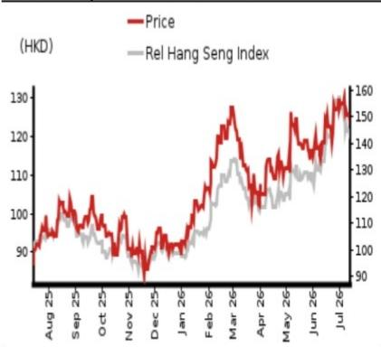
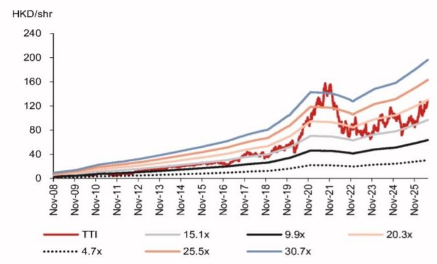
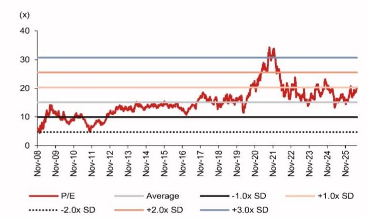

# Milwaukee momentum underpins growth

## Replacement, restocking and AIDC demand drive earnings growth

1H26F preview: Data center and replacement demand support sales growth
We expect Techtronic (TTI) to deliver 11.2% y-y 1H26F earnings growth, supported by: (i) data center construction spending (according to Census, data center construction rose 22.1% y-y in Jan-May 2026); (ii) likely emerging replacement demand, as the previous sales growth peak occurred in 2020-21 and the replacement cycle typically runs about five-seven years, based on our estimates; and (iii) margin-accretive Milwaukee potentially extending its lead at Home Depot (HD US, Not rated), where we estimate TTI held around 48-49% power tool sales share in 1H26F. In addition, the suspension of the Hart business in Dec-25 likely dragged 1H26F y-y revenue growth and resulted additional expenses; however, the company's growing focus on Milwaukee and Ryobi as its two core brands should support a better group net margin in the long run.

## 2H26F: Encouraging 4Q26F outlook may point to restocking

We estimate HD's Jun-26 inventory level was at a similar or even at a lower level y-y. Considering potentially strong 4Q26 sell-through — our industry survey suggests over 10% y-y growth for the overall power tool business in 4Q26F, helped by Black Friday and gift-center promotions and new product launches — we believe 3Q26F could see additional restocking of power tools and hand tools from the distributors. Meanwhile, Home Depot's share in TTI's total sales continued to trend down in 2020-25 from 48.9% to 45.4%. We believe this partly reflects faster growth in TTI's non-Home Depot channels, such as the data center, and overseas markets — TTI's Europe sales grew 9.0% y-y in local currency in 2025, outpacing group growth of 4.1%, with Milwaukee still a relatively late entrant in the region with room to expand.

## Maintain Buy; raise TP to HKD163 on solid Milwaukee momentum

We reiterate our Buy rating and raise TP to HKD163 (from HKD140) to reflect the likely incremental sales from replacement, restocking, and non-Home Depot channel demand. We revise up our 2026/27F EPS forecasts to USD0.76/0.87 from USD0.74/0.84 to factor in these drivers, together with a modest GPM improvement as the company concentrates resources on two core brands. Our new TP of HKD163 is based on 24x 2027F P/E (previously 24x 2026F P/E), which is at +1.7x SD of its historical average of 15x. The stock now trades at 18x 2027F P/E.

<table><tr><td>Year-end 31 Dec</td><td colspan="2">FY25</td><td colspan="2">FY26F</td><td colspan="2">FY27F</td><td colspan="2">FY28F</td></tr><tr><td>Currency (USD)</td><td>Actual</td><td>Old</td><td>New</td><td>Old</td><td>New</td><td>Old</td><td>New</td><td></td></tr><tr><td>Revenue (mn)</td><td>15,260</td><td>16,178</td><td>16,267</td><td>17,222</td><td>17,467</td><td>18,351</td><td>18,645</td><td></td></tr><tr><td>Reported net profit (mn)</td><td>1,198</td><td>1,355</td><td>1,382</td><td>1,532</td><td>1,587</td><td>1,738</td><td>1,789</td><td></td></tr><tr><td>Normalised net profit (mn)</td><td>1,198</td><td>1,355</td><td>1,382</td><td>1,532</td><td>1,587</td><td>1,738</td><td>1,789</td><td></td></tr><tr><td>FD normalised EPS</td><td>65.62c</td><td>74.18c</td><td>75.64c</td><td>83.90c</td><td>86.90c</td><td>95.14c</td><td>97.96c</td><td></td></tr><tr><td>FD norm. EPS growth (%)</td><td>6.8</td><td>13.1</td><td>15.3</td><td>13.1</td><td>14.9</td><td>13.4</td><td>12.7</td><td></td></tr><tr><td>FD normalised P/E (x)</td><td>24.4</td><td>-</td><td>21.2</td><td>-</td><td>18.4</td><td>-</td><td>16.3</td><td></td></tr><tr><td>EV/EBITDA (x)</td><td>14.3</td><td>-</td><td>12.9</td><td>-</td><td>11.2</td><td>-</td><td>9.9</td><td></td></tr><tr><td>Price/book (x)</td><td>4.2</td><td>-</td><td>3.8</td><td>-</td><td>3.4</td><td>-</td><td>3.0</td><td></td></tr><tr><td>Dividend yield (%)</td><td>2.0</td><td>-</td><td>2.1</td><td>-</td><td>2.2</td><td>-</td><td>2.4</td><td></td></tr><tr><td>ROE (%)</td><td>18.0</td><td>18.5</td><td>18.8</td><td>18.9</td><td>19.4</td><td>19.3</td><td>19.4</td><td></td></tr><tr><td>Net debt/equity (%)</td><td>net cash</td><td>net cash</td><td>net cash</td><td>net cash</td><td>net cash</td><td>net cash</td><td>net cash</td><td></td></tr></table>

Source: Company data, NOM estimates

Rating Remains Buy

Target price
Increased from
HKD 140.00
HKD 163.00

<table><tr><td>Closing price14 July 2026</td><td>HKD 125.50</td></tr></table>

<table><tr><td>Implied upside</td><td>+29.9%</td></tr></table>

<table><tr><td>Market Cap (USD mn)</td><td>29,271.9</td></tr><tr><td>ADT (USD mn)</td><td>85.3</td></tr></table>

## Relative performance chart

  
Source: LSEG, NOM

## Research Analysts

Advanced Manufacturing

Frank Fan - NIHK

frank.fan@NOM.com

+852 2252 2195

Donnie Teng - NIHK
donnie.teng@NOM.com
+852 2252 1439

## Key data on Techtronic Industries

Cashflow statement (USDmn)

<table><tr><td>Performance(%)</td><td>1M</td><td>3M</td><td>12M</td><td></td><td></td></tr><tr><td>Absolute (HKD)</td><td>5.7</td><td>11.8</td><td>44.3</td><td>M cap (USDmn)</td><td>29,271.9</td></tr><tr><td>Absolute (USD)</td><td>5.7</td><td>11.7</td><td>44.5</td><td>Free float (%)</td><td>74.3</td></tr><tr><td>Rel to Hang Seng Index</td><td>7.8</td><td>18.2</td><td>44.2</td><td>3-mth ADT (USDmn)</td><td>85.3</td></tr></table>

<table><tr><td colspan="6">Income statement (USDmn)</td></tr><tr><td>Year-end 31 Dec</td><td>FY24</td><td>FY25</td><td>FY26F</td><td>FY27F</td><td>FY28F</td></tr><tr><td>Revenue</td><td>14,622</td><td>15,260</td><td>16,267</td><td>17,467</td><td>18,645</td></tr><tr><td>Cost of goods sold</td><td>-8,726</td><td>-8,968</td><td>-9,313</td><td>-9,896</td><td>-10,451</td></tr><tr><td>Gross profit</td><td>5,896</td><td>6,292</td><td>6,953</td><td>7,571</td><td>8,194</td></tr><tr><td>SG&amp;A</td><td>-4,642</td><td>-4,967</td><td>-5,448</td><td>-5,843</td><td>-6,246</td></tr><tr><td>Employee share expense</td><td>0</td><td>0</td><td>0</td><td>0</td><td>0</td></tr><tr><td>Operating profit</td><td>1,254</td><td>1,325</td><td>1,505</td><td>1,728</td><td>1,948</td></tr><tr><td>EBITDA</td><td>1,917</td><td>1,993</td><td>2,217</td><td>2,493</td><td>2,764</td></tr><tr><td>Depreciation</td><td>-663</td><td>-668</td><td>-712</td><td>-765</td><td>-816</td></tr><tr><td>Amortisation</td><td></td><td></td><td></td><td></td><td></td></tr><tr><td>EBIT</td><td>1,254</td><td>1,325</td><td>1,505</td><td>1,728</td><td>1,948</td></tr><tr><td>Net interest expense</td><td>-126</td><td>-97</td><td>-91</td><td>-97</td><td>-104</td></tr><tr><td>Associates &amp; JCEs</td><td></td><td></td><td></td><td></td><td></td></tr><tr><td>Other income</td><td>89</td><td>74</td><td>79</td><td>85</td><td>91</td></tr><tr><td>Earnings before tax</td><td>1,216</td><td>1,302</td><td>1,494</td><td>1,716</td><td>1,934</td></tr><tr><td>Income tax</td><td>-95</td><td>-104</td><td>-112</td><td>-129</td><td>-145</td></tr><tr><td>Net profit after tax</td><td>1,122</td><td>1,198</td><td>1,382</td><td>1,587</td><td>1,789</td></tr><tr><td>Minority interests</td><td>0</td><td>0</td><td>0</td><td>0</td><td>0</td></tr><tr><td>Other items</td><td></td><td></td><td></td><td></td><td></td></tr><tr><td>Preferred dividends</td><td></td><td></td><td></td><td></td><td></td></tr><tr><td>Normalised NPAT</td><td>1,122</td><td>1,198</td><td>1,382</td><td>1,587</td><td>1,789</td></tr><tr><td>Extraordinary items</td><td></td><td></td><td></td><td></td><td></td></tr><tr><td>Reported NPAT</td><td>1,122</td><td>1,198</td><td>1,382</td><td>1,587</td><td>1,789</td></tr><tr><td>Dividends</td><td>-486</td><td>-573</td><td>-611</td><td>-656</td><td>-700</td></tr><tr><td>Transfer to reserves</td><td>636</td><td>626</td><td>771</td><td>932</td><td>1,089</td></tr><tr><td>Valuations and ratios</td><td></td><td></td><td></td><td></td><td></td></tr><tr><td>Reported P/E (x)</td><td>26.1</td><td>24.4</td><td>21.2</td><td>18.4</td><td>16.3</td></tr><tr><td>Normalised P/E (x)</td><td>26.1</td><td>24.4</td><td>21.2</td><td>18.4</td><td>16.3</td></tr><tr><td>FD normalised P/E (x)</td><td>26.1</td><td>24.4</td><td>21.2</td><td>18.4</td><td>16.3</td></tr><tr><td>Dividend yield (%)</td><td>1.7</td><td>2.0</td><td>2.1</td><td>2.2</td><td>2.4</td></tr><tr><td>Price/cashflow (x)</td><td>12.9</td><td>14.8</td><td>14.6</td><td>13.4</td><td>12.0</td></tr><tr><td>Price/book (x)</td><td>4.6</td><td>4.2</td><td>3.8</td><td>3.4</td><td>3.0</td></tr><tr><td>EV/EBITDA (x)</td><td>15.3</td><td>14.3</td><td>12.9</td><td>11.2</td><td>9.9</td></tr><tr><td>EV/EBIT (x)</td><td>23.4</td><td>21.6</td><td>19.1</td><td>16.2</td><td>14.0</td></tr><tr><td>Gross margin (%)</td><td>40.3</td><td>41.2</td><td>42.7</td><td>43.3</td><td>43.9</td></tr><tr><td>EBITDA margin (%)</td><td>13.1</td><td>13.1</td><td>13.6</td><td>14.3</td><td>14.8</td></tr><tr><td>EBIT margin (%)</td><td>8.6</td><td>8.7</td><td>9.3</td><td>9.9</td><td>10.4</td></tr><tr><td>Net margin (%)</td><td>7.7</td><td>7.9</td><td>8.5</td><td>9.1</td><td>9.6</td></tr><tr><td>Effective tax rate (%)</td><td>7.8</td><td>8.0</td><td>7.5</td><td>7.5</td><td>7.5</td></tr><tr><td>Dividend payout (%)</td><td>43.3</td><td>47.8</td><td>44.2</td><td>41.3</td><td>39.1</td></tr><tr><td>ROE (%)</td><td>18.5</td><td>18.0</td><td>18.8</td><td>19.4</td><td>19.4</td></tr><tr><td>ROA (pretax %)</td><td>10.9</td><td>11.3</td><td>11.9</td><td>12.4</td><td>13.5</td></tr><tr><td>Growth (%)</td><td></td><td></td><td></td><td></td><td></td></tr><tr><td>Revenue</td><td>6.5</td><td>4.4</td><td>6.6</td><td>7.4</td><td>6.7</td></tr><tr><td>EBITDA</td><td>11.6</td><td>4.0</td><td>11.3</td><td>12.4</td><td>10.9</td></tr><tr><td>Normalised EPS</td><td>15.2</td><td>6.8</td><td>15.3</td><td>14.9</td><td>12.7</td></tr><tr><td>Normalised FDEPS</td><td>15.2</td><td>6.8</td><td>15.3</td><td>14.9</td><td>12.7</td></tr></table>

Source: Company data, NOM estimates

<table><tr><td colspan="6">Cashflow statement (USDmn)</td></tr><tr><td>Year-end 31 Dec</td><td>FY24</td><td>FY25</td><td>FY26F</td><td>FY27F</td><td>FY28F</td></tr><tr><td>EBITDA</td><td>1,917</td><td>1,993</td><td>2,217</td><td>2,493</td><td>2,764</td></tr><tr><td>Change in working capital</td><td>244</td><td>5</td><td>-1,385</td><td>-175</td><td>-172</td></tr><tr><td>Other operating cashflow</td><td>107</td><td>-19</td><td>1,175</td><td>-141</td><td>-159</td></tr><tr><td>Cashflow from operations</td><td>2,268</td><td>1,979</td><td>2,007</td><td>2,176</td><td>2,433</td></tr><tr><td>Capital expenditure</td><td>-686</td><td>-590</td><td>-813</td><td>-873</td><td>-932</td></tr><tr><td>Free cashflow</td><td>1,581</td><td>1,389</td><td>1,194</td><td>1,303</td><td>1,501</td></tr><tr><td>Reduction in investments</td><td>0</td><td>0</td><td>0</td><td>0</td><td></td></tr><tr><td>Net acquisitions</td><td></td><td></td><td></td><td></td><td></td></tr><tr><td>Dec in other LT assets</td><td>2</td><td>-1,248</td><td>0</td><td>0</td><td></td></tr><tr><td>Inc in other LT liabilities</td><td>-37</td><td>599</td><td>0</td><td>0</td><td></td></tr><tr><td>Adjustments</td><td>80</td><td>107</td><td>649</td><td>0</td><td>0</td></tr><tr><td>CF after investing acts</td><td>1,661</td><td>1,461</td><td>1,194</td><td>1,303</td><td>1,501</td></tr><tr><td>Cash dividends</td><td>-486</td><td>-573</td><td>-611</td><td>-656</td><td>-700</td></tr><tr><td>Equity issue</td><td></td><td></td><td></td><td></td><td></td></tr><tr><td>Debt issue</td><td></td><td></td><td></td><td></td><td></td></tr><tr><td>Convertible debt issue</td><td></td><td></td><td></td><td></td><td></td></tr><tr><td>Others</td><td>-897</td><td>-443</td><td>-1,646</td><td>0</td><td>0</td></tr><tr><td>CF from financial acts</td><td>-1,383</td><td>-1,015</td><td>-2,257</td><td>-656</td><td>-700</td></tr><tr><td>Net cashflow</td><td>279</td><td>445</td><td>-1,063</td><td>647</td><td>801</td></tr><tr><td>Beginning cash</td><td>953</td><td>1,232</td><td>1,678</td><td>615</td><td>1,263</td></tr><tr><td>Ending cash</td><td>1,232</td><td>1,678</td><td>615</td><td>1,263</td><td>2,064</td></tr><tr><td>Ending net debt</td><td>44</td><td>-700</td><td>-584</td><td>-1,232</td><td>-2,033</td></tr><tr><td colspan="6">Balance sheet (USDmn)</td></tr><tr><td>As at 31 Dec</td><td>FY24</td><td>FY25</td><td>FY26F</td><td>FY27F</td><td>FY28F</td></tr><tr><td>Cash &amp; equivalents</td><td>1,232</td><td>1,678</td><td>615</td><td>1,263</td><td>2,064</td></tr><tr><td>Marketable securities</td><td></td><td></td><td></td><td></td><td></td></tr><tr><td>Accounts receivable</td><td>1,993</td><td>2,005</td><td>2,089</td><td>2,238</td><td>2,386</td></tr><tr><td>Inventories</td><td>4,076</td><td>4,452</td><td>4,497</td><td>4,769</td><td>5,029</td></tr><tr><td>Other current assets</td><td>398</td><td>285</td><td>1,931</td><td>1,931</td><td>1,931</td></tr><tr><td>Total current assets</td><td>7,699</td><td>8,420</td><td>9,132</td><td>10,201</td><td>11,410</td></tr><tr><td>LT investments</td><td></td><td></td><td></td><td></td><td></td></tr><tr><td>Fixed assets</td><td>3,046</td><td>2,983</td><td>3,084</td><td>3,193</td><td>3,309</td></tr><tr><td>Goodwill</td><td>603</td><td>607</td><td>0</td><td>0</td><td>0</td></tr><tr><td>Other intangible assets</td><td>1,369</td><td>1,248</td><td>607</td><td>607</td><td>607</td></tr><tr><td>Other LT assets</td><td>173</td><td>171</td><td>1,419</td><td>1,419</td><td>1,419</td></tr><tr><td>Total assets</td><td>12,890</td><td>13,429</td><td>14,242</td><td>15,420</td><td>16,745</td></tr><tr><td>Short-term debt</td><td>513</td><td>348</td><td>0</td><td>0</td><td>0</td></tr><tr><td>Accounts payable</td><td>3,871</td><td>4,033</td><td>4,075</td><td>4,321</td><td>4,557</td></tr><tr><td>Other current liabilities</td><td>535</td><td>654</td><td>1,001</td><td>1,001</td><td>1,001</td></tr><tr><td>Total current liabilities</td><td>4,919</td><td>5,034</td><td>5,076</td><td>5,322</td><td>5,558</td></tr><tr><td>Long-term debt</td><td>764</td><td>630</td><td>31</td><td>31</td><td>31</td></tr><tr><td>Convertible debt</td><td></td><td></td><td></td><td></td><td></td></tr><tr><td>Other LT liabilities</td><td>844</td><td>807</td><td>1,406</td><td>1,406</td><td>1,406</td></tr><tr><td>Total liabilities</td><td>6,527</td><td>6,471</td><td>6,513</td><td>6,759</td><td>6,995</td></tr><tr><td>Minority interest</td><td></td><td></td><td></td><td></td><td></td></tr><tr><td>Preferred stock</td><td></td><td></td><td></td><td></td><td></td></tr><tr><td>Common stock</td><td>690</td><td>692</td><td>692</td><td>692</td><td>692</td></tr><tr><td>Retained earnings</td><td>5,674</td><td>6,267</td><td>7,038</td><td>7,969</td><td>9,059</td></tr><tr><td>Proposed dividends</td><td></td><td></td><td></td><td></td><td></td></tr><tr><td>Other equity and reserves</td><td>0</td><td>0</td><td>0</td><td>0</td><td>0</td></tr><tr><td>Total shareholders&#x27; equity</td><td>6,364</td><td>6,958</td><td>7,729</td><td>8,661</td><td>9,750</td></tr><tr><td>Total equity &amp; liabilities</td><td>12,890</td><td>13,429</td><td>14,242</td><td>15,420</td><td>16,745</td></tr><tr><td>Liquidity (x)</td><td></td><td></td><td></td><td></td><td></td></tr><tr><td>Current ratio</td><td>1.57</td><td>1.67</td><td>1.80</td><td>1.92</td><td>2.05</td></tr><tr><td>Interest cover</td><td>9.9</td><td>13.7</td><td>16.6</td><td>17.7</td><td>18.7</td></tr><tr><td>Leverage</td><td></td><td></td><td></td><td></td><td></td></tr><tr><td>Net debt/EBITDA (x)</td><td>0.02</td><td>net cash</td><td>net cash</td><td>net cash</td><td>net cash</td></tr><tr><td>Net debt/equity (%)</td><td>0.7</td><td>net cash</td><td>net cash</td><td>net cash</td><td>net cash</td></tr><tr><td>Per share</td><td></td><td></td><td></td><td></td><td></td></tr><tr><td>Reported EPS (USD)</td><td>61.44c</td><td>65.62c</td><td>75.64c</td><td>86.90c</td><td>97.96c</td></tr><tr><td>Norm EPS (USD)</td><td>61.44c</td><td>65.62c</td><td>75.64c</td><td>86.90c</td><td>97.96c</td></tr><tr><td>FD norm EPS (USD)</td><td>61.44c</td><td>65.62c</td><td>75.64c</td><td>86.90c</td><td>97.96c</td></tr><tr><td>BVPS (USD)</td><td>3.48</td><td>3.81</td><td>4.23</td><td>4.74</td><td>5.34</td></tr><tr><td>DPS (USD)</td><td>0.27</td><td>0.31</td><td>0.33</td><td>0.36</td><td>0.38</td></tr><tr><td>Activity (days)</td><td></td><td></td><td></td><td></td><td></td></tr><tr><td>Days receivable</td><td>49.8</td><td>47.8</td><td>45.9</td><td>45.2</td><td>45.4</td></tr><tr><td>Days inventory</td><td>170.5</td><td>173.6</td><td>175.4</td><td>170.9</td><td>171.6</td></tr><tr><td>Days payable</td><td>161.9</td><td>160.8</td><td>158.9</td><td>154.8</td><td>155.5</td></tr><tr><td>Cash cycle</td><td>58.3</td><td>60.5</td><td>62.4</td><td>61.3</td><td>61.5</td></tr></table>

Source: Company data, NOM estimates

## Company profile

Techtronic Industries Company Limited is a fast-growing world leader in power tools, accessories, storage, hand tools, outdoor power equipment, and floor-care and cleaning for DIY, professional and industrial users in the home improvement, repair, maintenance, construction and infrastructure industries. Founded in 1985, TTI was listed on the Hong Kong Stock Exchange in 1990, and is now included in the Hang Seng Index as one of its constituent stocks.

## Valuation Methodology

Our TP of HKD163 is based on 24x 2027F EPS of USD0.87, at +1.7x SD of its historical average P/E. The benchmark index is Hang Seng Index.

Risks that may impede the achievement of the target price

Downside risks: 1) weaker-than-expected US housing market and less investment in construction activities; 2) slower gross margin expansions, as we assume the gross margin will continue to expand gradually in 2026/27F but it may expand less than what we expect; and 3) rising raw materials costs and expenses due to supply chain disruption.

## ESG

Techtronic fits the ESG theme since it offers cordless lithium-ion battery products. The company converts users from traditional power sources including corded, pneumatic, hydraulic, and petrol tools to lithium battery products; and eliminate harmful noise pollution from neighborhoods via its acoustic engineering capabilities.

Fig. 1: Techtronic – Forward P/E band  
  
Source: Bloomberg Finance L.P., NOM estimates

Fig. 2: Techtronic – Forward P/E with -2/+3x SD  
  
Source: Bloomberg Finance L.P., NOM estimates

HKD 125.50 (14-Jul-2026) Buy (Sector rating: N/A)

## Appendix A-1

This report has been produced by NOM International (Hong Kong) Ltd. (NIHK), Hong Kong. See Disclaimers for NOM Group entity details.

## Analyst Certification

We, Frank Fan and Donnie Teng, hereby certify (1) that the views expressed in this Research report accurately reflect our personal views about any or all of the subject securities or issuers referred to in this Research report, (2) no part of our compensation was, is or will be directly or indirectly related to the specific recommendations or views expressed in this Research report and (3) no part of our compensation is tied to any specific investment banking transactions performed by NOM Securities International, Inc., NOM International plc or any other NOM Group company.

## Issuer Specific Regulatory Disclosures

The terms "NOM" and "NOM Group" used herein refer to NOM Holdings, Inc. and its affiliates and subsidiaries, including NOM Securities International, Inc. ('NSI') and Instinet, LLC ('ILLC'), U. S. registered broker dealers and members of SIPC.

## Materially mentioned issuers

<table><tr><td>Issuer</td><td>Ticker</td><td>Price</td><td>
