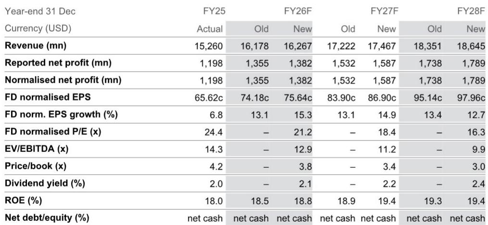
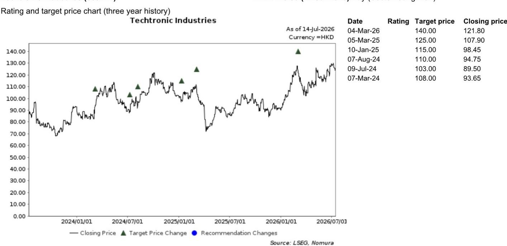
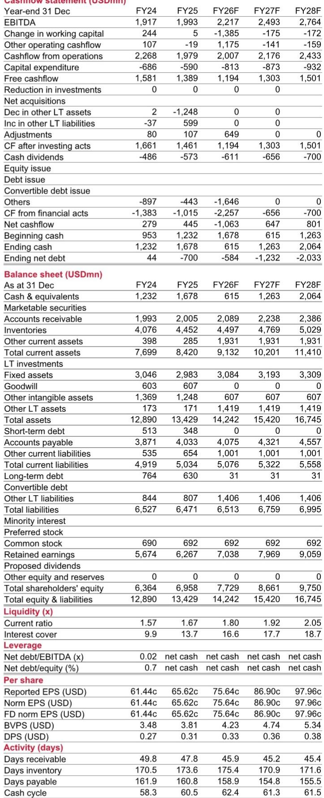

# NOM：创科实业Milwaukee动能支撑增长

数据中心建设支出、替换周期启动和渠道补库存，这三股力量正在同时推动创科实业进入一个少见的增长窗口。NOM在最新报告中上调了这家电动工具龙头的盈利预测，核心判断是：2026年下半年可能出现的渠道补库存，将成为全年业绩的额外加速器。

报告给出的时间线值得注意。1H26F，数据中心建设支出同比增长22.1%，这是美国普查局的官方数据，不是行业推测。与此同时，2020-2021年销售高峰对应的电动工具，正在进入五到七年的自然替换周期。这两个因素叠加，已经为上半年提供了可量化的增长基础。

但真正让这份报告区别于市场共识的，是它对下半年库存行为的判断。

## 1. 渠道库存处于低位，补库存窗口正在打开

NOM估算，家得宝在2026年6月的电动工具库存水平同比持平甚至更低。考虑到四季度行业终端销售可能实现超过10%的同比增长——来自黑色星期五、礼品促销和新品发布——三季度很可能会看到分销商提前补货。

这个判断的逻辑链条是：终端销售增速超过渠道预期时，补库存不是选择，而是被动响应。如果四季度确实如行业调查显示的那样强劲，那么三季度就会成为库存重建的起点。

> **KC评论：** 补库存本身是短期脉冲，但它的意义在于验证需求是否真实。如果三季度渠道开始主动备货，说明下游对四季度销售有信心，这比任何预测模型都更有说服力。

## 2. Milwaukee正在从家得宝走向更宽的渠道

创科对家得宝的销售占比从2020年的48.9%下降到2025年的45.4%。表面看是集中度降低，但NOM认为这恰恰反映了非家得宝渠道的更快增长——数据中心客户、海外市场都在贡献增量。

欧洲市场是一个具体例子。2025年，创科在欧洲的本地货币销售增长9.0%，远超集团整体4.1%的增速。Milwaukee在欧洲仍属于相对晚进入的品牌，这意味着它在当地还有可观的渗透空间。

渠道多元化在电动工具行业是一个被低估的结构性优势。单一渠道依赖意味着议价权受限，而多通道增长则让品牌在面对零售商时拥有更多空间。

## 3. 品牌聚焦正在改善利润率结构

2025年12月，创科暂停了Hart品牌业务。这个动作在短期内会影响收入增长并产生额外费用，但NOM认为长期影响是正面的：公司将资源集中在Milwaukee和Ryobi两个核心品牌上，有助于提升整体净利率。

从财务数据看，毛利率从FY24的40.3%提升到FY25的41.2%，NOM预计FY26F将进一步升至42.7%。净利率也从7.7%升至7.9%，预计FY26F达到8.5%。这些数字背后是产品组合优化和品牌聚焦的共同结果。

一个值得注意的细节是，创科在FY25已经处于净现金状态，且预计未来几年将持续保持。这意味着公司在补库存周期中不需要额外融资，现金流可以支撑运营扩张。

## 4. 数据中心需求不是短期故事

美国数据中心建设支出在2026年前五个月同比增长22.1%，这个数字来自官方统计，不是行业预测。数据中心对电动工具的需求不仅限于建设阶段——后续的运维、改造、扩容都会产生持续的工具采购。

Milwaukee在专业级电动工具市场的定位，使其天然受益于这类大型基础设施项目。与DIY市场不同，数据中心客户对工具的专业性、耐用性和电池平台兼容性有更高要求，这正是Milwaukee的竞争壁垒所在。

NOM报告没有展开的是，数据中心建设支出的持续性取决于科技公司的资本开支计划。如果AI相关研究继续扩张，数据中心建设周期可能比传统商业地产更长，这意味着工具需求的支撑时间也会相应延长。

---

，而在于它识别了三重需求叠加的时间窗口：替换周期、数据中心建设和渠道补库存。这三个因素在2026年同时出现，在创科的历史上并不常见。

对于关注这家公司的读者来说，三季度渠道库存数据将是验证报告判断的关键节点。如果补库存如期启动，那么2026年全年的增长节奏会比市场预期的更均衡——上半年靠数据中心和替换，下半年靠渠道重建。

For informational purposes only. Portions may be generated,translated,summarized,or edited with AI assistance based on source materials and may contain omissions or errors. Please verify independently. This is not investment,legal,tax,accounting,or other professional advice.

For informational purposes only. Portions may be generated,translated,summarized,or edited with AI assistance based on source materials and may contain omissions or errors. Please verify independently. This is not investment,legal,tax,accounting,or other professional advice.

