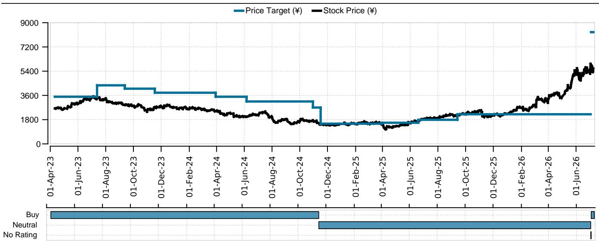
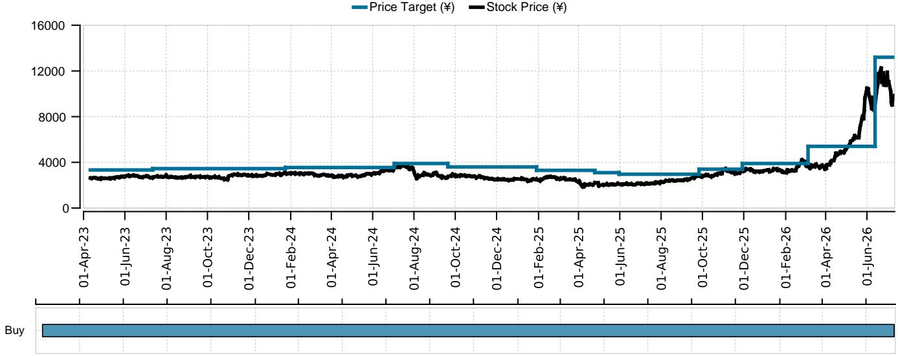
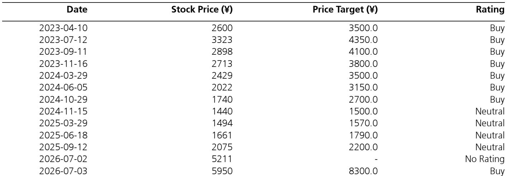

# AI基础设施需求正在重塑日本电子元器件行业，选择性布局的窗口正在收窄

日本电子元器件行业正呈现一种需要审慎观察的现象。在2026年7月初于香港和新加坡举行的28场读者会议中，市场对该行业的关注度依然很高，对多层陶瓷电容器（MLCC）基本面的乐观情绪持续存在。然而，与同年3月和4月的市场调研相比，由于股价估值上升和价格波动加剧，一种更为谨慎的态度也随之出现。这种强劲潜在需求与高企定价之间的张力，构成了一个策略性的观察节点。

核心逻辑清晰但尚未被广泛接受：AI驱动的需求周期正在同一行业内同时创造结构性赢家和周期性陷阱，而市场才刚刚开始区分它们。将所有电子元器件供应商视为水涨船高的受益者，可能会在分化变得明显时面临风险。

自春季以来，变化最显著的不是AI相关元器件需求的基本面展望，而是市场愿意为其支付的价格。在3月和4月，读者的主流姿态是看涨信念。到了7月，这种信念已分化为一场更细致的讨论：哪些公司真正拥有在未来12至18个月内维持增长的竞争壁垒。近期会议形成的共识是，该行业已不再是普涨格局。

## 村田制作所的AI增长可见性构筑了太阳诱电无法匹敌的清晰竞争壁垒

7月会议中读者情绪最显著的变化，是越来越多的人倾向于分析师对村田制作所而非太阳诱电的偏好。这并非边缘性偏好，而是反映了一种结构性判断：哪家公司已占据了AI数据中心建设所需的关键供应链位置。村田的竞争优势源于其由AI驱动的中期增长具有更高的可见性，而太阳诱电因其当前产品组合和客户集中度无法复制这一点。

这种区别之所以重要，是因为AI数据中心需要具备特定性能特征的元器件：超低噪声、热应力下的高可靠性，以及处理密集电力输送的能力。村田在这些领域的产品路线图更为先进，其与领先AI基础设施供应商的客户关系也更为深入。对观察者而言，这意味着村田的收入轨迹更具可预测性，且较少依赖宏观环境的广泛复苏。该公司的元器件现已嵌入AI计算的物理架构中，而不仅仅是搭乘一般电子需求的周期性浪潮。

相比之下，太阳诱电仍更多地暴露于当前信号混杂的传统消费电子和汽车周期中。两家公司之间的估值差距反映了这种分化，但7月会议表明，越来越多的观察者认为，随着AI基础设施支出在2027年前加速，这一差距应进一步扩大。

## 罗姆的内在价值在股价上涨后仍被低估，但铠侠的持仓带来干扰风险

分析师在亚洲路演前将罗姆的评级从“中性”上调至“增持”，引发了大量讨论。鉴于该股年初至今的强劲表现，一些读者对时机提出了质疑。然而，大多数读者认同核心分析论点：排除其持有的东芝普通股后，罗姆的内在价值仍被低估，其核心功率半导体业务存在可观的盈利上行空间。

这是一个典型的分类加总估值机会。市场将罗姆作为一个单一实体定价，但该公司资产负债表上持有大量铠侠的间接股份。这一持股造成了估值扭曲。剔除铠侠持仓后，剩余核心业务的交易价格存在折价，未能反映其在碳化硅（SiC）功率器件及其他AI相关半导体产品中的定位。这些核心业务的盈利上行空间尚未在一致预期中体现。

一些读者提出的反对意见是，罗姆的股价日益受到其铠侠持股波动的影响，这增加了投资案例的复杂性。这是一个合理的担忧。购买罗姆股票以获取其功率半导体故事的读者，必须接受其部分回报将由市场对另一家不同子行业公司的看法决定。风险在于，铠侠自身的周期性或估值压缩可能掩盖罗姆的运营进展。

对于决策者而言，含义很明确：只有那些愿意穿透铠侠的干扰，专注于功率半导体业务独立盈利轨迹的人，才能看到罗姆提供的风险回报比。该股票并非被动持有标的，需要主动跟踪两个独立的故事。

## 数据中心敞口是行业中最具意义的讨论话题，但上行空间集中在少数公司

在会议中讨论最频繁的股票中，TDK和美蓓亚三美引发了最长的对话，特别是围绕它们在数据中心领域的业务机会。这并非巧合。数据中心建设是当前周期中电子元器件较强劲的需求驱动力，而这两家公司都拥有合理的敞口。

然而，多位读者表示，以当前估值来看，TDK和美蓓亚三美的上行空间有限。这是一个关键细节。数据中心敞口是股票被纳入考虑的必要条件，但不足以证明溢价估值的合理性。市场已为这些公司计入了基线水平的数据中心收入增长。读者现在提出的问题是，增长率是否会加速超过已被贴现的水平。

对于TDK，讨论集中在其为AI服务器提供的电源和磁性元器件能力上。对于美蓓亚三美，焦点则在于其用于数据中心冷却和自动化系统的精密电机和传感器技术。两者都是真实的机会，但数据中心收入占两家公司总销售额的比例仍然不大。风险在于，数据中心热情可能推动股价先行于实际盈利贡献，一旦更广泛的电子周期走软，这种估值将难以维持。

相比之下，广濑电机引发了另一种讨论。许多读者表达了对工业设备需求复苏的预期，并提到了新整合的SER（一家半导体测试探针制造商）的潜力，将其视为一个具体催化剂。这是一个更细化的机会。SER为广濑提供了与半导体资本支出周期的直接联系，而该周期目前正由AI芯片需求驱动。整合是近期发生的，其盈利贡献尚未被市场完全理解。对于愿意深入研究的读者而言，广濑可能提供一条通往AI敞口的、不那么拥挤的路径。

京瓷也被广泛讨论，但焦点是理解其近期股价走强背后的因素，而非基本面上行空间。这是一个警示信号。当读者在问“这只股票为什么上涨？”而非“它还能增长多少？”时，通常表明价格变动已跑在了基本面故事之前。会议中注意到了一些对基本面改善的预期，但语气更多是探究性的，而非基于坚定信念。

## 在当前周期中观察日本电子元器件行业的决策框架

7月会议的信息可以整合为一个实用的决策框架。该框架包含三个层面：结构性需求验证、估值纪律和敞口集中度。

首先，结构性需求验证需要确认一家公司的AI相关收入不仅是在增长，而且是作为总销售额的百分比在增长。村田通过了这一检验。排除铠侠持股后，罗姆也通过了。TDK和美蓓亚三美正在取得进展，但尚未达到AI收入主导盈利叙事的门槛。广濑是早期阶段的候选者。太阳诱电和京瓷在当前周期中未通过这一检验。

其次，估值纪律意味着拒绝任何具有AI敞口的股票都值得溢价倍数的前提。7月会议显示，读者正越来越多地应用这一纪律，尤其是对TDK和美蓓亚三美。正确的方法是将当前市盈率与仅包含已合同锁定的AI收入（而非期望中的AI收入）的前瞻盈利预估进行比较。交易价格高于此调整后倍数的公司，无论其故事如何，都应避免。

第三，敞口集中度意味着认识到日本电子元器件行业并非一个多元化的押注。AI机会集中在少数拥有特定产品能力和客户关系的公司。试图通过不加区分地持有五六只股票来捕捉这一主题的投资组合，很可能会跑输那些专注于两三家拥有较强结构性地位的公司。分析师对村田和罗姆的明确推荐反映了这种集中逻辑。

行业分析中识别的风险因素强化了采用此框架的必要性。宏观因素的突然波动，特别是美国个人消费的变化，可能扰乱更广泛的电子周期。金融市场波动，包括美国股市的震荡，可能压缩整个行业的估值，无论个别公司表现如何。石化和金属等基础材料成本的变化，可能压缩缺乏定价能力的公司的利润率。这些风险并非假设，它们是当前周期可能转向的机制。

其含义是，该行业有吸引力的入场窗口正在收窄。随着越来越多的读者聚焦于AI主题，拥有真正结构性优势的股票将变得更加昂贵，而仅仅搭乘主题的股票将更容易受到回调的影响。现在的决策不是是否要关注日本电子元器件，而是哪些具体公司拥有足够的盈利可见性来证明其当前估值的合理性，以及拥有足够的竞争壁垒来在下一轮周期中维持增长。

*仅供参考。部分内容可能基于源材料通过AI辅助生成、翻译、总结或编辑，可能存在遗漏或错误。请独立核实。本文不构成任何专业建议。*

仅供参考。部分内容可能基于源材料通过AI辅助生成、翻译、总结或编辑，可能存在遗漏或错误。请独立核实。本文不构成任何专业建议。

