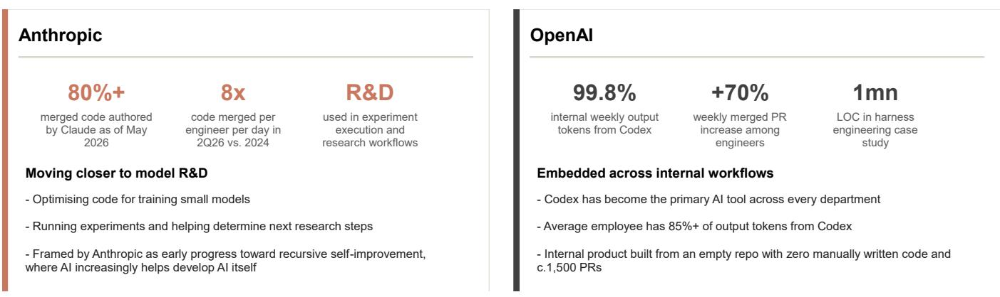
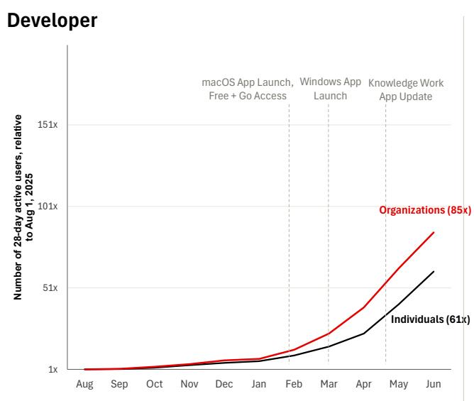
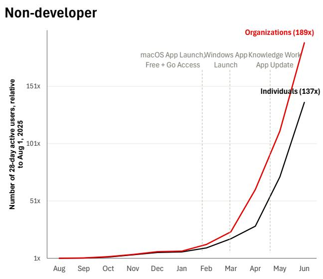
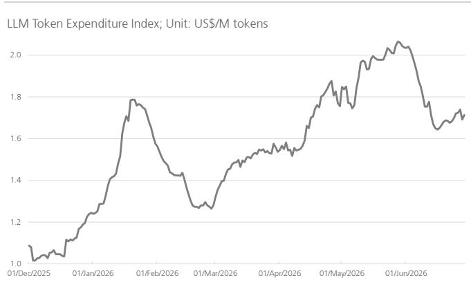
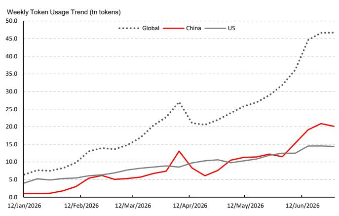

# China AI Intelligence

# Key themes in H226E: model capability, monetization, and token ROI

## Three key themes

Interest in China AI models has increased after the listing of Zhipu and MiniMax in early 2026, with market discussions becoming more nuanced across model iteration, monetization and competition. We set out three key themes to watch in H226E: 1) while we expect continued improvement in model intelligence led by coding capability, we note early signs that SOTA models may maintain their position, supported by data feedback loops and improving user engagement due to better productization and the rising adoption of AI in model R&D (e.g. recursive self-improvement); 2) we expect model-layer monetization to continue to grow, as coding TAM expands beyond developers, while progress in multimodality may be underappreciated; and 3) we expect an increasing focus on token ROI, and the shift of enterprises and users from tokenmaxing to token optimization should drive tiered demand and widen divergence in the pricing power of state-of-the-art (SOTA) vs. other models, while Chinese models may benefit from this trend given their structural cost efficiency (note).

## Coding remains the clearest path for model intelligence improvement

We reiterate our view that coding is the core capability underpinning model intelligence with a clear path to drive the capability frontier. We view AI coding as among the most tractable domains for RL-based post-training, given its relatively verifiable outcomes, scalable synthetic data and real-task feedback from AI coding agents. We note emerging Chinese AI labs are more proactive in productization by building coding-agent products/harnesses, which could create a potential data feedback loop and improve user engagement via accumulated project context, skills and preferences. We note rising adoption of AI in model R&D, where stronger coding capability could accelerate model iterations (early progress in recursive self-improvement). This could allow models with SOTA coding capabilities to reinforce their position.

## Vast monetization potential, increasing ROI discipline

On monetization, AI coding TAM continues to expand, shifting from developer tools into broader productivity tools for knowledge workers, with feature innovation (e.g. app plugins, Claude Tag) to integrate with more workflow and accelerate adoption. Progress in multimodality is also worth noting, with Chinese models demonstrating early leadership in video-generation capability and monetization (e.g. US$500m ARR for Kuaishou's Kling in May). As enterprise adoption shifts from tokenmaxing to ROI discipline, we are more positive on Chinese models' global share-gain potential, supported by rising recognition (e.g. GLM-5.2) and visible ROI advantages, especially in high-volume, repetitive coding and agentic workflows. However, we acknowledge compute supply remains the key bottleneck for the pace of ARR ramp-up.

## Diverging valuation among listed companies

The price performances of Zhipu and MiniMax post IPO has shown a widening divergence, reflecting Zhipu's strengthening position in SOTA coding models (e.g. GLM-5.2) and clearer monetization potential in coding use cases. While we do not rule out the possibility of MiniMax catching up in model performance, underpinned by its advantages in compute power access and R&D efficiency, we expect its valuation discount to continue in the near term, while we will continue to monitor inflection in future model iterations. Amid rising token demand, we raise our 2026E revenue/ARR forecasts significantly for both companies. Our PTs for Zhipu/MiniMax is revised to HK$2,200/HK$500, from HK$1,160/HK$1,000, implying 85x/20x P/ARR based on December 2026E ARR of US$1.5bn/US$1.0bn.

## Equities

China

Internet Services

Wei Xiong

Analyst

wei.xiong@ubs.com

+86-21-3866 8883

Kenneth Fong

Analyst

kenneth-kc.fong@ubs.com

+852-3712 3890

Charles Chen

Analyst

S1460524020001

charles-za.chen@ubs.com

+86-21-3866 8907

## COMMENTARY

## Clear path for model capability improvement in AI coding

We believe AI coding is among the most tractable domains for RL-based post-training, given its relatively verifiable outcomes through code execution, unit tests and automated graders, while scalable synthetic data and real-task feedback from coding agents could further support continued model improvement.

We note early adoption of AI coding in frontier model R&D, with stronger coding capabilities potentially helping accelerate future model iterations, forming an early path toward recursive self-improvement (RSI). This is illustrated by Anthropic's latest report, "When AI builds itself", which suggests that coding agents are increasingly being used in AI model R&D, including optimizing code for training small models and running experiments. OpenAI's Codex disclosures also points to a similar trend in internal adoption.

Figure 1: AI coding is moving deeper into frontier model R&D  
  
Source: Company data

## Productization and early data feedback loop

On top of further developing their base models, we note that emerging Chinese AI labs are becoming more proactive in launching first-party coding agent products/harnesses, including Zhipu's ZCode, MiniMax Code and DeepSeek's reported Code Harness team build-out (news). We believe this could create an early data feedback loop, as user interactions and real-task workflows can feed back into model improvement. Meanwhile, accumulated project context, skills and user preferences could also improve user engagement over time, in our view.

Figure 2: Chinese AI labs are increasingly launching first-party coding-agent products / harnesses

<table><tr><td>Company</td><td>Coding agent</td><td>Launch date</td><td>Coding agent progress</td></tr><tr><td>Emerging AI labs</td><td></td><td></td><td></td></tr><tr><td>Zhipu</td><td>Zcode</td><td>1-Jul-26</td><td>Launched ZCode, a first-party coding-agent / harness product for GLM models. It is positioned as a desktop agent for coding workflows, supporting long-horizon tasks, SSH remote development and mobile control.</td></tr><tr><td>Moonshot AI(Kimi)</td><td>Kimi Code</td><td>May-26</td><td>Released Kimi Code CLI, a terminal-based coding agent that can read and edit code, run shell commands, search files, fetch web pages and choose next steps based on execution feedback.</td></tr><tr><td>MiniMax</td><td>MiniMax Code</td><td>29-May-26</td><td>Renamed its MiniMax Agent desktop app to MiniMax Code, adding a dedicated CLI shortcut and positioning it more clearly as a coding-agent product.</td></tr><tr><td>DeepSeek</td><td>Developing</td><td>20-May-26</td><td>Reportedly started building a native coding-agent product via a new Code Harness team, with the product informally referred to as DeepSeek Code.</td></tr><tr><td>Internet leaders</td><td></td><td></td><td></td></tr><tr><td>Tencent</td><td>CodeBuddy</td><td>9-Sep-25</td><td>Launched CodeBuddy Code, an AI CLI coding agent, adding CLI format to CodeBuddy's existing plugin / IDE product suite.</td></tr><tr><td>Alibaba</td><td>Qwen Code</td><td>22-Jul-25</td><td>Open-sourced Qwen Code, a terminal coding agent adapted for Qwen models and agentic coding workflows.</td></tr><tr><td>ByteDance</td><td>TRAE</td><td>Jul-25</td><td>Released TRAE Agent, an LLM-based software engineering agent with CLI support for general-purpose coding tasks and repository-level workflows.</td></tr><tr><td>Baidu</td><td>Comate</td><td>Jun-25</td><td>Released Comate AI IDE, expanding Comate from AI coding assistant toward AI IDE / coding-agent workflows with multimodal capabilities and multi-agent collaboration.</td></tr></table>

Source: Company data

## AI coding TAM expansion continues

We observe that AI coding TAM continues to expand, as coding agents shift from developer tools to broader productivity tools for knowledge workers. OpenAI's latest Codex usage update provides clear evidence of this trend: Codex use started with developers, but as it expanded toward more general knowledge work, non-developer users became the fastest-growing user group. By early Jun-2026, non-developer individual users had increased 137x since Aug-2025, while non-developer organizational users increased 189x and OpenAI's non-developer internal users increased 12x.

Meanwhile, we believe continued feature innovation could further accelerate adoption beyond software engineers. For example, OpenAI's Codex plugins extend coding agents into role-specific workflows across data analytics, creative production, sales, product design, public equity investing and investment banking, while Anthropic's Claude Tag brings Claude into Slack as a team-based agent with access to selected channels, tools, data and codebases. We also observed similar features in China's coding agent products (e.g., Zhipu's Zcode and Kimi Code/Work).

Figure 3: AI coding agent adoption is broadening beyond developers  

  
Source: OpenAI (How agents are transforming work). Note: The above data refers to 28-day active users indexed to 1 Aug. 2025

As enterprise adoption shifts from tokenmaxing to ROI discipline, we are more positive on Chinese models' global share-gain potential, with more visible ROI advantages in coding and agentic workflows, especially for high-volume, repetitive inference tasks, as evidenced by rising integrations across overseas apps and platforms (see our APAC Focus report on China AI models' cost efficiency).

Figure 4: LLM Token Expenditure Index  
  
Source: SiliconData. Note: Data as of 1 July 2026. Normalized blended rate drawn from observations across frontier API providers, open-weight inference platforms, brokered dedicated-instance markets and self-hosted reference deployment

Figure 5: China vs US AI model token usage trend on OpenRouter  
  
Source: OpenRouter. Note: Data as of 1 July 2026

Figure 6: Overseas apps and platforms are increasingly integrating Chinese AI models

<table><tr><td>App / Platform</td><td>Product category</td><td>Key functions</td><td>Timing</td><td>Integration details</td></tr><tr><td>Fireworks AI</td><td>AI inference / model hosting platform</td><td>Open-model AI infrastructure for training / fine-tuning and high-throughput inference, with serverless, on-demand and reserved deployments plus OpenAI / Anthropic-compatible APIs</td><td>Kimi / MiniMax / Qwen: 10-12 Jun 2026; GLM-5.2: 16 Jun 2026</td><td>Fireworks announced day-zero GLM-5.2 availability. Its changelog / model library also lists Kimi K2.7 Code, MiniMax M3, Qwen 3.7 Plus and other Chinese models on the platform.</td></tr><tr><td>Vercel AI</td><td>Developer tool / AI gateway</td><td>Developer AI gateway providing one API key for hundreds of models, unified billing / observability, provider routing / fallback, spend controls, BYOK and drop-in SDK compatibility</td><td>GLM-5.2: 16 Jun 2026; GLM-5.2 Fast via Wafer: 24 Jun 2026</td><td>Vercel added GLM-5.2 to AI Gateway on 16 Jun under model ID zai/glm-5.2. On 24 Jun, it added GLM-5.2 Fast via Wafer, a model inference / hosting platform offering serverless and dedicated inference.</td></tr><tr><td>Cloudflare Workers AI</td><td>Serverless AI / edge inference platform</td><td>Serverless GPU inference on Cloudflare's global network, with open-source model access through Workers / API, pay-as-you-use pricing and integrations with AI Gateway, Vectorize and Workers</td><td>16 Jun 2026</td><td>Cloudflare announced GLM-5.2 availability on Workers AI, highlighting agentic coding, function calling and reasoning. The initial context window was 262k, with plans to expand later.</td></tr><tr><td>OG Private Computer</td><td>Decentralised AI compute / verifiable inference</td><td>Decentralised AI compute network for router / direct inference, provider marketplace access, wallet-based settlement, TEE-backed verification and chatbot, image and speech service types</td><td>18 Jun 2026; Kimi added the following day</td><td>OG announced GLM-5.2 availability on Private Computer, highlighting end-to-end encryption for prompts, code and outputs, as well as verifiable compute. Qwen-3.7 Plus was also available, with Kimi 2.7 Code added shortly thereafter.</td></tr><tr><td>Notion</td><td>Notes / AI workspace</td><td>All-in-one workspace for docs, wikis / knowledge base, databases, project management, enterprise search, meeting notes and agents</td><td>Mid-Jun 2026</td><td>Notion announced GLM-5.2 availability, particularly for long-horizon tasks. The model is served through Baseten, which also confirmed that Notion is offering GLM-5.2 via its inference platform.</td></tr><tr><td>Perplexity</td><td>AI answer engine / Enterprise AI / APIs</td><td>AI answer engine and enterprise research platform spanning web research, internal-file / app search, agentic Computer workflows and developer APIs</td><td>Mid- to late Jun 2026</td><td>Perplexity's Agent API model list includes perplexity/glm-5.2 and perplexity/kimi-k2.7-code, making both models available through its Agent API.</td></tr><tr><td>Devin / Cognition</td><td>AI coding / software engineering agent</td><td>Autonomous AI software engineer for writing, running and testing code, resolving tickets / bugs, migrations / refactors, PR review, codebase Q&A and engineering support</td><td>24 Jun 2026</td><td>Devin announced that Kimi K2.7 and GLM-5.2 are available in Devin Desktop and CLI.</td></tr><tr><td>Coinbase</td><td>Crypto exchange / digital asset platform</td><td>Retail and institutional crypto / asset trading platform, with custody, staking, payments, wallets, developer infrastructure and onchain services</td><td>Late Jun 2026;</td><td>Coinbase co-founder and CEO Brian Armstrong said the company is experimenting with GLM-5.2 and Kimi 2.7 as default open-weight models through its internal LLM gateway, aiming to reduce AI spend without restricting engineers' token usage.</td></tr><tr><td>Fello AI</td><td>Multi-model AI assistant / consumer app</td><td>All-in-one AI chatbot app for Mac, iPhone and iPad, with multi-model chat, web search, file / PDF analysis, image generation / editing, multilingual chat and cross-device sync</td><td>25 Jun 2026</td><td>Fello AI 6.7.0 added GLM-5.2, MiniMax M3, DeepSeek V4 and Qwen 3.7 Max, alongside new Podcast and Travel Skills and broader file support.</td></tr><tr><td>Poe / Quora</td><td>Multi-model chatbot / bot platform</td><td>Consumer and developer AI aggregation platform for accessing multiple models / bots, generating text, images, video and audio, web search, multi-bot chat, bot / app creation, workflows and Poe API</td><td>Live on platform; no single announcement date found</td><td>Poe pages show access to GLM-5.2, DeepSeek V4 Flash / Pro. Kimi K2.7 Code, MiniMax M3 and other Chinese models via providers such as Novita AI.</td></tr></table>

Source: Company data

Figure 7: Model intelligence and API prices of key AI models

<table><tr><td>Provider</td><td>Model</td><td>Release Date</td><td>AA Intelligence Index</td><td>Input Price (US$/M tokens)</td><td>Cache Hit Price (US$/M tokens)</td><td>Output Price (US$/M tokens)</td><td>Blended Price (US$/M tokens)</td></tr><tr><td>Zhipu</td><td>GLM-5.2 (max)</td><td>2026/06/16</td><td>51.1</td><td>$1.4</td><td>$0.26</td><td>$4.4</td><td>$0.90</td></tr><tr><td>Zhipu</td><td>GLM-5.1</td><td>2026/04/07</td><td>40.2</td><td>$1.4</td><td>$0.26</td><td>$4.4</td><td>$0.90</td></tr><tr><td>MiniMax</td><td>MiniMax-M3</td><td>2026/06/01</td><td>44.4</td><td>$0.3</td><td>$0.06</td><td>$1.2</td><td>$0.22</td></tr><tr><td>MiniMax</td><td>MiniMax-M2.7</td><td>2026/03/18</td><td>38.1</td><td>$0.3</td><td>$0.06</td><td>$1.2</td><td>$0.22</td></tr><tr><td>Kimi</td><td>Kimi K2.6</td><td>2026/04/20</td><td>42.8</td><td>$1.0</td><td>$0.16</td><td>$4.0</td><td>$0.70</td></tr><tr><td>DeepSeek</td><td>DeepSeek V4 Pro (peak-period pricing)</td><td>2026/06/29</td><td rowspan="2">31.2</td><td>$0.9</td><td>$0.007</td><td>$1.7</td><td>$0.35</td></tr><tr><td>DeepSeek</td><td>DeepSeek V4 Pro</td><td>2026/04/24</td><td>$0.4</td><td>$0.004</td><td>$0.9</td><td>$0.18</td></tr><tr><td>DeepSeek</td><td>DeepSeek V4 Flash (High) (peak-period pricing)</td><td>2026/06/29</td><td rowspan="2">37.4</td><td>$0.3</td><td>$0.006</td><td>$0.6</td><td>$0.12</td></tr><tr><td>DeepSeek</td><td>DeepSeek V4 Flash (High)</td><td>2026/04/24</td><td>$0.1</td><td>$0.003</td><td>$0.3</td><td>$0.06</td></tr><tr><td>Alibaba</td><td>Qwen3.7 Max</td><td>2026/05/19</td><td>46.0</td><td>$2.5</td><td>$0.25</td><td>$7.5</td><td>$1.43</td></tr><tr><td>Alibaba</td><td>Qwen3.6 Max Preview</td><td>2026/04/20</td><td>40.0</td><td>$1.3</td><td>$0.13</td><td>$7.8</td><td>$1.13</td></tr><tr><td>Tencent</td><td>Hy3-preview</td><td>2026/04/23</td><td>26.1</td><td>$0.1</td><td>$0.03</td><td>$0.3</td><td>$0.06</td></tr><tr><td>Anthropic</td><td>Claude Claude Fable 5 (with Fallback)</td><td>2026/07/01</td><td>60.0</td><td>$10.0</td><td>$1.00</td><td>$50.0</td><td>$7.70</td></tr><tr><td>Anthropic</td><td>Claude Sonnet 5 (max) (through August 31, 2026)</td><td>2026/06/30</td><td>53.4</td><td>$2.0</td><td>$0.20</td><td>$10.0</td><td>$1.54</td></tr><tr><td>Anthropic</td><td>Claude Sonnet 5 (max) (starting September 1, 2022)</td><td>2026/06/30</td><td>53.4</td><td>$3.0</td><td>$0.30</td><td>$15.0</td><td>$2.31</td></tr><tr><td>Anthropic</td><td>Claude Opus 4.8 (max)</td><td>2026/05/28</td><td>55.7</td><td>$5.0</td><td>$0.50</td><td>$25.0</td><td>$3.85</td></tr><tr><td>Anthropic</td><td>Claude Opus 4.7 (max)</td><td>2026/04/16</td><td>53.5</td><td>$5.0</td><td>$0.50</td><td>$25.0</td><td>$3.85</td></tr><tr><td>Anthropic</td><td>Claude Sonnet 4.6 (max)</td><td>2026/02/17</td><td>47.2</td><td>$3.0</td><td>$0.30</td><td>$15.0</td><td>$2.31</td></tr><tr><td>Anthropic</td><td>Claude 4.5 Haiku</td><td>2025/10/15</td><td>23.7</td><td>$1.0</td><td>$0.10</td><td>$5.0</td><td>$0.77</td></tr><tr><td>OpenAI</td><td>GPT-5.5 (xhigh)</td><td>2026/04/23</td><td>54.8</td><td>$5.0</td><td>$0.50</td><td>$30.0</td><td>$4.35</td></tr><tr><td>Google</td><td>Gemini 3.1 Pro Preview</td><td>2026/02/19</td><td>46.5</td><td>$2.0</td><td>$0.20</td><td>$12.0</td><td>$1.74</td></tr></table>

Source: Company data, Artificial Analysis. Note: Data as of 9 July 2026. The blended price is calculated using cached input, uncached input and output token prices, with a ratio of 7:2:1. AA = Artificial Analysis

## Estimate changes

Figure 8: Summary of price targets and ratings – China AI stocks

<table><tr><td rowspan="2">Ticker</td><td rowspan="2">Company name</td><td rowspan="2">Mkt Cap (USD, m)</td><td rowspan="2">Share Price (HK$)</td><td colspan="2">PT (HK$)</td><td rowspan="2">Rating</td><td colspan="2">P/S (x)</td><td>Rev. CAGR</td><td colspan="2">PS/G</td></tr><tr><td>New</td><td>Old</td><td>2026E</td><td>2027E</td><td>25-27E</td><td>2026E</td><td>2027E</td></tr><tr><td>0100.HK</td><td>MiniMax</td><td>10,751</td><td>269</td><td>500</td><td>1,000</td><td>Buy</td><td>23</td><td>11</td><td>258%</td><td>0.09</td><td>0.04</td></tr><tr><td>2513.HK</td><td>Knowledge Atlas</td><td>93,314</td><td>1,640</td><td>2,200</td><td>1,160</td><td>Buy</td><td>104</td><td>42</td><td>332%</td><td>0.31</td><td>0.13</td></tr></table>

Source: Company data, Refinitiv, UBS estimates. Note: Consensus estimates are based on Refinitiv. Data as of 10 July 2026

## Knowledge Atlas Technology (Zhipu; 2513.HK)

We significantly raise our 2026E topline forecasts by 71%, mainly reflecting our more positive view on Zhipu's ARR ramp-up pace. We now estimate ARR to reach US$1.5bn by December 2026 (vs. US$250m in March 2026), higher than previous management internal target of US$1bn. This is supported by its strengthening position in AI coding, expanding compute capacity through internal AI infrastructure optimization and supply-sourcing efforts, as well as potential market share gains amid tighter access to global frontier models. We also raise our topline forecasts into the outer years, while conservatively modeling a more moderate growth trajectory beyond 2027E.

We edge down our GPM forecast by 1.2ppt in 2026, reflecting rising hardware-related costs, partially offset by the company's efforts to optimize AI inference costs. With improving operating leverage, we forecast a narrowing of the adjusted net margin to -100% in 2026 (-160% previously), although the absolute adjusted net loss increases by 7% to Rmb5.5bn due to the larger revenue base.

Figure 9: Key assumption changes

<table><tr><td rowspan="2">RMB mn</td><td rowspan="2">2024</td><td rowspan="2">2025</td><td colspan="3">2026E</td><td colspan="3">2027E</td><td colspan="3">2028E</td></tr><tr><td>New Ests.</td><td>Old Ests.</td><td>Diff.</td><td>New Ests.</td><td>Old Ests.</td><td>Diff.</td><td>New Ests.</td><td>Old Ests.</td><td>Diff.</td></tr><tr><td>Revenue</td><td>312</td><td>724</td><td>5,494</td><td>3,208</td><td>71%</td><td>13,531</td><td>7,941</td><td>70%</td><td>17,885</td><td>13,574</td><td>32%</td></tr><tr><td>YoY %</td><td>150.9%</td><td>131.9%</td><td>658.5%</td><td>342.8%</td><td>316 ppt</td><td>146.3%</td><td>147.6%</td><td>-1 ppt</td><td>32.2%</td><td>70.9%</td><td>-39 ppt</td></tr><tr><td>On-premise deployment</td><td>264</td><td>534</td><td>1,007</td><td>1,007</td><td>0%</td><td>1,753</td><td>1,753</td><td>0%</td><td>2,620</td><td>2,620</td><td>0%</td></tr><tr><td>Open platform and API</td><td>48</td><td>190</td><td>4,487</td><td>2,200</td><td>104%</td><td>11,778</td><td>6,188</td><td>90%</td><td>15,264</td><td>10,954</td><td>39%</td></tr><tr><td>Gross profit</td><td>176</td><td>297</td><td>1,762</td><td>1,067</td><td>65%</td><td>5,409</td><td>3,235</td><td>67%</td><td>7,978</td><td>6,044</td><td>32%</td></tr><tr><td>Gross Margin</td><td>56.3%</td><td>41.0%</td><td>32.1%</td><td>33.3%</td><td>-1.2 ppt</td><td>40.0%</td><td>40.7%</td><td>-0.8 ppt</td><td>44.6%</td><td>44.5%</td><td>0.1 ppt</td></tr><tr><td>Operating expense</td><td>(2,714)</td><td>(4,083)</td><td>(8,642)</td><td>(6,950)</td><td>24%</td><td>(12,908)</td><td>(9,898)</td><td>30%</td><td>(14,885)</td><td>(12,945)</td><td>15%</td></tr><tr><td>% of revenue</td><td>868.8%</td><td>563.7%</td><td>157.3%</td><td>216.7%</td><td>-59 ppt</td><td>95.4%</td><td>124.6%</td><td>-29 ppt</td><td>83.2%</td><td>95.4%</td><td>-12 ppt</td></tr><tr><td>Selling and marketing expenses</td><td>(387)</td><td>(391)</td><td>(899)</td><td>(743)</td><td>21%</td><td>(1,556)</td><td>(1,191)</td><td>31%</td><td>(1,788)</td><td>(1,629)</td><td>10%</td></tr><tr><td>% of revenue</td><td>124.0%</td><td>54.0%</td><td>16.4%</td><td>23.1%</td><td>-7 ppt</td><td>11.5%</td><td>15.0%</td><td>-4 ppt</td><td>10.0%</td><td>12.0%</td><td>-2 ppt</td></tr><tr><td>General and administrative expenses</td><td>(134)</td><td>(505)</td><td>(899)</td><td>(743)</td><td>21%</td><td>(1,421)</td><td>(1,191)</td><td>19%</td><td>(1,610)</td><td>(1,357)</td><td>19%</td></tr><tr><td>% of revenue</td><td>42.8%</td><td>69.8%</td><td>16.4%</td><td>23.1%</td><td>-7 ppt</td><td>10.5%</td><td>15.0%</td><td>-5 ppt</td><td>9.0%</td><td>10.0%</td><td>-1 ppt</td></tr><tr><td>Research and Development expenses</td><td>(2,195)</td><td>(3,180)</td><td>(6,846)</td><td>(5,467)</td><td>25%</td><td>(9,930)</td><td>(7,517)</td><td>32%</td><td>(11,501)</td><td>(9,964)</td><td>15%</td></tr><tr><td>% of revenue</td><td>702.7%</td><td>439.1%</td><td>124.6%</td><td>170.4%</td><td>-46 ppt</td><td>73.4%</td><td>94.7%</td><td>-21 ppt</td><td>64.3%</td><td>73.4%</td><td>-9 ppt</td></tr><tr><td>Operating profit/(loss)- IFRS</td><td>(2,538)</td><td>(3,787)</td><td>(6,880)</td><td>(5,882)</td><td>17%</td><td>(7,499)</td><td>(6,663)</td><td>13%</td><td>(6,907)</td><td>(6,900)</td><td>0%</td></tr><tr><td>IFRS operating margin %</td><td>-812.5%</td><td>-522.8%</td><td>-125.2%</td><td>-183.4%</td><td>-32%</td><td>-55.4%</td><td>-83.9%</td><td>-34%</td><td>-38.6%</td><td>-50.8%</td><td>-24%</td></tr><tr><td>Operating profit/(loss)- Adjusted (Non-IFRS)</td><td>(2,046)</td><td>(2,251)</td><td>(5,431)</td><td>(5,084)</td><td>7%</td><td>(4,251)</td><td>(4,757)</td><td>-11%</td><td>(2,794)</td><td>(3,914)</td><td>-29%</td></tr><tr><td>Adjusted OPM %</td><td>-655%</td><td>-311%</td><td>-99%</td><td>-158%</td><td>60 ppt</td><td>-31%</td><td>-60%</td><td>28 ppt</td><td>-16%</td><td>-29%</td><td>13 ppt</td></tr><tr><td>Profit/(loss) before tax</td><td>(2,958)</td><td>(4,718)</td><td>(6,953)</td><td>(5,956)</td><td>17%</td><td>(7,494)</td><td>(6,653)</td><td>13%</td><td>(6
