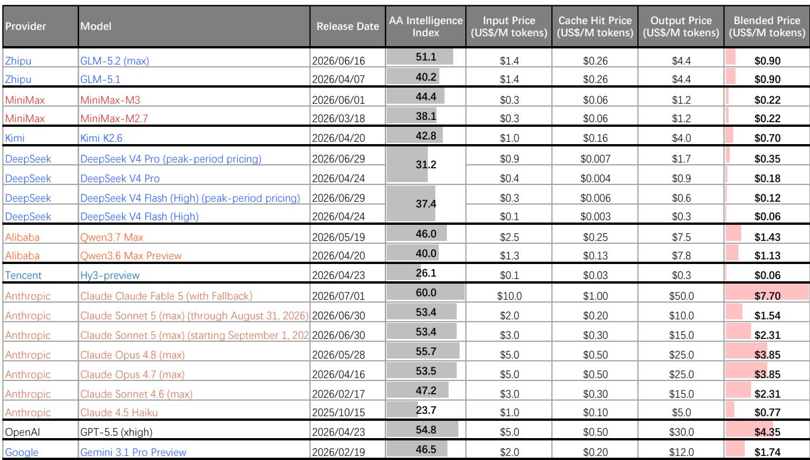
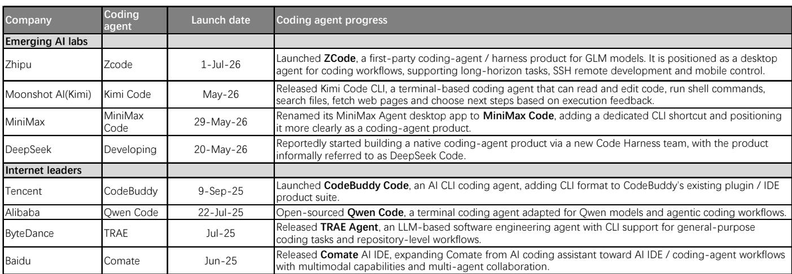
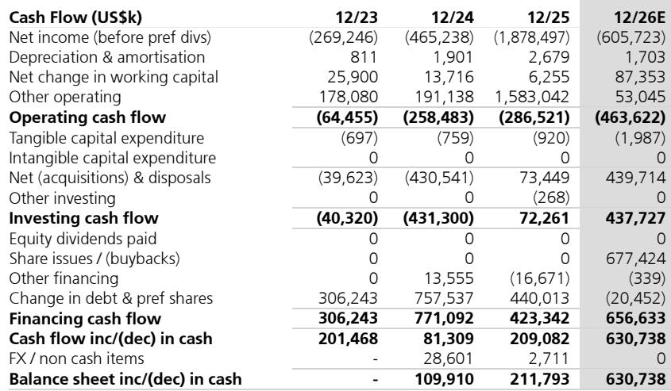

# UBS：中国AI智能H2关键主题-模型能力、货币化与token ROI

智谱和MiniMax在2026年初先后上市后，市场对中国AI模型的讨论已经从“能不能追”进入“怎么赚钱”的阶段。UBS在最新发布的H2展望中提出一个核心判断：模型层商业化的分水岭正在到来，但决定胜负的变量不是算力规模，而是token ROI——企业客户正在从“有多少用多少”转向“每一分钱都要看到回报”。

这份报告最值得关注的地方，不是模型评测榜单的排名变化，而是三个正在同步发生、彼此强化的结构性趋势：编码能力正在成为模型智能迭代的“飞轮轴心”，模型层货币化的TAM正在从开发者扩展到知识工作者，以及中国模型凭借结构性成本优势，正在全球推理市场中拿到越来越多真实订单。

## 1. 编码能力正在成为模型智能的“自增强回路”

UBS认为，AI编码是目前强化学习后训练中最容易落地的领域。原因很直接：代码执行结果可验证、合成数据可规模化、编码Agent能提供真实任务反馈。这三个条件让编码成为模型能力提升最清晰的路径。

但真正有意思的发现是，更强的编码能力正在反哺模型研发本身。报告引用了Anthropic和OpenAI的内部数据：编码Agent已经被用于优化小模型训练代码、运行实验、甚至参与下一代模型的迭代。UBS称之为“递归自我改进”的早期迹象——模型越会写代码，就越能加速自己的进化。

这意味着，SOTA模型的领先优势可能比市场预期的更持久。数据飞轮和用户粘性正在形成：用户越用，模型越了解项目上下文、技能偏好和工作流，切换成本就越高。智谱的ZCode、MiniMax Code、DeepSeek正在组建的Code Harness团队，本质上都是在抢这个飞轮的入口。

> **KC评论：** 编码能力不只是“模型能不能写代码”的问题，它正在变成模型研发的基础设施。如果这个逻辑成立，那么模型之间的差距可能不是线性拉开的，而是指数级的——领先者的迭代速度会越来越快。

## 2. 货币化TAM正在从开发者扩展到知识工作者

AI编码的市场规模正在被重新定义。UBS观察到，编码Agent正在从开发者工具演变为知识工作者的通用生产力工具。OpenAI的Codex使用数据提供了最直接的证据：截至2026年6月初，非开发者个人用户较2025年8月增长了137倍，非开发者组织用户增长了189倍。

这不是一个边缘现象。Codex插件已经覆盖数据分析、创意制作、销售、产品设计、公开市场研究和国际机构等角色。Anthropic的Claude Tag把Agent带入Slack，成为团队协作的基础设施。中国产品也在跟进：智谱的ZCode和Kimi Code/Work都支持类似的多角色工作流。

多模态能力的进展同样值得关注。快手Kling在2026年5月已经实现5亿美元年化收入，证明视频生成不是“叫好不叫座”的赛道。UBS认为，市场可能低估了中国模型在多模态货币化上的早期领导力。

## 3. token ROI正在重塑竞争格局，中国模型的结构性优势开始兑现

企业客户的行为正在发生根本性转变。UBS将其概括为从“tokenmaxing”到“token optimisation”——过去企业追求“能跑多少跑多少”，现在开始精打细算每一笔token支出的回报。

这个转变对竞争格局的影响是结构性的。报告中的LLM Token Expenditure Index显示，中国模型的混合推理成本仅为美国前沿模型的十分之一甚至更低。GLM-5.2的混合价格是0.90美元/百万token，而Claude Fable 5是7.70美元，GPT-5.5是4.35美元。在高频、重复性的编码和Agent工作流中，这个成本差异直接转化为可量化的ROI优势。

海外平台的集成数据正在验证这一点。Fireworks AI、Vercel、Cloudflare、Notion、Perplexity、甚至Coinbase，都在2026年6月集中接入了GLM-5.2、Kimi K2.7等中国模型。Coinbase的CEO明确表示，引入中国模型是为了“在不限制工程师token使用的前提下降低AI支出”。

> **KC评论：** 中国模型的成本优势不是“便宜没好货”，而是结构性效率差异带来的定价权。当企业客户开始算ROI时，这种优势会从“可选”变成“必选”。但UBS也指出，算力供给仍然是ARR增长节奏的关键瓶颈——需求不缺，缺的是能稳定跑推理的算力。

## 4. 上市公司的估值分化已经开始，但拐点可能来自下一次模型迭代

智谱和MiniMax上市后的价格表现已经出现明显分化。UBS认为，这反映了智谱在SOTA编码模型上的领先地位（GLM-5.2）以及更清晰的编码场景货币化路径。MiniMax在算力获取和研发效率上有自己的优势，但短期内估值折价可能持续。

UBS大幅上调了两家公司的2026年收入和ARR预测。智谱的2026年12月ARR预期为15亿美元，MiniMax为10亿美元。但报告没有回避一个关键问题：下一次模型迭代可能改变竞争格局。如果MiniMax在下一轮模型评测中追平甚至反超，市场定价会重新调整。

对于读者来说，这意味着当前的分化不是终局，而是动态博弈的一个快照。跟踪的指标不是模型榜单排名，而是编码Agent的用户粘性、企业客户的token消耗结构、以及海外平台的集成深度。

---

For informational purposes only. Portions may be generated,translated,summarized,or edited with AI assistance based on source materials and may contain omissions or errors. Please verify independently. This is not investment,legal,tax,accounting,or other professional advice.

For informational purposes only. Portions may be generated,translated,summarized,or edited with AI assistance based on source materials and may contain omissions or errors. Please verify independently. This is not investment,legal,tax,accounting,or other professional advice.

