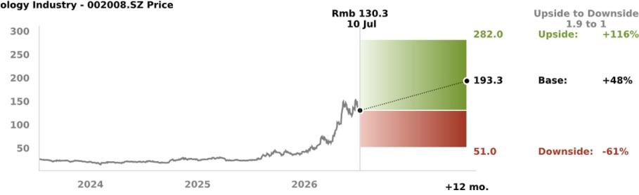
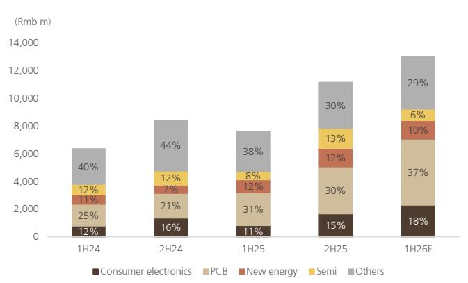
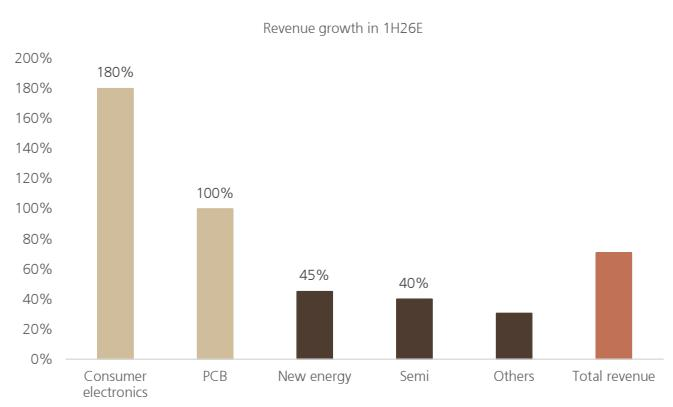

RIC: 002008.SZ BBG: 002008 CS

# 大族激光各业务线表现稳健，重申积极观点

## 上半年初步业绩表现强劲

根据公司初步业绩公告，上半年净利润同比增长156.1%至176.6%，显著高于我们及市场一致预期的约109%同比增长。强劲增长主要得益于：1）核心PCB及消费电子设备业务带动下，收入实现强劲增长（预计同比增长约68%）；2）经常性盈利能力改善（根据业绩指引中值，扣除特殊项目后的净利润率同比提升约9个百分点）。我们持续认为PCB及消费电子设备业务是可持续的增长驱动力，正如我们在升级报告（链接）中所强调的，增长动力来自于高端HDI和mSAP PCB的超快激光钻孔设备，以及主要客户稳健的采购需求。除PCB及消费电子设备外，其他业务如电池、泛半导体及其他激光设备也展现出稳健需求。在计入上半年强劲的初步业绩并更新主要业务假设后，我们将2026-28年盈利预测上调22-74%，并将目标报价从92.00元上调至193.30元。鉴于其扎实的基本面和合理的估值水平，我们维持积极观点。

## 各业务线表现强劲

PCB设备上半年收入同比增长超过100%，得益于下游需求强劲及产品组合改善（包括高精度背钻和超快激光钻孔设备）。超快激光钻孔设备的采用速度超出我们预期，主要受AI PCB和1.6T光模块需求驱动。我们认为，在更先进的PCB设备应用、市场份额持续提升及产品组合升级的推动下，这一增长势头将在2026-28年持续。消费电子设备上半年收入同比增长超过180%，我们认为可能由其最大客户驱动。我们预计下半年仍有上行空间，主要得益于折叠屏智能手机和3D打印设备的采用。其他业务中，电池/泛半导体/通用激光设备上半年收入同比分别增长45%/40%/30%，我们认为这得益于AI相关需求的增长。

## 盈利预测调整

我们将2026-28年盈利预测上调22-74%，反映收入预测上调16-40%以及综合毛利率预测上调2-4个百分点，主要由于产品组合改善。

## 估值：目标报价上调至193.30元，维持积极观点

我们将基于市盈率的目标报价从92.00元上调至193.30元，反映：1）每股盈利预测上调；2）目标市盈率倍数从26倍上调至35倍，隐含1.2倍PEG比率不变。鉴于我们认为其增长周期可能在下半年至2028年持续，当前估值仍具吸引力。

## 股票信息

<table><tr><td>中国</td></tr><tr><td>工业，多元化</td></tr></table>

12个月评级 积极

12个月目标价 193.30元

价格（2026年7月10日） 130.30元

交易数据及关键指标

<table><tr><td colspan="2">交易数据及关键指标</td></tr><tr><td>52周区间</td><td>152.80-24.22元</td></tr><tr><td>总市值</td><td>1340亿元/198亿美元</td></tr><tr><td>流通股数</td><td>10.30亿股</td></tr><tr><td>自由流通比例</td><td>93%</td></tr><tr><td>日均成交量（千股）</td><td>59,903</td></tr><tr><td>日均成交额（百万元）</td><td>7,622.5</td></tr><tr><td>普通股股东权益（12/26E）</td><td>201亿元</td></tr><tr><td>市净率（12/26E）</td><td>6.7倍</td></tr><tr><td>净债务/EBITDA（12/26E）</td><td>不适用</td></tr></table>

每股盈利（UBS，摊薄）（元）

<table><tr><td></td><td>调整前</td><td>调整后</td><td>变动%</td><td>一致预期</td></tr><tr><td>12/26E</td><td>2.39</td><td>2.90</td><td>22</td><td>2.36</td></tr><tr><td>12/27E</td><td>3.54</td><td>5.52</td><td>56</td><td>3.44</td></tr><tr><td>12/28E</td><td>4.28</td><td>7.43</td><td>74</td><td>4.03</td></tr></table>

余俊
分析师
S1460517080002
jimmy.yu@ubs.com
+86-21-3866 8880

赖永伟
分析师
S1460524110001
yongwei.lai@ubs.com
+86-21-3866 8780

罗晴
副分析师
S1460125090001
qing-za.luo@ubs.com
+86-213-866 5000

<table><tr><td>关键数据（百万元）</td><td>12/23</td><td>12/24</td><td>12/25</td><td>12/26E</td><td>12/27E</td><td>12/28E</td><td>12/29E</td><td>12/30E</td></tr><tr><td>营业收入</td><td>14,091</td><td>14,771</td><td>18,759</td><td>29,257</td><td>39,809</td><td>47,699</td><td>53,076</td><td>59,160</td></tr><tr><td>息税前利润（UBS）</td><td>82</td><td>(50)</td><td>888</td><td>3,385</td><td>6,313</td><td>8,456</td><td>10,183</td><td>12,141</td></tr><tr><td>净利润（UBS）</td><td>820</td><td>1,694</td><td>1,190</td><td>2,987</td><td>5,685</td><td>7,653</td><td>9,352</td><td>11,237</td></tr><tr><td>每股盈利（UBS，摊薄）（元）</td><td>0.78</td><td>1.61</td><td>1.15</td><td>2.90</td><td>5.52</td><td>7.43</td><td>9.08</td><td>10.91</td></tr><tr><td>每股股息（净）（元）</td><td>0.20</td><td>0.34</td><td>0.20</td><td>0.50</td><td>0.96</td><td>1.29</td><td>1.57</td><td>1.89</td></tr><tr><td>净（债务）/现金</td><td>3,869</td><td>3,052</td><td>2,984</td><td>2,592</td><td>4,763</td><td>9,179</td><td>15,940</td><td>24,170</td></tr></table>

<table><tr><td>盈利能力/估值</td><td>12/23</td><td>12/24</td><td>12/25</td><td>12/26E</td><td>12/27E</td><td>12/28E</td><td>12/29E</td><td>12/30E</td></tr><tr><td>息税前利润率（UBS）%</td><td>0.6</td><td>(0.3)</td><td>4.7</td><td>11.6</td><td>15.9</td><td>17.7</td><td>19.2</td><td>20.5</td></tr><tr><td>投入资本回报率（息税前）%</td><td>0.7</td><td>(0.4)</td><td>6.5</td><td>21.7</td><td>33.7</td><td>39.6</td><td>44.1</td><td>49.7</td></tr><tr><td>企业价值/EBITDA（UBS核心）倍</td><td>72.5</td><td>91.5</td><td>22.1</td><td>33.8</td><td>18.8</td><td>13.8</td><td>11.0</td><td>8.7</td></tr><tr><td>市盈率（UBS，摊薄）倍</td><td>32.1</td><td>13.2</td><td>26.6</td><td>44.9</td><td>23.6</td><td>17.5</td><td>14.3</td><td>11.9</td></tr><tr><td>股权自由现金流（UBS）回报表现%</td><td>(0.4)</td><td>(1.2)</td><td>2.6</td><td>(0.1)</td><td>2.0</td><td>4.0</td><td>6.0</td><td>7.3</td></tr><tr><td>股息回报表现（净）%</td><td>0.8</td><td>1.6</td><td>0.7</td><td>0.4</td><td>0.7</td><td>1.0</td><td>1.2</td><td>1.4</td></tr></table>

来源：公司公告，LSEG Eikon，UBS预测。标记为（UBS）的指标已由分析师进行调整。估值：基于当年平均股价，（E）：基于2026年7月10日130.30元的股价

本报告由UBS有限责任公司编制。分析师认证及必要披露，包括UBS发布的量化研究回顾信息，请参见第14页。

## UBS研究思路图 指引我们的思考及本报告内容分布

## 问题：大族激光的PCB设备能否在2025-28年受新应用及客户驱动维持60%以上增长？

很可能。我们认为有多重因素可推动其PCB设备收入增长，包括AI及高性能计算应用带来的需求显著增加、国内PCB供应商强劲的新产能扩张计划，以及大族激光市场份额提升伴随产品组合升级。我们预测其PCB设备收入在2025-28年将实现62%的年复合增长率。

## 问题：消费电子业务能否在2025-28年恢复50%以上的收入增长？

很可能。受其最大客户产品创新周期及激光应用范围扩大驱动，我们预计大族激光消费电子业务收入在2025-28年将实现50%的年复合增长率。

## 问题：大族激光的综合毛利率在2025-28年能否持续改善？

能。随着高毛利的PCB和消费电子设备收入贡献增加，我们预计大族激光的综合毛利率在2025-28年将提升6个百分点。

在计入上半年强劲的初步业绩及我们最新的行业交流反馈后，我们将2026-28年收入/盈利预测分别上调16-40%/22-74%，并将目标报价从92.00元上调至193.30元。我们估计其PCB设备/消费电子业务收入在2025-27年将实现63%/99%的年复合增长率。我们预计：1）其高附加值PCB设备将更早渗透至更多AI PCB制造商；2）其全球领先消费电子客户的创新及新产品周期将推动激光应用增加；3）其他业务，如光纤、泛半导体及低功率激光，因其AI相关需求增长，有望贡献更多收入。计入这些积极因素，我们预计其净利润在2026/2027年将分别增长151%/90%，而2025年则下降30%。

PCB业务：大族数控的净利润率已从2025年第二季度/2026年第一季度的10%/17%提升至2026年第二季度预计的20%，得益于产品组合升级。主要AI PCB厂商，胜宏科技和鹏鼎控股，在2025年行业资本开支弹性较高后，对2026年给出了积极的资本开支展望（同比分别增长172%和154%）。行业新公布的AI PCB产能扩张资本开支超过1000亿元。大族数控在2025年是胜宏科技的第二大供应商，PCB设备总出货额为12.7亿元，占胜宏科技总资本开支的20%。消费电子业务：大族激光消费电子业务上半年收入同比增长超过180%。我们认为其北美最大客户再次进入旗舰产品周期。

大族激光当前交易于2027年预期市盈率24倍（相对于我们预测的2027-29年每股盈利28%的年复合增长率），显著低于其最接近的同业。我们认为在此水平上，考虑到其未来2-3年的稳健增长前景，估值具有吸引力。我们35倍的目标市盈率倍数，较其28倍的历史平均市盈率高出1.6个标准差，我们认为鉴于其稳健的盈利增长前景，这一估值是合理的。

<table><tr><td>价值驱动因素（2025-27E）</td><td>PCB设备销售年复合增长率</td><td>消费电子设备销售年复合增长率</td><td>其他销售年复合增长率</td><td>综合毛利率（2027E）</td><td>销售管理费用率（含研发，2027E）</td></tr><tr><td>282.00元 上行情景</td><td>80%</td><td>120%</td><td>30%</td><td>40%</td><td>20%</td></tr><tr><td>193.30元 基准情景</td><td>63%</td><td>99%</td><td>18%</td><td>38%</td><td>20%</td></tr><tr><td>51.00元 下行情景</td><td>30%</td><td>20%</td><td>0%</td><td>33%</td><td>23%</td></tr></table>

来源：UBS预测。注：数据截至2026年7月10日。

大族激光科技产业集团股份有限公司（大族激光）是中国激光相关设备领域的市场和技术领导者。该公司是2025年全球最大的PCB设备供应商，也是消费电子应用领域激光设备的主要供应商。

## 上半年初步业绩

根据初步业绩，上半年净利润同比增长156.1%至176.6%，显著高于我们及路透一致预期的约109%同比增长。所有业务板块收入表现均强劲：

- PCB设备：大族激光PCB设备上半年收入同比增长超过100%，意味着第二季度收入同比增长约100%。增长由高附加值设备出货量增加驱动，包括高精度背钻机和mSAP超快激光钻孔解决方案。根据大族数控（大族激光的PCB设备子公司），PCB设备业务在第二季度有望实现约20%的净利润率（对比2025年第二季度/2026年第一季度的10%/17%），反映出产品组合的显著改善。

- 消费电子设备：大族激光消费电子业务上半年收入同比增长超过180%，得益于渗透进一家全球领先消费电子企业的创新周期。

- 其他设备：

- 电池设备：上半年收入同比增长约45%，受益于大客户的产能扩张。

- 泛半导体设备：上半年收入同比增长约40%，受AMOLED重复订单及封装测试业务复苏驱动。

- 通用激光设备：上半年收入同比增长约30%，得益于其低功率激光设备应用范围的扩大。

图1：第二季度初步业绩 vs UBS及一致预期

<table><tr><td colspan="6">第二季度</td></tr><tr><td></td><td>初步业绩</td><td>UBS预测</td><td>差异</td><td>路透一致预期</td><td>差异</td></tr><tr><td>收入（百万元）</td><td>7,865*</td><td>6,792</td><td>16%</td><td>6,665</td><td>18%</td></tr><tr><td>净利润（百万元）</td><td>946</td><td>680</td><td>39%</td><td>680</td><td>39%</td></tr></table>

来源：路透，UBS预测。注：* 表示UBS基于公司初步业绩的估计。

图2：大族激光半年度收入

来源：公司数据，UBS预测

图3：大族激光上半年收入增长，按板块划分

来源：公司数据，UBS预测

## 关键假设变动

我们将2026E、2027E和2028E的全年收入预测分别上调16%、29%和40%，主要反映消费电子设备、PCB设备及其他设备需求强于预期。

图4：收入预测变动

<table><tr><td rowspan="2">（百万元）</td><td colspan="3">UBS预测（新）</td><td colspan="3">UBS预测（旧）</td><td colspan="3">%/百分点变动</td></tr><tr><td>2026E</td><td>2027E</td><td>2028E</td><td>2026E</td><td>2027E</td><td>2028E</td><td>2026E</td><td>2027E</td><td>2028E</td></tr><tr><td>信息技术</td><td>16,224</td><td>25,174</td><td>30,116</td><td>14,819</td><td>19,409</td><td>21,422</td><td>9%</td><td>30%</td><td>41%</td></tr><tr><td>- 消费电子</td><td>5,200</td><td>9,800</td><td>10,475</td><td>4,900</td><td>6,300</td><td>6,060</td><td>6%</td><td>56%</td><td>73%</td></tr><tr><td>- PCB</td><td>11,024</td><td>15,374</td><td>19,641</td><td>9,919</td><td>13,109</td><td>15,362</td><td>11%</td><td>17%</td><td>28%</td></tr><tr><td>新能源</td><td>3,017</td><td>3,302</td><td>3,689</td><td>2,255</td><td>2,774</td><td>3,299</td><td>34%</td><td>19%</td><td>12%</td></tr><tr><td>泛半导体</td><td>2,301</td><td>2,613</td><td>3,036</td><td>1,601</td><td>1,784</td><td>1,990</td><td>44%</td><td>46%</td><td>53%</td></tr><tr><td>通用工业激光设备</td><td>7,685</td><td>8,521</td><td>9,857</td><td>6,481</td><td>6,946</td><td>7,375</td><td>19%</td><td>23%</td><td>34%</td></tr><tr><td>- 高功率</td><td>3,557</td><td>3,773</td><td>4,160</td><td>3,165</td><td>3,497</td><td>3,823</td><td>12%</td><td>8%</td><td>9%</td></tr><tr><td>- 低功率及其他</td><td>4,129</td><td>4,748</td><td>5,697</td><td>3,316</td><td>3,449</td><td>3,552</td><td>24%</td><td>38%</td><td>60%</td></tr><tr><td>光纤</td><td>30</td><td>200</td><td>1,000</td><td>0</td><td>0</td><td>0</td><td>不适用</td><td>不适用</td><td>不适用</td></tr><tr><td>总收入</td><td>29,257</td><td>39,809</td><td>47,699</td><td>25,157</td><td>30,913</td><td>34,086</td><td>16%</td><td>29%</td><td>40%</td></tr></table>

来源：UBS预测

收入预测上调的主要原因：

## 1. PCB设备：

我们将2026-28年PCB设备收入预测上调11-28%，主要反映以下综合影响：1）激光钻孔设备预测上调，因高端HDI（主要用于1.6T光模块加工）的mSAP应用需求上升；2）机械及其他钻孔设备（主要是mSAP应用的成型和测试设备）预测上调。

我们看到PCB设备业务的多项积极因素，包括：1）主要AI PCB厂商胜宏科技和鹏鼎控股，在2025年行业资本开支弹性较高后，对2026年给出了积极的资本开支展望（同比分别增长172%和154%）；2）新公布的AI PCB资本开支超过1000亿元，其中先进PCB产能扩张（如高阶HDI和mSAP）日益增多，需要更多高附加值激光钻孔设备；3）在2025-26年行业基础设施建设（如土地和厂房）之后，2026年下半年至2028年的PCB设备采购可能加速；4）根据胜宏科技，其从大族数控（大族激光的PCB子公司，专注于PCB设备业务）的采购占其2025年总资本开支的20%；鉴于大族数控的产品已获得全球AI PCB市场领导者的认可，我们相信大族数控的PCB设备有望渗透更多AI PCB厂商。

图5：PCB设备收入预测变动

<table><tr><td rowspan="2">百万元</td><td colspan="3">UBS预测（新）</td><td colspan="3">UBS预测（旧）</td><td colspan="3">%/百分点变动</td></tr><tr><td>2026</td><td>2027</td><td>2028</td><td>2026</td><td>2027</td><td>2028</td><td>2026</td><td>2027</td><td>2028</td></tr><tr><td>机械钻孔设备</td><td>7,190</td><td>8,833</td><td>9,608</td><td>7,415</td><td>9,521</td><td>10,090</td><td>-3%</td><td>-7%</td><td>-5%</td></tr><tr><td>激光钻孔设备</td><td>2,730</td><td>3,510</td><td>4,136</td><td>713</td><td>1,433</td><td>2,749</td><td>283%</td><td>145%</td><td>50%</td></tr><tr><td>其他设备</td><td>1,104</td><td>3,031</td><td>5,898</td><td>1,791</td><td>2,155</td><td>2,524</td><td>-38%</td><td>41%</td><td>134%</td></tr><tr><td>总计</td><td>11,024</td><td>15,374</td><td>19,641</td><td>9,919</td><td>13,109</td><td>15,362</td><td>11%</td><td>17%</td><td>28%</td></tr></table>

来源：UBS预测

图6：PCB制造商近期公布的产能扩张计划

<table><tr><td>公司</td><td>公告日期</td><td>国家</td><td>省/市</td><td>主要产品</td><td>产能</td><td>总投资（十亿元）</td><td>年产值（亿元）</td><td>预计投产日期</td><td>当前状态</td></tr><tr><td rowspan="8">胜宏科技</td><td>2024年5月</td><td>越南</td><td></td><td>HDI</td><td>150,000平方米</td><td>1.8</td><td>1.65</td><td>2026</td><td rowspan="3">预计2026年6-7月投产公司泰国工厂一期升级A1栋于2025年3月完工；二期高端产能已开始试产认证；泰国A2栋及越南工厂建设按计划推进。L1-3将于6月投产；L4-5于11月；L6于12月。惠州四厂已开始分阶段爬坡。</td></tr><tr><td>2024年8月</td><td>泰国</td><td></td><td>HLC</td><td>150万平方米</td><td>1.4</td><td>1.95</td><td>2025/2026</td></tr><tr><td>2024年12月</td><td>中国</td><td>惠州四厂</td><td>HDI, HLC</td><td></td><td>2.7</td><td></td><td>2025</td></tr><tr><td>2026年1月</td><td>马来西亚</td><td></td><td>待定</td><td></td><td>待定</td><td></td><td>预计2027/28</td><td>5100万美元收购SunPower马来西亚股权；目标公司核心业务为光伏</td></tr><tr><td>2026年2月</td><td>中国</td><td>惠州十/十一厂</td><td>HDI, HLC</td><td>10万平方米HDI 15万平方米HLC</td><td>7.5</td><td>30</td><td>2026/2027</td><td>基础设施升级建设中</td></tr><tr><td>2026年2月</td><td>中国</td><td>惠州</td><td>HLC</td><td>102万平方米</td><td>3*</td><td></td><td>2026/2027</td><td>基础设施升级建设中</td></tr><tr><td>2026年2月</td><td>中国</td><td>长沙/益阳，湖南</td><td>HDI, HLC</td><td>7.2万平方米HDI 36万平方米HLC</td><td>12*</td><td></td><td>2026/2027</td><td>厂房于2025年10月封顶；基础设施升级建设中</td></tr><tr><td>2026年2月</td><td></td><td></td><td>mSAP</td><td></td><td>待定</td><td></td><td>预计2027/28</td><td>建设中</td></tr><tr><td rowspan="7">沪电股份</td><td>2022年6月</td><td>泰国</td><td></td><td>HDI, HLC</td><td></td><td>2.0</td><td></td><td>2025年第二季度</td><td>2025年第二季度小批量生产，已获全球高质量客户认证，2025年第四季度起产能显著扩大</td></tr><tr><td>2024年1月</td><td>中国</td><td>昆山，江苏 技术升级</td><td>HDI, HLC</td><td></td><td>0.5</td><td></td><td>2025年下半年</td><td></td></tr><tr><td>2024年10月</td><td>中国</td><td>昆山，江苏 一期</td><td>HDI, HLC</td><td>180,000平方米</td><td>2.7</td><td>3</td><td>2026年下半年</td><td>2025年6月底开工；预计2026年下半年试产并逐步爬坡，2027年达产</td></tr><tr><td>2024年10月</td><td>中国</td><td>昆山，江苏 二期</td><td>HDI, HLC</td><td>110,000平方米</td><td>1.6</td><td>1.8</td><td>2032年前</td><td></td></tr><tr><td>2025年7月</td><td>中国</td><td>黄石，湖北</td><td>HDI, HLC</td><td></td><td>3.6</td><td></td><td>待定</td><td></td></tr><tr><td>2026年2月</td><td>中国</td><td>昆山，江苏</td><td>待定</td><td>140,000平方米</td><td>3.3</td><td>3</td><td>2028</td><td></td></tr><tr><td>2026年4月</td><td>中国</td><td>昆山，江苏</td><td>待定</td><td></td><td>6.8</td><td></td><td>待定</td><td></td></tr><tr><td rowspan="2">东山精密</td><td>2025年7月</td><td>中国</td><td>珠海，广东</td><td>HDI, HLC</td><td></td><td>7.0</td><td></td><td>2027</td><td>2亿美元用于设备升级；一期产能预计2026年第二季度准备就绪，第三季度投产</td></tr><tr><td>2025年8月</td><td>泰国</td><td></td><td>HDI, HLC</td><td></td><td>7.0</td><td></td><td></td><td>部分生产设备安装调试中；项目按计划推进。</td></tr><tr><td rowspan="4">生益电子</td><td>2023年7月</td><td>泰国</td><td></td><td>HDI</td><td></td><td>1.2</td><td></td><td>2026</td><td>项目于2026年1月封顶</td></tr><tr><td>2024年12月</td><td>中国</td><td>东莞，广东</td><td>HDI</td><td>250,000平方米</td><td>1.4</td><td></td><td>2025/2027</td><td>一期于2025年第三季度开始试产；二期规划提前启动</td></tr><tr><td>2025年8月</td><td>中国</td><td>吉安，江西</td><td>HDI, HLC</td><td>700,000平方米</td><td>1.9</td><td></td><td>2026/2027</td><td>2025年8月开工建设</td></tr><tr><td>2025年11月</td><td>中国</td><td>东莞，广东</td><td>HDI</td><td>167,200平方米</td><td>2.0</td><td></td><td>2028</td><td></td></tr><tr><td rowspan="3">鹏鼎控股</td><td>2025年8月</td><td>中国</td><td>淮安，江苏</td><td>SLP, HDI, HLC</td><td></td><td>8.0</td><td></td><td>2028</td><td>2025年8月开工建设；预计2026年底HDI/HLC产能弹性较高</td></tr><tr><td>2025年12月</td><td>泰国</td><td></td><td>HDI, HLC</td><td></td><td>4.3</td><td></td><td>2027</td><td>一厂HDI/HLC试产，产品正接受各客户认证</td></tr><tr><td>2026年3月</td><td>中国</td><td>淮安，江苏</td><td>HDI, HLC</td><td></td><td>11.0</td><td></td><td>待定</td><td>2026年2月取得建设用地使用权</td></tr><tr><td>景旺电子</td><td>2025年8月</td><td>中国</td><td>珠海，广东</td><td>HDI, HLC</td><td>&gt;800,000平方米</td><td>5.0</td><td></td><td>2026/2027</td><td>2025年上半年完成棕地升级；新产能于2025年第三季度开工建设，预计2026年底投产；预留用地计划2027年初开工，年内投产</td></tr><tr><td>方正科技</td><td>2025年6月</td><td>中国</td><td>珠海，广东</td><td>HDI</td><td></td><td>2.1</td><td></td><td>2027</td><td>已开始爬坡</td></tr><tr><td rowspan="3">深南电路</td><td>2023年11月</td><td>泰国</td><td></td><td>HDI, HLC</td><td></td><td>1.3</td><td></td><td></td><td>2025年第三季度投产；目前处于爬坡初期；2026年全年将持续爬坡</td></tr><tr><td>2024年9月</td><td>中国</td><td>南通，江苏</td><td>HDI</td><td>660,000平方米</td><td>1.9</td><td></td><td></td><td>2025年第四季度投产；目前处于爬坡初期；2026年全年将持续爬坡</td></tr><tr><td>2025年8月</td><td>中国</td><td>无锡，江苏</td><td>待定</td><td></td><td>待定</td><td></td><td>待定</td><td>2025年8月取得土地；目前处于招标建设阶段，预计分阶段投产</td></tr><tr><td colspan="6">总计</td><td>&gt;103*</td><td></td><td></td><td></td></tr></table>

来源：公司数据，UBS预测。注：* 基于我们对未披露总投资额项目每平方米3万元投资额的假设；2026年3月后发生的行业动态以红色标记。

图7
