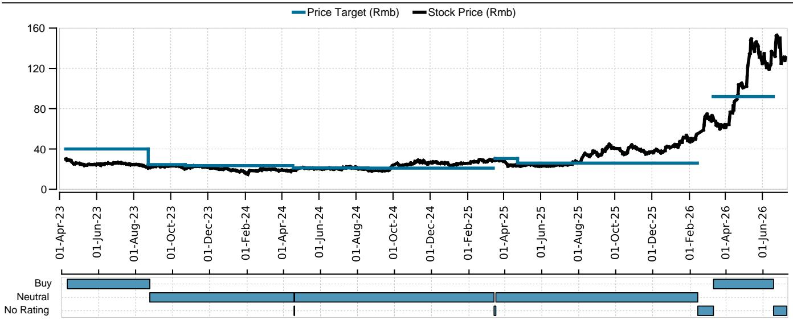
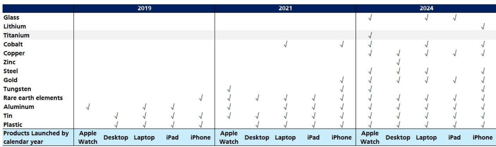
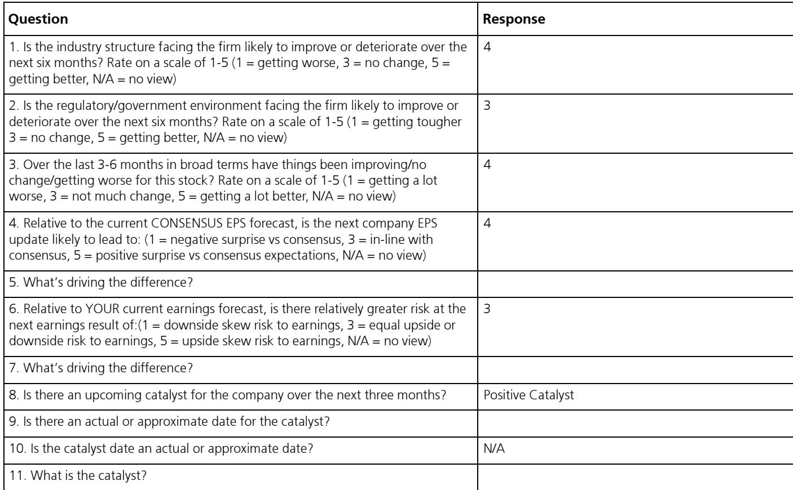

# Han's Laser Is No Longer a Cyclical Bet: The Equipment Maker's Structural Transformation Is Reshaping Its Earnings Power

Han's Laser Technology Industry reported first-half 2026 net profit growth of 156% to 177% year-on-year, beating consensus estimates by nearly 50 percentage points. This was not a single-segment surprise. Revenue growth exceeded 100% in PCB equipment, surpassed 180% in consumer electronics equipment, and ranged from 30% to 45% in battery, pan-semiconductor, and general-purpose laser equipment. Every major business line accelerated simultaneously. The question for observers is whether this represents a cyclical peak or the beginning of a structurally higher earnings trajectory. The evidence points decisively to the latter.

The company's preliminary results imply a second-quarter net profit of approximately Rmb946 million on revenue of roughly Rmb7.9 billion, representing a 39% earnings beat versus analyst forecasts. More important than the magnitude of the beat is the mechanism behind it. Pre-exceptional net profit margin improved by approximately 9 percentage points year-on-year, driven not by one-time gains but by a sustained shift in product mix toward higher-value equipment. This margin expansion is not cyclical. It reflects a structural change in what Han's Laser sells and to whom.

Three interlocking drivers underpin this transformation: the AI-driven upgrade cycle in PCB manufacturing, the deepening of Han's Laser's relationship with the world's largest consumer electronics company, and the emergence of a new product category in fiber optics. Each of these drivers has multi-year visibility, and together they create an earnings growth trajectory that the current valuation does not reflect. At 24x 2027 estimated earnings and a 0.84x PEG ratio based on a 28% EPS CAGR from 2027 to 2029, the stock prices in a modest growth cycle, not the structural re-rating that the evidence supports.

## The PCB Equipment Business Has Crossed a Threshold: AI Demand Is Transforming Both Volume and Margins

PCB equipment revenue grew more than 100% year-on-year in the first half of 2026, and the second quarter alone saw net profit margin at Han's CNC, the PCB equipment subsidiary, reach approximately 20%, up from 10% in the second quarter of 2025 and 17% in the first quarter of 2026. This margin progression is the single most important data point in the report. It signals that the product mix has shifted decisively toward high-precision back drilling machines and ultrafast laser drilling equipment for mSAP applications, which carry significantly higher margins than conventional mechanical drilling equipment.

The demand driver is not a generic PCB upcycle. It is specifically tied to AI server boards and 1.6T optical transceivers, which require high-density interconnect PCBs with advanced HDI and mSAP processes. These applications demand ultrafast laser drilling equipment that Han's Laser is uniquely positioned to supply. The adoption of this equipment has been faster than analyst expectations, and the report explicitly notes that growth momentum is likely to continue through 2028.

The capex data from major AI PCB manufacturers confirms the sustainability of this demand. Victory Giant and Avary, two of the largest global AI PCB players, have guided 2026 capex increases of 172% and 154% year-on-year respectively, following a year in which industry-wide capex already doubled. Newly announced AI PCB capacity expansion plans in China alone exceed Rmb100 billion. Critically, the report notes that PCB equipment procurement typically accelerates after the infrastructure construction phase, which occurred in 2025 and early 2026. This means the equipment purchasing cycle for these new factories is still in its early stages.

Han's CNC was Victory Giant's second-largest supplier in 2025, with total shipments of Rmb1.27 billion, representing 20% of Victory Giant's total capex. As Victory Giant's products gain recognition from the global AI PCB market leader, Han's Laser's equipment is likely to penetrate additional AI PCB manufacturers. The combination of expanding total addressable market, market share gains, and product mix upgrades creates a revenue CAGR of 63% for PCB equipment from 2025 to 2027, according to analyst estimates. This is not a cyclical spike. It is a structural re-rating of the business.

## Consumer Electronics Equipment Is Entering a New Product Cycle with Higher Attachment Rates

Consumer electronics equipment revenue grew more than 180% year-on-year in the first half of 2026, driven by penetration into a leading global consumer electronics player's innovation cycle. The report identifies two specific catalysts for the second half of 2026: foldable smartphone production and 3D printing equipment adoption. Together, these represent a significant expansion in the number of laser applications per device.

The historical pattern with this customer is instructive. Each major product cycle has introduced new laser processing requirements, from screen cutting to circuit board drilling to structural component welding. The foldable form factor requires additional laser processing steps for the hinge mechanism, the flexible display, and the new structural components. 3D printing equipment represents an entirely new product category within the consumer electronics segment, with potential applications beyond the initial customer.

Analyst estimates project a 99% revenue CAGR for the consumer electronics equipment business from 2025 to 2027. This may appear aggressive, but it is consistent with the reported first-half growth rate and the product cycle cadence. The largest customer typically ramps production volumes in the second half of the year, and the foldable product cycle is expected to extend through multiple generations. The 3D printing equipment business, while early stage, has the potential to become a meaningful revenue contributor if it gains adoption beyond the initial customer.

The implication for margins is equally important. Consumer electronics equipment carries higher gross margins than the company's general-purpose laser products. As this segment's revenue share increases, the blended gross profit margin should continue to improve. The report estimates a 6 percentage point improvement in blended GPM from 2025 to 2028, driven primarily by the rising contribution from PCB and consumer electronics equipment.

## A Decision Framework for Observers: Three Questions to Determine Whether the Thesis Holds

The case for Han's Laser rests on three assumptions, each of which can be tracked with observable data. Observers should evaluate the thesis against these specific questions rather than relying on broad market sentiment.

First, can the PCB equipment business sustain its growth trajectory? The key leading indicators are the capex guidance from major AI PCB manufacturers and the adoption rate of mSAP and high-order HDI processes. If Victory Giant and Avary maintain or increase their capex guidance, and if additional PCB manufacturers announce AI-specific capacity expansions, the demand environment remains supportive. The critical risk is a slowdown in AI infrastructure investment, which would directly reduce demand for high-end PCB equipment. However, the current pipeline of announced capacity expansions exceeds Rmb100 billion, and the equipment procurement cycle typically lags construction by 12 to 18 months, providing visibility through 2028.

Second, is the consumer electronics product cycle real and sustained? The key data points are the foldable smartphone production volumes and the adoption of 3D printing equipment. If the largest customer introduces foldable devices with meaningful production targets, and if 3D printing equipment orders materialize in the second half of 2026, the revenue trajectory is credible. The risk is that the product cycle proves shorter or smaller than expected, which would compress the multi-year growth outlook.

Third, can the company maintain or improve its margin structure? The critical metric is the quarterly net profit margin at Han's CNC, which improved from 10% to 20% over three quarters. If this margin holds or improves, it confirms that the product mix shift is structural. If margins revert toward historical levels, it would suggest that the current mix is temporary or that competitive pressure is compressing pricing.

These three questions define the decision framework. Each has a clear observable metric, and each directly determines the earnings trajectory. The analyst estimates imply a 151% earnings increase in 2026 and a 90% increase in 2027, following a 30% decline in 2025. These are not extrapolations of a cyclical peak. They are forecasts of a structural transformation that is still in its early stages.

## The Earnings Revision Magnitude Reveals the Scale of Underestimation

The report revises 2026-2028 earnings estimates upward by 22% to 74%, with the largest revisions occurring in the outer years. The 2028 EPS estimate increases by 74%, from Rmb4.28 to Rmb7.43. This revision magnitude is unusual and reveals the extent to which prior forecasts underestimated the duration and intensity of the growth cycle.

The revision drivers are specific and measurable. Revenue forecasts increase by 16% for 2026, 29% for 2027, and 40% for 2028. The largest upward revisions are in consumer electronics equipment revenue, which increases by 56% for 2027 and 73% for 2028, and pan-semiconductor equipment revenue, which increases by 46% and 53% respectively. The PCB equipment laser drilling forecast increases by 283% for 2026 and 145% for 2027, reflecting the faster-than-expected adoption of ultrafast laser drilling equipment for mSAP applications.

The blended gross profit margin forecast increases by 2 to 4 percentage points across the forecast period, reflecting the improved product mix. This margin expansion is not assumed. It is directly supported by the reported margin progression at Han's CNC and the increasing revenue share of high-margin consumer electronics equipment.

The target PE multiple increases from 26x to 35x. The PEG ratio remains unchanged at 1.2x, meaning the multiple expansion is justified by the earnings growth acceleration. At the current price of Rmb130.30, the stock trades at 24x 2027 estimated earnings, which represents a discount to the target multiple and a significant discount to the growth rate.

## The Valuation Does Not Reflect the Structural Shift in Earnings Quality

Han's Laser has historically been viewed as a cyclical equipment manufacturer, with earnings tied to the capital expenditure cycles of its end customers. The current valuation of 24x 2027 estimated earnings with a 28% EPS CAGR for 2027-2029 implies a PEG ratio of 0.84x, which is below the company's historical average and significantly below the multiples assigned to structural growth companies in the technology equipment space.

The argument for a higher multiple rests on the quality and visibility of the earnings stream. The PCB equipment business is no longer a commodity drilling equipment supplier. It is a specialized provider of high-precision laser drilling equipment for AI infrastructure, with a customer base that is investing in multi-year capacity expansions. The consumer electronics equipment business is embedded in the product cycles of the world's most valuable technology company, with increasing laser content per device. The fiber optics business, while early stage, represents a new growth vector with potential to become material by 2028.

The target multiple of 35x, which is 1.6 standard deviations above the historical average of 28x, is justified by the earnings growth outlook. But even this multiple may prove conservative if the structural transformation narrative gains broader acceptance. Companies that transition from cyclical to structural growth often experience multiple expansion beyond what near-term earnings growth alone would justify, as the market re-rates the quality and sustainability of the earnings stream.

*For informational purposes only. Portions may be generated, translated, summarized, or edited with AI assistance based on source materials and may contain omissions or errors. Please verify independently. This is not investment, legal, tax, accounting, or other professional advice.*

For informational purposes only. Portions may be generated, translated, summarized, or edited with AI assistance based on source materials and may contain omissions or errors. Please verify independently. This is not investment, legal, tax, accounting, or other professional advice.

