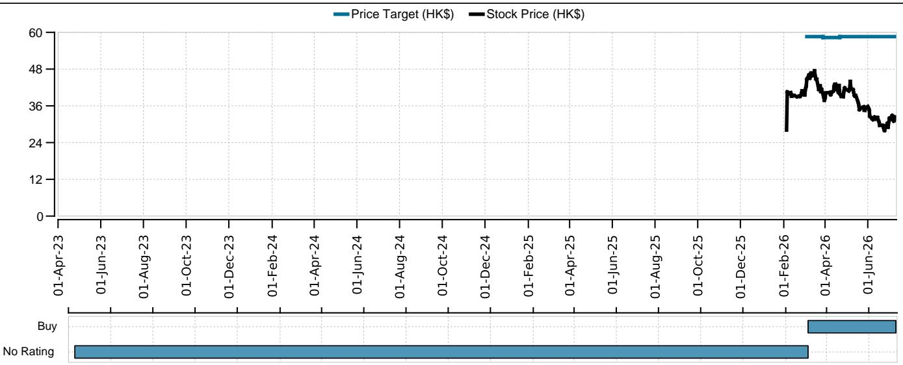

First Read

# 牧原股份2026年上半年初步业绩符合预期

## 问：业绩与预期相比如何？

答：牧原股份2026年上半年的初步业绩基本符合预期。公司预计2026年上半年归属于股东的净亏损为57亿至67亿元人民币，而2025年上半年为盈利105亿元人民币，这意味着2026年第二季度净亏损为45亿至55亿元人民币，而2025年第二季度为盈利60亿元人民币。盈利的大幅变化主要由于生猪价格显著走弱，这抵消了公司在成本降低和运营效率方面的持续进展。

## 问：业绩中最值得关注的方面有哪些？

## 估值：维持正面观点；目标价58.6港元

我们维持对牧原股份的正面观点，基于现金流折现模型的目标价为58.6港元。尽管盈利仍受生猪价格影响，但我们预计行业基本面将在2026年下半年改善，支持生猪价格回升。作为行业低成本领先者，拥有稳健的资产负债表和卓越的运营效率，牧原股份有望在行业周期回升中成为主要受益者，随着价格环境正常化，盈利将实现显著恢复。

## 市场观察

答：1）生猪出栏：2026年第二季度，牧原股份商品猪出栏量为2030万头，同比增长1.3%。2）生猪价格：2026年第二季度生猪价格同比下降33%至每公斤9.7元。3）生产成本：由于生产效率提升和饲料成本下降，我们估计2026年第二季度生产成本进一步降至每公斤11.6-11.7元，而2026年第一季度为每公斤11.9元。4）截至2026年第二季度末，能繁母猪存栏量为310万头，同比下降9.3%，环比下降0.5%。

<table><tr><td>中国</td></tr><tr><td>农业</td></tr></table>

12个月评级 正面

12个月目标价 58.60港元

价格（2026年7月10日） 32.40港元

股票代码：2714.HK 彭博：2714 HK

<table><tr><td colspan="2">交易数据与关键指标</td></tr><tr><td>52周范围</td><td>47.40-27.96港元</td></tr><tr><td>市值</td><td>1860亿港元/237亿美元</td></tr><tr><td>流通股数</td><td>57.37亿股（普通股）</td></tr><tr><td>自由流通量</td><td>100%</td></tr><tr><td>日均成交量（千股）</td><td>3,103</td></tr><tr><td>日均成交额（百万）</td><td>1.108亿港元</td></tr><tr><td>普通股股东权益（12/26E）</td><td>844亿元人民币</td></tr><tr><td>市净率（12/26E）</td><td>1.9倍</td></tr><tr><td>净债务对EBITDA（12/26E）</td><td>2.7倍</td></tr></table>

每股收益（UBS，摊薄）（人民币）

<table><tr><td></td><td>UBS</td><td>市场一致预期</td></tr><tr><td>12/26E</td><td>0.82</td><td>1.76</td></tr><tr><td>12/27E</td><td>6.20</td><td>5.21</td></tr><tr><td>12/28E</td><td>4.65</td><td>6.38</td></tr></table>

蒋妮娜

分析师

nina.jiang@ubs.com

+852-2971 5681

彭雅妮，CFA

分析师

christine-y.peng@ubs.com

+852-2971 7571

邓志强

副分析师

steven.dang@ubs.com

+852-3-712 2195

<table><tr><td>主要财务数据（百万元人民币）</td><td>12/23</td><td>12/24</td><td>12/25</td><td>12/26E</td><td>12/27E</td><td>12/28E</td><td>12/29E</td><td>12/30E</td></tr><tr><td>营业收入</td><td>110,861</td><td>137,947</td><td>144,145</td><td>121,277</td><td>153,839</td><td>150,001</td><td>149,725</td><td>145,583</td></tr><tr><td>息税前利润（UBS）</td><td>(3,260)</td><td>19,883</td><td>18,543</td><td>6,880</td><td>38,684</td><td>29,139</td><td>28,362</td><td>23,854</td></tr><tr><td>净利润（UBS）</td><td>(4,263)</td><td>17,881</td><td>15,555</td><td>4,601</td><td>35,814</td><td>26,872</td><td>26,193</td><td>21,879</td></tr><tr><td>每股收益（UBS，摊薄）（人民币）</td><td>(0.78)</td><td>3.27</td><td>2.85</td><td>0.82</td><td>6.20</td><td>4.65</td><td>4.54</td><td>3.79</td></tr><tr><td>每股股息（净额）（人民币）</td><td>0.00</td><td>1.39</td><td>1.36</td><td>0.40</td><td>3.10</td><td>2.79</td><td>2.72</td><td>2.27</td></tr><tr><td>净（债务）/现金</td><td>(57,837)</td><td>(55,951)</td><td>(54,884)</td><td>(45,734)</td><td>(11,202)</td><td>(4,250)</td><td>4,604</td><td>9,095</td></tr></table>

<table><tr><td>盈利能力/估值</td><td>12/23</td><td>12/24</td><td>12/25</td><td>12/26E</td><td>12/27E</td><td>12/28E</td><td>12/29E</td><td>12/30E</td></tr><tr><td>息税前利润率（UBS）%</td><td>(2.9)</td><td>14.4</td><td>12.9</td><td>5.7</td><td>25.1</td><td>19.4</td><td>18.9</td><td>16.4</td></tr><tr><td>投入资本回报率（息税前利润）%</td><td>(2.5)</td><td>15.1</td><td>14.0</td><td>5.2</td><td>29.7</td><td>22.2</td><td>21.3</td><td>17.6</td></tr><tr><td>企业价值/EBITDA（UBS核心）倍</td><td>-</td><td>-</td><td>-</td><td>12.6</td><td>4.1</td><td>4.9</td><td>4.9</td><td>5.5</td></tr><tr><td>市盈率（UBS，摊薄）倍</td><td>-</td><td>-</td><td>-</td><td>34.5</td><td>4.5</td><td>6.0</td><td>6.2</td><td>7.4</td></tr><tr><td>股权自由现金流（UBS）回报表现%</td><td>-</td><td>-</td><td>-</td><td>4.4</td><td>22.9</td><td>15.5</td><td>15.5</td><td>12.6</td></tr><tr><td>股息回报表现（净额）%</td><td>-</td><td>-</td><td>-</td><td>1.4</td><td>11.1</td><td>10.0</td><td>9.7</td><td>8.1</td></tr></table>

来源：公司账目、LSEG Eikon、UBS估计。标记为（UBS）的指标已应用分析师调整。估值：基于当年平均股价，（E）：基于2026年7月10日32.40港元的股价

本报告由UBS亚洲有限公司编制。分析师认证和所需披露，包括关于UBS发布的定量研究回顾的信息，从第4页开始。

预期回报

<table><tr><td>预期价格升值</td><td>80.9%</td></tr><tr><td>预期股息回报表现</td><td>1.4%</td></tr><tr><td>预期股票回报</td><td>82.3%</td></tr><tr><td>市场回报假设</td><td>11.1%</td></tr><tr><td>预期超额回报</td><td>71.2%</td></tr></table>

## 公司描述

牧原股份是中国最大的生猪生产企业，业务覆盖饲料加工、生猪育种、种猪扩繁、商品猪饲养和屠宰等环节。其主要产品包括商品猪、种猪和仔猪。2024年，牧原股份生猪出栏量达到7160万头。

## 估值方法与风险声明

我们基于现金流折现模型得出牧原股份的目标价。

牧原股份面临的风险包括：1）饲料原料成本上升导致生产成本节约有限；2）生猪去库存速度慢于预期，导致生猪价格持续承压，降低牧原股份的盈利能力；3）生猪销量增长低于预期；4）下游屠宰业务发展慢于预期。

## 定量研究回顾

UBS全球研究发布一项定量评估，即“定量研究回顾”，评估其分析师对若干短期因素发生可能性的回答。本月的观点如下。本评估中对特定股票的观点仅反映了对这些短期因素的看法，其时间范围与本报告中设定的任何股票评级所反映的12个月时间范围不同。如需查看之前的回答，请参考（i）之前的UBS全球研究报告；以及（ii）如果该月未发布适用的研究报告，请参考定量研究回顾，该报告可在https://neo.ubs.com/quantitative找到，或联系您的UBS销售代表获取报告，或通过ubs-quant-answers@ubs.com联系定量研究团队。还提供包含所有回答的综合报告，您同样应联系您的UBS销售代表了解详情和定价，或通过上述电子邮件联系定量研究团队。

## 牧原股份

<table><tr><td>问题</td><td>回答</td></tr><tr><td>1. 未来六个月，公司面临的行业结构可能改善还是恶化？按1-5分评分（1=恶化，3=无变化，5=改善，N/A=无观点）</td><td>N/A</td></tr><tr><td>2. 未来六个月，公司面临的监管/政府环境可能改善还是恶化？按1-5分评分（1=趋严，3=无变化，5=改善，N/A=无观点）</td><td>N/A</td></tr><tr><td>3. 过去3-6个月，这只股票总体上是改善、无变化还是恶化？按1-5分评分（1=大幅恶化，3=变化不大，5=大幅改善，N/A=无观点）</td><td>N/A</td></tr><tr><td>4. 相对于当前市场一致预期的每股收益预测，下一次公司盈利更新可能导致：（1=低于市场一致预期，3=符合市场一致预期，5=高于市场一致预期，N/A=无观点）</td><td>N/A</td></tr><tr><td>5. 造成差异的原因是什么？</td><td></td></tr><tr><td>6. 相对于您当前的盈利预测，下一次盈利结果的风险是：（1=盈利下行风险，3=盈利上行或下行风险相等，5=盈利上行风险，N/A=无观点）</td><td>N/A</td></tr><tr><td>7. 造成差异的原因是什么？</td><td></td></tr><tr><td>8. 未来三个月公司是否有即将到来的催化剂？</td><td>无催化剂</td></tr><tr><td>9. 催化剂是否有实际或大致日期？</td><td></td></tr><tr><td>10. 催化剂日期是实际日期还是大致日期？</td><td>N/A</td></tr><tr><td>11. 催化剂是什么？</td><td></td></tr></table>

## 所需披露

本文件由UBS亚洲有限公司（UBS集团附属公司）编制。UBS集团、其子公司、分支机构和关联公司，包括前CS集团及其子公司、分支机构和关联公司，在此统称为“UBS”。

有关UBS如何管理冲突并保持其UBS全球研究产品独立性、历史表现信息、关于UBS全球研究建议的某些额外披露以及研究报告中使用的某些第三方数据的条款和条件的信息，请访问https://www.ubs.com/disclosures。除非另有说明，本报告中的信息和数据基于公司披露，包括但不限于年度、中期、季度报告和其他公司公告。业绩图表中的数字指过去；过去的表现并非未来结果的可靠指标。可根据要求提供更多信息。UBS有限责任公司经中国证券监督管理委员会批准，具备证券投资咨询业务资格。UBS可能作为本报告可能涉及的债务证券（或相关衍生品）的本金交易方。本建议最终确定于：2026年7月12日格林威治时间晚上10:20。UBS已指定某些UBS全球研究部门成员为衍生品研究分析师，这些部门成员主要发布关于衍生品价格或市场的分析，并提供足够合理的信息以作为进行衍生品交易决策的基础。当衍生品研究分析师与股票研究分析师或经济学家共同撰写研究报告时，衍生品研究分析师负责衍生品的投资观点、预测和/或建议。定量研究回顾：UBS全球研究发布一项定量评估，即“定量研究回顾”，评估其分析师对若干短期因素发生可能性的回答。本评估中对特定股票的观点仅反映了对这些短期因素的看法，其时间范围与本报告中设定的任何股票评级所反映的12个月时间范围不同。如需了解最新回答，请参阅本报告末尾的定量研究回顾附录（如适用）。如需查看之前的回答，请参考（i）之前的UBS全球研究报告；以及（ii）如果该月未发布适用的研究报告，请参考定量研究回顾，该报告可在https://neo.ubs.com/quantitative找到，或联系您的UBS销售代表获取报告，或通过ubs-quant-answers@ubs.com联系定量研究团队。还提供包含所有回答的综合报告，您同样应联系您的UBS销售代表了解详情和定价，或通过上述电子邮件联系定量研究团队。

## 分析师认证：

每位主要负责本研究报告内容的研究分析师，就本报告所涵盖的每个证券或发行人，特此证明：（1）本报告中表达的所有观点准确反映了他/她对这些证券或发行人的个人观点，并且是独立准备的，包括对UBS的态度；（2）他/她的报酬中没有任何部分曾经、正在或将会直接或间接地与研究报告中的具体建议或观点相关。

UBS全球研究：全球股票评级定义

<table><tr><td>12个月评级</td><td>定义</td><td>覆盖范围$^{1}$</td><td>投行服务$^{2}$</td></tr><tr><td>买入</td><td>FSR > MRA 6%以上</td><td>55%</td><td>24%</td></tr><tr><td>中性</td><td>FSR 在 MRA 的 -6% 至 6% 之间</td><td>40%</td><td>21%</td></tr><tr><td>卖出</td><td>FSR < MRA 6%以下</td><td>6%</td><td>21%</td></tr></table>

来源：UBS。评级分配截至2026年6月30日。
1：全球范围内处于12个月评级类别的公司百分比。

2：在过去12个月内获得投资银行（IB）服务的12个月评级类别中的公司百分比。

关键定义：预期股票回报（FSR）定义为未来12个月的预期价格升值百分比加上总股息回报表现。在某些情况下，此回报表现可能基于应计股息。市场回报假设（MRA）定义为一年期当地市场利率加5%（作为股权风险溢价的代理指标，而非预测）。审核中（UR）股票可能被分析师标记为UR，表明该股票的价格目标和/或评级可能在近期内发生变化，通常是为了响应可能影响投资案例或估值的事件。股票价格目标具有12个月的投资期限。

例外和特殊情况：英国和欧洲投资基金评级和定义为：买入：对结构、管理、业绩记录、折价等因素持正面看法；中性：对结构、管理、业绩记录、折价等因素持中性看法；卖出：对结构、管理、业绩记录、折价等因素持负面看法。核心区间例外（CBE）：标准+/-6%区间的例外可由投资审查委员会（IRC）批准。IRC考虑的因素包括股票的波动性和相应公司债务的信用利差。因此，被视为非常高或低风险的股票可能适用更高或更低的评级区间。当此类例外适用时，将在相关研究文件的公司披露表中予以说明。

为本报告做出贡献且受雇于UBS有限责任公司任何非美国附属公司的研究分析师未在FINRA注册/具备研究分析师资格。此类分析师可能不是UBS有限责任公司的关联人士，因此不受FINRA关于与主题公司沟通、公开露面以及交易研究分析师账户持有的证券的限制。以下列出为本报告做出贡献的每个附属公司及其雇用的分析师名称（如有）。
UBS集团香港分行：彭雅妮，CFA、蒋妮娜、邓志强。

公司披露

<table><tr><td>公司名称</td><td>路透代码</td><td>12个月评级</td><td>价格</td><td>价格日期</td></tr><tr><td>牧原股份</td><td>2714.HK</td><td>买入</td><td>32.40港元</td><td>2026年7月10日</td></tr></table>

来源：UBS全球研究；LSEG Eikon。所有价格均为当地市场收盘价。本表中的评级是本报告之前发布的最新评级。它们可能比股票定价日期更近。

除非另有说明，请参阅本报告正文中的估值和风险部分。如需获取与本报告讨论的公司相关的完整披露声明，包括估值和风险信息，请联系UBS有限责任公司，地址：11 Madison Avenue, New York, NY 10010, USA，收件人：投资研究。

牧原股份（港元）

<table><tr><td>日期</td><td>股价（港元）</td><td>目标价（港元）</td><td>评级</td></tr><tr><td>2023-04-10</td><td>NaN</td><td>-</td><td>无评级</td></tr><tr><td>2026-03-05</td><td>42.36</td><td>58.60</td><td>买入</td></tr><tr><td>2026-03-28</td><td>41.38</td><td>58.30</td><td>买入</td></tr><tr><td>2026-04-21</td><td>42.64</td><td>58.60</td><td>买入</td></tr></table>

来源：UBS全球研究；LSEG Eikon，截至2026年7月10日。所有价格均为当地市场收盘价。评级截至所示日期。

适用于全球财富管理客户的免责声明紧随全球研究免责声明之后。适用于CS财富管理的免责声明紧随全球财富管理免责声明之后。

## UBS全球研究免责声明

本文件由UBS亚洲有限公司（UBS集团附属公司）编制。UBS集团、其子公司、分支机构和关联公司，包括前CS集团及其子公司、分支机构和关联公司，在此统称为“UBS”。

本文件中的任何意见可能随时更改，且仅于发布之日有效。UBS内部的不同领域、团队和人员可能独立地制作和分发不同的研究产品。例如，UBS首席投资办公室的研究出版物由UBS全球财富管理制作。UBS全球研究由UBS投资银行制作。每个独立研究组织的研究方法和评级体系可能不同，例如在研究交流、投资期限、模型假设和估值方法方面。因此，除某些经济预测外（UBS首席投资办公室和UBS全球研究可能就此合作），每个独立研究组织提供的研究交流、评级、价格目标和估值可能不同或不一致。您应参考每个相关研究产品以了解其方法和评级体系的详细信息。并非所有客户都能访问每个组织的所有产品。每个研究产品均受制于制作该产品的组织的政策和程序。

本文件仅提供给UBS明确授权接收的接收方。如果您未获授权，请立即销毁本文件。

UBS全球研究通过UBSNeo，以及在某些情况下通过UBS网站和任何其他经批准的用于分发UBS全球研究的系统或分发方法（每个均为“系统”）提供给我们的客户。它也可能通过第三方供应商提供，并由UBS和/或第三方通过电子邮件或替代电子方式分发。

所有UBS全球研究均可通过UBSNeo获取。如果您希望讨论您对UBSNeo的访问权限，请联系您的UBS销售代表。当UBS全球研究提及“UBS证据实验室内部”或使用了UBS证据实验室提供的数据，并且您希望访问该数据时，请联系您的UBS销售代表。UBS证据实验室数据可通过UBSNeo获取。UBS全球研究和UBS证据实验室向客户提供的服务水平和类型可能因多种因素而异，例如客户对接收通信的频率和方式的个人偏好、客户的风险状况和投资重点及视角（例如，市场范围、行业特定、长期、短期等）、客户与UBS全球研究和UBS证据实验室的整体关系规模及范围，以及法律和监管限制。UBSHOLT和UBSPharma Values是UBS全球研究的产品。HOLT Lens是一个公司绩效平台产品，提供客观的基于会计框架的公司比较和估值，可供UBS全球研究客户使用；如需了解详情和定价，请联系您的UBS销售代表。特别是，HOLT根据所选情景有多种保证价格；如果您对特定公司的保证价格感兴趣，请致函UBS有限责任公司，地址：11 Madison Avenue, New York, NY 10010, USA，收件人：投资研究，同样需考虑商业因素。UBSPharma Values是一个分析工具，涉及基于药品销售预测创建多个单个产品净现值计算，可供UBS全球研究客户使用；如需了解详情和定价，请联系您的UBS销售代表。对于所有其他特定免责声明，请参阅https://www.ubs.com/disclosures。

当您通过系统接收UBS全球研究时，您对此类UBS全球研究的访问和/或使用受本UBS全球研究免责声明和UBSNeo平台使用协议（“Neo条款”）以及适用于相关系统的任何其他相关使用条款的约束。

当您通过第三方供应商、电子邮件或其他电子方式接收UBS全球研究时，您同意使用须遵守本UBS全球研究免责声明、Neo条款以及（如适用）UBS投资银行业务条款（https://www.ubs.com/global/en/investment-bank/regulatory.html）和UBS使用条款/免责声明（https://www.ubs.com/global/en/legalinfo2/disclaimer.html）。此外，您同意UBS根据我们的隐私声明（https://www.ubs.com/global/en/legalinfo2/privacy.html）和Cookie通知（https://www.ubs.com/global/en/legal/privacy/users.html）处理您的个人数据并使用Cookie。

如果您通过系统或任何其他方式接收UBS全球研究，您同意不得复制、修改、修订、创作衍生作品、提供给任何第三方，或以任何方式商业利用任何通过UBS全球研究或其他方式提供的UBS内容，并且您同意不得从通过UBS全球研究或其他方式提供给您的任何研究或估计中提取数据，除非事先获得UBS的书面同意。您同意未经UBS事先书面同意，不得在任何人工智能系统中使用UBS全球研究。

在某些情况下，您可能以非UBS客户的身份接收UBS全球研究，并且您理解并同意，在这些情况下（i）UBS全球研究仅供您参考；（ii）就接收目的而言，您并非意图成为，也不会被视为UBS的“客户”以用于任何法律或监管目的；（iii）不得依赖或依据UBS全球研究采取任何行动；并且（iv）此类内容受后续相关免责声明的约束。

本文件仅可在法律允许的范围内分发。它不针对或意图分发给任何位于任何司法管辖区（该等分发、出版、提供或使用将违反适用法律或法规，或会使UBS须在该司法管辖区进行任何注册或取得许可）的公民或居民或任何个人或实体，或供其使用。

本文件是一般性沟通，具有教育性质；它不是广告，也不是招揽或要约购买或出售任何金融工具或参与任何特定交易策略。本文件中的任何内容均不构成任何投资策略或建议适合或适用于读者的个人情况，或以其他方式构成个人建议。通过提供本文件，UBS或其代表均无任何责任或授权以受托身份或其他方式提供或已提供研究交流。投资涉及风险，读者应审慎并自行判断做出投资决策。UBS或其代表均未建议接收方或任何其他人采取特定行动方案或任何行动。接收方应仔细阅读本文件的全部内容，而不应仅从评级中得出推论或结论。通过接收本文件，接收方承认并同意上述预期目的，并进一步否认任何期望或信念，即该信息构成对接收方的研究交流，或以其他方式旨在满足接收方的投资目标。本文件中描述的金融工具可能并非在所有司法管辖区或对某些类别的读者均有资格出售。

期权、结构性衍生品和期货（包括场外衍生品）并非适合所有读者。交易这些工具被认为具有风险，可能仅适合成熟读者。在购买或出售期权之前，以及为了解与期权相关的完整风险，您必须收到一份“标准化期权的特征和风险”文件。您可以在https://www.theocc.com/publications/risks/riskchap1.jsp阅读该文件，或向您的销售人员索取副本。关于这些工具相关风险的各种理论解释已经发布。任何索赔、比较、建议、统计数据或其他技术数据的支持文件将根据要求提供。过去的表现并不一定预示未来的结果。在需要多次买卖期权的期权策略（如价差和跨式组合）中，交易成本可能很高。由于税务考虑对许多期权交易的重要性，考虑期权的读者应咨询其税务顾问，了解税收如何影响预期期权交易的结果。

抵押贷款和资产支持证券可能涉及高风险，并且可能对利率或其他市场条件的波动高度敏感。外币汇率可能对文件中提及的任何证券或相关工具的价值、价格或收入产生不利影响。如需研究交流、交易执行或其他咨询，客户应联系其当地销售代表。

UBS指出，目前不存在全球公认的框架或定义（法律、监管或其他方面），也没有市场共识，关于什么是“ESG”（环境、社会或治理）或同等标签，或者信息（定义见下文）需要具备哪些精确属性才能被定义为ESG或同等标签。本文件包含、引用或UBS或第三方出于任何目的使用的任何信息、数据或其他内容（包括来自第三方来源的）（“信息”），涉及任何实际或潜在的ESG目标、问题或考虑，不旨在用于ESG分类、监管制度或行业倡议目的（“ESG制度”）。本材料中的任何内容均无意传达、暗示或表明UBS认为或表示本材料中提及的任何产品、服务、个人或主体符合或满足ESG制度下可能存在的任何ESG分类、标签或类似标准。UBS未对ESG制度的合规性进行任何评估。各方应自行进行这些目的的评估。

任何投资或收入的价值可能下跌也可能上涨，读者可能无法收回全部（或任何）投资金额。过去的表现并不一定是未来表现的指南。UBS及其董事、雇员或代理人均不对因使用全部或任何信息而产生的任何损失（包括投资损失）或损害承担任何责任。

在做出任何投资或财务决策之前，本文件或信息的任何接收方应采取措施了解投资的风险和回报，并寻求其个人财务、法律、税务和其他专业顾问的个性化建议，该建议应考虑其投资目标的所有特定事实和情况。

本文件中陈述的任何价格仅供参考，并不代表个别证券或其他金融工具的估值。不表示任何交易可以或可能以这些价格执行，并且任何价格不一定反映UBS的内部账簿和记录或基于理论模型的估值，并且可能基于某些假设。UBS或任何其他来源的不同假设可能导致实质上不同的结果。

对于与本文件相关的任何材料中包含的信息（“信息”）的准确性、完整性或可靠性，不作任何明示或暗示的陈述或保证，但有关UBS的信息除外。该信息并非旨在成为本文件中提及的证券、市场或发展的完整陈述或摘要。UBS不承担更新或保持信息最新的义务。本报告中归因于第三方的任何陈述均代表UBS对该第三方公开或通过订阅服务提供的数据、信息和/或意见的解释，且该等使用和解释未经第三方审查。在任何情况下，本文件或任何信息（包括任何预测、价值、指数或其他计算金额（“价值”））均不得用于以下任何目的：

(i) 估值或会计目的；

(ii) 确定任何金融工具或金融合同的到期或应付金额、价格或价值；或

(iii) 衡量任何金融工具的表现，包括但不限于为了追踪任何价值的回报或表现，或定义投资组合的资产配置，或计算绩效费用。

通过接收本文件和信息，您将被视为向UBS声明并保证，您不会将本文件或任何信息用于上述任何目的，或以其他方式依赖本文件或任何信息。

UBS拥有政策和程序，包括但不限于独立性政策和永久信息隔离，旨在并依赖这些政策和程序来管理潜在的利益冲突，并控制UBS各部门及其子公司、分支机构和关联公司之间的信息流动。UBS确实与研究报告涵盖的公司开展业务并寻求开展业务。因此，读者应注意，该公司可能存在可能影响本报告客观性的利益冲突。读者应将本报告仅视为做出投资决策的单一因素。有关UBS全球研究如何管理冲突并保持其研究产品独立性、历史表现信息以及关于UBS全球研究建议的某些额外披露的更多信息，请访问https://www.ubs.com/disclosures。

UBS全球研究将完全由UBS全球研究管理层自行决定启动、更新和停止覆盖，该管理层也将对任何已发布研究产品的时间和频率拥有相对少见决定权。本文件中的分析基于众多假设。已发布研究报告中的所有重要信息，如估值方法、风险陈述、基本假设（包括这些假设的敏感性分析）、评级历史等，均可在UBSNeo上找到。不同的假设可能导致实质上不同的结果。

UBS全球研究可能在准备本文件时使用人工智能工具（“AI工具”）。尽管使用了任何此类AI工具，本文件已经过人工审核。

负责准备本文件的分析师可能与交易台人员、销售人员和其他方互动，以收集、应用和解释市场信息。UBS依赖信息隔离来控制UBS一个或多个领域内的信息流向UBS的其他领域、部门、团队或关联公司。准备本文件的分析师的薪酬完全由UBS全球研究管理层和高级管理层（不包括投资银行）决定。分析师薪酬不基于投资银行收入；然而，薪酬可能与UBS和/或其整体部门的收入相关，其中投资银行、销售和交易是其中的一部分，以及UBS整体。

对于在欧盟受监管市场上交易的金融工具：UBS（不包括UBS有限责任公司）担任发行人金融工具的做市商或流动性提供者（根据英国法律对这些术语的解释，或者如果UBS未在英国进行该活动，则根据UBS确定其进行该活动的相关司法管辖区的法律），除非流动性提供者的活动是根据任何其他欧盟司法管辖区的法律法规给出的定义进行的，则此类信息在本文件中单独披露。对于在非欧盟受监管市场上交易的金融工具：UBS可能担任做市商，除非该活动在美国根据相关法律法规给出的定义进行，则此类活动将在本文件中具体披露。UBS可能已发行价值基于本文件中提及的一种或多种金融工具的权证。UBS及其关联公司和雇员可能持有本文件确定的工具或衍生品的多头或空头头寸，作为本金交易，并买卖；此类交易或头寸可能与本文表达的意见不一致。

在过去12个月内，UBS可能已根据MiFID II提供或接收投资服务和活动或辅助服务，这些服务可能已导致或承诺就这些服务向该公司支付或从该公司收取费用。

请注意，UBS进行的所有交易均符合瑞士、欧盟、联合国、英国和美国实施的制裁法规，符合UBS的全球制裁政策。UBS对未来研究价值的意见假设没有新的制裁措施。

根据修订后的美国总统行政命令13959，美国人士被禁止购买或出售某些被指定为与中国军方有关联的公司的证券。

英国：本材料由UBS集团伦敦分行分发给符合资格的交易对手或专业客户。UBS集团伦敦分行由审慎监管局授权，并受金融行为监管局和审慎监管局的有限监管。欧洲：除非本文另有规定，这些材料由UBS欧洲SE（UBS集团的子公司）分发给符合资格的交易对手或专业客户（如德国联邦金融监管局规则和MiFID所述），并且仅对此类人士可用。该信息不适用于零售客户，也不应被其依赖。UBS欧洲SE由欧洲中央银行（ECB）授权，并受德国联邦金融监管局和欧洲中央银行监管。德国、卢森堡、荷兰、比利时和爱尔兰：如果UBS欧洲SE的分析师为本文件做出了贡献，则该文件也被视为由UBS欧洲SE编制。在所有情况下，它由UBS欧洲SE和UBS集团伦敦分行分发。土耳其：由UBS集团伦敦分行分发。本文件中的信息不旨在用于在土耳其共和国境内以任何方式提供、营销和销售任何资本市场工具和服务。因此，本文件不得被视为向土耳其共和国居民作出或将要作出的要约。UBS集团伦敦分行未根据《资本市场法》（第6362号法律）的规定获得土耳其资本市场委员会的许可。因此，未经资本市场委员会事先批准，本文件或与工具/服务相关的任何其他发售材料不得用于向土耳其共和国境内的人士提供任何资本市场服务。但是，根据第32号法令第15(d)(ii)条，土耳其共和国居民购买或出售境外证券没有限制。波兰：由UBS欧洲SE（有限责任合伙）波兰分行分发。如果UBS欧洲SE（有限责任合伙）波兰分行的分析师为本文件做出了贡献，则该文件也被视为由UBS欧洲SE（有限责任合伙）波兰分行编制。俄罗斯：由UBS银行（有限责任公司）编制和分发。不应被解释为俄罗斯法律——联邦法律第39-FZ号“关于证券市场”第6.1-6.2条意义上的个人研究交流。瑞士：由UBS集团分发给仅限机构读者。UBS集团受瑞士金融市场监管局（FINMA）监管。意大利：由UBS欧洲SE编制，并由UBS欧洲SE和UBS欧洲SE意大利分行分发。如果UBS欧洲SE意大利分行的分析师为本文件做出了贡献，则该文件也被视为由UBS欧洲SE意大利分行编制。法国：由UBS欧洲SE编制，并由UBS欧洲SE和UBS欧洲SE法国分行分发。如果UBS欧洲SE法国分行的分析师为本文件做出了贡献，则该文件也被视为由UBS欧洲SE法国分行编制。西班牙：由UBS欧洲SE编制，并由UBS欧洲SE和UBS欧洲SE西班牙分行分发。如果UBS欧洲SE西班牙分行的分析师为本文件做出了贡献，则该文件也被视为由UBS欧洲SE西班牙分行编制。瑞典：由UBS欧洲SE编制，并由UBS欧洲SE和UBS欧洲SE瑞典分行分发。如果UBS欧洲SE瑞典分行的分析师为本文件做出了贡献，则该文件也被视为由UBS欧洲SE瑞典分行编制。南非：由UBS南非（私人）有限公司（注册号：1995/011140/07）分发，该公司是约翰内斯堡证券交易所的授权用户和授权的金融服务提供商（FSP 7328）。沙特阿拉伯：本文件由UBS集团（和/或其任何子公司、分支机构或关联公司）发布，UBS集团是一家股份有限公司，在瑞士注册，注册地址为Aeschenvorstadt 1, CH-4051 Basel 和 Bahnhofstrasse 45, CH-8001 Zurich。本出版物已获得UBS沙特阿拉伯（UBS集团的子公司）的批准，该公司是一家沙特封闭式股份公司，在沙特阿拉伯王国注册，商业注册号为1010257812，注册
