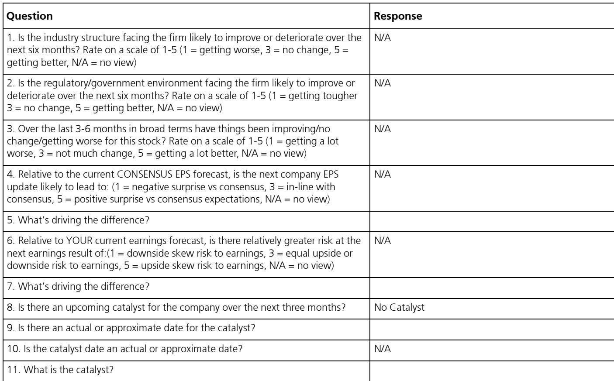
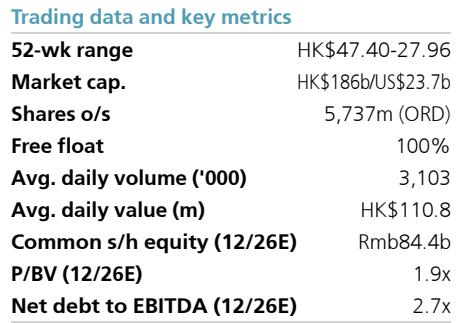

# 牧原的成本优势是猪价波动中相对少见锚点：上半年业绩从盈利105亿转为亏损62亿

中国最大的生猪生产企业牧原股份，2026年上半年归属于股东的初步净亏损为57亿至67亿元人民币，与去年同期105亿元的净利润形成巨大反差。仅第二季度就产生45亿至55亿元的净亏损，而2025年第二季度为净利润60亿元。这一业绩变化并非由运营失败、疫病爆发或资产负债表压力驱动，而是由单一的外部因素驱动：第二季度生猪价格同比下降33%，平均仅为每公斤9.7元。在一个商品化行业中，盈利与亏损的差距以每公斤个位数人民币衡量，这一跌幅足以抹去即使是行业最高效运营商的全部盈利能力。

这一变化的规模需要严谨的分析回应。本能的反应是将亏损视为结构性疲弱的信号。这种解读是不正确的。牧原在此期间的基础运营表现有所改善。公司继续降低生产成本，得益于更好的饲料转化率和更低的饲料原料价格，估计第二季度成本已从第一季度的每公斤11.9元降至11.6-11.7元。第二季度生猪出栏量稳定在2030万头，同比增长1.3%。亏损纯粹是价格现象，而非公司竞争地位的恶化。这一区别对于正在决定是在低谷期退出还是增加仓位的观察者至关重要。

战略问题不在于牧原是否是一家好公司。关于成本领先、规模和资产负债表纪律的证据是清晰的。问题在于当前报价是否充分折现了行业供给侧动态最终将推动的复苏。基于能繁母猪存栏减少的轨迹和公司自身的成本轨迹，答案是当前估值包含了过于悲观的周期看法，为具有12至18个月视野的观察者创造了一个有吸引力的切入点。

## 能繁母猪存栏收缩是下一轮价格复苏最可靠的领先指标

初步结果中最重要的数据点不是盈利数字，而是能繁母猪存栏量。牧原第二季度末能繁母猪存栏为310万头，同比下降9.3%，环比下降0.5%。这一收缩并非牧原独有，它反映了更广泛的行业去库存进程，因为持续的低猪价迫使中小型生产商减少产能。其机制在农产品周期中简单且成熟：当整个行业在低于盈亏平衡点运营一段时间后，边际生产商退出，供应收缩，价格最终复苏。

当前收缩的战略意义在于其持续性。牧原自身的能繁母猪存栏连续下降，即使公司维持了稳定的商品猪出栏量，表明公司正在预期持续疲弱定价的情况下主动减少种猪存栏。这不是一个困境信号，而是行业最低成本生产商做出的理性产能管理决策。当一家成本结构比行业平均低约每公斤2元的公司选择减少其种猪存栏时，表明定价环境对整个行业而言是不可持续的。这意味着已经开始的供应响应将在2026年下半年及2027年加速。

能繁母猪存栏减少与商品猪供应之间的滞后时间约为10个月。因此，2026年年中牧原能繁母猪存栏同比下降9.3%，直接对应到2027年第二季度可供应生猪的显著减少。研究估算反映了这一逻辑，预计盈利将从2027年开始强劲复苏，净利润从2026年估计的46亿元上升至358亿元。这一复苏并非猜测，而是已记录在能繁母猪数据中的供应收缩的算术结果。

## 牧原的成本领先优势创造了大多数同行无法比拟的结构性利润缓冲

牧原持有的最重要的竞争优势是其成本地位。第二季度估计为每公斤11.6-11.7元，公司的生产成本比中国行业平均水平低约每公斤2元。这一差距在相对值上看似不大，但在一个售价在单个季度内波动30%或更多的商品中，每公斤2元的成本优势是生存于低谷与被逼减产之间的区别。

成本优势是结构性的，而非周期性的。它建立在三个竞争对手难以复制的支柱上。第一，规模。牧原2024年生猪出栏量7160万头，使其在饲料原料采购、物流密度和固定成本吸收方面拥有中小型生产商无法匹敌的优势。第二，垂直整合。公司在其系统内控制饲料加工、育种、繁殖和育肥，消除了向第三方供应商的利润流失。第三，运营纪律。在严重价格压力期间生产成本持续下降，从第一季度的每公斤11.9元降至第二季度的11.6-11.7元，表明组织在收入下降时不会放松成本控制。许多公司在低迷期会收紧成本管理，但很少有公司能在保持稳定产出的同时执行这一点。

战略意义在于，牧原将以比进入时更强的相对地位走出当前低谷。较弱的竞争对手无法在当前价格水平上承受亏损，将继续退出。牧原的资产负债表虽然有杠杆，但可控。预计净债务将从2025年底的549亿元降至2026年底的457亿元，随后随着盈利复苏，到2027年底降至112亿元。公司没有财务困境风险，它正在利用低迷期巩固其地位。

## 估值隐含了周期不支持的盈利能力的永久性减值

按当前股价32.40港元计算，牧原的估值约为2026年每股收益0.82元的34.5倍。这一倍数看似昂贵，但它是低谷盈利的统计产物。更相关的指标是基于2027年估计的远期市盈率，为4.5倍。对于行业成本领先者来说，在预期盈利复苏期间出现个位数倍数，基本面并不支持。

这一目标并非基于对周期高峰定价的激进假设，而是基于猪价正常化至允许行业获得合理资本回报的水平。研究估算预计2027年息税前利润率为25.1%，而2026年为5.7%，2025年为12.9%。这一复苏与中国历史猪价周期一致，低于成本的定价时期之后是12至18个月的上行周期，恢复行业盈利能力。

复苏未能实现的风险是真实但有限的。主要的下行情景是生猪去库存进展慢于预期，延长了疲弱定价期。这一风险部分已包含在研究自身的估算中，其显示2028年每股收益从2027年的6.20元降至4.65元，表明分析师预计初始复苏后会有一些价格调整。更极端的风险，即中国猪肉需求的结构性转变，并未得到消费数据的支持。猪肉仍然是中国的主要蛋白质来源，人均消费量保持稳定。

## 为观察者提供的穿越生猪周期低谷的决策框架

对于考虑在当前水平关注牧原的观察者，分析框架应围绕三个连续问题构建。

第一，公司是否有足够的财务韧性来度过长期低谷？答案是肯定的。牧原2026年的净债务与息税折旧摊销前利润比率预计为2.7倍，考虑到公司的成本优势和资本市场准入，这一水平虽高但可控。研究估算显示，随着盈利复苏，净债务在2027年将大幅下降，并在2029年转为净现金。公司并未面临流动性危机。

第二，盈利复苏的概率和幅度如何？概率很高，幅度很大。能繁母猪存栏收缩已经在进行中，并将在10至12个月内转化为供应减少。研究估算意味着从2026年上半年约60亿元的净亏损转变为2027年全年净利润358亿元。这不是一个渐进改善的预测，而是一个急剧的周期性复苏预测。

第三，当前报价是否为时机选择错误的风险提供了足够的补偿？2027年4.5倍的市盈率意味着市场正在以复苏不会发生的方式定价。如果复苏哪怕部分实现，当前报价也提供了可观的上行空间。如果复苏延迟六个月，下行空间受限于公司的成本优势和资产负债表实力。风险回报不对称是有利的。

周期性研究中常见的错误是将当前状况无限外推。牧原2026年上半年的亏损是周期性低点，而非结构性恶化。公司在低谷期间的运营表现确认了其作为行业最佳定位运营商的地位。能够看透当前盈利疲弱，看到已经在能繁母猪数据中建立的供应驱动复苏的观察者，将获得回报。

*仅供参考。部分内容可能基于源材料通过AI辅助生成、翻译、总结或编辑，可能存在遗漏或错误。请独立核实。这不是专业建议。*

仅供参考。部分内容可能基于源材料通过AI辅助生成、翻译、总结或编辑，可能存在遗漏或错误。请独立核实。这不是专业建议。

