# 医疗设施与健康管理：医疗健康新视野——首批婴儿潮一代今年将满80岁，这意味着什么？

通过本篇研究笔记，我们推出一个名为"医疗健康新视野"的新主题报告系列。我们计划利用这些报告来审视医疗服务领域更广泛的发展趋势。本报告作为开篇之作，探讨了首批婴儿潮一代于2026年达到80岁这一现象所带来的影响。

## 婴儿潮一代人口结构将在未来15年推动"80岁以上"年龄组增长

2026年是一个关键的人口结构里程碑，因为婴儿潮一代（出生于1946-1964年）的首批成员将年满80岁。尽管人口老龄化是一个持续存在的趋势，但多项人口分析强调，一旦个体进入80岁，其健康状况、医疗资源使用和支出都会发生显著变化，这使得该阶段与更广泛的65岁以上人群有所不同。布鲁金斯学会的研究预测，从2020年代中期到2040年代中期，美国80岁及以上人口将大约翻一番，从约1500万人增至近3000万人。美国人口普查局的数据同样显示，老年人口群体的增长速度预计将快于年轻年龄群体。更具体地说，人口普查局预计，到2040年，85岁及以上的成年人将达到约1400万，相较于2022年约600万的85岁以上成年人，增幅达72%。从医疗服务的角度来看，这一转变之所以重要，不仅是因为人口数量的增长，更在于80岁以后，医疗护理需求、护理时长以及对支持服务的依赖程度会不成比例地增加，从而改变了医疗需求的构成和强度。

## 医疗支出随年龄增长显著增加

国民健康支出数据显示，医疗成本随年龄增长而显著增加，并在最年长的年龄组中进一步攀升。例如，2020年，65岁及以上老年人的人均个人医疗支出为22,356美元，是儿童支出水平的五倍多，约为劳动年龄成年人的2.5倍。尽管该年龄组仅占总人口的17%，但在2020年却占据了约37%的医疗总支出。美国医疗保险和医疗补助服务中心的数据还显示，85岁及以上成年人的人均医疗支出更高，平均约为36,000美元，超过了较年轻老年人的支出水平。这些数据强调了这样一个观点：人口结构向老龄化（尤其是80岁及以上人群）的转变，为医疗支出创造了结构性支撑，预计这一趋势在未来将进一步加速。

## 然而，随着年龄增长，特别是80岁以上，医疗护理的类型会发生显著变化

随着人口从65岁向80岁以上过渡，医疗资源的使用会从预防性和选择性服务，显著转向更复杂的慢性病管理和更高强度的护理，这是由多病共存状况的增加以及跨场景护理协调需求的提升所驱动的。较年轻的老年人（65-74岁）仍处于"维持阶段"，支出集中在门诊、医生和药物使用上；而75-84岁年龄组的住院率、专科治疗强度和急性后期护理使用率则显著上升。这一趋势在85岁以上人群中进一步加速，其支出越来越多地偏向于基于时长的服务，如专业护理、居家健康、临终关怀以及长期服务和支持。在此背景下，老龄化人口——其医疗消费水平已是普通人群的数倍——应会继续推动整个系统内的增量需求，即使医疗服务提供方式正在发生结构性转变。与此同时，越来越多的人倾向于"居家养老"（大多数老年人偏爱居家护理），这为居家健康和社区服务创造了长期的结构性支撑，其背后有成本考量、社会因素以及居家护理能力提升的支持。

## 专业护理机构、居家健康、住院康复、临终关怀、辅助生活、殡葬服务将迎来积极转折点

我们预计，急性后期护理机构将成为80岁以上人口增长的主要受益者。这包括住院康复机构、居家健康护理、临终关怀和专业护理机构等，我们预计这些机构将从该人口群体的增长中获得业务量上的好处，因为这些机构主要服务于老年患者群体。流向低成本护理场所的业务量也应受益于管理式医疗组织和支付方日益寻求控制成本的趋势，因此他们很可能会将患者引导至这些低成本场所，如居家健康护理和专业护理机构。因此，我们认为居家健康、住院康复和专业护理运营商是这一人口趋势的明确受益者。辅助生活、临终关怀、个人护理和殡葬服务等领域也可能受益。因此，我们重点列出了七家我们认为可能在未来十年受益于婴儿潮一代老龄化的公司：Addus HomeCare Corporation (ADUS)、BrightSpring Health Services (BTSG)、Encompass Health (EHC)、Ensign Group (ENSG)、Health Care Services Group (HCSG)、PACS Group (PACS) 和 Service Corporation (SCI)。受此主题影响但未被覆盖的股票包括 Brookdale Senior Living (BKD)、Chemed (CHE) 和 Pennant Group (PNTG)。

## UBS HOLT 视角提供进一步洞察

在本报告中，我们还利用 UBS HOLT 框架来补充我们的分析。UBS HOLT 是一个客观的、基于现金流的框架，用于评估公司业绩和估值，独立于我们的基本面分析。根据 HOLT 评分卡，该组公司整体表现良好，十家公司中有八家在 HOLT 全宇宙中排名前一半。运营质量是较强的因素，有五家公司处于前五分之一（ADUS、BTSG、CHE、EHC 和 SCI），这得益于它们高且稳定的现金流投资回报率。

## 评估老龄化人口的影响

## 美国人口正在老龄化

2026年是一个人口结构的转折点，因为婴儿潮一代（出生于1946-1964年）的首批成员将达到80岁。尽管人口老龄化是一个持续存在的趋势，但多项人口分析强调，当个体进入80岁时，其健康状况、医疗资源使用和支出都会发生显著变化，这使得该阶段与更广泛的65岁以上人群有所不同。布鲁金斯学会的研究预测，从2020年代中期到2040年代中期，美国80岁及以上人口将大约翻一番，从约1500万人增至近3000万人。美国人口普查局的数据同样显示，老年人口群体的增长速度预计将快于年轻年龄群体。更具体地说，人口普查局预计，到2040年，85岁及以上的成年人将达到约1400万，相较于2022年约600万的85岁以上成年人，增幅达72%。从医疗服务的角度来看，这一转变之所以重要，不仅是因为人口增长，更在于80岁以后，护理需求、护理时长以及对支持服务的依赖程度会不成比例地增加，从而改变了医疗需求的构成和强度。

图1：美国85岁及以上成年人（单位：千人）
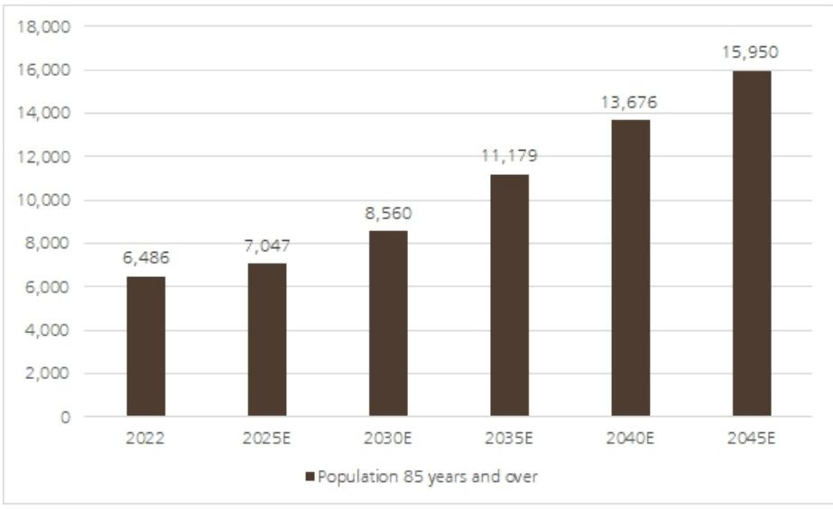
来源：人口普查局和UBS；人口数据以千计

预计美国人口中慢性病的发病率也将上升。根据 Frontier Health 的数据，到2050年，50岁及以上至少患有一种慢性病的人数预计将增加99.5%（从2020年的约7200万增至约1.43亿），而患有多病共存状况的人数预计到2050年将增长略高于90%，达到1500万。美国疾病控制与预防中心的数据发现，90%的美国老年成年人报告患有一种或多种慢性病，而约79%的老年人患有多种慢性病。

图2：慢性病患病率随年龄增长而增加
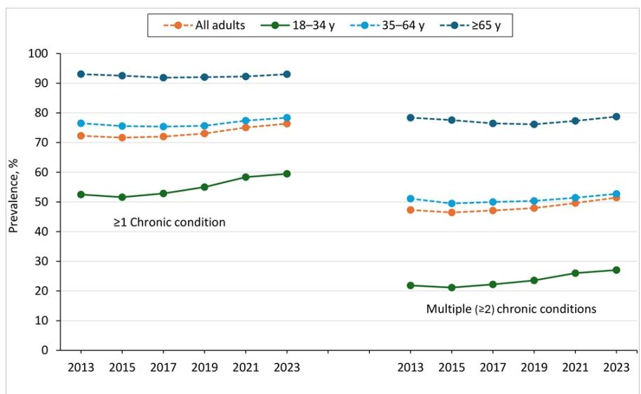
来源：美国疾病控制与预防中心

图3：慢性病趋势
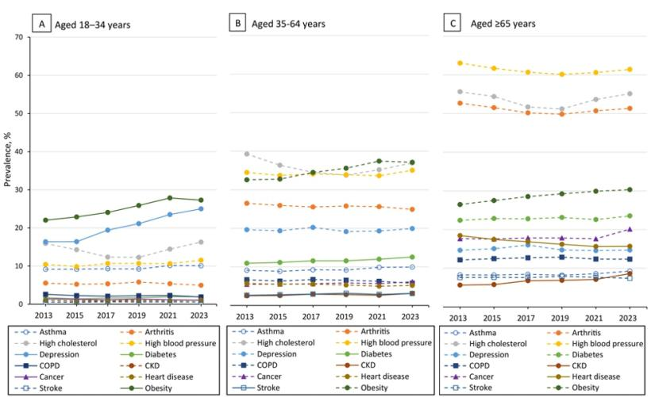
来源：美国疾病控制与预防中心

## 支出随高龄增长而急剧上升

随着慢性病患病率、身体虚弱程度、日常生活辅助需求的增加，医疗支出随年龄增长而增加也就不足为奇了。国民健康支出数据提供了明确的证据，表明医疗支出随年龄增长而急剧上升，并在最年长的年龄段进一步加速。例如，2020年，65岁及以上老年人的人均个人医疗支出为22,356美元，是儿童支出水平的五倍多，约为劳动年龄成年人的2.5倍。该年龄组在总人口中占比最小（例如17%），但在2020年却占据了约37%的医疗总支出。美国医疗保险和医疗补助服务中心的表格显示，85岁及以上成年人的人均医疗支出更高，达到约36,000美元，显著高于较年轻的老年人。尽管85岁以上人群在总人口中所占比例相对较小，但他们在个人医疗总支出中占据了不成比例的巨大份额。这些数据支持了这样一种前提：人口向80岁以上年龄组的老龄化创造了结构性支出支撑，我们预计这一趋势在未来将加速。虽然这不是导致美国医疗成本预期增长的相对少见因素，但我们确实认为婴儿潮一代的老龄化是美国医疗支出总额增长的一个驱动因素。美国医疗保险和医疗补助服务中心的国民健康支出数据预测，到2034年，医疗支出将增长至约9万亿美元，复合年增长率为5.4%（2025-2034年）。美国医疗保险和医疗补助服务中心指出，这一增长速度预计将超过平均GDP增长率（约4%），导致医疗支出占GDP的份额从约18%增加到2034年的约21%。

图4：按年龄组划分的人均个人医疗支出
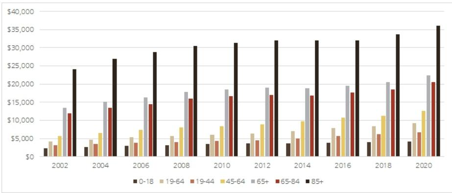
来源：人口普查局和UBS

图5：美国医疗支出预测
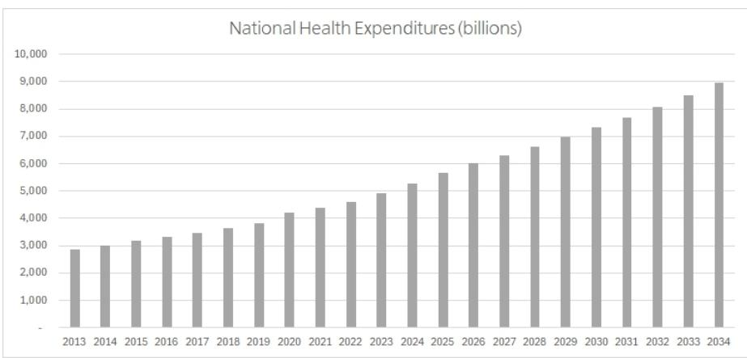
来源：美国医疗保险和医疗补助服务中心

## 老年人的医疗资源使用随年龄增长而变化

随着老年人从65岁过渡到80岁，医疗资源的使用会从预防性护理和选择性手术，显著转向慢性病的强化管理和更高强度的治疗。这反映了多病共存负担的增加，这既增加了护理的频率，也提高了护理的复杂性，从而推动了初级、专科和协调护理场景中的更高使用率。行业评论强调，老龄化群体需要逐步加强的慢性病管理和更高强度的干预措施，而65岁以上个体已经以普通人群数倍的水平使用医疗服务这一事实，放大了这一动态。因此，老龄化人口只会增加美国对医疗资源和服务的需求。与此同时，在老龄化的早期阶段，医疗服务提供持续向门诊和日间手术环境迁移，这反映了临床偏好以及在较低强度环境中改善的疗效。

重要的是，支出随年龄增长并非纯粹是业务量故事，而是反映了所提供护理组合的根本性转变。在65-74岁年龄组中，支出仍以门诊、医生和药物使用为主，这与慢性病管理的"维持阶段"相符，对机构护理的依赖有限。到75-84岁，多病共存的增加推动了住院率和专科强度的提升，同时急性后期服务的作用日益增强，因为更多患者出院后被转至康复和专业护理机构。最显著的转变发生在85岁以上年龄组，其支出越来越集中在急性后期和支持性护理类别，包括专业护理机构、居家健康和临终关怀。在此阶段，成本增长更多地由基于时长的使用驱动，而非离散的临床干预，包括专业护理机构天数、居家健康护理周期和临终关怀，以及长期服务和支持。

## 对医疗服务的影响

## 护理场所的转移将使急性后期护理机构受益

我们预计急性后期护理机构将成为人口老龄化的主要受益者。这包括住院康复机构、居家健康护理、临终关怀和专业护理机构等，我们预计这些机构将从人口老龄化中获得业务量上的好处，因为这些机构主要服务于老年患者群体。流向低成本护理场所的业务量也应受益于管理式医疗组织和支付方日益寻求控制成本的趋势，因此他们很可能会将患者引导至这些低成本场所。

居家健康被视为最大的受益者之一：随着管理式医疗组织和州/联邦资助机构寻求优化治疗和成本效益，居家护理因其较低的成本而成为受益者。如下所示，居家健康护理的费用比最昂贵的治疗方案便宜多达13倍。此外，研究表明，居家护理的好处不仅仅是经济上的。事实上，根据发表在《国家医学图书馆》上的一项研究，与医院护理相比，居家护理已被证明成本更低，并且重要的是，再入院率更低（见此处）。此外，《国家医学图书馆》估计，与患者出院后30天内再入院相关的年度可避免成本约为410亿美元。此外，发表在《美国管理式医疗杂志》上的一项研究发现，接受居家健康护理的患者再入院风险降低了60%。

图6：基于护理场所的每日治疗成本
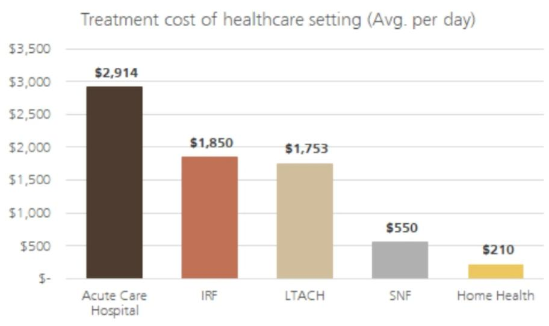
来源：公司报告和Genworth护理成本调查

图7：按服务收费医疗保险的急性后期出院份额
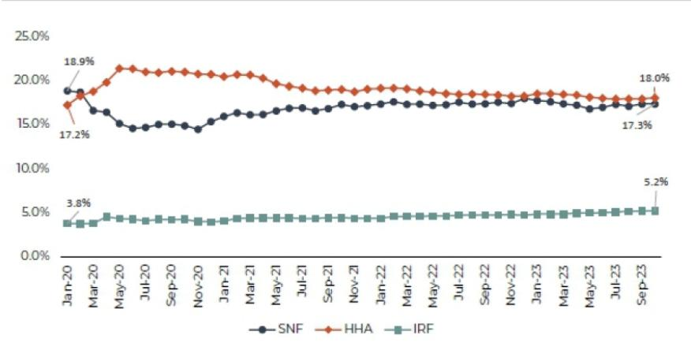
来源：MedPac数据手册

与传统的住院治疗相比，在排名前25位的医疗保险严重程度诊断相关分组中，超过一半的急性医院居家护理周期在出院后30天内也与较低的医疗保险支出相关。所有这些都支持了居家护理对于支付方、患者和提供者的成本效益和日益增长的吸引力。因此，麦肯锡估计，目前在为按服务收费和医疗保险优势计划受益人在传统机构中提供的护理中，高达2650亿美元可能转移到家中，这并不令人意外。

美国人口不仅正在老龄化，而且老年人越来越倾向于留在家中接受护理，这被称为"居家养老"。美国退休人员协会最新的《家庭和社区偏好调查》显示，老年人（60岁以上）绝大多数希望留在自己的家中（75%）和社区（73%）。这种重新渴望居家养老的原因包括但不限于生活成本、维持现有的社会和家庭联系、对新的辅助技术（门铃、摄像头、智能家居设备等）的信心。虽然许多人（44%）认为离开家去机构是不可避免的（主要是出于健康原因），但日益增长的居家健康和养老需求是居家健康护理的另一个支撑因素。

鉴于预计流向居家健康护理机构的业务量将不断增加，美国医疗保险和医疗补助服务中心的国民健康支出预测显示，与居家健康护理相关的医疗支出增长速度将快于医疗总支出，国民健康支出预测居家护理的复合年增长率约为7.8%（2025-2034年）。这高于医疗总支出的约5.4%的复合年增长率、医院的约4.8%的复合年增长率以及护理机构和持续护理退休社区的约4%的复合年增长率。

个人护理服务：虽然许多老年人在65岁时仍然活跃，但到80岁时，对日常生活活动辅助的需求显著增加。根据Addus的数据，大约90%的65岁及以上成年人希望尽可能长时间地"居家养老"。个人护理服务能够通过提供非医疗援助（如洗澡、穿衣、备餐和家务）来满足这一需求，这些对于住院或入住机构风险较高的老年人至关重要。对日常生活活动辅助的需求随年龄增长而增加，随着老年人数量的增加，对日常生活活动辅助服务的需求只会增加。根据2018年的一项研究，大约20%的85岁及以上成年人需要日常生活活动辅助，这比75-84岁成年人中需要日常生活活动辅助的8.7%高出两倍多，而65-74岁年龄组这一比例为3.7%。

## 专业护理机构是另一个低成本护理场所选择

与居家健康类似，我们认为专业护理机构是人口老龄化趋势的主要受益者之一。ENSG等行业运营商认为这将是一个长达十年的支撑因素，目前仍处于早期阶段。虽然不如居家健康便宜，但专业护理机构确实为支付方提供了一个低成本护理场所，每天仅需550美元。此外，拥有高质量评分的一流运营商也能为其患者带来优质的疗效，并将继续成为转诊管理者首选的出院护理场所。

图8：护理机构和持续护理退休社区的国民健康支出预测（百万美元）
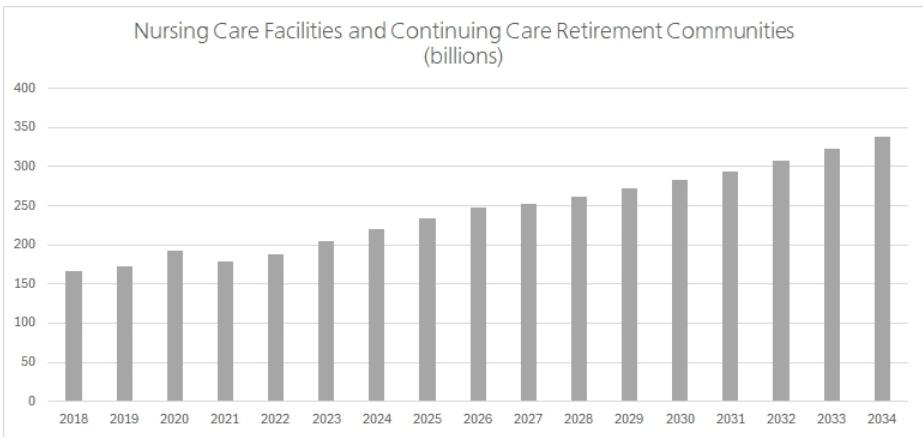
来源：美国医疗保险和医疗补助服务中心

## 临终关怀业务量也应受益于人口老龄化

临终关怀业务量受益于人口老龄化带来的显著结构性支撑，因为对临终关怀的需求与年龄密切相关，并在75岁以上年龄组中不成比例地增加。随着预期寿命的延长，更大比例的人口进入高龄类别，在这些类别中，慢性、进行性疾病（如癌症、痴呆症和心血管疾病）的患病率上升，从而扩大了符合临终关怀服务条件的患者群体。根据Caring Hospice Institute的数据，临终关怀入院时的平均年龄约为80岁，最大的单一年龄组是85岁及以上。从业务量角度来看，老年人口的增长不仅增加了死亡总人数，还延长了死亡前的功能衰退期，支持了更早的转诊和更长的住院时间，这共同推动了总患者天数。此外，意识的提高、医生转诊实践的演变以及医疗保险的支持，共同推动了临终关怀使用率的稳步上升，表明人口扩张正得到结构性渗透率增长的补充。根据国家居家护理联盟的数据，在2024日历年度，有190万医疗保险受益人接受了一天或更长时间的临终关怀，比2023日历年度增长了4.4%。此外，在2024日历年度所有医疗保险受益人死亡病例中，53.1%的人接受了至少一天的临终关怀，并且在死亡时已登记接受临终关怀，这是连续第三年改善。

## 老年住宅和辅助生活：需求上升，供应受限

老年住宅数据同样反映了与人口老龄化相一致的需求增长。国家老年人住房与护理投资中心报告称，2025年美国老年住宅入住率约为88-89%，标志着入住率连续四个季度以上增长。截至2026年第一季度，国家老年人住房与护理投资中心的数据显示入住率为89.5%，环比上升40个基点。国家老年人住房与护理投资中心指出，需求增强是由婴儿潮一代人口老龄化推动的，而新库存供应有限，2025年第四季度库存增长率低于1%，这是连续第三个季度库存增长率低于1%。国家老年人住房与护理投资中心预测，到2026年底，老年住宅入住率可能超过90%，特别是在独立生活和辅助生活类别中，因为需求继续超过新建设。鉴于美国预期的人口趋势，我们预计对老年住宅和辅助生活的需求只会从这里开始增加。

图9：按物业类型划分的入住率
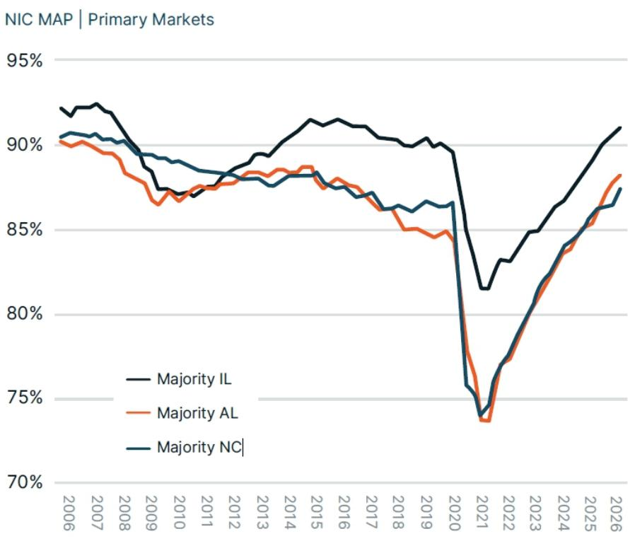
来源：国家老年人住房与护理投资中心 MAP：IL - 独立生活；AL - 辅助生活；NC - 护理

## 殡葬服务业务量也应受益于人口老龄化

婴儿潮一代进入高龄阶段也与殡葬服务相关，包括殡仪馆、墓地和火葬服务提供商。死亡率随年龄增长而急剧上升，尤其是在80岁以后，这使得这一人口里程碑成为一个长期的积极业务量驱动因素。事实上，SCI（美国最大的殡仪馆和墓地运营商之一）指出，我们仍处于婴儿潮一代老龄化带来的预期长达十年的支撑因素的早期阶段。来自美国疾病控制与预防中心和社会保障局的美国生命表显示，尽管高龄人群的预期寿命有所改善，但年死亡概率在高龄组中呈指数级增长。全国殡葬业者协会的预测显示，死亡人数将持续上升至2045年，预计到2045年将比2022年增加19%。也就是说，收入增长在一定程度上受到消费者偏好持续转变的影响。全国殡葬业者协会预测火化率将显著上升，到2045年达到82.3%，而2025年约为63%，而土葬率预计到2045年将下降至13.3%。火化服务的平均每项服务收入通常低于传统土葬，即使在业务量上升的情况下，也会对即时殡葬收入造成组合压力。全国殡葬业者协会指出，家庭对火化的偏好增加受到成本考量、环境问题、宗教禁忌减少以及希望简化葬礼仪式的影响，而无宗教信仰人数的增加也导致了传统葬礼的减少和火化的兴起。墓地经营者和预需业务预计也将受益于人口老龄化。预需销售随年龄增长而增加，因为进入70多岁和80多岁的人更有可能预先安排葬礼和墓地服务。这些合同会产生递延但相对可预测的未来收入流。

## 医院

虽然我们已经指出人口老龄化趋势对急性后期护理机构有利，但我们认为医院也将从这一趋势中受益。预计医院将受益于人口老龄化，因为老年患者会不成比例地推动更高的急性护理使用率，尤其是在75岁以上和80岁以上年龄组。使用数据一致表明，65岁以上人群使用医院服务的比率远高于较年轻的成年人，这既反映了更高的慢性病负担，也反映了更高的急性事件发生率（例如，心血管事件、感染、跌倒）。例如，根据Vizient的数据，2024年65岁以上成年人的急诊就诊中，72%被归类为紧急情况，高于18-64岁成年人的65%比率。在未来十年，Vizient预计65岁及以上人口群体的紧急就诊量将增长28%，而75-84岁年龄组预计将增长45%。随着人口老龄化，这应转化为住院人数、急诊就诊量和医院总业务量的持续增长。此外，符合医疗保险资格人口的扩大——特别是医疗保险优势计划的持续增长——提供了一个与人口老龄化相关的大规模且相对稳定的支付方基础。根据Vizient的预测，65岁以上年龄组在所有护理场所的业务量预计都将增长。这包括预计65岁以上人口的急诊业务量将增长24%（2024-2034年），住院出院量增长17%，住院天数增长22%，门诊量增长30%。作为参考，这些数字均低于Vizient预计的急性后期护理业务量32%的增长。

有趣的是，随着年龄增长，医院住院业务量并未出现任何实质性的下降。根据美国医疗保险和医疗补助服务中心关于按服务收费医疗保险住院患者的数据，65-74岁年龄组的每千名医疗保险A部分参保人出院人数最低，为147人次，然后增加到75-84岁年龄组的275人次，再增加到85-94岁年龄组的461人次。

图10：按年龄组划分的按服务收费医疗保险住院患者使用趋势

<table><tr><td>年龄组</td><td>原始医疗保险A部分参保人总数</td><td>有使用记录的总人数</td><td>总出院人数</td><td>占总出院人数百分比</td><td>每千名原始医疗保险A部分参保人出院人数</td><td>每千名有使用记录者出院人数</td><td>总项目支付额</td><td>占总项目支付额百分比</td><td>每位原始医疗保险A部分参保人项目支付额</td></tr><tr><td>65-74岁</td><td>17,223,233</td><td>1,597,656</td><td>2,539,369</td><td>31.9</td><td>147</td><td>1,589</td><td>43,281,196,154</td><td>34</td><td>2,513</td></tr><tr><td>75-84岁</td><td>9,666,928</td><td>1,619,019</td><td>2,657,792</td><td>33.4</td><td>275</td><td>1,642</td><td>42,922,968,459</td><td>34</td><td>4,440</td></tr><tr><td>85-94岁</td><td>3,188,185</td><td>901,809</td><td>1,470,759</td><td>18.5</td><td>461</td><td>1,631</td><td>20,651,899,535</td><td>16</td><td>6,478</td></tr><tr><td>95岁及以上</td><td>447,894</td><td>143,316</td><td>217,759</td><td>2.7</td><td>486</td><td>1,519</td><td>2,729,881,221</td><td>2</td><td>6,095</td></tr></table>

来源：美国医疗保险和医疗补助服务中心和UBS

## 管理式医疗组织可能面临老年成员使用率上升的压力，但预计管理式医疗组织会将成员引导至低成本场所

美国人口老龄化已经使管理式医疗组织的医疗保险优势计划成员总数受益，这反过来又帮助增加了保费。随着医疗保险优势计划成员年龄的增长，理论上，由于老年人慢性病患病率增加，成员可能会遇到更多的医疗事件，从而导致使用率上升。然而，重要的是要认识到，疾病负担较高的成员通常具有更高的风险评分，因此美国医疗保险和医疗补助服务中心向管理式医疗组织支付的用于照顾这些病情较重患者的费用也更高。就风险模型和年龄组而言，CMS-HCC模型系数会根据年龄自然增加。然而，年龄分组是每4年递增一次（75-79、80-84、85-89等）。因此，假设一个成员的HCC代码不变，但年龄进入下一个年龄组，这将在其他条件不变的情况下为收入创造支撑。也就是说，如果成员的健康状况在达到80岁后迅速恶化，管理式医疗组织将无法在次年之前捕获这些代码。这反过来会导致收入水平降低和医疗成本支出增加，直到成员的风险评分被适当捕获和评分。我们认为，管理式医疗组织将寻求通过更多地利用基于价值的护理合同以及将成员引导至低成本护理场所（如居家健康）等方式，来更好地管理这一老龄化人口群体。

图11：管理式医疗组织的医疗损失率趋势
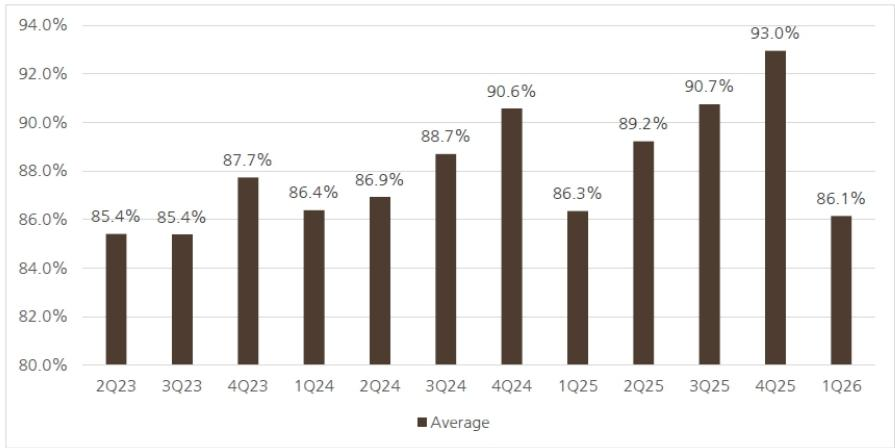
来源：公司报告；不包括ALHC

## 劳动力和护理人员短缺是一个限制因素

尽管人口趋势表明需求在上升，但业务量的增长受到劳动力可用性的限制。根据两党政策中心的数据，美国在过去20多年里一直面临直接护理人员的持续短缺，预计2022年至2032年间将有近900万个直接护理职位空缺。报告强调，人员短缺迫使许多居家健康提供者拒绝转诊患者，并导致了医院出院的延迟。与此同时，无偿护理已成为护理系统的一个关键组成部分。美国退休人员协会和全美护理联盟2025年的报告估计，有6300万美国人提供了无偿护理，自2015年以来增长了近50%。此外，社区生活管理局观察到，直接护理专业人员的有限可用性限制了老年人和残疾人获得社区服务的机会。这些趋势表明，鉴于美国人口老龄化，对护理的需求与满足这一需求的有限护理人员供应之间日益失衡。

# 利用UBS HOLT框架来构建关于我们"80岁以上受益者"的讨论

在本节中，我们利用UBS HOLT框架来提供关于本报告中重点提及公司的额外见解。UBS HOLT是一个客观的、基于现金流的框架，用于评估公司业绩和估值，独立于我们的工作。其核心是，HOLT使用其专有的现金流投资回报率方法衡量投资资本回报率，该方法在不同地理区域和行业间一致应用。该框架还通过模拟公司现金流生成随时间的可持续性和衰减来评估估值。

## HOLT评分卡和因子分析

UBS HOLT评分卡是一个系统性的框架，从三个核心维度对公司进行排名：运营质量、动能和估值。这三个支柱被同等加权，并组合成一个总体评分卡排名，帮助识别具有吸引力和不具吸引力的公司，并且历史上与长期股东回报相关。基于HOLT的公司业绩和估值指标，HOLT评分卡提供了一套独特、有区分度且易于处理的因子集。因子在0（最弱）到100（较强）的范围内相对于定义的同行宇宙进行排名。

HOLT运营质量因子根据公司历史CFROI的水平和变异性来评估其相对吸引力。HOLT动能因子提供了市场情绪的衡量标准，包括13周CFROI修正、价格动能和流动性。HOLT估值因子评估公司股票价格的相对吸引力，并考虑其HOLT合理上涨/下跌空间、市场隐含回报表现、经济市盈率、HOLT市净率和股息回报表现。

我们还包括描述性因子同行排名，这些排名不贡献于总体评分卡排名，但突出了那些基于其增长潜力或防御性特征可能值得特定投资组合定位的公司。HOLT增长因子衡量一家公司相对于同行可能产生更高或更低未来现金流增长的程度。HOLT低波动因子衡量公司股票价格的变异性及其对区域市场变动的敏感性。为了评估低波动性，该因子评估长期月度贝塔值、长期月度价格波动率和90天价格波动率。

图12：急性后期同行HOLT评分卡和因子同行排名

<table><tr><td>代码</td><td>BTSG</td><td>HCSG</td><td>ADUS</td><td>PACS</td><td>CHE</td><td>EHC</td><td>BKD</td><td>ENSG</td><td>SCI</td><td>PNTG</td></tr><tr><td>总体同行排名</td><td>92</td><td>86</td><td>77</td><td>75</td><td>69</td><td>67</td><td>57</td><td>57</td><td>50</td><td>30</td></tr><tr><td>运营质量</td><td>94</td><td>78</td><td>93</td><td>68</td><td>98</td><td>81</td><td>34</td><td>78</td><td>81</td><td>72</td></tr><tr><td>动能</td><td>96</td><td>91</td><td>63</td><td>77</td><td>68</td><td>37</td><td>74</td><td>48</td><td>30</td><td>65</td></tr><tr><td>估值</td><td>8</td><td>25</td><td>29</td><td>45</td><td>9</td><td>49</td><td>60</td><td>37</td><td>36</td><td>6</td></tr><tr><td colspan="11"></td></tr><tr><td>增长</td><td>92</td><td>78</td><td>90</td><td>96</td><td>31</td><td>61</td><td>12</td><td>78</td><td>38</td><td>75</td></tr><tr><td>低波动</td><td>37</td><td>54</td><td>79</td><td>40</td><td>90</td><td>83</td><td>59</td><td>80</td><td>83</td><td>40</td></tr></table>

来源：UBS HOLT Lens。数据截至2026年7月13日。总体评分卡同行排名、因子同行排名和描述性同行排名基于区域基础得出。排名反映了在北美地区的相对定位。公司按HOLT总体评分卡同行排名从左到右排列。

## 有关HOLT评分卡和因子库的更多信息，请参见此处

在上图中，我们按总体评分卡排名及其基础因子组成部分对急性后期同行组进行排名。该组公司整体表现良好，十家公司中有八家在HOLT全宇宙中排名前一半。运营质量是较强的因素，有五家公司处于前五分之一（CHE、BTSG、ADUS、EHC、SCI），这得益于它们高且稳定的CFROI。动能表现不一，而估值普遍不太有利，除BKD外，所有公司均排名在全宇宙的后一半。

## UBS HOLT Lens中的个体公司分析

在本节中，我们通过UBS HOLT Lens分析急性后期同行组中每个成员的个体情况。以下分析源自HOLT模型默认情景，该情景基于HOLT的系统性衰减方法。鼓励读者覆盖UBS HOLT Lens中的默认情景，以反映他们自己的假设。

## BrightSpring Health Services Inc (BTSG)

在急性后期同行中，BTSG获得了最高的HOLT总体评分卡排名92。自2024年1月首次公开募股以来，这家居家和社区健康解决方案提供商的股价上涨了超过530%。CFROI在2025年上升至27%的高点，这是由资产周转率提高推动的，因为公司通过剥离其社区生活业务，合理化其运营租赁设施和许可证。展望未来，CFROI预计到2027年将进一步上升至32%。然而，市场似乎正在贴现向2025年CFROI水平的回归，同时伴随中个位数的增长。

## 图13：UBS HOLT Lens中的BTSG

来源：UBS HOLT Lens。数据截至2026年7月13日。

<table><tr><td colspan="4">动能</td></tr><tr><td></td><td>6个月</td><td>3个月</td><td>1个月</td></tr><tr><td>CFROI修正</td><td>1.26</td><td>1.50</td><td>0.00</td></tr><tr><td>价格变动百分比</td><td>23.20</td><td>22.06</td><td>6.32</td></tr><tr><td colspan="4">公司信息</td></tr></table>

## Healthcare Services Group (HCSG)

HCSG的CFROI在2025年反弹，这是由管理层所说的定价改善和运营效率带来的利润率复苏推动的。2026年第一季度后强劲的股价表现和积极的CFROI修正支持了其处于前十分之一的动能因子。展望未来，CFROI预计将保持高位，而市场定价隐含的CFROI约为12%，资产增长率为高个位数。

## 图14：UBS HOLT Lens中的HCSG

来源：UBS HOLT Lens。数据截至2026年7月13日。

## Addus Homecare Corp (ADUS)

ADUS的CFROI在过去五年中显著上升，这得益于利润率扩张和资产周转率的提高。值得注意的是，尽管在过去一年的大部分时间里CFROI修正有利，但该股在最近表现优异之前的大部分时间里都落后于大盘。即使在上涨之后，该股仍以低于历史估值标准的水平交易，经济市盈率为18.2倍，而五年中位数为24.1倍；HOLT市净率为8.9倍，而历史中位数为9.0倍。尽管共识预测表明该公司将继续产生有吸引力的回报，但市场隐含的CFROI反映了对这些水平持久性的怀疑，当前定价表明CFROI长期将衰减至约28%。

## 图15：UBS HOLT Lens中的ADUS

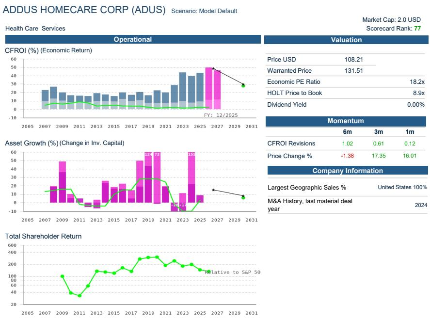
来源：UBS HOLT Lens。数据截至2026年7月13日。

## PACS Group Inc (PACS)

强劲的股价表现和积极的CFROI修正支持了PACS高达75的HOLT总体评分卡排名。CFROI在2025年反弹，因为利润率在人员投资之后恢复，这些投资在2024年暂时压低了销售、一般及管理费用，导致CFROI低于公司的资本成本。CFROI预计在未来十二个月内将进一步改善，而市场定价隐含稳定的CFROI水平，同时到2030年资产增长率为高个位数。

## 图16：UBS HOLT Lens中的PACS

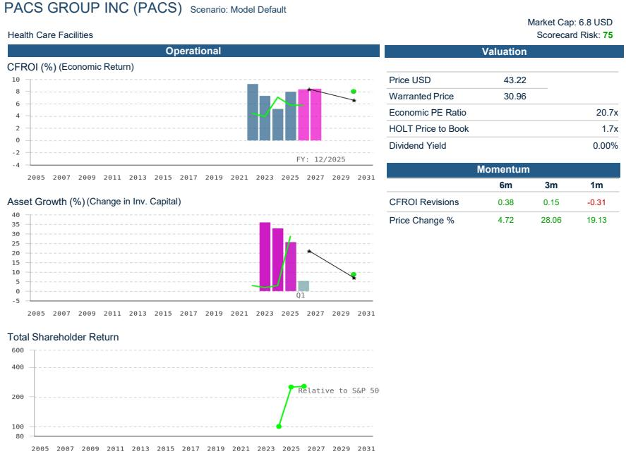
来源：UBS HOLT Lens。数据截至2026年7月13日。

<table><tr><td colspan="3">估值</td></tr><tr><td>价格（美元）</td><td>488.59</td><td></td></tr><tr><td>合理价格</td><td>349.77</td><td></td></tr><tr><td>经济市盈率</td><td></td><td>26.7倍</td></tr><tr><td>HOLT市净率</td><td></td><td>7.8倍</td></tr><tr><td>股息回报表现</td><td></td><td>0.49%</td></tr></table>

<table><tr><td colspan="2">公司信息</td></tr><tr><td>业务板块（数量 | CFROI范围）</td><td>2 | 8%</td></tr></table>

## Chemed Corp (CHE)

在经历了一段长期的恶化之后，CHE的CFROI预计在未来几年将有所改善，近期主要是由于其Roto-Rooter业务销售增长放缓和利润率压力。展望未来，公司整体CFROI预计到2027年将恢复至32%。与此同时，CHE的股价已从今年春季早些时候触及的多年低点反弹，市场隐含的CFROI表明读者预计该公司将在长期内维持这些较高的近期回报水平，同时资产增长温和。

## 图17：UBS HOLT Lens中的CHE

![](images/d55a4d8f8706f9053f775e4572c3688d2077610270d32d0e0d4
