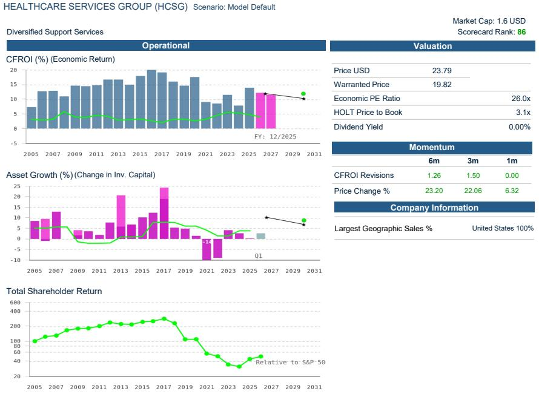
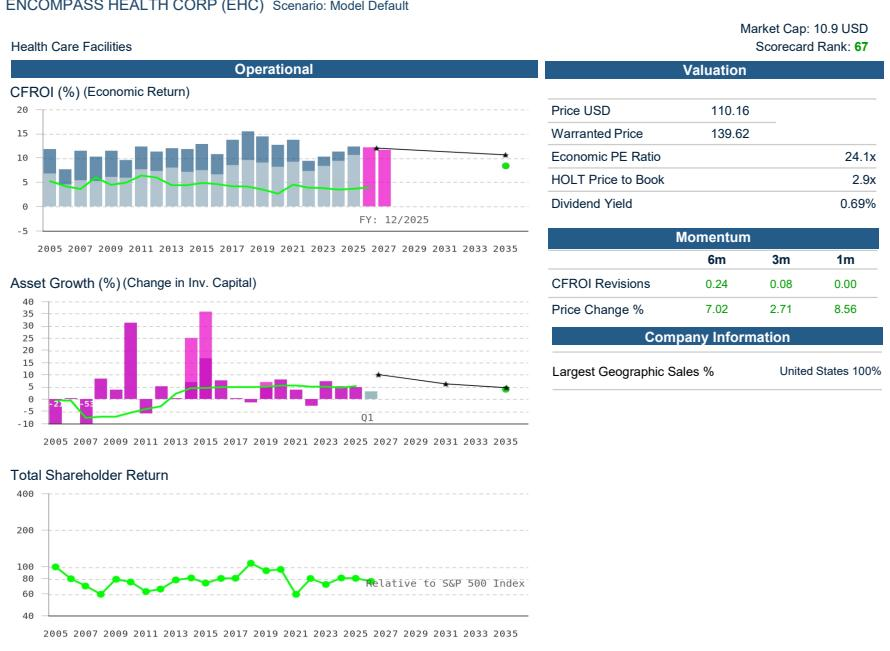
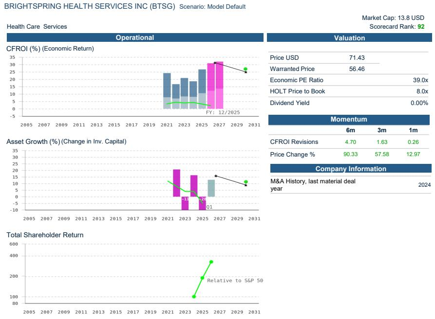

# The Baby Boomer Inflection Will Reshape Healthcare Demand, Not Just Expand It

The first Baby Boomer turns 80 this year. That single demographic milestone, often cited in passing, conceals a structural transformation that most healthcare observers have not yet fully priced in. The U.S. population aged 80 and older is projected to nearly double from roughly 15 million today to almost 30 million by the mid-2040s, according to Brookings Institution research. But the critical insight is not the raw population growth. It is that healthcare utilization, cost structure, and site-of-care preferences undergo a discontinuous shift once patients cross the 80-year threshold. The 85-and-older cohort already consumes approximately $36,000 per capita in personal healthcare spending, more than 60 percent above the average for the 65-plus group, which itself spends $22,356 per capita. This is not a linear extension of existing trends. It is a qualitative change in the composition of demand.

The strategic opportunity lies in recognizing that the care delivery system built for a younger senior population is poorly configured for the needs of the oldest old. The 65-to-74 cohort still operates largely in a maintenance phase, with spending concentrated in outpatient visits, physician services, and prescription drugs. By ages 75 to 84, inpatient admissions and specialist intensity rise notably. But the most dramatic reallocation occurs in the 85-plus group, where spending shifts decisively toward duration-based services: skilled nursing, home health, hospice, and long-term services and supports. This is not a volume story alone; it is a fundamental rotation in the type of care demanded. And the payment system, particularly managed care organizations seeking cost control, is already steering patients toward lower-cost settings that align with this demographic shift.

The implications for researchers and strategic planners are clear. Post-acute settings such as inpatient rehabilitation facilities, home health agencies, skilled nursing facilities, and hospice providers are the primary structural beneficiaries. These settings already serve an older patient cohort, and their addressable market is about to expand at a rate that outpaces the broader healthcare economy. Home health care, in particular, stands out because it is simultaneously the most cost-efficient setting and the one most aligned with patient preference. AARP surveys show that 75 percent of adults aged 60 and older want to remain in their homes, and the cost differential is staggering: home health can be up to 13 times cheaper per day than the most expensive institutional alternatives. The combination of demographic tailwind, payer preference, and patient desire creates a convergence that few other healthcare subsectors can match.

## The 80-Plus Age Cohort Drives a Discontinuous Shift in Healthcare Utilization and Spending

The most common analytical error in demographic research is to treat the 65-plus population as a homogeneous group. National Health Expenditure data from CMS reveals a starkly different reality. In 2020, per capita spending for the 85-plus cohort reached roughly $36,000, compared with $22,356 for all seniors 65 and older. That is a 61 percent premium within the senior category alone. The 65-plus age group already accounted for 37 percent of total U.S. healthcare spending despite representing only 17 percent of the population. As the 80-plus population doubles, the spending concentration will intensify.

But the spending increase is not merely a function of age-related morbidity. It reflects a fundamental change in the mix of services consumed. The 65-to-74 cohort still generates most of its spending through outpatient care, physician visits, and pharmaceuticals. By ages 75 to 84, inpatient admissions and specialist consultations rise meaningfully. In the 85-plus group, the center of gravity shifts to post-acute and supportive care: skilled nursing facility days, home health episodes, hospice care, and long-term services and supports. This is a shift from event-based spending to duration-based spending. The financial profiles of companies serving these segments are structurally different from those serving acute-care or elective-procedure markets. Revenue streams tied to length of stay or episode count, rather than transaction volume, offer a different risk-return profile and greater visibility.

## Chronic Disease Prevalence and Multi-Morbidity Create a Structural Demand Floor That Cannot Be Cyclical

The demographic expansion of the 80-plus cohort is accompanied by a parallel increase in chronic condition prevalence. Frontier Health data projects that the number of Americans aged 50 and older with at least one chronic disease will rise from roughly 72 million in 2020 to approximately 143 million by 2050, a 99.5 percent increase. Multi-morbidity, defined as having two or more chronic conditions, is forecast to grow just over 90 percent to 15 million by 2050. The Centers for Disease Control and Prevention already reports that 9 in 10 older adults have at least one chronic condition, and 79 percent have multiple conditions.

This epidemiologic reality has a direct bearing on the type of healthcare infrastructure that will be needed. Chronic disease management is inherently less episodic and more continuous than acute care. It requires care coordination across multiple settings, regular monitoring, and interventions that are often non-surgical. The healthcare system that emerges to serve this population will look less like a hospital-centric model and more like a distributed network of home-based and community-based services, supported by skilled nursing and rehabilitation facilities for higher-acuity episodes. Companies that have already built capabilities in care coordination, home health, and post-acute services are effectively pre-positioned for a demand environment that will compound for at least the next 15 years.

## Post-Acute and Home-Based Care Settings Are the Primary Structural Beneficiaries of the Demographic Rotation

The shift from acute to post-acute care is already visible in discharge patterns. Medicare fee-for-service data shows a growing share of hospital discharges directed to home health, skilled nursing facilities, and inpatient rehabilitation facilities, rather than remaining in the hospital or being discharged without services. This trend will accelerate as managed care organizations, which increasingly dominate Medicare Advantage and Medicaid managed care, actively steer patients to lower-cost settings. Home health care, at roughly one-thirteenth the cost of the most expensive treatment settings, is the most obvious beneficiary.

The cost advantage is not the only driver. Clinical evidence supports home-based care as a superior setting for many patients. A study published in the National Library of Medicine found that patients receiving home health care had a 60 percent lower risk of hospital readmission, and the American Journal of Managed Care documented similar findings. Acute Hospital Care at Home episodes were associated with lower Medicare spending in the 30-day post-discharge period for more than half of the top 25 Medicare Severity Diagnosis Related Groups. McKinsey estimates that up to $265 billion worth of care currently delivered in traditional facilities for fee-for-service and Medicare Advantage beneficiaries could shift to the home. That figure, if realized, would represent a reallocation of roughly 15 to 20 percent of current hospital spending.

Skilled nursing facilities, while not as cheap as home health at approximately $550 per day, still represent a lower-cost alternative to hospital care and are increasingly operated by high-quality providers who can demonstrate superior outcomes. The combination of demographic tailwind, payer preference, and quality-based referral patterns creates a favorable environment for skilled nursing operators with strong clinical scores and efficient cost structures. Hospice and personal care services, which address the needs of the oldest and most frail patients, will also see structural volume growth that is largely independent of economic cycles.

## A Decision Framework for Researchers: Four Criteria to Identify Companies Positioned for the 80-Plus Demographic Shift

Not every healthcare company will benefit equally from this demographic wave. The following framework helps distinguish between companies that are merely exposed to aging demographics and those that are structurally positioned to capture disproportionate share.

First, assess the degree of revenue exposure to duration-based services rather than transaction-based services. Companies whose revenue is tied to length of stay, episode count, or patient census in post-acute settings have more predictable demand than those dependent on elective procedure volume, which can be deferred or disrupted. Home health agencies, skilled nursing operators, and hospice providers score highly on this criterion.

Second, evaluate the company's ability to serve patients across multiple care settings. The 80-plus patient population requires care coordination that spans primary care, home health, skilled nursing, rehabilitation, and hospice. Companies with integrated platforms or strong referral networks are better positioned to capture the full episode of care and to retain patients as their needs escalate. Fragmented providers risk losing patients to competitors at each transition point.

Third, examine the cost position relative to alternative sites of care. Managed care organizations and government payers are increasingly using value-based payment models and narrow networks to steer patients to lower-cost settings. Providers that can demonstrate both cost efficiency and quality outcomes will be preferred in network design. Home health agencies that can document lower readmission rates and skilled nursing operators with high star ratings have a competitive advantage.

Fourth, consider the degree of operational leverage in the business model. Many post-acute providers operate with high fixed costs in labor and facility infrastructure. As volumes increase with the demographic wave, companies with scalable platforms and proven ability to add capacity without proportionate cost increases will see margin expansion. The UBS HOLT framework, which evaluates corporate performance through a cash-flow-based lens, shows that several companies in this space rank in the top quintile of the HOLT universe for operational quality, supported by high and stable cash flow return on investment.

## The Shift Toward Aging in Place Reinforces the Home Health and Personal Care Tailwind

Patient preference is aligning with payer economics in a way that creates a durable tailwind for home-based care. AARP's latest Home and Community Preferences Survey found that 75 percent of adults aged 60 and older want to remain in their homes, and 73 percent want to stay in their communities. The desire to age in place is driven by cost considerations, social connections, and growing confidence in assistive technologies such as smart home devices and remote monitoring.

The demand for personal care services, which provide non-medical assistance with activities of daily living such as bathing, dressing, and meal preparation, increases sharply with age. A 2018 study found that roughly 20 percent of adults aged 85 and older need help with activities of daily living, more than double the 8.7 percent rate for adults aged 75 to 84, and more than five times the 3.7 percent rate for the 65-to-74 cohort. As the 80-plus population doubles, the number of individuals requiring personal care services will grow at an even faster rate than the population itself, because the prevalence of need is highest in the oldest age brackets.

CMS projections reinforce this view. The agency forecasts that home health care expenditures will grow at a 7.8 percent compound annual rate from 2025 to 2034, outpacing the 5.4 percent growth rate for total healthcare expenditures, the 4.8 percent rate for hospitals, and the 4.0 percent rate for nursing care facilities and continuing care retirement communities. This differential growth rate is not a short-term anomaly. It reflects a structural reallocation of healthcare spending from facility-based to home-based settings, driven by the convergence of demographic pressure, cost containment imperatives, and patient preference.

*For informational purposes only. Portions may be generated, translated, summarized, or edited with AI assistance based on source materials and may contain omissions or errors. Please verify independently. This is not professional advice.*

For informational purposes only. Portions may be generated, translated, summarized, or edited with AI assistance based on source materials and may contain omissions or errors. Please verify independently. This is not professional advice.

