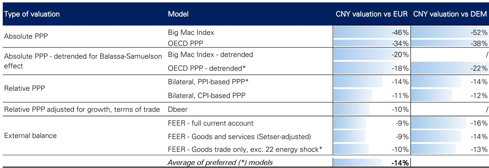
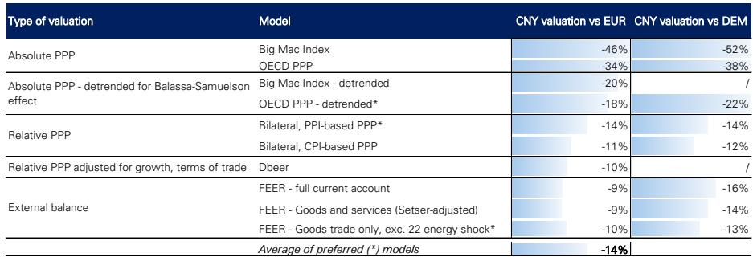

# 人民币兑欧元的结构性价值评估：基于十种模型的综合分析

近期，欧盟正面临经济学家所称的“中国冲击2.0”阶段。欧盟对华贸易逆差近年来显著扩大，其背后驱动因素包括中国制造业价值链的攀升、俄乌冲突后相对能源成本的结构性变化，以及系统性降低中国生产成本的补贴机制。在最近的七国集团峰会上，德国总理弗里德里希·默茨明确表示，欧盟正在与拥有严重低估货币的国家竞争。他没有点名中国，但意图不言自明。

通过运用十种不同的估值模型对人民币兑欧元的公允价值进行系统评估，得出一个核心结论：人民币兑单一欧元货币仍被低估约15%。这一差距较12个月前的超过20%有所收窄，但仍处于与2005-2008年期间极端水平相当的位置。关键的是，当以假设的德国马克为基准进行衡量时，这种低估变得更加明显，表明德国面临的竞争力挑战在规模上显著大于整个欧元区。这并非一个边际或暂时的定价异常，而是当前全球汇率体系的一个结构性特征，对贸易政策、企业战略和市场配置具有直接影响。

## 十种模型共同指向15%的低估，最便宜的指标揭示出汇率之外的扭曲

本报告采用的分析方法刻意追求稳健。分析并非依赖单一方法，而是部署了涵盖两大类别——购买力平价（PPP）和外部平衡框架——的十种不同模型。结果虽不完全相同，但趋于一致。最简单的模型——巨无霸指数——显示人民币兑欧元被低估46%。经合组织（OECD）更广泛的价格水平指标则指向34%的低估。然而，这些原始的相对购买力平价数字如果只看表面价值会产生误导。它们未能考虑巴拉萨-萨缪尔森效应，该效应预测，在可贸易品领域生产率增长较快的快速增长经济体，其实际汇率应随时间推移而结构性走强。当对这些指标进行去趋势处理以剔除长期生产率趋势后，巨无霸指标隐含的低估降至约20%，OECD指标则为18%。

比较通胀差异而非相对价格水平的相对购买力平价模型，得出了更为温和但仍显著的估计。基于PPI的相对购买力平价模型指向14%的低估，基于CPI的版本则暗示11%。一个更复杂的、调整了贸易条件和生产率差异的变体——DBeer模型——得出10%的低估。外部平衡模型估计了将经常账户余额恢复至历史平均水平所需的汇率调整，在贸易加权基础上，这些模型的结果集中在9-10%的低估附近，尽管转换为欧元/人民币双边汇率后数字略有不同。

关键洞察并非来自任何单一模型的确切数字，而是这种趋同性。十种不同的方法，各有不同的假设和数据输入，都指向同一方向：人民币兑欧元被低估，且幅度之大足以对实际经济结果产生影响。

## 2022年以来的趋势逆转标志着数十年人民币渐进升值格局的结构性断裂

将错估估计值随时间的变化绘制成图，揭示出一个比当前水平本身更值得关注的模式。从21世纪初到大约2020年，根据相对购买力平价指标，人民币被低估的程度一直在稳步缩小。这与巴拉萨-萨缪尔森效应一致：随着中国可贸易品生产率的提高，其实际汇率走强。这一趋势并非完全线性，但方向清晰且持续。

这一趋势在2022年后急剧逆转。巨无霸和OECD购买力平价指标上的低估程度再次开始扩大。数据中可见这一断裂，且恰逢中国宏观环境面临显著变化的时期：房地产市场调整、人口结构变化以及政策优先级的转变。在此期间，人民币兑美元和欧元的贬值受到周期性因素和结构性因素的共同驱动，但净效应是货币偏离了公允价值而非向其靠拢。即使在今年出现部分修正之后——欧元走弱，欧元/人民币从高点回落——低估程度仍处于2008年前期以来未见的水平。

这一逆转之所以重要，是因为它改变了任何前瞻性评估的基准。如果之前的渐进升值趋势得以延续，人民币现在可能已更接近公允价值。相反，差距扩大了，需要弥合这一差距所需的调整也增加了。这意味着，要么人民币必须从此处大幅升值，要么欧元必须贬值，或者两者兼而有之。错估持续的时间越长，它就越深地嵌入贸易模式、决策和企业规划之中。

## 德国面临的竞争力问题在数量上更大，在性质上不同于欧元区平均水平

当将同一套模型应用于假设的德国马克时——使用德国价格数据、德国贸易平衡和德国外部账户——结果令人瞩目。在每一项指标上，人民币兑德国马克的低估程度甚至比兑欧元更严重。在去趋势后的OECD购买力平价指标上，兑德国马克的低估为22%，而兑欧元为18%。在使用完整经常账户数据的FEER模型上，差距为16%对9%。在仅考虑商品的FEER变体上，则为13%对10%。

原因很简单。德国的外部平衡恶化程度比欧元区平均水平更为严重。德国的经常账户盈余在十年前达到GDP的8%以上峰值，现已降至约GDP的4.3%。商品贸易顺差也已收窄。这种恶化反映了多重因素：能源价格冲击、全球需求变化，以及来自中国出口在德国长期拥有比较优势的领域（尤其是汽车）的特定竞争压力。当汇率像当前模型所显示的那样被低估时，德国出口商面临双重挤压：由于能源和监管因素，他们的成本更高；而他们的售价则被一种使中国商品人为便宜的货币所削弱。

这不仅仅是学术上的区别。如果欧元区是一个同质化的集团，那么对中国货币低估的政策回应将是统一的。但德国的敞口更大，其盈余缩水更多，其采取行动的政治压力也相应更高。默茨在七国集团的评论并非外交辞令。它们是一个信号，表明德国将汇率视为其工业竞争力的一个直接且重要的因素。

## 外部平衡模型揭示出标题数据中的扭曲，可能低估了真实的错估程度

中国和欧元区的标题经常账户数据都包含显著的扭曲，在得出任何估值结论之前必须进行调整。对于欧元区，最突出的扭曲是爱尔兰，其在跨境资金流动和企业税务规划中的巨大作用抬高了标题经常账户盈余。将爱尔兰从分析中剔除，会使欧元区的外部平衡更接近其历史平均水平，但由于爱尔兰的扭曲主要发生在收入方面，调整幅度不大。

对于中国，扭曲的影响更为重大。分析师Brad Setser记录了过去几年中国商品贸易数据在方法和报告上的明显变化，海关数据与国际收支数据出现分歧。当使用Setser基于海关的方法调整FEER模型时，人民币在贸易加权基础上的隐含低估程度增加。仅考虑商品的FEER变体，它隔离了实物商品贸易并排除了收入和服务组成部分，得出了类似的结果：中国的商品贸易顺差约为GDP的6%，而10年平均水平约为4%。这2个百分点的差距是外部平衡论证低估的核心。

这意味着，已经指向低估的标题经常账户数字，实际上可能低估了问题的规模。如果数据扭曲掩盖了更大的盈余，那么恢复均衡所需的汇率调整也相应更大。这不是一个推测性的说法。这是从模型本身所需的数据调整中直接得出的推论。

## 企业财务主管和组合管理者的决策框架：欧元/人民币调整的三种情景

对于需要将这一分析转化为可操作决策的读者，三种情景提供了一个有用的框架。第一种情景是渐进、有序的调整，人民币兑欧元在多年期间每年升值2-3%，在不造成破坏性波动的情况下弥合低估差距。这一情景假设中国持续的政策干预以平滑人民币路径，国内需求逐步复苏，且贸易紧张局势不升级。这是许多市场参与者假设的基准情景，但它要求近期贬值的结构性驱动因素——房地产领域调整、人口结构变化和资本流动——开始逆转。

第二种情景是更急剧、政治驱动的调整。如果欧洲政策制定者，以德国为首，得出结论认为低估正在实质性损害其工业基础，他们可能会升级贸易措施或通过多边论坛协调施压。欧盟委员会正在进行的对中国电动汽车补贴的调查是一个前兆。一场全面的贸易争端可能会在短期内引发人民币快速贬值，但最终的均衡将要求中期内人民币走强。这一情景更具破坏性，但也更明确。

第三种情景是不调整。人民币在较长时期内保持低估，由中国资本管制、政策干预以及导致其近期疲软的结构性因素所支撑。在这一情景下，竞争力差距持续存在，欧洲工业在关键领域继续失去市场份额，政治压力不断累积，直至迫使政策回应。这对双方来说都是最糟糕的结果：它延长了不确定性，扭曲了决策，并增加了日后无序调整的风险。

报告中的模型无法告诉你哪种情景会占上风。但它们确实告诉你，当前的低估程度是巨大的、持续的，并且与任何合理的均衡定义都不一致。方向是明确的，即使时机和路径尚不确定。

*仅供参考。部分内容可能基于源材料通过AI辅助生成、翻译、总结或编辑，可能存在遗漏或错误。请独立核实。这不构成专业建议。*

仅供参考。部分内容可能基于源材料通过AI辅助生成、翻译、总结或编辑，可能存在遗漏或错误。请独立核实。这不构成专业建议。

