## 人民币融资生态的崛起：从熊猫债与点心债到更深入的市场

Perry Kojodjojo
Perry.Kojodjojo@db.com

Chen Kan
Chen.Kan@db.com

2026年7月13日

- **明确的政策转向以加速国际化进程。** 中国"十五五"规划（2026-2030年）明确将人民币国际化提升为战略重点，与此前审慎的推进方式有所不同。这一加速趋势在2026年初的多项举措中已有所体现，例如降低外汇风险准备金率、扩大"南向债券通"额度等，这些措施提升了市场流动性和可及性。在香港的支持下，这些行动传递出高层对人民币全球角色的明确承诺。

- **分化且互补的市场角色。** 熊猫债和点心债市场正演变为双引擎体系。熊猫债市场为境外主体提供了筹集可全球使用的人民币资金的渠道，募集资金现在可灵活汇至境外。与此同时，离岸点心债市场正巩固其作为国际读者核心资产枢纽的地位，这得益于资产多元化需求以及内地需求的增长。

- **熊猫债市场成熟为战略性工具。** 熊猫债市场近期同比增长60%，这一增长已具备结构性驱动因素，而不仅仅是成本优势。超过一半的募集资金用于境外，证实了其作为全球人民币来源的价值。然而，其战略潜力受到短期化倾向（大部分发行期限在3年以内）以及金融行业借款人仍占主导地位等因素的制约。

- **点心债市场的多元化与成熟化。** 点心债市场正迅速成熟为一个成熟的离岸枢纽。其显著的多元化特征包括：境外发行人占比超过25%，境内发行主体从房地产转向科技行业，以及债券期限延长的趋势。这反映了读者信心的增强，而"南向债券通"带来的内地新增需求也为此提供了支撑。

- **下一前沿：聚焦构建完整的金融生态。** 人民币国际化的下一阶段将超越债券发行量的增长，转向构建稳健的金融基础设施。主要挑战在于将离岸人民币供给与深度的二级市场流动性、可靠的价格发现基准回报表现曲线以及全面的风险管理工具相匹配。长期成功取决于能否创建这一完整、流动的生态系统。

- **更深入的离岸人民币金融市场。** 人民币国际化将深化离岸人民币利率、融资和外汇市场。一个更健全的离岸人民币政府债券市场将有助于建立基准回报表现曲线，而活跃的利率互换、货币互换和外汇掉期市场将增强对冲、融资效率和价格发现功能。

- **扩大欧洲在人民币融资市场的参与。** 尽管欧洲主体在熊猫债和点心债的境外发行中占据主导地位，但这种参与高度集中于少数几家金融行业的重复发行人，企业部门基本缺席。障碍包括单笔发行规模较小、读者基础较窄以及市场熟悉度不足。随着人民币国际化的推进，我们预计国际发行人的参与将更加广泛，尤其是考虑到中欧关系日益紧密，欧洲企业有望成为重要力量。

2018年1月：中国人民银行明确，企业可以合法用外汇结算的跨境交易，均可使用人民币结算。

2018年5月：股票互联互通每日额度扩大四倍，北向交易从130亿元增至520亿元，南向交易从105亿元增至420亿元。

## 2018年6月：

- 中国A股首次被纳入MSCI新兴市场指数。
- 取消了合格境外机构读者（QFII）项下每月20%的资金汇出限制。
- 取消了QFII和人民币合格境外机构读者（RQFII）赎回资金三个月锁定期要求。
- 允许QFII和RQFII对冲其在境内投资产生的汇率风险。
- 中国人民银行宣布，所有参与银行间债券市场（CIBM）的境外人民币清算行和结算行均可进行回购交易并将资金汇出境外。
- QFII可自行选择资金汇入的币种和时机。
- QFII证券投资收入汇出的程序显著简化。
- 取消了托管行数量限制。

2020年9月：中国证监会、中国人民银行和国家外汇管理局修订了QFII和RQFII规则，包括：
- 放宽资格要求，便利QFII和RQFII的投资和运营。
- 整合QFII和RQFII的资格和规则体系。
- 取消为QFII或RQFII提供服务的中介机构数量限制。

## 2024年2月：

- 中国国债和政策性银行债被接受为香港金管局人民币流动性安排的合格抵押品。
- 已在银行间债券市场进行现券交易的境外读者，可在银行间债券市场进行债券回购交易。
- 北向债券通正式启动。
- 中国人民银行将远期售汇的外汇风险准备金率下调至0%。

## 2026年4月：

- 允许QFII和RQFII投资于股票期权、商品期货，并参与债券回购和融资融券交易。

## 2026年6月：

- 中国人民银行将设立FIMA回购安排，允许外国央行和其他官方机构获取人民币流动性。

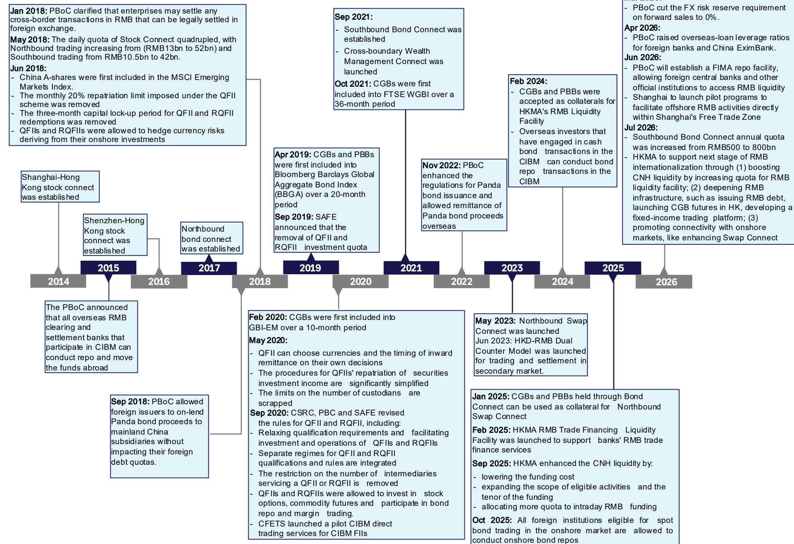

## 2026年7月：

- "南向债券通"年度额度从5000亿元提高至8000亿元。
- 香港金管局将通过以下方式支持人民币国际化的下一阶段：（1）通过提高人民币流动性安排额度来增加离岸人民币流动性；（2）深化人民币基础设施，例如发行人民币债券、在香港推出中国国债期货、发展固定收益交易平台；（3）促进与在岸市场的互联互通，例如优化"互换通"。

2023年5月：北向"互换通"正式上线。
2023年6月：港币-人民币双柜台模式推出，用于二级市场交易和结算。

2025年1月：通过"债券通"持有的中国国债和政策性银行债可作为北向"互换通"的抵押品。

2025年2月：香港金管局推出人民币贸易融资流动资金安排，以支持银行的人民币贸易融资服务。

2025年9月：香港金管局通过以下方式增强离岸人民币流动性：
- 降低融资成本。
- 扩大合格活动范围和融资期限。
- 增加日内人民币融资额度。

2025年10月：所有有资格在在岸市场进行即期债券交易的外国机构，均被允许进行在岸债券回购。

政策立场已从审慎转向明确。中国"十五五"规划（2026-2030年）将人民币国际化提升为战略重点，去掉了此前"审慎"的表述。在全球去美元化趋势下，这一政策转向得到了2026年初一系列快速而具体的行动支持。

中国人民银行已采取措施提升流动性并放松管制，包括降低外汇风险准备金要求、统一贷款额度、提高贷款杠杆率以支持熊猫债市场。它还设立了面向外国央行的FIMA回购安排，并显著扩大了"南向债券通"，将其额度提高至8000亿元人民币，同时将范围扩展至澳门和港币计价资产。

与此同时，香港当局正积极支持这一进程，将其人民币流动性安排增加至5000亿元人民币，延长其期限，推出中国国债期货，并实现人民币与印尼盾的直接交易。

进展并不均衡。尽管官方对人民币国际化的承诺是坚定的——中国人民币跨境支付系统（CIPS）的交易量创下纪录即为明证——但进展仍不均衡。人民币在中国货物贸易结算中的占比已从2019年的13%跃升至2025年的约30%。然而，该货币在全球范围内的足迹仍然有限，在全球支付、外汇储备和债务证券中的份额仅约1-4%。这与约占全球GDP 19%的中国经济规模相比显得不成比例，表明人民币作为全球融资货币的角色仍有巨大的增长空间。

重心已从贸易转向投资流动。跨境人民币使用的性质已发生根本性变化。虽然总交易量已飙升至70万亿元人民币，但关键的变化在于构成。资本和金融账户交易现在约占人民币结算总额的75%，标志着从贸易到投资作为主要引擎的决定性转变。

这一转变意味着下一阶段需要一个更深入的金融生态系统。重点必须放在创建更稳健的渠道上，以便筹集和部署人民币资本。这包括：通过在岸（熊猫债）和离岸（点心债）市场更方便地获取人民币融资，更复杂的对冲工具，以及为全球投资组合提供更广泛的有吸引力的人民币计价资产（如离岸点心债）。

美元在储备中的份额下降表明去美元化进程持续
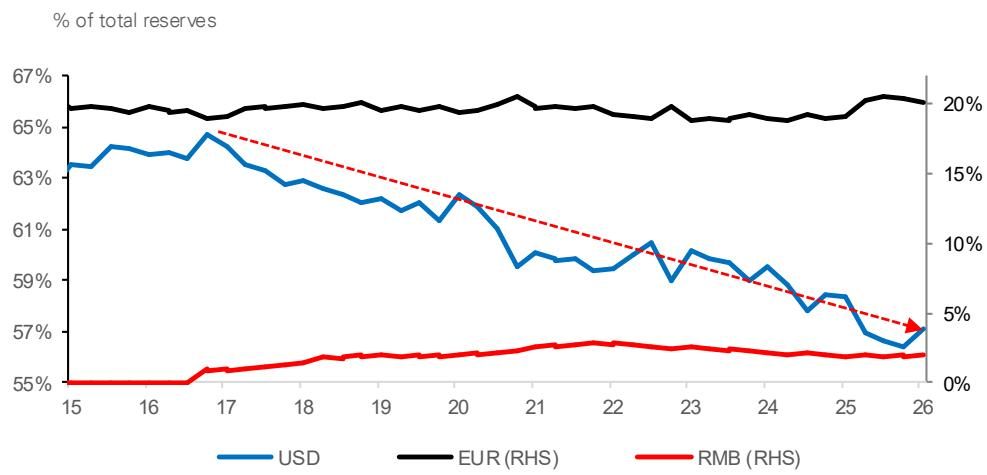

通过CIPS进行的人民币交易创历史新高
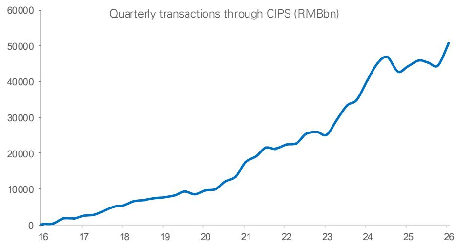

人民币在贸易结算中的使用更加活跃
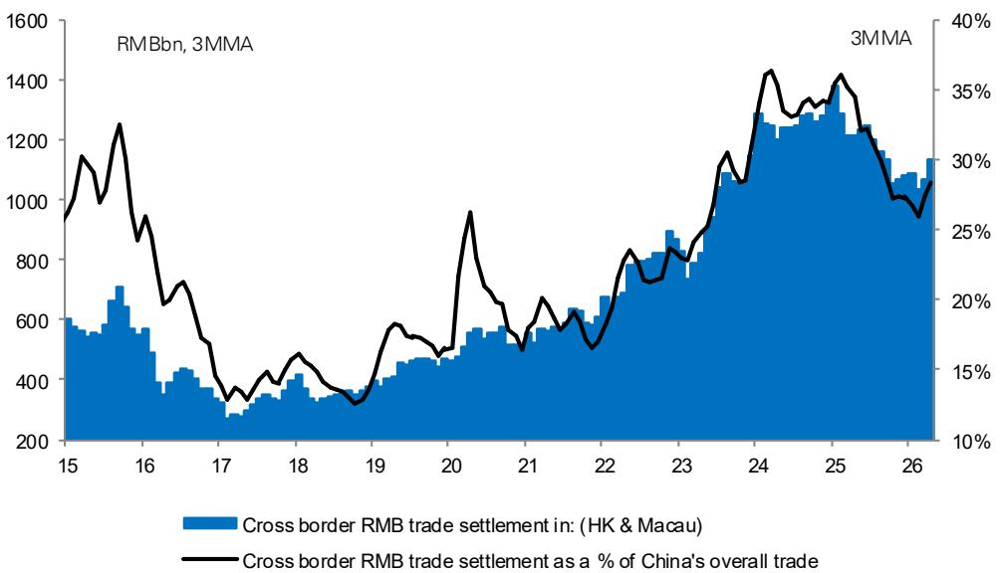

人民币计价债务发行显著增加，尤其是在中国推动发展熊猫债和点心债市场的情况下
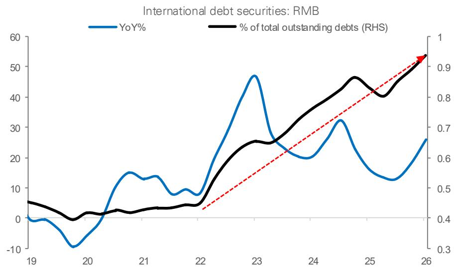

自我们2025年关于点心债和熊猫债市场的入门报告以来，这两个市场已进入一个更具活力的新篇章。变化的步伐已经加快，每个市场的特征开始以重要的方式分化。具体如何？

首先，在不同的轨道上加速。在岸熊猫债市场正经历创纪录的一年，发行量激增。仅在2026年上半年，发行量就超过了1600亿元人民币，年增长率超过60%。这一繁荣不仅仅是由低融资成本驱动的，更是市场架构根本性改善的直接结果。

简化的发行程序——例如统一的监管框架和储架注册制度——使这一过程感觉更像一个主流的融资市场。关键的是，更灵活的资金规则允许发行人在没有太多操作障碍的情况下将募集资金汇往境外，将熊猫债从一个受限制的在岸货币池转变为可全球使用的人民币融资工具。这种灵活性，加上总发行量的明显上升趋势，标志着市场进入了一个新的成熟阶段。

相比之下，离岸点心债市场的强劲增长是由多元化驱动的。随着内地保险公司通过"南向债券通"获得准入，以及额度从5000亿元人民币扩大到8000亿元人民币，该市场有望获得显著提振，为日益由外资主导的发行人基础创造了新的需求来源。

其次，发展出截然不同的市场"基因"。虽然这两个市场对人民币国际化都至关重要，但它们正以独特的特征演变：

发行人基础——熊猫债保持传统，点心债拥抱科技。熊猫债市场仍由金融业和其他传统行业主导。然而，点心债市场显示出明显的多元化趋势。信息技术行业的发行量急剧上升，成为市场中一个可见且不断增长的部分，而这在熊猫债领域几乎不存在。这一激增是由多种因素共同推动的：中国科技巨头正在寻求廉价、长期限的离岸人民币融资，以资助其大规模的人工智能和云资本支出周期。点心债市场满足了这一需求，提供了与其投资期限相匹配的低借贷成本和更长的久期，同时利用了读者对高等级离岸人民币信用的强劲需求。

期限结构。熊猫债保持短期，点心债期限延长。这两个市场在不同的时间范围内运作。熊猫债市场 overwhelmingly 是短期的，今年迄今几乎所有发行的期限都在3年或更短。这并非由于监管上限，而是反映了在岸市场的结构：需求集中在短端，由管理短期资产的银行主导。由于历史上平坦的回报表现曲线提供的额外收益（期限溢价）有限，发行人或读者缺乏发行或购买更长期限债券的动力。

相反，点心债市场显示出明显的成熟迹象，发行期限呈明显延长趋势，5年及以上期限的债券占比显著且不断增长。

点心债市场稳步增长，有望进一步深化

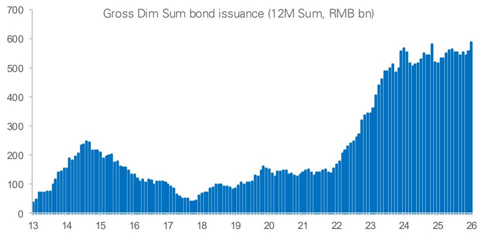

政策宽松释放熊猫债市场新增长阶段
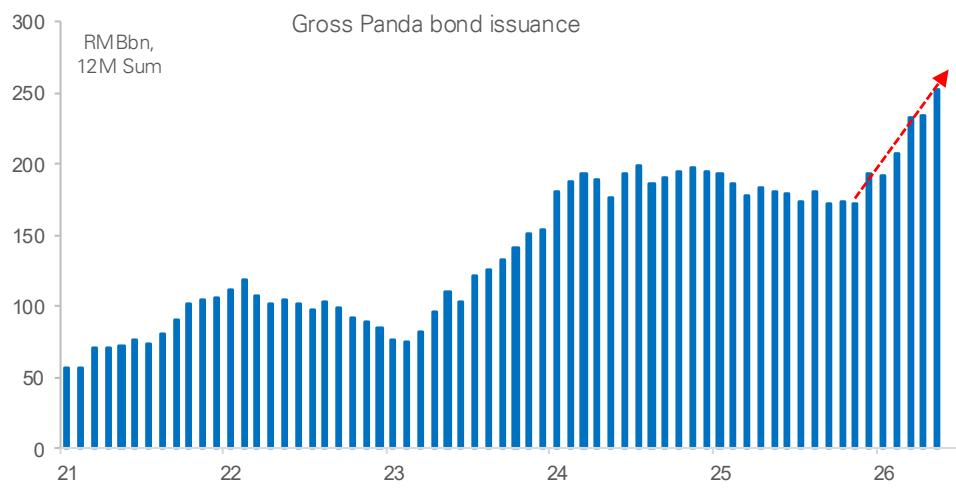

成为首选的离岸人民币枢纽，不仅对政府实体，也对公司
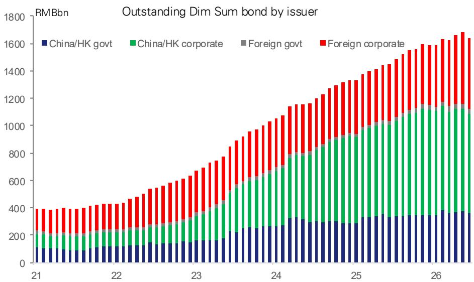

一个有望吸引更多外国发行人的混合市场
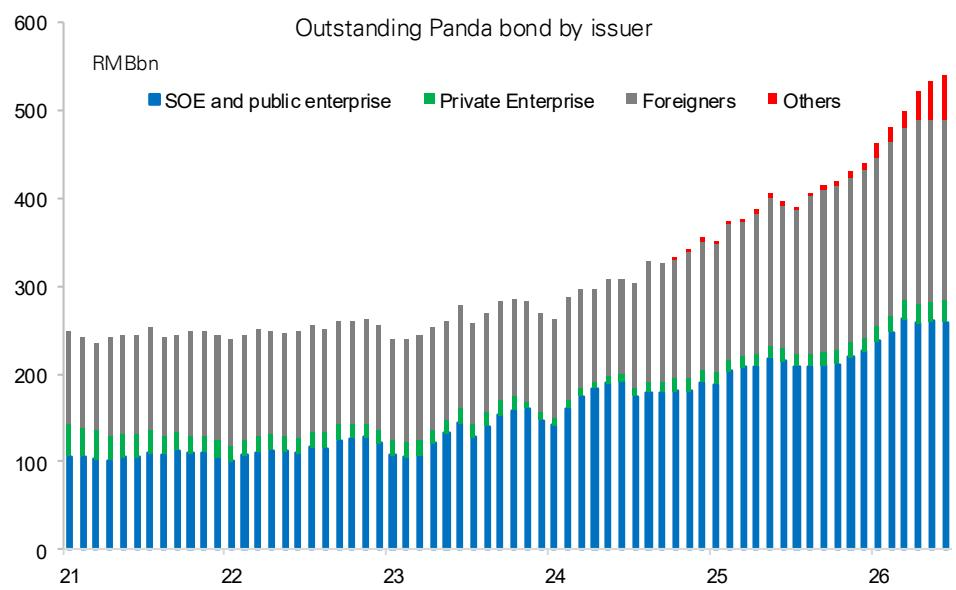
来源：DB、彭博财经有限合伙、CEIC、Haver、万得

国际化深化，外国发行人占据主导地位

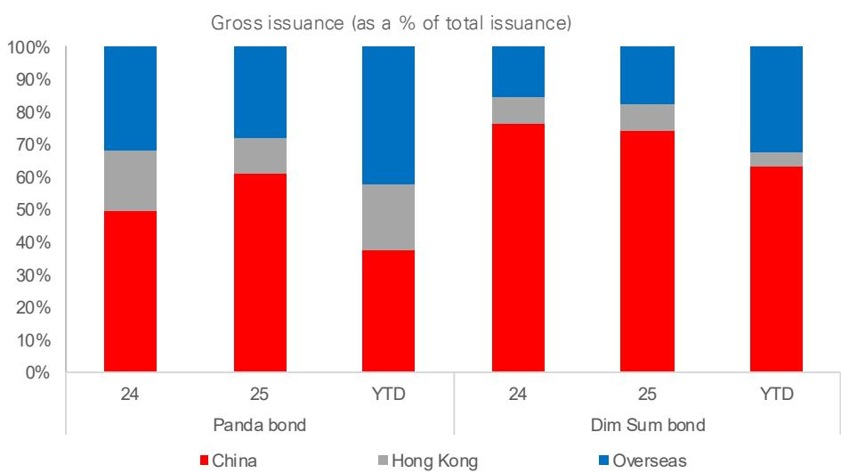
点心债向科技领域多元化，标志着向新经济融资的转变

金融业铺平道路，为更广泛的企业使用奠定基础
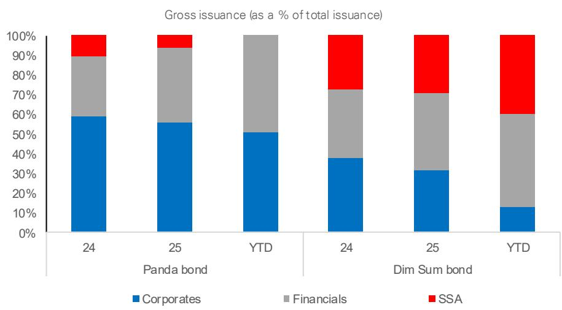

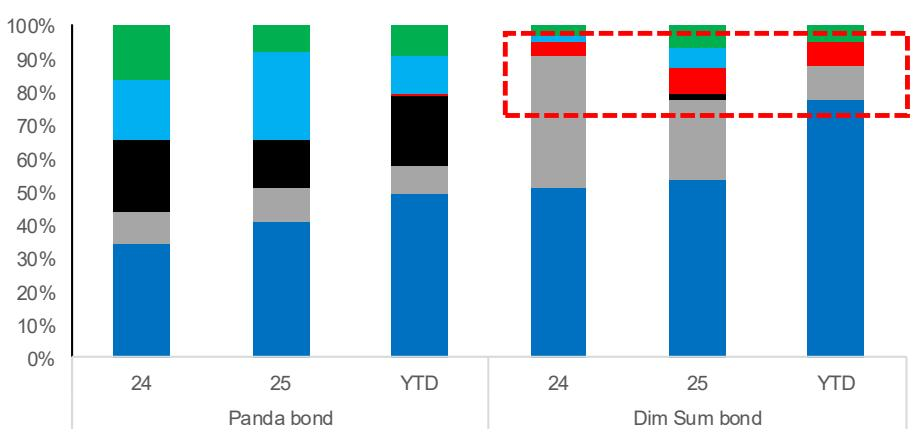
■金融业 ■工业 ■日常消费 ■信息技术 ■公用事业 ■其他

点心债期限延长趋于成熟，而熊猫债仍聚焦短期
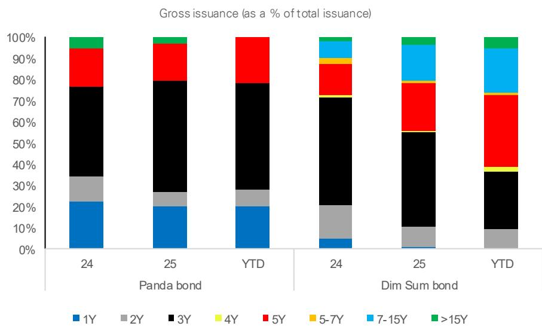

熊猫债市场显示出明显的成熟迹象，即使在融资成本优势收窄的情况下，净发行量仍保持韧性正值。这表明市场越来越将熊猫债市场视为一种战略性融资工具。这一转变是由供需两方面的结构性改善驱动的。在供给方面，三个关键趋势显而易见：

- **外国参与扩大。** 外国发行人已成为市场的基石，其发行占比从十年前的不到10%持续稳定在30%以上。尽管金融机构仍是核心发行人基础，但市场正在逐步多元化。

- **境外使用增加。** 发行人越来越多地将熊猫债用于境外融资。2026年至今，募集资金用于境外的比例已攀升至53%，较此前低于40%的水平显著增加。这是监管放松的直接结果，它将熊猫债从受限制的在岸工具转变为灵活、可全球使用的人民币融资。

- **持续的短期偏好。** 市场仍然高度集中于较短期限，3年及以下的发行占绝大多数。这反映了在岸读者基础仍主要关注回报表现曲线短端。

在需求方面，国内银行仍是新发行债券的主要吸收者。然而，今年外国买家的温和回归是一个积极信号，逆转了2025年的净卖出趋势。

发行量保持韧性，市场已超越成本节约阶段

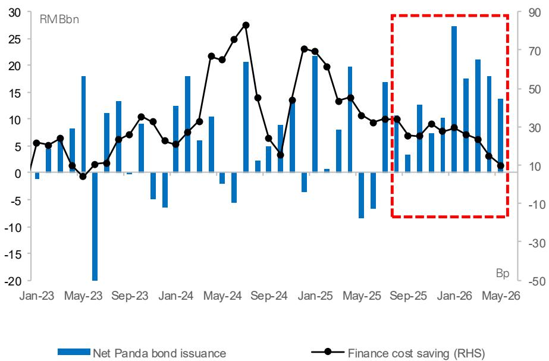
外国参与成为市场的基石

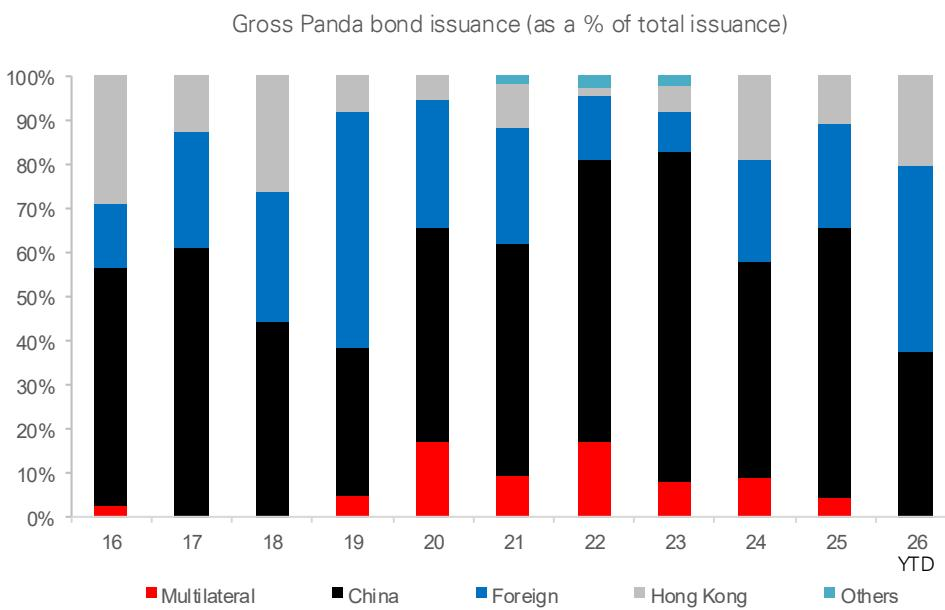
来源：DB、彭博财经有限合伙、CEIC、Haver、万得

在岸 离岸 其他 募集资金汇出境外比例（右轴）

金融业继续为更广泛的发行人增长铺平道路
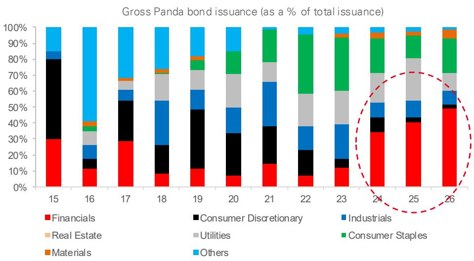

短期限仍占主导，凸显市场深化空间
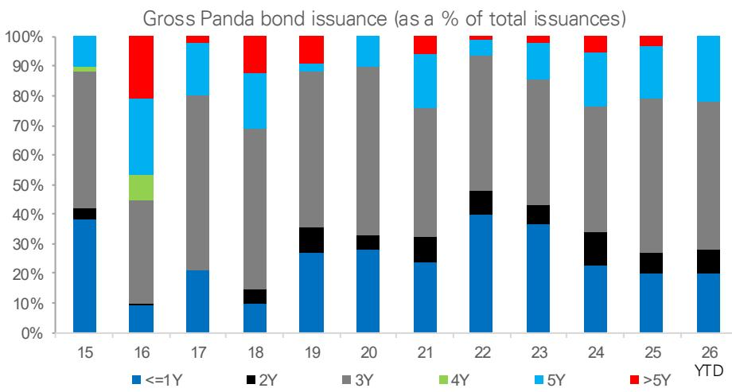

灵活性增加，境外使用成为常态
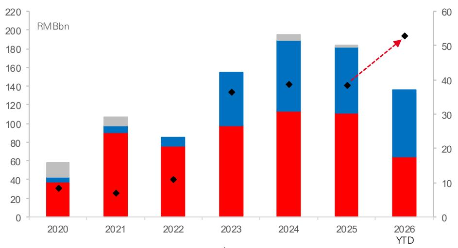

外国读者需求回归，预示着信心恢复
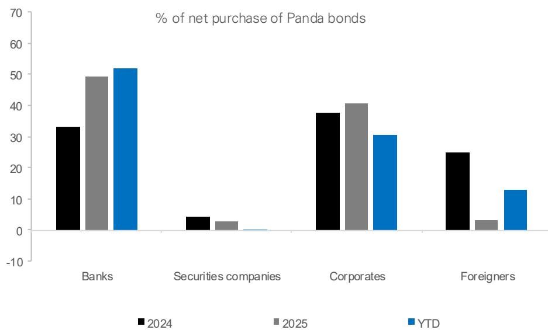
来源：DB、彭博财经有限合伙、CEIC、Haver、万得

在熊猫债演变为战略性工具的同时，离岸点心债市场也在描绘一条同样充满活力但截然不同的轨迹。重塑点心债市场的几个关键趋势：

- **外国发行人现在占据主导。** 外国实体已成为市场的基石。其总发行份额近年来已从不到15%攀升至超过25%。

- **科技取代房地产。** 在境内发行人中，出现了从"旧经济"向"新经济"的明显轮换。房地产曾主导发行，而科技/信息技术行业已异军突起成为主要驱动力，反映了中国不断增长的科技行业的资本需求。

- **发行期限正在延长。** 市场显示出明显的成熟迹象，发行人，尤其是外国发行人，越来越倾向于发行更长期限的债券。5年及以上期限的债券份额显著增长，一个15年以上的新兴市场开始出现，这表明读者信心增强，融资策略更加成熟。

- **支持性监管正在释放新需求。** 需求侧将迎来重大提振。近期的政策开放，例如允许内地寿险公司（2026年5月）通过"南向债券通"购买点心债，将释放大量新的资本池，为未来增长创造可持续的需求基础。此外，"南向债券通"额度增加至8000亿元人民币以及可购买产品范围的扩大也起到了推动作用。

外国参与成为市场的基石

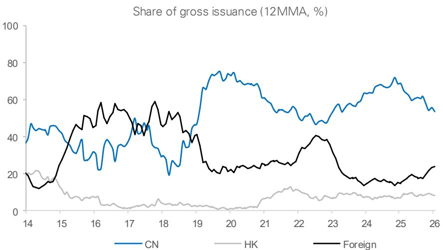
科技公司取代房地产相关板块成为境内发行人主力

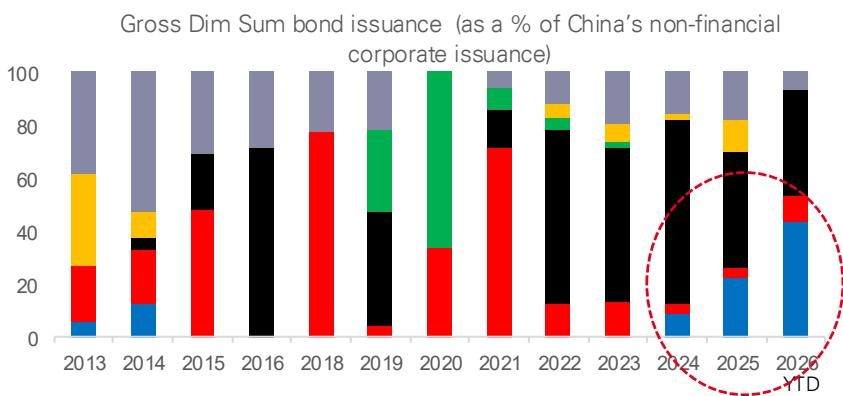
■ 科技/信息技术 ■ 房地产 ■ 建筑/工程 ■ 私募股权 ■ 能源/公用事业 ■ 其他

点心债发行期限延长...
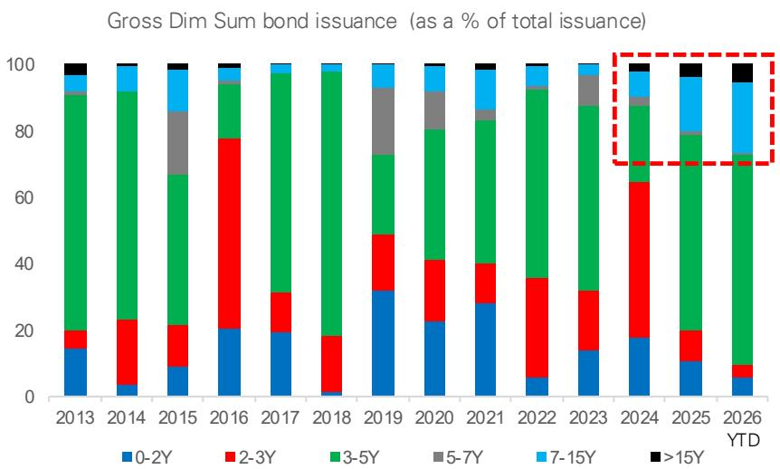

## ...由外国发行人引领

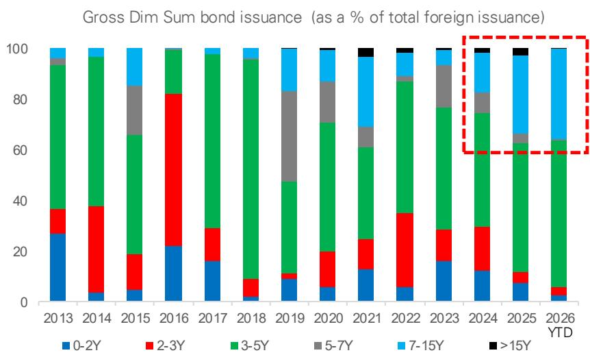

人民币债券主导香港债券市场
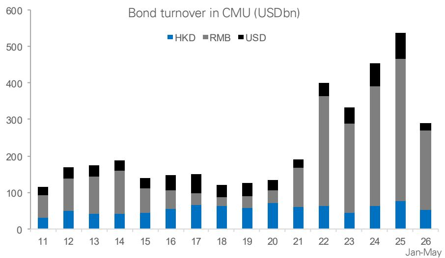

支持性的需求侧监管应支撑点心债需求
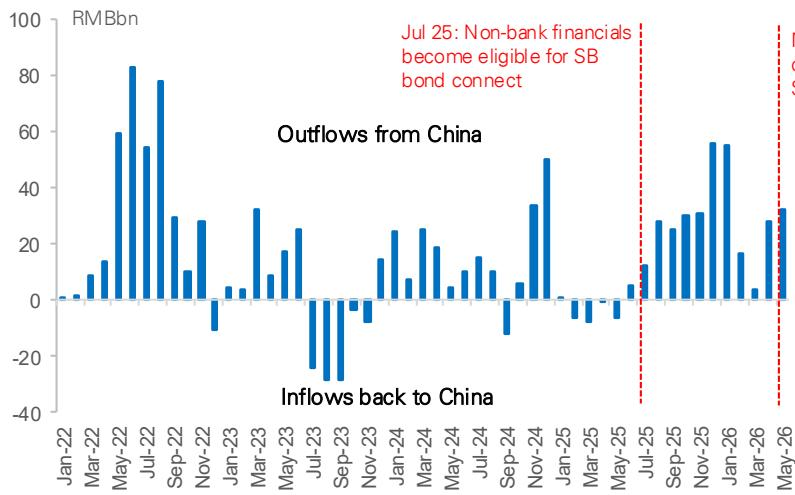
来源：DB、彭博财经有限合伙、CEIC、Haver、万得

未来五年，熊猫债和点心债市场将日益推动人民币资本市场和跨境人民币融资的成熟。虽然各自并非决定性因素，但它们共同扩大了可投资的人民币资产，深化了融资渠道，并连接了国内外读者池，从而培育了一个涵盖融资、投资和再配置的综合性人民币生态系统。

通过监管改革，中国的在岸市场对外国发行人变得更加可及。与此同时，香港正通过发展基准回报表现曲线、交易基础设施和市场互联互通，巩固其作为主要离岸人民币枢纽的角色。这些趋势增强了人民币作为融资和投资货币的使用，补充了其在贸易结算中日益增长的作用。

然而，进展仍面临不确定性，包括资本账户限制、离岸人民币流动性、读者参与、对冲市场发展以及更广泛的宏观环境和地缘政治格局。因此，熊猫债和点心债应被视为人民币国际化的关键基石。

## 熊猫债市场：从政策倡议到新兴融资渠道

熊猫债市场似乎正超越其早期发展阶段，日益成为国际发行人相关的融资渠道。历史上，熊猫债发行相对有限，集中于超国家机构和政策导向的借款人，而文件要求和资金使用限制制约了更广泛的参与。监管改革已逐步减少了这些障碍，允许更广泛的外国主权、金融机构和公司进入中国的国内债券市场。

近期的发行增长表明市场接受度在提高。发行人多样性有所改善，地域参与范围扩大，平均期限逐步延长。这些发展共同表明发行人和国内读者的信心都在增强。

我们预计，假设中国继续放宽熊猫债的操作障碍，未来几年熊猫债发行量将以3年平均增长率（每年20-30%）继续增长。这将推动年发行量从当前水平向2200亿元人民币迈进。

## 熊猫债市场：准入改善，但深度仍落后于发行

然而，持续增长不应被视为理所当然。市场发展最终取决于更广泛的宏观环境、发行人经济性以及对中国的金融市场改革的信心。

几项正在进行的改革可能会改善熊猫债市场的功能：

- **计划性发行。** 向注册制框架迈进以及对重复发行人的更简化处理，可能会降低发行成本并提高市场可及性。

- **产品多样性。** 绿色、可持续发展挂钩及其他类型的人民币债券结构的扩展，可以拓宽发行人基础并吸引新读者。

- **国际接轨。** 在文件标准、披露实践、定价透明度和分配流程方面的渐进式进展，可能会减少外国借款人的操作障碍。

如果这些趋势持续下去，熊猫债可能越来越像成熟的外国发行人本币债券市场，例如武士债市场，成为寻求人民币敞口的特定国际发行人的标准融资选择。

尽管如此，仍存在一些结构性制约因素：

- **读者集中。** 读者基础仍然严重偏向国内银行、外国银行在岸账户以及高质量非银行资产管理公司，限制了二级市场换手率和价格发现。

- **长期限发展有限。** 更长期限的发行仍然相对稀缺，制约了为外国发行人建立更深入的人民币信用曲线。

- **操作复杂性。** 尽管发行已变得更高效，但文件、会计、语言和监管要求仍比成熟的美元和欧元债券市场更为繁琐。

- **对冲和流动性。** 中国的回购、衍生品和对冲基础设施已有显著改善，但跨货币对冲工具和二级流动性仍不如主要债券市场甚至离岸人民币市场发达。例如，尽管外汇对冲相对更发达——人民币在全球场外外汇衍生品交易中的份额从2010年的1.0%上升至2025年的8.1%——但利率对冲尚不完善。根据国际清算银行的数据，2025年人民币在全球场外利率衍生品交易中的份额仅为0.8%。利率互换流动性集中在短端和5年期。离岸读者只能有限地使用中国国债期货。这些因素制约了离岸读者对冲更长期限久期风险的能力。

当局可以通过以下方式提供支持：（1）鼓励寿险公司将合格的熊猫债作为标准可接受资产类别持有，并为合格的主权、超国家、政策相关和高等级熊猫债发行人建立具有优惠或至少明确规定的分层资本框架；（2）促进更长期限的发行；（3）使熊猫债发行向国际规范标准化（例如，减少对经验丰富的发行人的重复法律/文件要求）。

## 点心债市场：加强离岸人民币生态系统

点心债市场正进入一个新的发展阶段。政策制定者似乎越来越关注加强其作为中央离岸人民币基准和流动性中心的角色，而不仅仅是作为一个象征性的离岸人民币市场。增加多种期限的人民币计价政府和准主权证券的发行，可以改善基准曲线构建，并支持人民币资产更有效的定价。

与此同时，针对市场基础设施、二级市场流动性和离岸人民币生态系统发展的政策举措，巩固了香港作为人民币融资和投资主要离岸中心的地位。

## 关键发展领域：

- **曲线形成。** 跨期限的更定期发行日历将为读者提供更清晰的定价参考，并促进相对价值分析、投资组合构建和风险管理。

- **流动性和价格发现。** 改进的交易基础设施、融资市场和基准发行可以提高市场效率，并支持更广泛的机构参与。

- **读者多元化。** 扩大保险公司、资产管理公司、养老基金和国际机构的参与，可以改善流动性并减少对狭窄读者基础的依赖。

- **基础设施扩展。** 对"债券通"、衍生品市场、结算系统和交易平台的增强，可以加强香港在更广泛的离岸人民币生态系统中的作用。此外，为巩固香港作为领先离岸人民币数字债券枢纽的地位，香港政府正考虑将人民币债券代币化。

## 制约因素

尽管前景有所改善，但点心债市场的历史表明，增长并非总是线性的。此前，快速扩张期之后曾出现过离岸人民币流动性收紧或读者需求减弱导致的长期收缩期。未来的增长仍将对以下因素敏感：

- 离岸人民币流动性状况；
- 人民币预期；
- 相对融资成本；
- 香港和内地当局的政策支持。

因此，市场的长期成功不仅取决于发行量的增长（3年平均年增长率30%），还取决于创建一个深度、流动且可持续的离岸人民币投资生态系统。

## 熊猫债和点心债：人民币国际化的两个组成部分

熊猫债和点心债对人民币国际化至关重要，不仅在于它们的发行量，更在于它们将人民币余额转化为可投资和可对冲的金融资产的作用。点心债扩大了离岸人民币资产池，而熊猫债则为外国借款人提供了进入在岸人民币融资的渠道。两者共同促进了人民币从贸易结算货币向更广泛的融资和投资货币的转变。

重要的是要将这一过程与实现储备货币地位区分开来。虽然债券市场工具有助于货币国际化，但更广泛的因素——包括资本账户开放、制度信心、法律确定性、市场流动性和宏观环境稳定——同样至关重要。

## 来自武士债市场的启示

武士债市场提供了一个有用的历史比较。武士债——非居民借款人在日本发行的日元计价债券——通过扩大日元计价资产的范围、将外国发行人融入日本国内资本市场以及鼓励日元在融资和投资中的更广泛使用，支持了日元的国际化。

通过提供一个公认的框架，使借款人能够筹集日元，读者能够持有日元计价资产，武士债市场为日元发展成为国际金融货币做出了贡献。熊猫债和点心债旨在通过创建渠道，使外国发行人和全球读者能够借入、投资和持有人民币敞口，从而为人民币发挥类似功能。然而，这一比较也突出了一个重要的局限性。日本的经验表明，仅靠债券市场发展并不能保证储备货币地位。深度和流动性的资本市场是货币国际化的必要组成部分，但它们只是更广泛的金融和制度框架中的一个要素。

## 加强人民币国际化的基础

对于人民币而言，进展将继续受到资本账户政策、在岸-离岸一体化、市场流动性、读者参与以及风险管理和对冲工具的持续发展等因素的影响。未来五年最可能的路径是渐进式而非变革性的变化。熊猫债和点心债正日益成为人民币资本市场发展的重要支柱，并可能扩大可投资人民币资产的存量，深化跨境人民币融资渠道，并改善人民币市场流动性。

其战略逻辑是直接的：随着贸易结算和金融活动产生人民币余额，读者和发行人需要流动性的人民币资产来进行投资和交易。熊猫债和点心债直接有助于满足这一需求。虽然它们的发展本身不会决定人民币未来的国际角色，但它们代表了一种重要机制，通过这种机制，人民币可以逐步从一种交易货币演变为一种更广泛地被用于融资、投资和持有的国际货币。

人民币
供给

长期流动性：经常账户 金融账户

中国人民银行-香港金管局常设安排：人民币流动性安排 主要流动性安排 人民币业务安排

离岸人民币
生态系统

曲线基准

货币市场基础设施

利率互换、货币互换、外汇市场

离岸人民币资产

点心债

货币市场产品（例如中国人民银行票据）

贸易融资和贷款

离岸人民币股票和基金

离岸人民币衍生品

互联互通机制

直接投资、贷款

## 熊猫债二级市场换手率仍然有限...

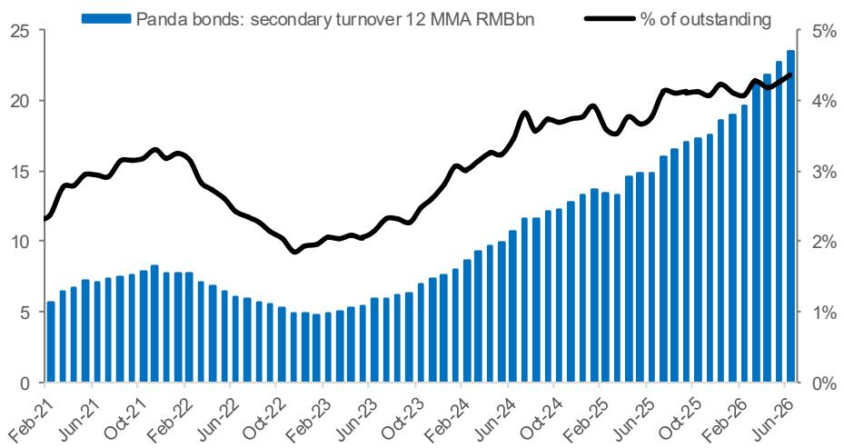
人民币占全球场外利率衍生品交易量的比例不到1%

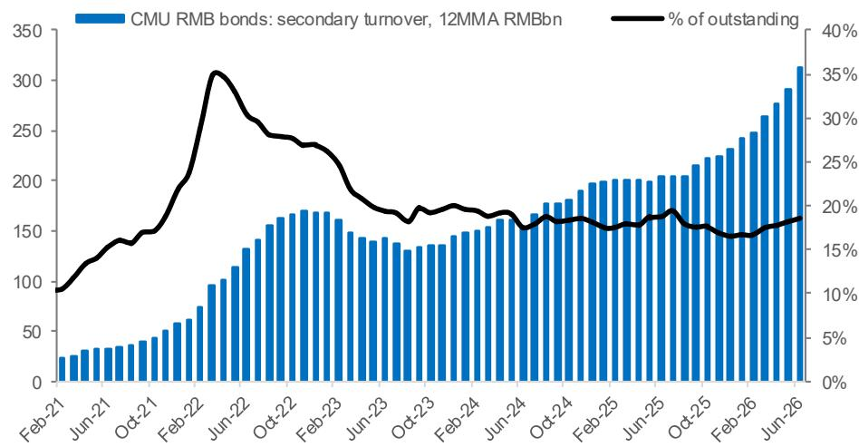
场外利率衍生品交易量，按货币划分（占总交易量的百分比）

## ...点心债亦然

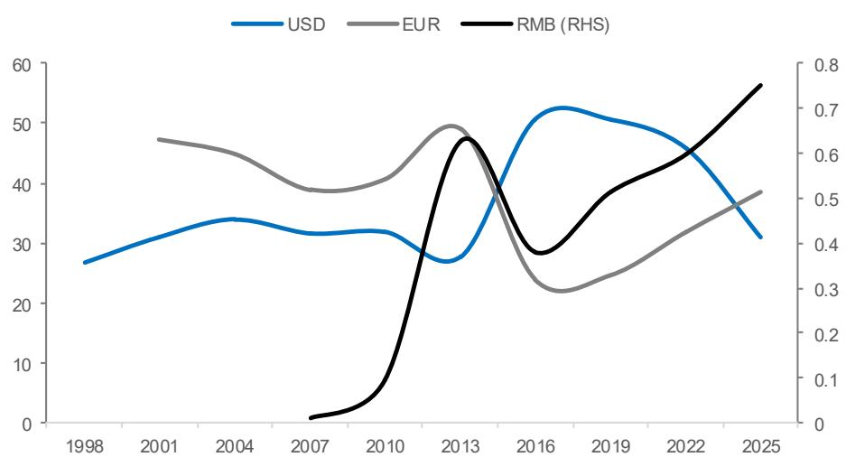

武士债的关键启示：成功的离岸债券市场建立在生态系统之上，而非仅仅发行量

<table><tr><td></td><td colspan="2">武士债</td><td colspan="2">点心债与熊猫债</td></tr><tr><td></td><td>时间</td><td>关键政策/里程碑</td><td>时间</td><td>关键政策/里程碑</td></tr><tr><td>第一阶段：市场创建</td><td>1970年</td><td>亚洲开发银行成为首个武士债发行人；市场向超国家机构和主权级借款人开放。</td><td>2005-2007年</td><td>国际金融公司/亚洲开发银行发行首批熊猫债；国家开发银行发行首批点心债</td></tr><tr><td>第二阶段：发行人自由化</td><td>1978-1998年</td><td>公司武士债发行始于1979年。通过1980-90年代逐步放宽发行人资格和评级要求，1990年代扩大了资金使用限制。</td><td>2010年至今</td><td>自2010年起允许熊猫债募集资金汇出境外。外国主权和公司自2015年起更积极地发行，发行程序和资金使用规则随时间逐步简化。</td></tr><tr><td>第三阶段：市场制度化</td><td>1980年起</td><td>武士债受到日本庞大的国内储蓄池的欢迎。然而，外国所有权持续低于10%。</td><td>2023年至今</td><td>通过2026年的"南向债券通"，读者基础正在扩大。然而，对海外读者的吸引力仍然有限。</td></tr><tr><td>第四阶段：成熟与衰退</td><td>1990年代末</td><td>随着日元更广泛的国际角色减弱以及日本金融市场的相对全球重要性下降，武士债发行量减少。</td><td>2026年+</td><td>关键挑战是构建一个完整的人民币融资生态系统，而非仅仅推广单一工具。</td></tr></table>

我们预计，随着人民币国际化的推进，离岸人民币市场将变得更加流动。不断增长的离岸人民币存量将为离岸人民币市场提供更大、更稳定的流动性池。同时，旨在扩大离岸人民币资产类别和风险管理工具的政策举措，应能改善离岸人民币的循环，支持更深入、更高效的利率、融资和外汇市场。在此背景下，离岸人民币生态系统可能出现有意义的进展，尤其是在离岸人民币政府债券、利率互换、货币互换和外汇掉期市场。

- **离岸人民币中国国债：** 更大、更具流动性的离岸人民币政府债券市场应有助于发展更完整的离岸人民币回报表现曲线。目前，未偿还的离岸中国政府债券仅占在岸市场的不到1%。更大的发行量和改善的二级市场流动性将加强价格锚定，并为离岸人民币固定收益产品建立更稳健的基准曲线。

- **人民币外汇波动率：** 人民币波动率按国际标准衡量仍然异常低。随着中国继续开放其资本账户并推进人民币国际化，该货币可能会以更大的双向风险和更少的政策压制进行交易，使波动率更接近其他主要国际货币的水平。鉴于中国在区域贸易和金融流动中的主导地位，更由市场驱动的人民币可能会对整个亚洲产生溢出效应，可能更广泛地提升亚洲新兴市场外汇的波动率。

未偿还离岸人民币中国国债占在岸市场的比例不到1%

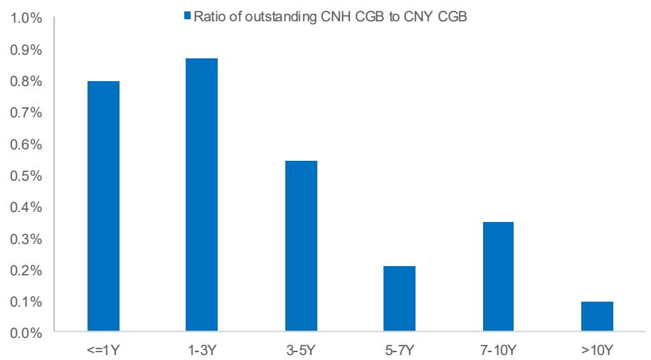

人民币波动率上升可能提升亚洲外汇市场的波动率
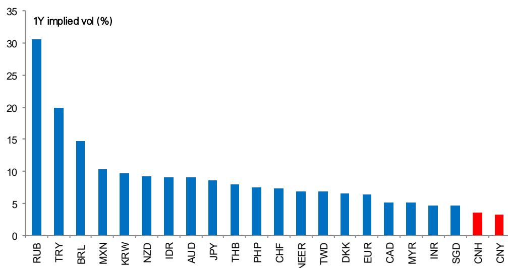
来源：DB、彭博财经有限合伙、CEIC、Haver、万得

- **离岸人民币利率互换：** 如果香港的离岸人民币流动性继续扩大，同时离岸人民币债券和贷款市场进一步发展，离岸人民币利率互换市场可能变得更具流动性和相关性。香港金管局和中国人民银行流动性安排的扩大，加上跨境回购准入，应能降低离岸人民币融资挤压的频率，并提高离岸人民币基准定价的可靠性。随着更多离岸人民币债券和贷款的发行，自然对冲需求将支持更高的利率互换交易量、更窄的买卖价差和更长的可交易期限。随着时间的推移，在岸和离岸人民币市场之间更大的整合应能促进离岸人民币和境内人民币利率曲线的趋同，使离岸人民币利率互换演变为更可信的人民币利率风险对冲工具，并成为人民币国际化的关键组成部分。

- **境内人民币利率互换：** 持续推进的人民币国际化应鼓励离岸读者通过"互换通"进入在岸境内人民币利率互换市场，而更深入的离岸人民币融资和抵押品市场则从香港支持这些头寸。随着离岸读者积累更多的中国国债、点心债和人民币资产，使用在岸境内人民币利率互换对冲人民币久期风险的需求可能会增加，从而巩固香港作为人民币风险管理门户的角色。改善的离岸人民币融资条件和更广泛的离岸人民币抵押品接受度可以提高保证金效率并降低进入在岸互换的成本，支持通过香港进行更大规模和更稳定的境内人民币利率互换活动。随着时间的推移，更深的离岸人民币流动性应能加强离岸人民币融资市场、"债券通"回报表现和在岸境内人民币利率互换曲线之间的联系。尽管在岸和离岸市场可能仍将保持区别，但更大的互联互通应能减少离岸人民币市场与在岸人民币利率之间大规模错位的频率和持续性。

- **货币互换：** 短期内，我们预计离岸人民币货币互换曲线将进一步平坦化。点心债发行的快速增长，加上发行期限的持续延长，应会增加曲线长端的接收需求。随着时间的推移，更深入的货币互换市场应能降低跨货币融资成本，并支持人民币在国际融资中日益增长的作用。长期限货币互换（10年及以上）的动态也可能因人民币国际化通过熊猫债、点心债和人民币计价跨境贷款而变得更加活跃。

- **外汇掉期：** 随着离岸人民币流动性池的扩大，我们预计离岸人民币外汇掉期市场将变得更深、更高效。离岸人民币外汇掉期的买卖价差仍明显宽于在岸市场，反映了离岸人民币融资的深度相对有限。更大的离岸人民币流动性应能缩小交易成本，改善市场深度，降低融资波动性，并加强离岸与在岸人民币市场之间的定价趋同。

离岸人民币存款持续增长，应为更深入、更具流动性的离岸人民币市场奠定基础

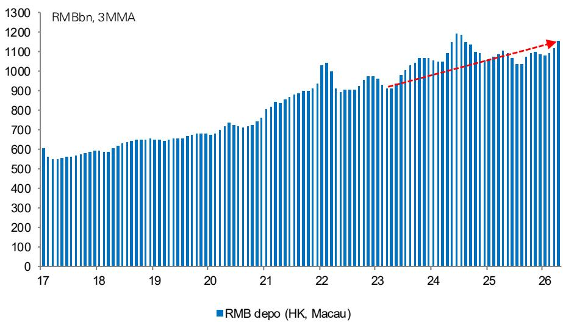

离岸人民币融资成本波动性可能变得更加稳定
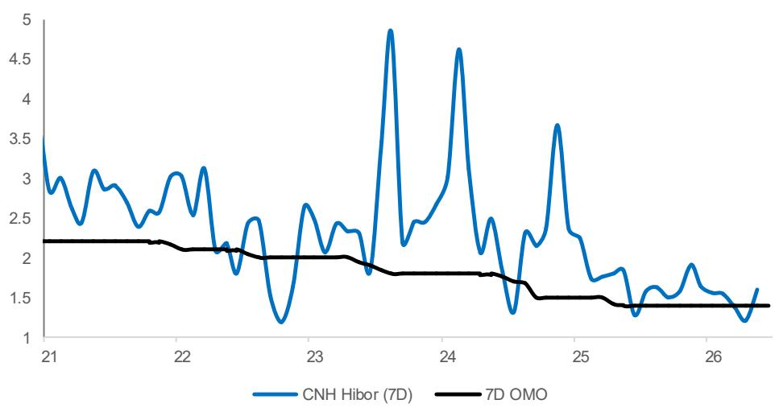

人民币债券扩张背景下，离岸人民币货币互换曲线将进一步平坦化
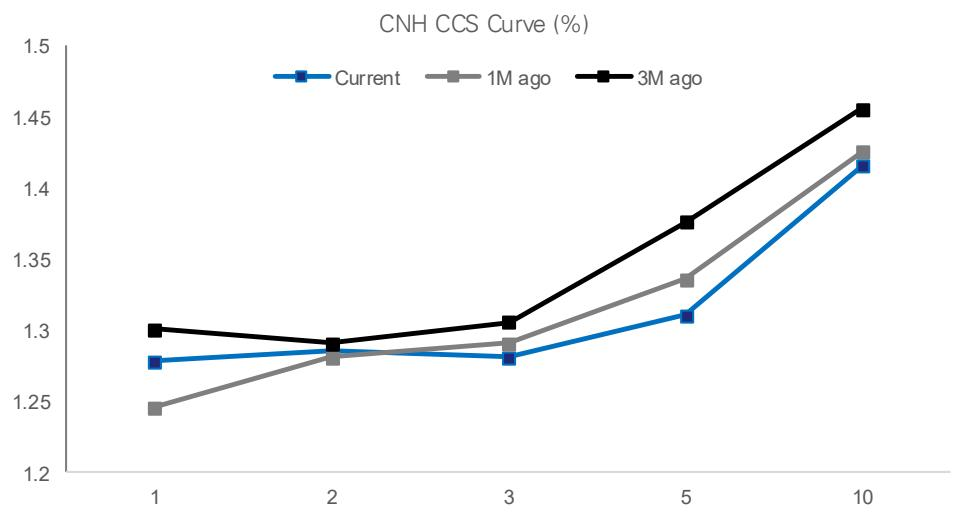

流动性扩大应能缩小离岸外汇掉期交易成本
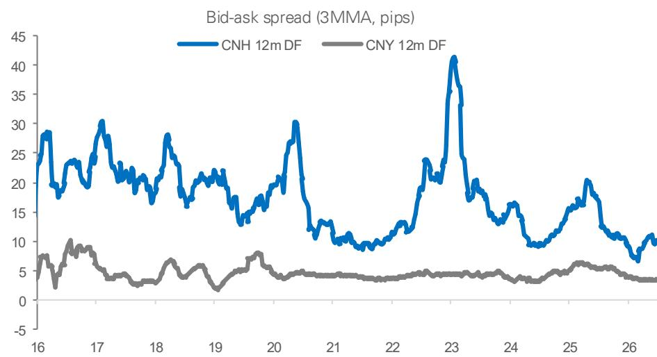
来源：DB、彭博财经有限合伙、CEIC、Haver、万得

欧洲实体是人民币债券市场的主要参与者，占外国熊猫债发行量的一半以上和点心债的三分之一。然而，发行人基础高度集中，金融机构占主导地位（85-95%），重复借款人占活动的90%以上。关键挑战在于吸引新发行人，而非留住现有发行人。

主要障碍包括：与主要市场相比，单笔发行规模较小，读者基础较窄，以及市场熟悉度不足。这些因素常常使得在人民币融资基础设施、文件和读者关系方面的前期投入在经济上不可行。

展望未来，我们预计这些障碍将随着人民币国际化而缓解。更深入的离岸人民币生态系统将支持更大的基准发行，拓宽读者基础，并改善流动性。离岸人民币衍生品市场的进一步发展将简化货币风险对冲和人民币收益互换。此外，中国的低利率以及与中国相关的业务敞口增长，可能会增强人民币融资对国际公司的吸引力。随着成本效益方程的改善，我们预计未来的市场发展将由更广泛的国际发行人，特别是欧洲公司推动，而非现有借款人的更大规模发行。

欧盟发行人在外国人民币债券发行中占很大份额...
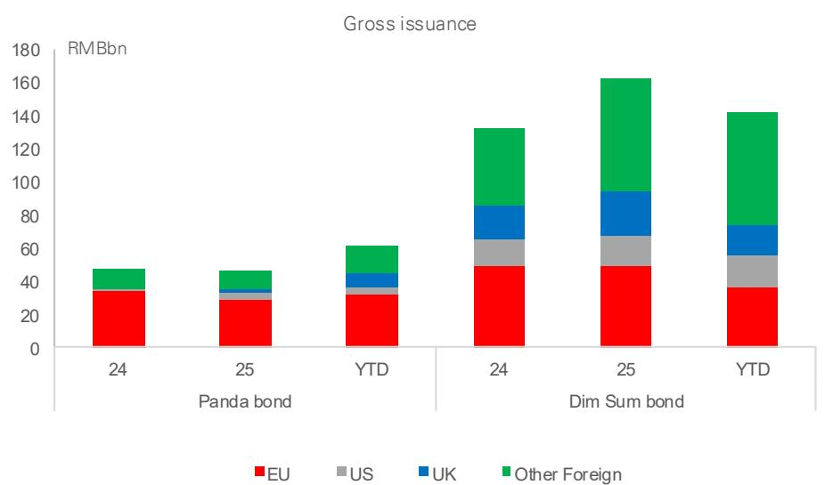
...但发行 overwhelmingly 集中在金融机构

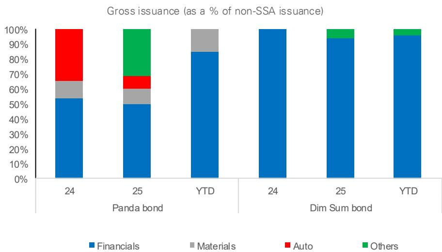

欧盟人民币债券发行仍由重复借款人主导

![](images/85e6280052280bb7ef6ea4706e4aa4c0f9ae0ed17e24d6da999
