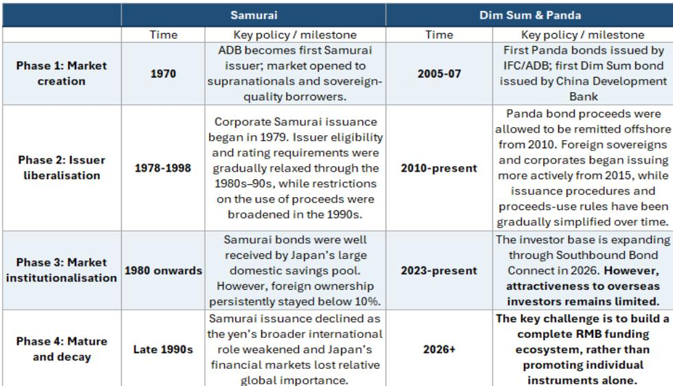

# The Panda and Dim Sum Bond Markets Are No Longer Just Funding Channels—They Are Becoming the Structural Engines of RMB Internationalization

The 15th Five-Year Plan (2026-2030) marks a decisive break with China's historically cautious approach to currency internationalization. For the first time, RMB internationalization is an explicit strategic priority, backed by a rapid sequence of concrete actions in early 2026: the reduction of FX risk reserve requirements, the establishment of a FIMA repo facility for foreign central banks, and a 60% increase in the Southbound Bond Connect quota to RMB 800 billion. These are not incremental tweaks. They represent a coordinated policy push to transform the RMB from a trade settlement currency into a genuine global financing and reserve currency.

Yet the gap between ambition and reality remains stark. China accounts for roughly 19% of global GDP, yet the RMB holds only 1-4% of global payments, FX reserves, and debt securities. The currency's global footprint is disproportionately small. The critical insight from the latest market data, however, is that the center of gravity has already shifted. Capital and financial account transactions now constitute approximately 75% of total RMB settlements, up from a trade-dominated composition just a few years ago. The engine of RMB internationalization is no longer trade—it is investment.

This shift places the Panda and Dim Sum bond markets at the center of the next phase. These two markets are evolving into a dual-engine system, each playing a distinct and complementary role in building the financial infrastructure that RMB internationalization demands. Understanding their diverging trajectories is not a niche analytical exercise. It is the key to understanding where the opportunities and constraints lie for global investors, corporate treasurers, and sovereign wealth managers over the next five years.

## The Panda Bond Market Has Matured Beyond Cost Arbitrage into a Strategic Global RMB Funding Tool

The Panda bond market's recent performance is not a cyclical spike. In the first half of 2026, issuance exceeded RMB 160 billion, representing year-on-year growth of over 60%. But the more telling statistic is that net issuance has remained resiliently positive even as the financing cost advantage over other markets has narrowed. This is the signature of a market that has moved beyond opportunistic cost arbitrage and into structural demand.

Three structural changes explain this shift. First, foreign issuers have become a cornerstone, consistently accounting for over 30% of issuance, up from less than 10% a decade ago. Second, and more important, the proportion of proceeds repatriated for offshore use has climbed to 53% in 2026 year-to-date, a sharp increase from the sub-40% levels of prior years. Regulatory easing has transformed Panda bonds from a ring-fenced onshore instrument into flexible, globally deployable RMB funding. Third, streamlined issuance procedures—unified regulatory oversight and shelf registration frameworks—have made the process feel like a mainstream funding market rather than a specialized channel.

The strategic implication is clear: Panda bonds are no longer just a cheaper way to raise onshore RMB. They are becoming a primary vehicle for non-Chinese entities to access global RMB liquidity. For a European corporate or a multilateral development bank, issuing a Panda bond today is not merely a China market play. It is a way to tap a growing pool of RMB that can be used anywhere in the world.

## The Dim Sum Market Is Diversifying in Issuer Composition and Tenor Structure, Signaling a Maturing Offshore Hub

While Panda bonds are evolving into a strategic funding tool, the offshore Dim Sum market is charting a distinctly different course. Its growth story is one of diversification, not just volume. Foreign entities now account for over 25% of gross issuance, up from less than 15% in recent years. Among domestic issuers, there has been a clear rotation from real estate to information technology. The IT sector's share has surged as Chinese tech giants seek cheap, long-tenor CNH funding to finance massive AI and cloud capital expenditure cycles. This is a structural shift from old-economy to new-economy funding.

Equally significant is the extension of issuance tenors. The Dim Sum market is showing clear signs of maturity, with a growing share of bonds in the 5-year and longer categories. A nascent market for bonds with tenors exceeding 15 years is beginning to emerge. This is not happening in the Panda market, where nearly all issuance remains concentrated in tenors of 3 years or less. The difference reflects a fundamental divergence in investor base and market structure. The onshore Panda market is dominated by banks managing short-term assets on a flat yield curve that offers little term premium. The offshore Dim Sum market, by contrast, benefits from a more diversified investor base that includes asset managers, insurers, and sovereign wealth funds with longer time horizons.

The demand side is about to receive a major structural boost. Recent policy liberalization allowing mainland insurers to purchase Dim Sum bonds via the Southbound Bond Connect, combined with the quota increase to RMB 800 billion, is set to unlock significant new pools of capital. This creates a self-reinforcing dynamic: a deeper demand base supports longer-dated issuance, which in turn attracts more sophisticated issuers and investors.

## The Divergence Between Panda and Dim Sum Markets Creates a Complementary Dual-Engine System, Not a Competitive One

The temptation is to view these two markets as competing for the same issuance and investor flows. That would be a mistake. Their diverging characteristics are creating a complementary system that serves different functions in the RMB internationalization architecture.

The Panda market is evolving into the primary channel for raising global RMB funding. Its strength lies in its scale, its streamlined regulatory framework, and its ability to provide issuers with flexible, offshore-usable proceeds. Its weakness is its short-term focus and its dominance by financial sector borrowers. The Dim Sum market, by contrast, is becoming the core asset hub for international investors. Its strength lies in its diversification—across issuer type, sector, and tenor—and its ability to attract a broader range of global capital. Its challenge is that it remains smaller and less liquid than the onshore market.

For a global investor, this means the two markets offer different value propositions. Panda bonds provide access to onshore credit quality with offshore usability. Dim Sum bonds offer a more diversified credit spectrum, longer durations, and the potential for capital appreciation as the market deepens. For a corporate treasurer, the choice depends on whether the primary goal is to raise flexible RMB funding (Panda) or to tap a specific investor base with a preference for offshore structures (Dim Sum).

The policy implication is equally important. China and Hong Kong authorities are not choosing one market over the other. They are actively developing both, with Hong Kong's recent measures—increasing its RMB liquidity facility to RMB 500 billion, launching CGB futures, and enhancing the Swap Connect—specifically designed to support the offshore ecosystem. The dual-engine system is intentional, not accidental.

## European Entities Dominate Foreign Issuance in Both Markets, but Corporate Participation Remains a Significant Untapped Opportunity

European entities are the dominant foreign issuers in both the Panda and Dim Sum markets. This is not surprising given the strength of EU-China economic ties and the sophistication of European financial institutions. But the composition of this participation reveals a critical gap. European issuance is highly concentrated among a small number of financial sector repeat borrowers. European corporates are largely absent.

The barriers are well documented: smaller deal sizes, a narrower investor base compared to domestic markets, and a lack of market familiarity. But the opportunity is also clear. As RMB internationalization progresses, the investor base is broadening, liquidity is improving, and the regulatory framework is becoming more accommodating. The recent inclusion of CGBs and PBBs as eligible collateral for HKMA's RMB Liquidity Facility, and the expansion of eligible activities under the Northbound Swap Connect, are concrete steps that reduce the operational friction for new entrants.

For European corporate treasurers, the strategic calculus is shifting. Issuing in the Panda or Dim Sum market is no longer just about accessing cheaper funding. It is about building a natural hedge for RMB-denominated revenues, establishing a presence in the world's second-largest bond market, and positioning the company for a future in which the RMB plays a larger role in global trade and investment. The first movers in this space will benefit from a first-mover advantage in investor relationships and market familiarity.

## A Decision Framework for Global Investors and Corporate Treasurers Evaluating RMB Bond Market Entry

The following framework translates the report's analysis into actionable strategic considerations. The question is not whether to participate in the RMB bond markets, but how and where.

**Step 1: Define your primary objective.** If the goal is to raise flexible, globally usable RMB funding, the Panda market is the more appropriate channel. Its streamlined issuance process and the ability to repatriate proceeds offshore make it the preferred vehicle for funding global operations. If the goal is to build a long-term RMB asset portfolio, the Dim Sum market offers a more diversified credit spectrum, longer tenors, and exposure to the growing tech sector.

**Step 2: Assess your investor base and tenor requirements.** The Panda market's investor base is dominated by domestic banks with a short-term focus. Issuers seeking tenors beyond 3 years will find limited demand. The Dim Sum market, by contrast, has a more diversified investor base and a growing appetite for longer-dated paper. Issuers with long-duration funding needs should prioritize the offshore market.

**Step 3: Evaluate your sector and credit profile.** Financial institutions have a well-established path in both markets. Non-financial corporates, particularly in the technology sector, will find a more receptive audience in the Dim Sum market, where the investor base is more familiar with new-economy credits. European corporates should assess whether their credit profile and sector align with the dominant investor preferences in each market.

**Step 4: Consider the hedging and liquidity ecosystem.** The depth of the offshore RMB derivatives market is improving, with active IRS, CCS, and FX swap markets. However, the onshore market still offers more robust hedging tools for certain instruments. Issuers should evaluate their ability to manage currency and interest rate risk in each market before committing to a specific channel.

**Step 5: Monitor the policy calendar.** The pace of regulatory change is accelerating. The expansion of the Southbound Bond Connect, the establishment of the FIMA repo facility, and the launch of CGB futures are all recent developments that alter the strategic landscape. Issuers and investors should maintain active monitoring of policy announcements, as the window of opportunity for first movers may be time-limited.

## The Next Phase of RMB Internationalization Requires a Complete Financial Ecosystem, Not Just Bond Issuance Growth

The most important insight from the current market evolution is that bond issuance growth alone is not sufficient. The next phase of RMB internationalization requires a complete financial ecosystem: deep secondary market liquidity, reliable benchmark yield curves for price discovery, and comprehensive risk management tools.

The report's analysis points to several areas where progress is being made. The CNH government bond market is becoming more robust, establishing benchmark yield curves that serve as pricing references for the entire offshore market. The expansion of the IRS, CCS, and FX swap markets is enhancing hedging capabilities and funding efficiency. The launch of CGB futures in Hong Kong is a significant step toward providing investors with the tools they need to manage duration and interest rate risk.

But constraints remain. The Panda market's short-term focus reflects a structural limitation in the onshore investor base. The Dim Sum market, while growing, remains smaller than its potential. The participation of European corporates, while promising, is still concentrated among a few financial sector repeat borrowers. These are not reasons for skepticism. They are the specific areas where further development is needed, and where the next wave of policy action is likely to be concentrated.

The strategic implication for global investors is clear. The RMB bond markets are no longer a niche opportunity for China specialists. They are becoming a core component of the global financial system, driven by explicit policy commitment, structural improvements in market architecture, and a fundamental shift from trade-driven to investment-driven currency internationalization. The window for early positioning is open, but it will not remain open indefinitely.

*For informational purposes only. Portions may be generated, translated, summarized, or edited with AI assistance based on source materials and may contain omissions or errors. Please verify independently. This is not investment, legal, tax, accounting, or other professional advice.*

For informational purposes only. Portions may be generated, translated, summarized, or edited with AI assistance based on source materials and may contain omissions or errors. Please verify independently. This is not investment, legal, tax, accounting, or other professional advice.

